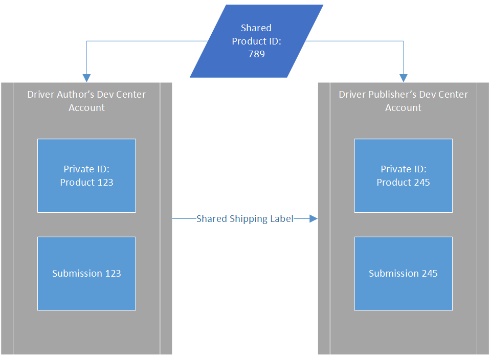

# Dashboard submission product and shipping label IDs

This topic defines the identification numbers associated with Partner Center submissions.

Within the Windows Hardware Dev Center, each driver submission is associated with three IDs: A private, shared and submission ID. The relation between these three IDs is illustrated below:

The Partner Center lists each of these IDs on the driver details page of your products:

## ID definitions

|ID Name|Description|
|----|----|
|Shared product ID|This identifier is shared across all accounts who have access to a driver. The Shared product ID allows you to easily communicate about specific submissions and track submission updates across multiple organizations. In most cases, this is the ID you will want to track and share with others.|
| Private Product ID|The private product ID is the top level identifier that is generated with each new product creation. This ID is most useful for personal reference of specific products, and predicting their URLs.|

>[!NOTE]
>When you share a driver with someone else, they will be assigned a new private product ID. If you want to communicate about a product, use the Shared Product ID.
|Submission ID|This identifier represents the individual packages you upload to a Product. The initial submission, and all submission updates each have a unique identifier. This ID is most useful for tracking updates using the Driver Update Acceptable (DUA) process within a product. See [Manage hardware submissions](/windows-hardware/drivers/dashboard/hardware-submission-manage.md).

Shipping labels also contain two additional IDs:

|ID Name | Description|
|--- | ---|
|Shipping Label ID | This identifier is used for internal tracking, and is assigned to any shipping labels that are assigned to a product. In most cases, you will not need to know the Shipping Label ID.|
|Promotion Request ID | If your Shipping Label requires a manual review from Microsoft, it will be given a Promotion Request ID. This represents your unique shipping label in the Driver Shiproom. You should include this Id in any support inquiry.|

## Next Steps

> [!div class="nextstepaction"]
> [Manage hardware submissions](hardware-submission-manage.md)

> [!div class="nextstepaction"]
> [Manage driver distribution with shipping labels](./manage-driver-distribution-by-submission.md)

