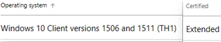

# Limiting driver distribution by Windows versions

IHVs, OEMs, and ODMs often need to change the distribution of a driver in Windows Update to a specific range of Windows versions. For example, a driver might:

* Have known problems in a specified range of versions.

* Need to be deployed to fix issues in past versions of Windows while a current driver is distributed to current versions.

* Extend its distribution to earlier, current or newer Windows versions.

These distribution ranges are defined by a **floor** and **ceiling**. A floor describes the earliest Windows version the driver will be distributed to, and a ceiling marks the latest. By adding a floor and ceiling, you can restrict your driver’s distribution. Floors and ceilings are specified in [shipping labels](https://docs.microsoft.com/windows-hardware/drivers/dashboard/manage-driver-distribution-by-submission) within the Hardware Dev Center Dashboard for the following driver submission formats:

* .HLKX
* .HCKX
* .CAB

> [!NOTE]
> Only Administrators, Shipping Label Owners, and Shipping Label Promoters can set floors and ceilings for driver submissions.

## Floor and ceiling types

Floors and ceilings are applied to newer or earlier or current version of Windows OS.
There are two types of floors and ceilings supported by the HDC Dashboard:

| Floor/ceiling type | Description |
| -- | -- |
| OS release-based | <ul><li>Used to expand or restrict the driver to additional Windows versions other than the certified Windows OS version.</li><li>Meant for drivers released to the public.</li></ul> |
| Build number-based | <ul><li>Used when developing drivers for newer and unreleased versions of Windows. </li><li>Available for Microsoft co-engineering partners only.</li></ul> |

## Setting floors and ceilings for your driver distribution

1. Create a shipping label and enter your details for the label’s name, publisher and targeting. For more information, see [Publish a driver to Windows Update](https://docs.microsoft.com/windows-hardware/drivers/dashboard/publish-a-driver-to-windows-update).

2. In **Select PNPs**, select the Hardware ID and operating system combinations you wish to publish to. Note that a floor can be set for each Hardware ID, but a ceiling is applied to all IDs within the same shipping label. Additionally, the oldest operating system you select will automatically be selected as the floor for your label. 

## Restricting driver distribution using floors and ceilings

Restricting a driver's distribution lets you set an OS minimum or maximum level. For Attestation submissions, we use the OS you select at the time of submission as the initial minimum OS. The minimum OS level cannot be set below the drivers certified OS level. You must first use Expansion (described below) to go lower than these initial minimum levels.

### OS Flooring
*(Minimum OS requirement)*

Use this option when you want a driver to only be offered at and above the listed operating system. For example, selecting an RS4 Floor would mean only systems running Windows 10 1803 (RS4) and above will be offered this driver.

### OS Ceiling  
*(Maximum OS requirement)*

*Note: access to this feature is limited.*

> [!IMPORTANT]
> * An OS Ceiling should only be set if there is a breaking change in the new OS that impacts basic functionality of the driver. A business justification is required when requesting an OS Ceiling.
> * The ceiling option is enabled only for Hardware IDs that target Windows 10, and only after clicking Publish in the **Select PNPs** selection area.
> * The ceiling you select should be higher than the PNP selections you made.

Use this option when you want a driver to only be offered at or below the listed operating system. For example, selecting an RS3 Ceiling on a Windows 10 1607 RS1 certified driver would mean your driver would never be offered to systems running Windows 10 1803 (RS4) or above.

The minimum OS level is determined by the Products Certified OS level, or the Attested OS level.  If you need to go below this, use driver expansion, described below.

## Driver Expansion

> [!IMPORTANT]
> Note the following when expanding your driver's distribution:
> * You can only expand drivers that you submit. The receivers of a shared submission cannot expand drivers.
> * Expansion can only be performed once per submission, and cannot be undone. Only expand your driver's distribution only when absolutely necessary.
> * All shipping labels associated with expanded submission will list new PNP HWIDs that can be used to target **Windows 10 Client versions 1506 and 1511 (TH1)**. 
> * Your Certified level for these newly created items will show as “Extended”.
> * Only Windows 8.1 drivers can be expanded upward to target Windows 10 systems.  
> * Expansion does not re-sign your driver or change your driver's certification level.

The Expansion process on a driver submission enables the ability to target operating systems below the products certification level or Attested OS level. It also enables a Windows 8.1 driver to be offered to Windows 10 systems. 

For example, If you want to enable your Windows 10 RS3 (1709) driver to be offered to Windows 10 RS1 (1607), you would click **Expand**. This will create a new baseline Operating System choice for every HWID listed in all your INFs.  This baseline is displayed as **Windows 10 Client versions 1506 and 1511 (TH1)** and shows **Extended** in the Certified section.  The baseline OS will always be Windows 10 1506 (TH1) and is our starting OS target point.

To bring the lower OS limit up to RS1, use the Floor feature called out above.  Select the **Extended** HWID you want, then click Publish.  

> [!NOTE]
> In the above example, there is no need to publish any HWIDs that list Windows 10 RS3.  This is because you will be setting a lower OS Floor limit of RS1.  Your **Extended** driver will be offered correctly to all operating systems that are greater than the lowest starting point.  This means it will be offered to RS1, RS2, RS3, etc.
> Trying to set a floor of RS1 when a Windows 10 RS3 (1709) targeted driver is selected will result in an error informing you to choose a higher OS floor target. 

## FAQ

**When would I need to specify a floor or ceiling for a version of Windows that has been released?**

*To prevent a pre-existing driver from being distributed to future versions of Windows. For example, while developing a replacement driver targeting an unreleased version of Windows.*

**When would I need to specify a floor and/or ceiling for a co-engineering driver? (coming soon)**

*You may need to specify a version of Windows that is currently in development as a floor If your driver contains a dependency contained in it.*

**How can I target a Windows version that is older than my driver’s certification?**

*See the above example.*
