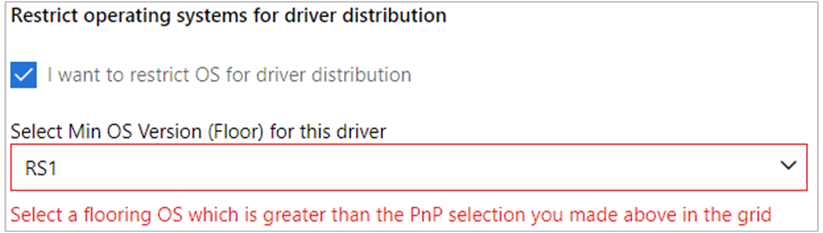
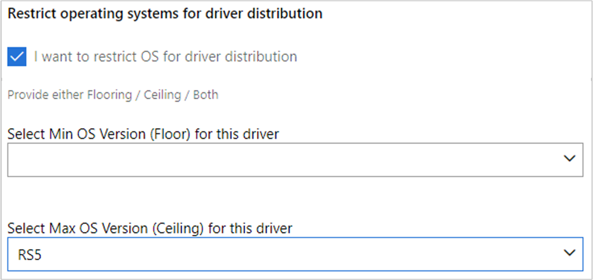
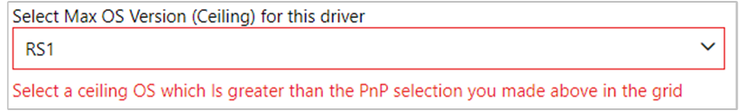
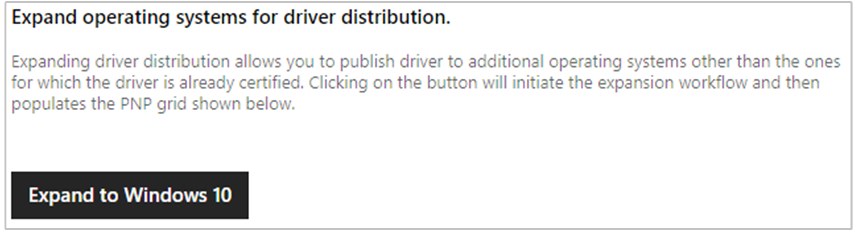
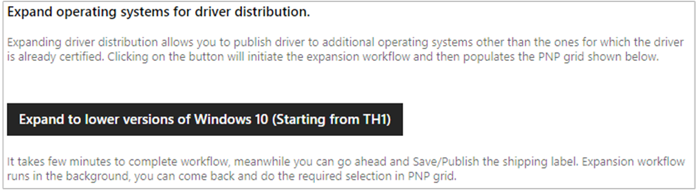
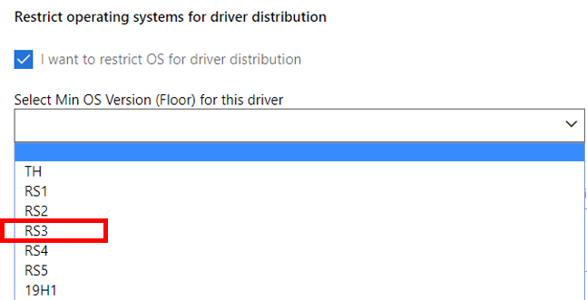

# How to limit or expand a driver’s distribution based on Windows version

Partners may sometimes need to expand or limit the OS distribution of a driver submission.  This topic describes each of the associated shipping label features for this and how to use them.

## Important information

Before you begin working with these features, you should be familiar with and keep in mind a few key principles, terms and definitions.

**Windows Update**: When you publish a driver to a specific OS release, say RS1 (Windows 10, version 1607), Windows Update will also offer the driver to systems running RS2, RS3, and forward (Windows 10, versions 1607, 1703, and 1709). But it would not be offered to TH1 or TH2 (Windows 10, version 1507 or 1511). In other words, drivers are always *offered forward*.
This is especially important to remember when dealing with the OS and Hardware ID combinations within the Shipping Label's PNP Grid. In practice, the offering drivers forward means that for the previous example, you need not publish the same Hardware ID to both RS2 and RS3. Windows Update will offer your RS1 posting to RS2 and later versions.  You only *need* to publish to the lowest OS release that you want to target in the PNP grid.

**Dynamic Updates and OS Floors**:  When Windows Update is called during the Windows **Upgrade** process, it uses special logic to override the current OS version information reported by the client and sets it to the target feature update version. For instance, if the client is on 10.0.17763 (Windows 10, version 1809) and upgrading to 10.0.18362 (Windows 10, version 1903), Dynamic Update will offer drivers from within the 18362 OS boundary. This is especially important to understand when dealing with the Floor feature. For more info see [Understanding Windows Update Automatic and Optional Rules for Driver Distribution](understanding-windows-update-automatic-and-optional-rules-for-driver-distribution.md).

**Submission Owner**:  The original submitter of the HLKx or .CAB driver package.  The originator is granted the capability to use the Driver Expansion feature.  The receivers of a *Shared submission* must work with their submission owner for some features.

**Required Permissions**:  Only users designated as Administrators, Shipping Label Owners, and Shipping Label Promoters can set floors and ceilings for driver submissions.  Only Co-Engineering partners have access to the Ceiling and Build Number based features.

**Floor and Ceiling types**: There are two types of floors and ceilings supported by the Driver Dashboard:

<table>
  <thead>
    <tr>
      <th>Floor/ceiling type</th>
      <th>Description</th>
    </tr>
  </thead>
  <tbody>
    <tr>
      <td>OS release-based</td>
        <td>
        <ul>
            <li>The choices are limited to TH, RS1, RS2, etc.</li>
            <li>Meant for drivers released to the public.</li></ul>
        </td>
    </tr>
    <tr>
      <td>Build number-based</td>
      <td>
        <ul>
            <li><em>Available for Microsoft co-engineering partners only.</em></li>
            <li>The choices are limited to a five-digit build number that is higher than the latest released Windows version.</li>
            <li>Used when developing drivers for unreleased versions of Windows.</li>
        </ul>
      </td>
    </tr>
  </tbody>
</table>

## Setting an OS Floor

* *A floor is implicitly and automatically set when you select a Hardware ID and OS combination from the PnP grid.* This means, the lowest OS you select from the PnP grid will be the implied floor.  
* The minimum allowable OS Floor is initially determined by the submissions lowest Certified OS level, or the Attested OS level.  If you need to set an OS Floor that is below these automatically determined levels then you must perform a Driver Expansion prior to setting the OS Floor.

The OS Floor describes the earliest Windows version that the driver could be distributed to.  Use this feature when you want to move the implied floor **UP** so that the driver will only be offered at and above the selected operating system.
The most common use case is described in the Driver Expansion section, [Use Case 2](#use-case-2--publishing-an-expanded-submission-to-a-specific-os-level).

### To set the OS Floor

1. Create a shipping label and enter your details.  For more information, see [Publish a driver to Windows Update](publish-a-driver-to-windows-update.md).
2. In the **Select PNPs** grid area, select *at least one* Hardware ID and operating system combination, and then click **Publish**.
3. Scroll down to the **Restrict operating systems for driver distribution** section, and check **I want to restrict OS for driver distribution**.  This selection only becomes available *after* you have clicked publish on at least one item in the PNP grid.
4. From the **Select Min OS Version (Floor)** drop down, pick the earliest OS version to distribute the driver to.

If you select a value for the OS Floor that is earlier than the options listed in your PnP grid, you will receive the following error.

## Setting an OS Ceiling

>[!NOTE]
> Access to the Ceiling feature is limited to select partner accounts with valid business need.  [Contact Support](https://go.microsoft.com/fwlink/?linkid=2038065) for questions.

A ceiling describes the upper OS limit that the driver will be distributed to. Use this option when you want a driver to be offered at or below the listed operating system release.

For example, if you select a Ceiling value of **RS3** (Windows 10, version 1709) your driver would never be offered to systems running RS4 (Windows 10, version 1803) or later.

>[!IMPORTANT]
>You should only set an OS Ceiling if there is a breaking change in a new OS that impacts basic functionality of the driver. Microsoft requires that you submit a business justification when requesting an OS Ceiling.

### To set the OS Ceiling

1. Create a shipping label and enter your details.  For more information, see [Publish a driver to Windows Update](publish-a-driver-to-windows-update.md).
2. In the **Select PNPs** grid area, select at *least one* Hardware ID and operating system combination, and then click **Publish**.
3. Scroll down to the **Restrict operating systems for driver distribution** section and select **I want to restrict OS for driver distribution**.  This selection only becomes available *after* you have clicked publish on at least one item in the PNP grid.
4. From the **Select Max OS Version (Ceiling)** drop down, select the earliest OS version you wish the driver to be distributed to.

>[!NOTE]
>You are only allowed to choose an OS ceiling that is equal to or lower than the highest OS published from within the PnP Grid.

The dashboard displays the following error if your selection is invalid.

## Driver Expansion: Expanding a Driver’s lowest OS target

Note the following important information when expanding your driver's distribution:

* Expansion can only be performed by the **original submission owner**. Receivers of a shared submission will not see this option. (See [Important information](#important-information).)  
* Expansion can only be performed once per submission and cannot be undone.  The Expansion button will be greyed out if it has already been performed.
* Expansion can only be done to drivers where your [INF Manufacturer section](../install/inf-manufacturer-section.md) does not use the \[BuildNumber] *TargetOSVersion* decoration such as NTamd64.10.0...**14393**.
* Only Windows 8.1 drivers can be expanded **upward** to target Windows 10 systems.  Windows 10 drivers can be expanded **downward**.
* Expansion does not change or add to your driver's certification level.  If your driver is certified for RS5, expansion does not give you any extra lower OS certifications.

The Driver Expansion feature grants partners the ability to target all versions of Windows 10.  It also enables a Windows 8.1 driver to be offered to Windows 10 systems.

It does this by creating a new **Extended** PNP Grid entry of *Windows 10 Client versions 1506 and 1511 (TH1)* and *Windows Server 2016 x64 (TH1)* for each *supported* INF within a submission package.   This works for both the Sharing and Publishing workflows in a shipping label. The following screen shots show the expansion button for a Windows 8.1 driver and the expansion button for a Windows 10 driver:

For example, the following submission was certified for Windows 10 Client version 1809 Client x64 (RS5).  After expansion, notice that two new **Extended** PNP Grid entries have been created.

If more than one INF were present in this submission, each INF and Hardware ID in them would receive identical new **Extended** entries.  The exception is, if an [INF Manufacturer](../install/inf-manufacturer-section.md) section uses the *\[BuildNumber] TargetOSVersion* decoration such as NTamd64.10.0...**14393**.  These INFs are skipped and cannot be expanded.  This means you could end up with only a partially expanded list of INFs in the PNP grid.  If you want all INF files to be expanded, you must edit the INF and remove the *BuildNumber*.  In addition, you might not see the **Expand** option box at all if no INFs are supported.

Once you have an **Extended** entry, you can then share or publish it.

In most cases, you won’t want the expanded driver to be offered to TH1 and above.  Instead, you are more often wanting it to start somewhere in between.  Therefore, you must also remember to set the [OS Floor restrictions](#setting-an-os-floor) as part of your shipping label creation.

Below are two of the most common use cases along with instructions for how to achieve them.  We’ll be using the above toaster submission as the example.

## Use cases for limiting or expanding driver distribution based on OS

Using the toaster example (shown in the previous screenshot), we'll walk through two of the more common use scenarios for setting driver distribution based on OS version:

* **Use Case 1: An IHV sharing an expanded submission to an OEM**  My OEM wants to target RS3 and RS4 clients, but my submission is only certified on RS5.  How can I enable this for my OEM partner so they can create their own Windows Update shipping label?
* **Use Case 2: Publishing an expanded submission to a specific OS level**  I want to publish my RS5 certified driver to Windows Update so that it targets RS3 and later.  How do I do this?

### Use Case 1: An IHV sharing an expanded submission to an OEM

As the submission owner, you are the only one that can expand your submission.

1. Click **Expand to lower versions of Windows 10 (Starting from TH1)**.
2. Select **Share** for each Hardware ID your OEM needs, making sure to include the **Extended** entry for **Windows 10 Client versions 1506 and 1511 x64 (TH1)**.  This is really the only OS entry you need to share with them as Windows Update offers forward (see [Important information](#important-information)).

3. Scroll to the bottom of the page and click **Publish** to finalize your share actions.
4. Inform your OEM to come to this page and read [Use Case 2](#use-case-2--publishing-an-expanded-submission-to-a-specific-os-level).  

If you already shared a driver with your partner, you could expand it later and share the additional extended item.  Be aware though, that the original shared submission will be deprecated, and your partner will only be able to use the latest shared submission from you (see the [Revoke/Revoke All](sharing-drivers-with-your-partners.md#revokerevoke-all) section for more information about deprecated items).

### Use Case 2:  Publishing an expanded submission to a specific OS level

You want to publish your Windows 10 RS5 (1809) driver to a lower OS than what is listed in the PNP grid, for instance RS3.  The first thing you need to do is **Expand** the submission.  If you received this submission from your IHV, they would have to complete the expansion task and then share the expanded items to you (see [Use Case 1](#use-case-1-an-ihv-sharing-an-expanded-submission-to-an-oem)).  

Once the driver expansion has completed, a new **Extended** PNP Grid entry of *Windows 10 Client versions 1506 and 1511 (TH1)* and *Windows Server 2016 x64 (TH1)* will be created for each supported INF within a submission package.  It will be one of these items you need to publish.
Using the expanded toaster example above, this is the correct way to publish it so that it has a floor of RS3.

1. Select **Publish** for the *hid\toaster&col02* and *Windows 10 Client versions 1506 and 1511 x64 (TH1)* item. This sets the implied floor to **TH1**.

2. Your shipping label will now show “Pending publishing” in the Status column like this.

3. Scroll down to the **Restrict operating systems for driver distribution** section and select **I want to restrict OS for driver distribution**.
4. From the **Select Min OS Version (Floor) for this driver** dropdown, select **RS3**.

5. Scroll to the bottom of the page and click **Publish** to finalize your publishing request.

This driver will be published and applicable to all OS versions for RS3 and later.

## FAQ

### Why can't I check the Restrict operating systems for driver distribution box?

Make sure you have first clicked **Publish** for at least one Hardware ID entry in the **Select PNPs** section.

### The Expand to lower versions of Windows 10 (Starting from TH1) box is greyed out or missing

If the box is greyed out, it means the submission has already been expanded.

If the box is missing, it means one of two things.  You are not the initial submission owner, or your INF contains the BuildNumber section.  See [Important Information](#important-information).

### How can I target a Windows version that is older than my driver’s certification?

See [Use Case 2](#use-case-2--publishing-an-expanded-submission-to-a-specific-os-level).

### Some of my INFs are missing after expansion.  Why can't I expand my entire submission?

Each INF in your submission is evaluated for expansion separately. If one or all your INFs' (see [INF Manufacturer](../install/inf-manufacturer-section.md)) uses the *\[BuildNumber] TargetOSVersion* decoration, then we will fail to process that INF for expansion. If you need to expand your submission, then you must first edit your INF and remove the \[BuildNumber]. INFs that do not contain the \[BuildNumber] will process successfully.  For more info, see [Important Information](#important-information).