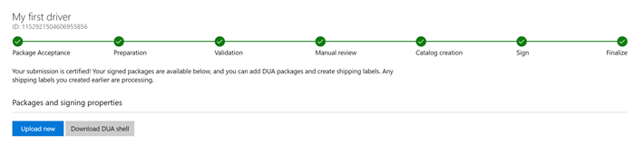

# Managing hardware submissions in the Windows Hardware Dev Center dashboard

After you submit your product for the Windows Hardware Compatibility Program for Windows 10 (or the certification program for previous Windows versions), you can manage it through the dashboard.

-   [Find a hardware submission](#find-a-hardware-submission)
-   [Update an HCK hardware submission using the Driver Update Acceptable (DUA) process](#update-an-hck-hardware-submission-using-the-driver-update-acceptable-dua-process)

## Find a hardware submission

1.  Sign in to the Windows Hardware Dev Center dashboard.

2.  On the **Manage submissions** page, you can see all hardware submissions that have been submitted by your organization. To find a specific hardware submission, you can do the following:

    <table>
    <colgroup>
    <col width="50%" />
    <col width="50%" />
    </colgroup>
    <thead>
    <tr class="header">
    <th>To</th>
    <th>You can</th>
    </tr>
    </thead>
    <tbody>
    <tr class="odd">
    <td>
Search
</td>
    <td>
Select to search by ID or by name, and then enter the ID or name in the Search box.
</td>
    </tr>
    <tr class="even">
    <td>
Sort
</td>
    <td>
Click a column heading to sort the list by that property.
</td>
    </tr>
    </tbody>
    </table>

         

3.  Click the submission ID to open more information about the submission. The following information is available:

    <table>
    <colgroup>
    <col width="50%" />
    <col width="50%" />
    </colgroup>
    <thead>
    <tr class="header">
    <th>Tab</th>
    <th>Description</th>
    </tr>
    </thead>
    <tbody>
    <tr class="odd">
    <td>
Submission info
</td>
    <td>
Describes the product, including:

    <ul>
    <li>
Name
</li>
    <li>
Certification selection
</li>
    <li>
Device type
</li>
    <li>
The device metadata category and the default icon if you do not choose to submit a custom icon
</li>
    <li>
Announcement date
</li>
    <li>
Marketing names. You can add new marketing names and select <strong>Add</strong>.
</li>
    <li>
If applicable, the signed driver files can be downloaded.
</li>
    </ul></td>
    </tr>
    </tbody>
    </table>

     

## Update an HCK hardware submission using the Driver Update Acceptable (DUA) process

1.  [Find the hardware submission](#find-a-hardware-submission) that you want to update.

2.  Select **Download DUA shell**, and then select **Save**. Note: DUA is only available for driver submissions that include a driver.

    

3.  Launch HCK Studio.

4.  Select **Package**, and then select **Browse** to open the downloaded DUA shell package.

5.  Select **Open as Driver Update package**.

6.  Select **OK**.

7.  Select the **Package** tab.

8.  For each driver you want to update, right-click the appropriate driver folder and then select **Replace Driver**.

9.  Select **Create Package**.

10. You will also need to sign your package, so select "Use the certificate store".

11. Go to your hardware submission and select **Upload new** in the **Packages and signing properties** section.

    

12. Choose a name for your updated driver package. You can use this name to organize your driver packages. Shipping Labels are associated to a specific driver package, so it is important to choose a unique name that you will recognize later.

13. Upload your updated driver package.

14. You can monitor the progress of your driver update with the progress tracker at the top of the page. Once all steps show a green check, the update is complete.

## Extension ID are automatically registered for your extension INF upon submission

When you submit an Extension INF to be signed, we will attempt to automatically register the Extension ID with your account. If the Extension ID you are trying to submit is already registered with some other organization, a message will display stating that the ID is already in use and to use a different one.  See [Using an extension INF file](https://docs.microsoft.com/en-us/windows-hardware/drivers/install/using-an-extension-inf-file) for more information about specifying an ExtensionID in your INF. 

Note that in your submissions, you may only use ExtensionIDs that are registered to your account. 

## Related topics

   *  [Create a new hardware submission](create-a-new-hardware-submission.md)
   *  [Get drivers signed by Microsoft for multiple Windows versions](get-drivers-signed-by-microsoft-for-multiple-windows-versions.md)
   *  [Driver flighting](driver-flighting.md)

[Send comments about this topic to Microsoft](mailto:wsddocfb@microsoft.com?subject=Documentation%20feedback%20%5Bhw_dashboard\hw_dashboard%5D:%20Manage%20hardware%20submissions%20%20RELEASE:%20%281/3/2017%29&body=%0A%0APRIVACY%20STATEMENT%0A%0AWe%20use%20your%20feedback%20to%20improve%20the%20documentation.%20We%20don't%20use%20your%20email%20address%20for%20any%20other%20purpose,%20and%20we'll%20remove%20your%20email%20address%20from%20our%20system%20after%20the%20issue%20that%20you're%20reporting%20is%20fixed.%20While%20we're%20working%20to%20fix%20this%20issue,%20we%20might%20send%20you%20an%20email%20message%20to%20ask%20for%20more%20info.%20Later,%20we%20might%20also%20send%20you%20an%20email%20message%20to%20let%20you%20know%20that%20we've%20addressed%20your%20feedback.%0A%0AFor%20more%20info%20about%20Microsoft's%20privacy%20policy,%20see%20http://privacy.microsoft.com/default.aspx. "Send comments about this topic to Microsoft")
