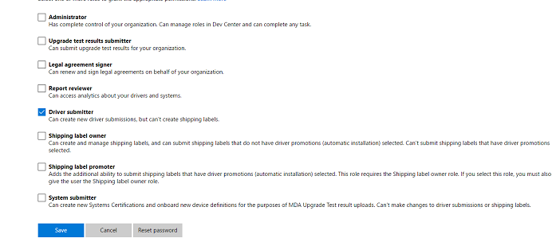

# Managing User Roles

The Windows Hardware Dev Center Dashboard allows you to assign specific roles to each of your users. The following roles are available for dashboard users:

| Role                           | Description                                                                                                                                                                                                                                                |
|--------------------------------|------------------------------------------------------------------------------------------------------------------------------------------------------------------------------------------------------------------------------------------------------------|
| Administrator                  | Has complete control of your organization. Can manage roles in Dev Center and can complete any task.                                                                                                                                                       |
| Upgrade Test Results Submitter | Can submit MDA upgrade test results for your organization.                                                                                                                                                                                                 |
| Legal Agreement Signer         | Can renew and sign legal agreements on behalf of your organization.                                                                                                                                                                                        |
| Report Reviewer                | Can access analytics about your drivers and systems. Able to see failure details and download cabs.                                                                                                                                                        |
| Driver Submitter               | Can create new driver submissions, but can’t create shipping labels.                                                                                                                                                                                       |
| Shipping Label Owner           | Can create and manage shipping labels, and can submit shipping labels that do not have driver promotions (automatic installation) selected. Can’t submit shipping labels that have driver promotions selected.                                             |
| Shipping Label Promoter        | Adds the additional ability to submit shipping labels that have driver promotions (automatic installation) selected. This role requires the Shipping Label Owner role. If you select this role, you must also give the user the Shipping Label Owner role. |
| System Submitter               | Can create new Systems Certifications and onboard new device definitions for the purposes of MDA Upgrade Test result uploads. Can’t make changes to driver submissions or shipping labels.                                                                 |

 

To change a user’s roles, navigate to the [Manage Users](https://go.microsoft.com/fwlink/?linkid=833569) section of **Account Settings**. Find the user you want to modify by using the search bar and click on their name.

In the user’s details, scroll down to the roles and select the ones they should have access to.

Finalize your selections by selecting **Save**.

 

 

