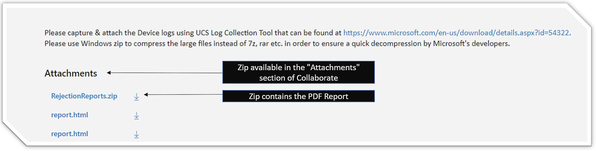
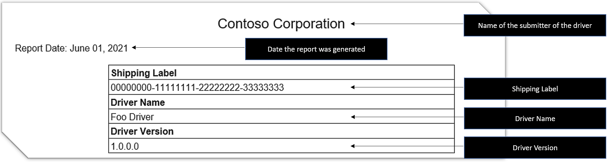
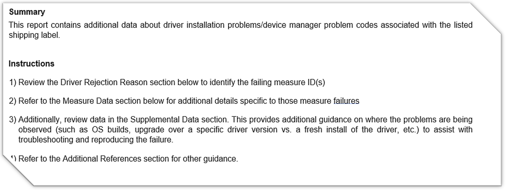
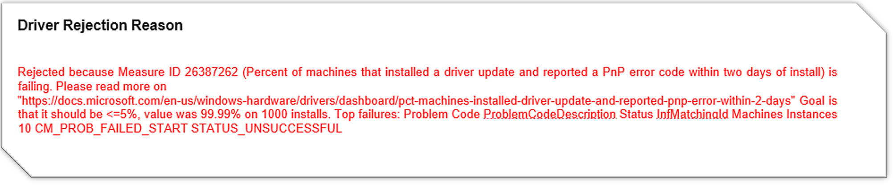
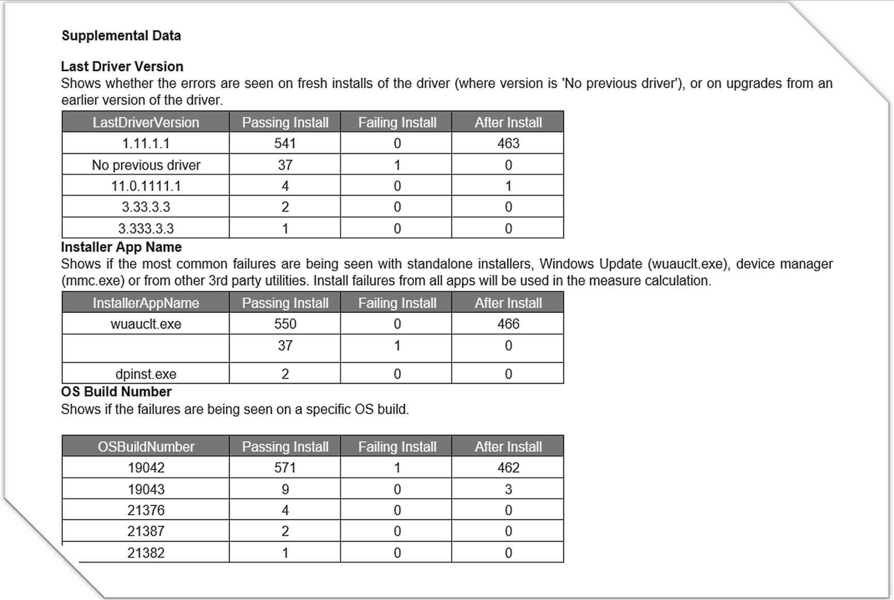
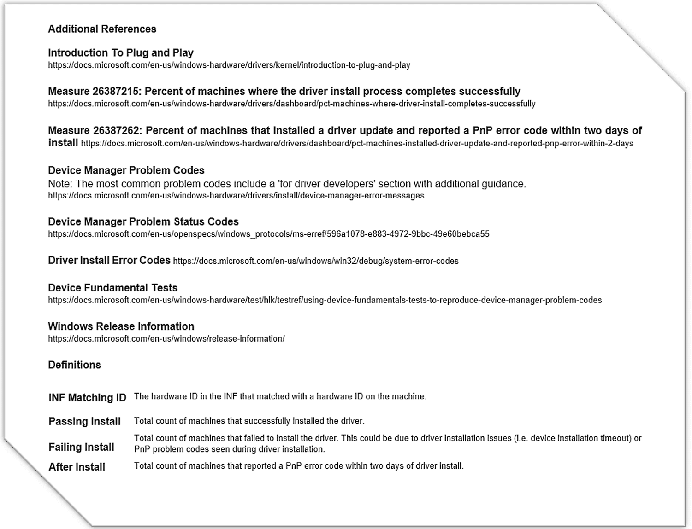

# Plug and Play extended flight report

If your driver is cancelled due to a Plug and Play measure failure, you will receive a report detailing the specifics of the failure.

## Location of the report

When a driver completes flighting, a bug is created and assigned to you. The bug includes a Decision Snapshot, a report on the state of the measures at the time of flight completion. If the driver is cancelled due to a Plug and Play measure failing during release monitoring, the same bug includes an Extended Flight Report for Plug and Play Measures. It is added to the *RejectionReports.zip* file as an attachment to that bug. Inside the zip file, the report filename is *PnP_Extended_Flight_Report.pdf*.

## How to read the report

The extended flight report contains the following sections:

1. [Title](#title)
1. [Summary and Instructions](#summary-and-instructions)
1. [Driver Rejection Reason](#driver-rejection-reason)
1. [Measure Data](#measure-data)
1. [Supplemental Data](#supplemental-data)
1. [Additional References](#additional-references)

### Title

The Title section describes the driver, including the submitter company name, the date the report was generated, the shipping label number, the driver name, and the driver version.

### Summary and Instructions

The Summary and Instructions section provides details on how to review the data, including basic information about the data in the report.

### Driver Rejection Reason

The Driver Rejection Reason section provides a summary of the installation measure failure that led the driver to be rejected and includes basic information about the failures that led the driver to be rejected.

In this section, you will find:

- The failing measure number ID. Look up the ID in the Measure Dictionary and the Flight Report.
- The name of the failing measure and a hyperlink leading to the official measure documentation.
- The numerical passing criteria for the measure to not be rejected.
- The numerical value of the driver for the failing measure.
- Details of the top failures identified in the driver. Details include Problem Code, Status and Machine Instances.

### Measure Data

The Measure Data section provides additional details specific to the Plug and Play failing measures. This section includes basic information about the installation measure failures that led the driver to be rejected. Failures include Problem Code/Install Error, Problem Code Description, Problem Status Description, Inf Matching ID, and Machines and Instances, for each of the three potentially evaluated metrics:

- Measure 26387215: Percent of machines where the driver install process completes successfully - Plug and Play Failures
- Measure 26387215: Percent of machines where the driver install process completes successfully - Driver Installation Failures
- Measure 26387262: Percent of machines that installed a driver update and reported a Plug and Play error code within two days of install

### Supplemental Data

The Supplemental Data section provides additional guidance on where problems are being observed to assist with troubleshooting and reproducing the failure. Additional information may include OS builds, upgrade over a specific driver version versus a fresh install of the driver, and so on.

For Last Driver Version, Installer App Name and OS Build Number, you will find the following data:

- Passing Install: Total count of machines that successfully installed the driver.
- Failing Install: Total count of machines that failed to install the driver. This could be due to driver installation issues (i.e. device installation timeout) or Plug and Play problem codes seen during driver installation.
- After Install: Total count of machines that reported a Plug and Play error code within two days of driver install.

### Additional References

The Additional References section provides more information on Plug and Play, measure definitions, error codes and additional information. This section provides additional references to documentation on relevant topics related to the usage and interpretation of the report.

