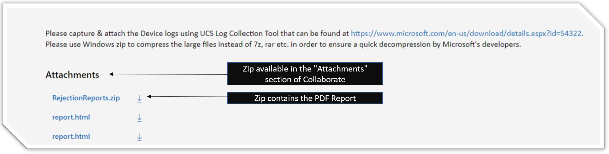
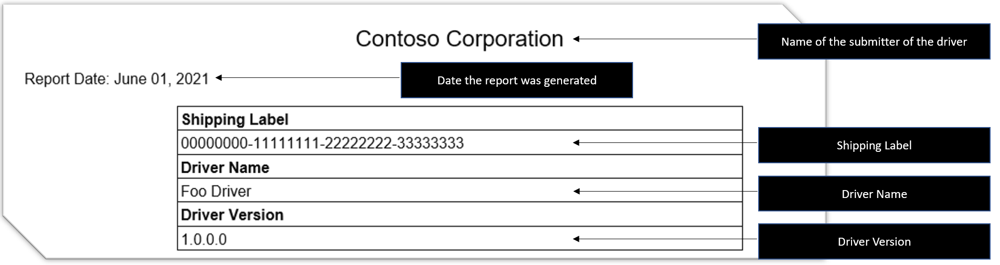
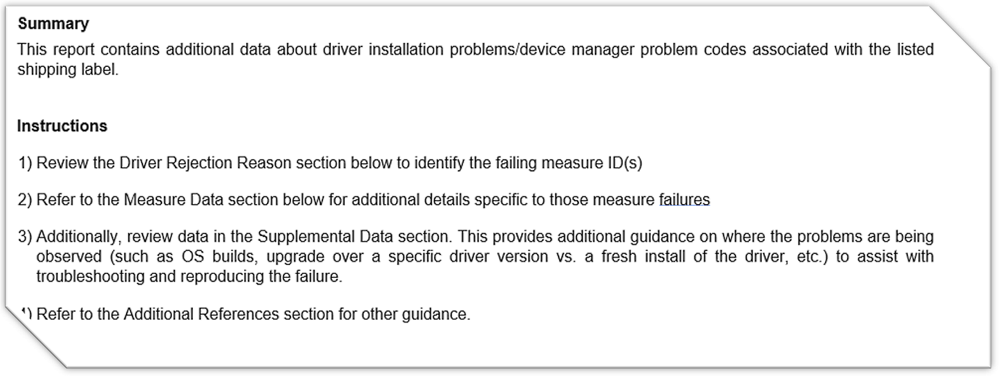
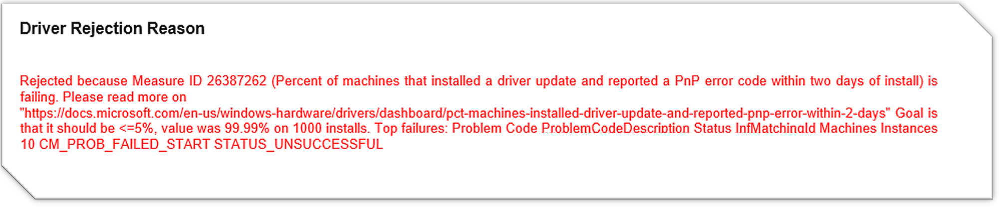
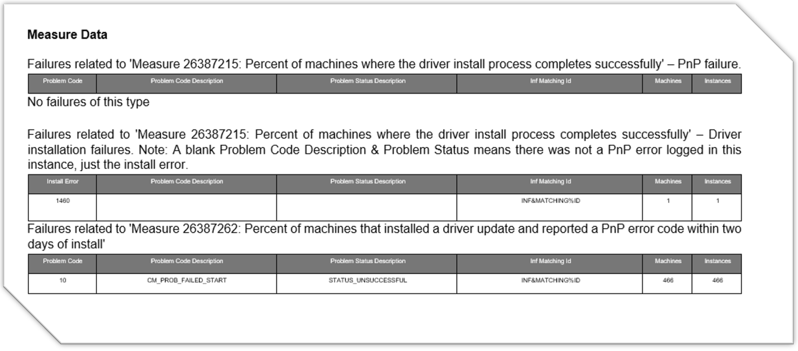
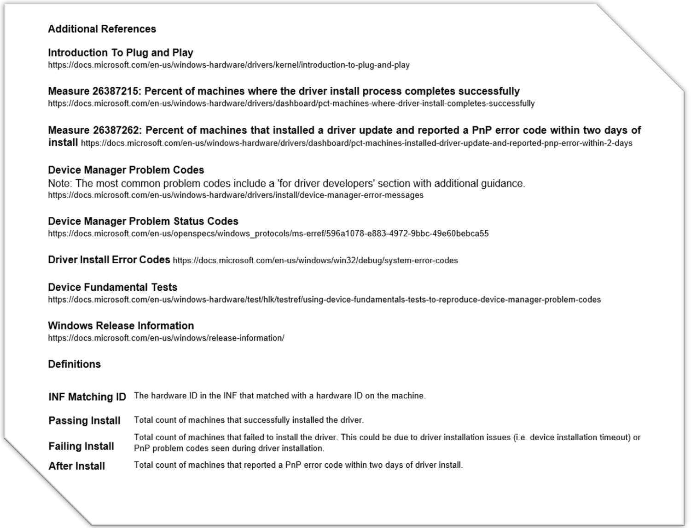

# PnP Extended Flight Report

Starting July1, 2021, if your driver is cancelled due to a PnP Measure failure, you will start to receive a new report detailing the specifics of the failure. 

## Location of the Report

When a driver completes flighting, a bug is created and assigned to you, which includes the Decision Snapshot (a report of the state of the measures at the time of flight completion) [report.html in image below]. If the driver is cancelled due to a PnP measure failing during release monitoring, we will be utilizing the same bug to include the new Extended Flight Report for PnP Measures. It will be added to the RejectionReports.zip file as an attachment to that bug. Inside the Zip file, the file name will be **PnP_Extended_Flight_Report.pdf.** 

*Figure 1: Screenshot of Bug Attachment with the RejectionReportst.zip file attached that contains the new PnP_Extended_Flight_Report.pdf* 

## How to Read the Report

This report has 7 sections: **Title**, **Summary and Instructions**, **Driver Rejected Reason**, **Measure Data**, **Supplemental Data**, and **Additional References**, described below:

### Title Section: describes the driver

This section includes the submitter company name, the date the report is generated, the shipping label number, the driver name, and the driver version.

*Figure 2: Screenshot of the Title section that includes the submitter company name, report date, shipping label, driver name, and driver version*

### Summary and Instructions Section: provides a summary of the report and details on how to review the data 

This section includes basic information about the data in the report.

*Figure 3: Screenshot of the summary and instructions section*

### Driver Rejection Reason Section: provides a summary of the installation measure failure that led the driver to be rejected 

This section includes basic information about the Installation Measure(s) failures that led the driver to be rejected. 

In this section you will find: 

- The failing measure number ID (to look it up in the Measure Dictionary and the Flight Report) 
- Name of the failing measure and a hyperlink leading to the official measure documentation. 

- The numerical passing criteria for the measure to not be rejected 
- The numerical value of the driver for the failing measure 
- Details of the top failures identified in the driver. Details include Problem Code, Status and Machine Instances 

*Figure 4: Screenshot of the Driver Rejection Reason Section*

### Measure Data Section: provides additional details specific to the PnP failing measures 

This section includes basic information about the Installation Measure(s) failures that led the driver to be rejected. This section includes Problem Code/Install Error, Problem Code Description, Problem Status Description, Inf Matching ID, Machines and Instances, for each of the 3 potentially evaluated metrics: 

- Measure 26387215: Percent of machines where the driver install process completes successfully - PnP Failure 
- Measure 26387215: Percent of machines where the driver install process completes successfully - Driver Installation Failures 
- Measure 26387262: Percent of machines that installed a driver update and reported a PnP error code within two days of install 

*Figure 5: Screenshot of the measure data section*

### Supplemental Data Section: provides additional guidance on where the problems are being observed 

This section provides additional guidance on where the problems are being observed (such as OS builds, upgrade over a specific driver version vs. a fresh install of the driver, etc.) to assist with troubleshooting and reproducing the failure. 

For Last Driver Version, Installer App Name and OS Build Number, you will find the following data: 

- Passing Install: Total count of machines that successfully installed the driver. 
- Failing Install: Total count of machines that failed to install the driver. This could be due to driver installation issues (i.e. device installation timeout) or PnP problem codes seen during driver installation. 
- After Install: Total count of machines that reported a PnP error code within two days of driver install. 

*Figure 6: Screenshot of the supplemental data section*

### Additional References Section: provides more information on PnP, measure definitions, error codes and additional information.  

This section provides additional references to documentation on relevant topics related to the usage and interpretation of this report.

*Figure 7: Screenshot of the additional references  section*