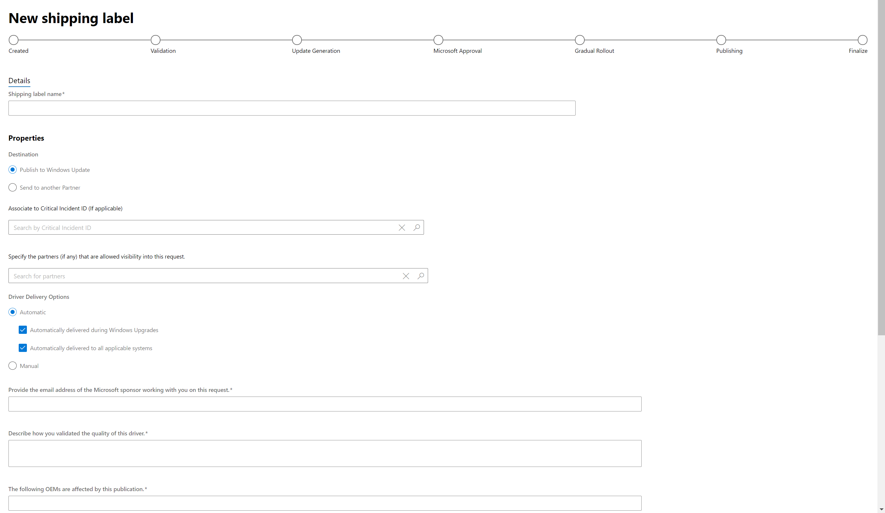

# Publish a driver to Windows Update

To publish a driver to Windows Update, [create a hardware submission](create-a-new-hardware-submission.md) and then follow the steps below.

1. [Find the hardware submission](manage-your-hardware-submissions.md) that contains the driver you want to distribute.

2. Go to the **Distribution** section of the hardware submission and select **New shipping label**.

   

3. On the shipping label page, go to the **Details** section and enter a name for the shipping label in the **Shipping label name** field. This name allows you to organize and search for your shipping labels.

4. In the **Properties** section, complete the following information:

   <table>
   <colgroup>
   <col width="50%" />
   <col width="50%" />
   </colgroup>
   <thead>
   <tr class="header">
   <th>Field</th>
   <th>Description</th>
   </tr>
   </thead>
   <tbody>
   <tr class="odd">
   <td>
<strong>Destination</strong>
</td>
   <td>
Select <strong>Publish to Windows Update</strong> to publish your driver to Windows Update. If you want to create a shared shipping label that allows you to share your driver with a partner, see <a href="sharing-drivers-with-your-partners.md" data-raw-source="[Share a driver with a partner](sharing-drivers-with-your-partners.md)">Share a driver with a partner</a>.

   

   <strong>Note</strong>  Shared drivers can only be shared by the organization that originally created it. An organization that receives a shared driver cannot share it again.
   

   

     
   
</td>
   </tr>
   <tr class="even">
   <td>
<strong>Release date</strong>
</td>
   <td>
Specify when you want your driver to be available for download on Windows Update.

   
If you want your driver to be published as soon as it passes certification, select <strong>Publish my driver as soon as it passes certification</strong>.

   
If you do not want your driver to be published before a certain date, select <strong>No sooner than</strong> and specify the date.
</td>
   </tr>
   <tr class="odd">
   <td>
<strong>Specify the partner (if any) that is allowed visibility into this request</strong>
</td>
   <td>
Enter a partner that you want to have read-only permissions to your driver and shipping label. Use this field when you want a partner to be aware of this shipping label request, such as when you publish a driver on their behalf. For more information, see <a href="https://msdn.microsoft.com/library/windows/hardware/mt786462" data-raw-source="[Publish a driver on behalf of a partner](https://msdn.microsoft.com/library/windows/hardware/mt786462)">Publish a driver on behalf of a partner</a>.
</td>
   </tr>
   <tr class="even">
   <td>
<strong>Driver promotions</strong>
</td>
   <td>
By default, drivers on Windows Update are marked as Optional. This means that a driver is only delivered if the device does not have a driver installed already. These options allow you to override the default behavior but require additional Microsoft evaluation.

   
Select <strong>Automatically deliver and install this driver during Windows Upgrade</strong> to promote your driver to be available for Dynamic Update.

   
Select <strong>Automatically deliver and install this driver on all applicable systems</strong> to promote your driver to Critical.
</td>
   </tr>
   </tbody>
   </table>

   

5. In the **Targeting** section, select the driver package that you want to publish.

6. After you select your driver package, **Select PNPs** becomes available. Select the hardware IDs you want to target. You can search for a specific hardware ID or operating system by using the search boxes above the list of hardware IDs.

   To target all listed hardware IDs, select **Publish All**.

   To target specific hardware IDs, find each desired hardware ID and select **Publish**.

   If you targeted all hardware IDs and want to remove them, select **Expire All**.

   To remove targeting for specific hardware IDs, find each hardware ID and select **Expire**.

   

7. If you want to add Computer Hardware IDs (CHIDs), enter each CHID into the text box and select **Add CHID(s)**. To bulk add multiple CHIDs, ensure that each CHID is separated by a newline, select **Add multiple CHIDs**, and paste your CHIDs into the text box. You can view all added CHIDs in the list below the text box. To remove a CHID from the list, select **Remove**

>[!IMPORTANT]
> CHIDs are not supported for the following versions of windows:
> * Windows 8.1 or earlier
> * Windows Server 2012 R2 or earlier
>
> If your driver targets either of these operating systems, create two shipping labels: one for Windows 10 (where you can add CHIDs) and one for down-level operating systems (where no CHIDs will be added).

8. If your driver targets Windows 10 in S mode, you must select both boxes, confirming the following:

   * Your driver is compatible with and follows the driver policies outlined in the [Windows 10 in S mode Driver Requirements](https://docs.microsoft.com/windows-hardware/drivers/install/Windows10SDriverRequirements).
   * You verify that your driver follows the additional code integrity policies outlined in the Windows 10 in S mode guidelines.
   * Your driver does not contain any non-Microsoft UI components or applications in the driver package.

   

9. Select **Publish** to send your request to Windows Update. If you do not want to publish the shipping label right now, you can select **Save**. You can publish the shipping label later by either opening the shipping label and selecting **Publish**, or you can select **Publish all pending** from the hardware submission page. Note that selecting **Publish all pending** will publish all unpublished shipping labels.

 

 

