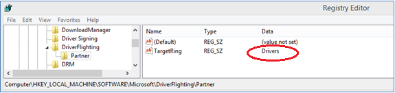
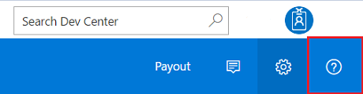
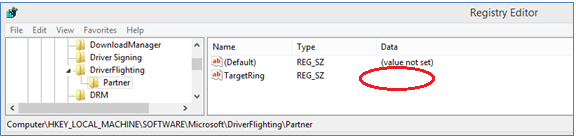

# Test distribution guidance to self-host desktop drivers

Hardware partners can test OS upgrade scenarios by publishing a driver to Windows Update and using test distribution. Once published, IHVs/OEMs can configure their client systems to request these drivers by configuring a predefined registry key value. In addition to receiving drivers distributed for testing, production drivers will still be offered to the same client machine. This adds prerelease drivers to the list of production drivers that will be offered from Windows Update. This method restricts prerelease drivers from being offered to the general public.

Starting with Windows 10, client systems may participate in receiving test distributed drivers throughout the Windows upgrade process. Hardware partners can test OS upgrade scenarios using this test distribution process.

## What is test distribution, and why do I need it?

By publishing drivers for test distribution and configuring client systems to receive test distributed drivers, you enable that system to receive all prerelease drivers and firmware content that are published on Windows Update. This allows partners to publish drivers using Windows Update to their test audience without impacting their retail consumer audience.

## Publishing drivers with test distribution

Publishing drivers for test distribution can be done for Windows 7, Windows 8.x, and Windows 10 systems. To publish a test distribution, simply [create a shipping label](manage-driver-distribution-by-submission.md) as normal and click on the "Test Registry Key" checkbox in the Targeting section.

## Removing drivers published for test distribution

### How do I manually remove my driver published for test distribution?

Once a driver has been published for test distribution it can be manually expired or re-published for (normal) distribution.

### How long does my driver published for test distribution last?

Drivers do not automatically expire from the test distribution workflow. After you complete testing, manually remove a driver using the procedure described in [Expire a driver from Windows Update](expire-a-driver-from-windows-update.md).

## Client PC configuration

### How do I configure my machine to receive test distribution drivers?

Configuring a system to receive test distribution updates can be performed with the following steps:

1.  Open the Windows Registry Editor (regedit.exe)
2.  Go to HKLM\\Software\\Microsoft\\
3.  Create subkeys \\DriverFlighting\\Partner\\
4.  Under the \\Partner subkey, create a string named **TargetRing** and type **Drivers** as the value
5.  Make sure you have the setting as shown below:

    

6.  Exit Windows Registry Editor. You do not need to restart the computer after this change.
7.  Do one of the following:
    -   Run Windows Update and check for updates.
    -   In Device Manager, right click on the target device and select **Update Device Software**.
8.  Verify that your test driver is offered as expected

    -   If you run into issues, contact Customer Service and Support.

        

### How do I stop my PC from receiving test distribution drivers?

To stop receiving test distribution drivers, remove the **TargetRing** registry data value you created in the previous section. Double-click on the **Drivers** data value to remove it, and then click **OK**. By doing this, your client system will no longer be offered pre-release drivers.

**Note**  Your system will continue to receive all production drivers from Windows Update.

 

1.  Open the Windows Registry Editor (regedit.exe)
2.  Go to HKLM\\Software\\Microsoft\\DriverFlighting\\Partner. If these keys do not exist then you are done, otherwise continue to the next step.
3.  Under \\Partner subkey, remove the data value for **TargetRing**
4.  Make sure the setting appears as shown below:

    

5.  Exit Windows Registry Editor. You do not need to restart the computer after this change.
6.  Do one of the following:
    -   Run Windows Update and check for updates
    -   In Device Manager, right click on the target device, and select **Update Device Software**.

 

 

