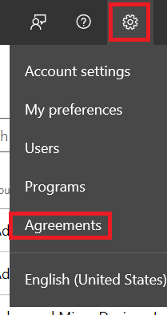

# Register for the Hardware Program

Your organization's administrator must [register](http://go.microsoft.com/fwlink/?LinkID=828002) for the Windows Hardware Dev Center program.

## Before you sign up

Review the following requirements before you start the registration process.

- If you have an existing organization Dev Center account that you want to use for the Hardware program, sign in with it before you begin registration.

- You must have an Extended Validation (EV) code signing certificate. Check whether your organization already has a code signing certificate. If your organization already has a certificate, have the certificate available as you will be asked to sign a file. If your organization does not have a certificate, you will need to buy one as part of the registration process.

    For information about code signing certificates and how to get a certificate, see [Get a code signing certificate](get-a-code-signing-certificate.md).

- You will need to sign in with your organization’s Azure Active Directory (Azure AD) [Global administrator](http://go.microsoft.com/fwlink/?LinkId=746654) account. If you don’t know whether your organization has an Azure AD directory, contact your IT department. If your organization doesn’t have an Azure AD directory, you must be able to create one.

- You must have the authority to sign legal agreements on behalf of your organization.

## Registration steps

There are five main steps to the Hardware Program registration.

1. Get a code signing certificate

    - Ensure you have a code signing certificate

    - If you do not have a certificate, you must buy one and have it available.

2. Download signtool.exe
    - signtool.exe is available as part of the [Windows SDK download](https://developer.microsoft.com/windows/downloads/windows-10-sdk)

3. Sign and upload the file provided to you within the **Sign and upload** portion of the registration process.
    > [!NOTE]
    > The following three steps no longer need to be completed within the same browser session.

    1. Download the provided signable file.
    2. Sign the file with signtool.exe and your code signing certificate.
    3. Upload the signed file. Your organization name and ID number is extracted from the signed file.

4. Sign in with an Azure AD Global administrator account

    - If your organization already has an Azure AD directory, sign in with a [Global administrator](http://go.microsoft.com/fwlink/?LinkId=746654) account.

    - If your organization does not have an Azure AD directory, you must create one and sign in.

5. Account details

    - Enter in account details, such as your organization display name and personal contact information.

    - Sign the required hardware developer legal agreements, located in the account settings tab as shown below:

        

## After registration

After your registration is complete, additional administrative tasks are available:

- [Manage users and permissions](managing-user-roles.md)

When you are finished with any administrative tasks, you are ready to create your first hardware submission. See [Hardware submissions](hardware-certification-submissions.md) for information and instructions.
