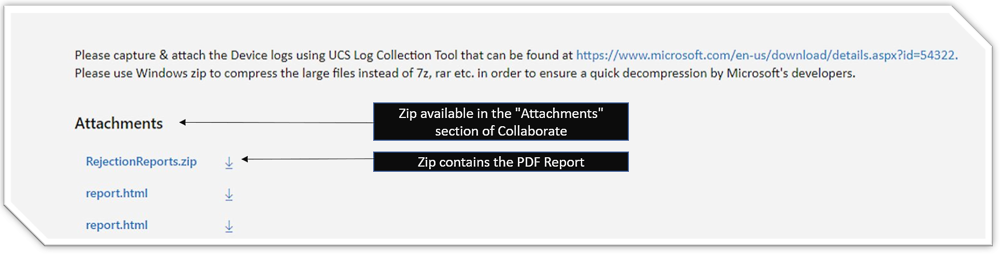
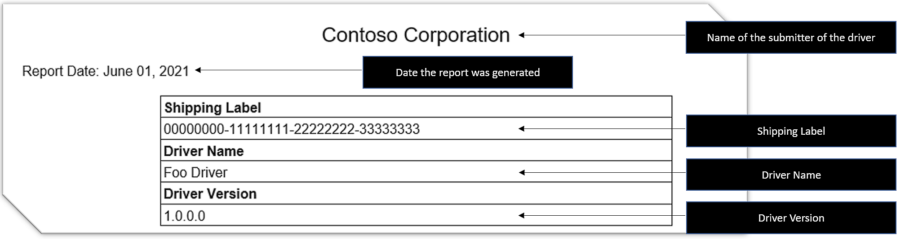

# Reliability measure failure report

If your driver is cancelled due to a reliability measure failure, you will receive a report detailing the specifics of the failure.

## Location of the report

When a driver completes flighting, a bug is created and assigned to you. The bug includes a Decision Snapshot, a report on the state of the measures at the time of flight completion. If the driver is cancelled due to a reliability measure failing during release monitoring, the same bug includes a Reliability Measure Failure Report. It is added to the *RejectionReports.zip* file as an attachment to that bug. Inside the zip file, the report filename is *ReliabilityMeasureReport.pdf*.

## How to read the report

The report contains the following sections:

1. [Title](#title)
1. [Summary](#summary)
1. [Driver Level Details](#driver-level-details)
1. [Cohort Level Details](#cohort-level-details)
1. [Failure Hash Reported From Drivers](#failure-hash-reported-from-drivers)
1. [Latest Cabs](#latest-cabs)

### Title

The Title section describes the driver, including the submitter company name, the date the report was generated, the shipping label number, the driver name, and the driver version.

### Summary

The Summary section provides basic information about what type of analysis was done and what you can do to address the issue.

### Driver Level Details

The Driver Level Details Section provides details specific to the reliability measure failures that led the driver to be rejected.

In this section, you will find:

- The measure ID to look up in the Measure Dictionary and the Flight Report
- The name of the failing measure
- The result of the measure at the time of the report
- The passing criteria
- The status of the measure
- The number of machines that have adopted the driver and were used to calculate the measure
- Timeline with the evolution of measure result (purple) and passing criteria (red) over time

Two potentially evaluated metrics:

- **Measure 26118008**: Percent of machines that reported stop errors in last 7 days
- **Measure 26118015**: Percent of machines that reported a live kernel dump in last 7 days

### Cohort Level Details

The Cohort Level Details section includes information about the reliability failures that were found, at a cohort level. This section will repeat for each failing cohort that is found.

The Cohort Level Details section lists a targeting cohort (Hardware ID, CHID, and OS version) where the failure was found. This is followed by the list of measures that failed for that targeting cohort, including:

- The measure ID to look up in the Measure Dictionary and the Flight Report
- The name of the failing measure
- The result of the measure at the time of the report
- The passing criteria
- The status of the measure
- The number of machines in that cohort that have adopted the driver and were used to calculate the measure
- Timeline with the evolution of measure result (purple) and passing criteria (red) over time

Two potentially evaluated metrics:

- **Measure 26118008**: Percent of machines reported stop errors in last 7 days
- **Measure 26118015**: Percent of machines that reported a live kernel dump in last 7 days

> [!NOTE]
> All small cohorts with less than 500 instances are merged into the "other" cohort.

### Failure Hash Reported From Drivers

The Failure Hash Reported From Drivers section provides information on crash types and failure hash reported from the current driver.

### Latest Cabs

The Latest Cabs section provides information on the latest cabs from different OS.

