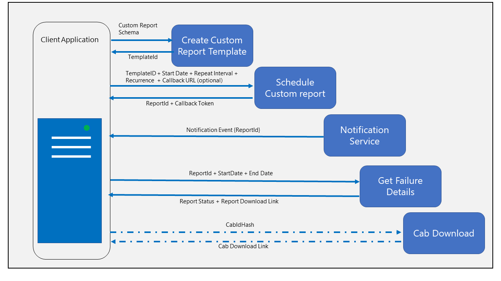

# Schedule custom reports for your driver failure details

Use these asynchronous methods to access reporting data for your Win10/ Win 8.x driver errors and OEM hardware errors. You can define reporting templates based on your needs, set a schedule and you will have data delivered to you at regular intervals.

>[!NOTE]
>
> - These methods can only be used by developer accounts that belong to the [Windows Hardware Dev Center program](https://msdn.microsoft.com/windows/hardware/drivers/dashboard/get-started-with-the-hardware-dashboard).
> - These methods can be used in place of the existing methods to determine [Windows 10 driver errors](https://docs.microsoft.com/windows/uwp/monetize/get-error-reporting-data-for-windows-10-drivers),  [Windows 7 and Windows 8.x driver errors](https://docs.microsoft.com/windows/uwp/monetize/get-error-reporting-data-for-windows-7-and-windows-8.x-drivers) (for IHVs), and [hardware errors](https://docs.microsoft.com/windows/uwp/monetize/get-oem-hardware-error-reporting-data) (for OEMs).
> - These methods expose a rich set of new dimensions and supports look back for as much as 90 days in the past.
> - The API documentation is also available in [Swagger](https://apidocs.microsoft.com/services/analyticsreportingapis)

## Prerequisites

> [!IMPORTANT]
> You must complete the requirements outlined in [Enable secure data sharing](enable-secure-data-sharing.md).

To use this method, you need to first do the following:

- If you have not done so already, complete all the [prerequisites](https://docs.microsoft.com/windows-hardware/drivers/dashboard/dashboard-api#complete-prerequisites-for-using-the-microsoft-hardware-api) for the Microsoft Store analytics API, including obtaining an Azure AD access token to use in the request header for this method. Note that after you obtain an access token, you have 60 minutes to use it before it expires. After the token expires, you can obtain a new one.

For more information, see [Access analytics data using Microsoft Store services](https://docs.microsoft.com/windows/uwp/monetize/access-analytics-data-using-windows-store-services)

> [!IMPORTANT]
> As a reminder, the [Windows Analytics Agreement](https://go.microsoft.com/fwlink/?linkid=866941) states: “You must not store Personal Information for longer than thirty (30) days. Following such 30-day period, you will immediately destroy the Personal Information.”

## Workflow to schedule custom reports for driver failure

The following diagram explains the API call pattern to create a new report template, schedule the custom report and retrieve failure data.

1. The Client Application defines the report schema in JSON format and call the [Create Report Template API](create-a-new-report-template.md).

2. On success, the Create New Report Template API returns the TemplateId.

3. The client application calls the [Schedule Custom Report API](schedule-a-new-report.md) using the TemplateId along with the report start date, Repeat Interval and Recurrence.

4. The client application could also send a callback URL to be notified once data for the scheduled report is ready.

5. On Success, the Schedule Custom Report API returns the ReportID.

6. The callback URL gets a notification once the data is ready for download on a regular basis.

7. The client application then uses the [Get Report Data API](get-report-data.md) using the ReportID to query the status of the report with the Report ID and date range.

8. On success, the report download link is returned and the application can initiate download of the data.

9. The report data contains the CabIdHash that can be used as input to the Cab Download API, to download the cab files.

10. The [Cab Download API](download-failure-cabs.md) returns the cab download link that can be used to download the cab files.

## See also

- [Create a new report template](create-a-new-report-template.md)

- [Sample report templates](sample-report-templates.md)

- [Analytics Reporting APIs (Swagger )](https://apidocs.microsoft.com/services/analyticsreportingapis)

- [Hardware dashboard API samples (GitHub)](https://aka.ms/hpc_async_api_samples)
