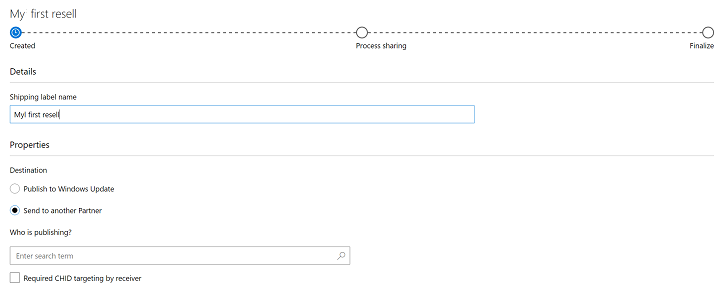
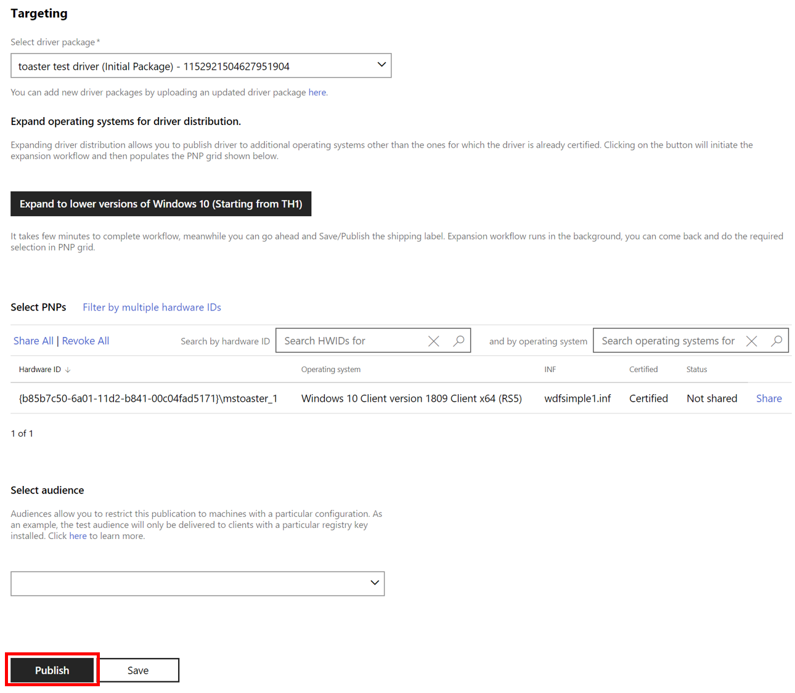

# Share a driver with a partner

To share a driver with one of your partners, [create a hardware submission](create-a-new-hardware-submission.md) and follow the steps below.

**Note**  Shared drivers can only be shared by the organization that originally created it. An organization that receives a shared driver cannot share it again.

 

1. [Find the hardware submission](manage-your-hardware-submissions.md) that contains the driver you want to share.

2. Go to the **Distribution** section of the hardware submission and select **New shipping label**.

   

3. On the shipping label page, go to the **Details** section and enter a name for the shipping label in the **Shipping label name** field. This name is private and is not viewable by your partner. The name allows you to organize and search for your shipping labels.

   

4. In the **Properties** section, complete the following information:

   <table>
   <colgroup>
   <col width="50%" />
   <col width="50%" />
   </colgroup>
   <thead>
   <tr class="header">
   <th>Field</th>
   <th>Description</th>
   </tr>
   </thead>
   <tbody>
   <tr class="odd">
   <td>
<strong>Destination</strong>
</td>
   <td>
Select <strong>Send to another Partner</strong> to share your driver with a partner. If you want to create a shipping label for Windows Update, see <a href="publish-a-driver-to-windows-update.md" data-raw-source="[Publish a driver to Windows Update](publish-a-driver-to-windows-update.md)">Publish a driver to Windows Update</a>.
</td>
   </tr>
   <tr class="even">
   <td>
<strong>Who is publishing?</strong>
</td>
   <td>
Search for the company name of your partner, and select it.
</td>
   </tr>
   <tr class="odd">
   <td>
<strong>Required CHID targeting by receiver</strong>
</td>
   <td>
This option forces your partner to apply CHIDs to any publication requests they create based on your driver. This allows you to protect your users when a Hardware ID may be shared among many partner companies.
</td>
   </tr>
   </tbody>
   </table>

     

5. In the **Targeting** section, select the driver package that you want to share.

   

6. After you select your driver package, **Select PNPs** becomes available. Select the hardware IDs you want to share. Your partner is limited to the selected hardware ID values for any publications they create. You can search for a specific hardware ID or operating system by using the search boxes above the list of hardware IDs.

   -   To target all listed hardware IDs, select **Publish All**.

   -   To target specific hardware IDs, find each desired hardware ID and select **Publish**.

   -   If you targeted all hardware IDs and want to remove them, select **Expire All**.

   -   To remove targeting for specific hardware IDs, find each hardware ID and select **Expire**.

7. Select **Publish** to share the driver. If you do not want to publish the shipping label right now, you can select **Save**. You can publish the shipping label later by either opening the shipping label and selecting **Publish**, or you can select **Publish all pending** from the hardware submission page. Note that selecting **Publish all pending** will publish all unpublished shipping labels.

 

 

