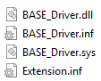
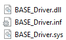
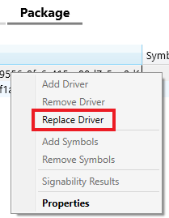
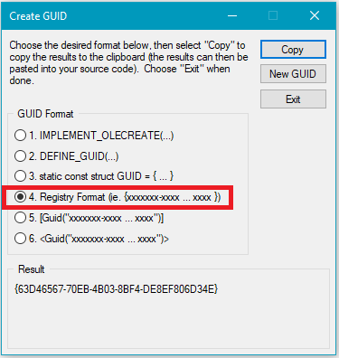
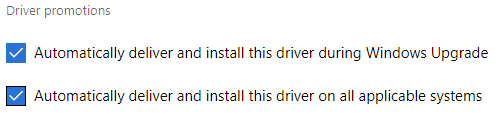

# Working with Extension INFs in the Windows Hardware Dev Center Dashboard

You can create shipping labels for your Extension INF files on the Windows Hardware Dev Center, enabling you to share and publish them like other submissions. This topic describes the process for packaging, submitting, and publishing these packages. For more information on how Extension INFs are created and installed, see [Using an Extension INF file](https://docs.microsoft.com/windows-hardware/drivers/install/using-an-extension-inf-file).

## Requirements for publishing Extension INFs to Windows Update 
Publishing Extension INFs to Windows update requires you to select automatic driver promotion checkboxes on your shipping label. The reason Extension INFs cannot be published as optional is because they are not listed in Device Manager for an end user to initiate an “Update Driver” action.   To see these checkboxes, you must first sign up for [driver flighting](https://docs.microsoft.com/windows-hardware/drivers/dashboard/driver-flighting). 

> [!NOTE]
> Note the following when publishing Extension INF files:
> * For Windows Update to offer Extension INFs, all systems must be running at least the RS3 [January 2018 Update](https://support.microsoft.com/help/4056892/windows-10-update-kb4056892) (10.0.16299.192).

## Submitting and publishing Extension INFs

This section describes how to submit and publish an INF package. See the highlighted items and FAQ for information on common mistakes and frequently asked questions.

> [!IMPORTANT]
> Microsoft recommends always creating a separate submission for each of your Extension INFs, and a separate submission containing only your base driver submission. Publishing your base driver and Extension INFs in a single submission will cause the following issues:
> * All shipping labels will be classified and evaluated as "Extension Drivers" by The Hardware Dev Center Dashboard. To find items that are Extensions, enter `@IsExtensionDriver:"True"` in the Dev Center search box.
> * After being published to Windows Update, users may be forced to download your driver packages multiple times: Once when the base driver is installed, and again for each applicable extension that PnP detects.

### Creating a submission package

#### Base driver package

1. Start a HLK test run with your base driver and Extension INF(s) as normal. The HLK results will be used for all of the below package creation steps. 

    

2. Remove the Extension INF template items from your Drivers folder and add only the base driver files back into your HLK package, as shown below.

    

3. Create and sign this HLKx package to make your base driver package.

    > [!NOTE]
    > Base driver packages must always be backwards compatible with existing extensions

#### Extension INF package

1. Using the same HLK results from above, select **Package** > **Replace Driver**

    

2. Add the Extension INF to the driver's folder with any referenced binaries. If you have multiple Extension INFs, only add one file. 

3. Create and sign this new HLK package. This will be your Extension INF package.

4.	Repeat this process for each of your Extension INFs, removing the driver folder contents each time.

### Submitting your packages to the Hardware Dev Center Dashboard

Create a new submission for each of the packages created above and upload them to the Hardware Dev Center.  Afterwards, create a shipping label for the ones you want share or publish. See [Create a new hardware submission](https://docs.microsoft.com/windows-hardware/drivers/dashboard/create-a-new-hardware-submission) and [Manage driver distribution with shipping labels](https://docs.microsoft.com/windows-hardware/drivers/dashboard/manage-driver-distribution-by-submission) for more information.

#### ExtensionID

The ExtensionID is a GUID that you generate that is used for driver lineage identification and versioning. It describes a hardware device part or part series, and is [automatically registered](https://blogs.msdn.microsoft.com/windows_hardware_certification/2017/11/08/hardware-dev-center-now-automatically-registers-extension-ids/) to the SellerID that submitted it. The owner of this SellerID is responsible for keeping track of ExtensionID usage and mapping, similar to CHID management. 

For example, when you create an ExtensionID for a new system part:

* The ExtensionID ownership will be assigned to your SellerID.
* Every system project from your organization that uses the part or part series will share the same ExtensionID.
* The ExtensionID will remain unchanged for the life of the part.

> [!NOTE]
> * If you use an ExtensionID that is not associated with your SellerID, the Hardware Dev Center Dashboard will reject your submission and inform you that the ExtensionID already belongs to another organization:
> * For a given device, only one Extension INF is installed for each unique ExtensionID value. Therefore, if a device has multiple Extension INFs you will need a new ExtensionID for each one.  This also means if two Extension INFs target the same device with different ExtensionIDs, both Extension INFs will be applied. See [Using an Extension INF file](https://docs.microsoft.com/windows-hardware/drivers/install/using-an-extension-inf-file) for more information.
>
> If your organization manages projects and submissions for another organization, note the following:
> * ExtensionID ownership is assigned to the SellerID who finalizes the submission. 
> * Using another organization's SellerID enables you to use their ExtensionID.
> * To use your organization's SellerID, you will need to create your own ExtensionID for the part or part series.

You should generate a new ExtensionID for the initial version of an Extension INF (i.e. The first time you customize and submit an Extension INF). This includes the first time you receive a new shared shipping label for a new device. Visual Studio includes a GUID creation utilities in Tools > Create GUID, though any online GUID generation tool should work, if it matches the registry format as shown below.

If you are updating an Extension INF that has already been published, keep the ExtensionID the same and increment the version and/or date specified by the [DriverVer directive](https://docs.microsoft.com/windows-hardware/drivers/install/inf-driverver-directive). the Driver date and driver version are used (in that order) to differentiate between multiple Extension INFs with the same ExtensionID.

### Publishing an Extension INF

To publish your Extension INF submission, follow the steps in [Publish a driver to Windows Update](https://docs.microsoft.com/windows-hardware/drivers/dashboard/publish-a-driver-to-windows-update). Ensure that both automatic driver promotion options are checked, and that your Extension INFs have specific targeting. 

If you do not see these driver promotion options, you may need to sign up for [driver flighting](https://docs.microsoft.com/windows-hardware/drivers/dashboard/driver-flighting).

All Extension INFs go through the driver flighting process to be distributed through Windows Update. After a successful flight, the file(s) will be available to retail systems. Joining the Windows Insiders program will give you faster access to drivers in this stage.

## Extension INF targeting and ranking differences

Because extensions are customizations for specific devices, they must always be specifically targeted.  Follow the below guidelines when working with Extension INF targeting:
* Extension INF files must have 4-part Hardware IDs (HWIDs) if possible. 
* In addition to having a 4-part HWID, CHIDs may also be added to the Extension INF's shipping label.
* For parts and part series that don't have a 4-part HWID, CHID targeting is required on the Shipping Label.

This targeting information is vital to accurately evaluate your Extension INF during distribution through Windows Update (WU). There are two stages in which WU evaluates drivers:

1. An applicability stage, when WU builds a list of drivers that apply to a given system.
2.	A ranking stage where Windows PnP and WU determine which driver from the list to install.

In general, there are a few key principles in regards to the ranking/targeting for Extension INFs:  

* The Extension INF's ExtensionID is not used for applicability – just for lineage and versioning identification.

* WU will offer (and PnP will install) the highest-ranked extension driver for each applicable Extension ID.

* Extension drivers are ONLY ranked by Date & Version which is included in the DriverVer directive. This is used by both WU and PnP.  See [INF Version Section](https://docs.microsoft.com/windows-hardware/drivers/install/inf-version-section) and [INF DriverVer directive](https://docs.microsoft.com/windows-hardware/drivers/install/inf-driverver-directive) for more information.
    * Note that PnP and WU don't consider the Feature or Identifier Score (i.e. 2-part vs. 4-part) in regards to extension drivers.

* CHID information is not used when ranking extension drivers on WU (i.e., you can't "block" other extension drivers with CHID targeting).

* For information on driver selection and targeting within the Windows operating system, see [Using an Extension INF file](https://docs.microsoft.com/windows-hardware/drivers/install/using-an-extension-inf-file)

## FAQ

### Driver development

**Do we need to change the ExtensionID every time we make an update to our base driver?**

No, you should keep the same Extension ID when making updates to your base driver.  The ExtensionID is used for version comparison and driver lineage identification.  It should not change within a driver's lineage. 

### Manufacturing

**Can we use an IHV-supplied Extension INF with their ExtensionID for manufacturing purposes?**

No. If you plan on owning the servicing aspect of the extension, then you must use your own Extension INF and ExtensionID during manufacturing.  

### Driver updates

**Do we need to publish an updated Extension INF to Windows Update every time a base driver package is updated and published?**

No, and you must not.  The base driver package must always be backwards compatible with existing extensions.
 
**What happens when an updated base driver is published and applied to an end user's system?** 

When a base driver update is applied, the currently installed Extension INF will be evaluated and applied if necessary. If there are no Extension INFs installed, Windows Update will download the latest applicable version.

**Do we need to publish an updated Extension INF or ExtensionID when we update our OS to the latest version?**

No, the existing ExtensionID and Extension INF will continue to work. 

**Can two systems share the same Extension INF if their customizations are the same?**

Yes.  If multiple systems use the same settings, or if you want to customize settings across a broader set of devices, then one Extension INF is sufficient.  To do this, you would add the applicable 4-part Hardware IDs to the Extension INF. See Using an Extension INF File for more information.

## Related pages

### Hardware Dev Center: 

* [Hardware submissions](hardware-certification-submissions.md)

* [Driver flighting](driver-flighting.md) 

* [Manage driver distribution with shipping labels](driver-flighting.md)

* [Publishing to Windows Update](publish-a-driver-to-windows-update.md)

### Windows Drivers:

* [Using a Universal INF File](https://docs.microsoft.com/windows-hardware/drivers/install/using-a-universal-inf-file)

* [Getting started with universal drivers](https://docs.microsoft.com/windows-hardware/drivers/develop/getting-started-with-universal-drivers)

* [Using a component INF file](https://docs.microsoft.com/windows-hardware/drivers/install/using-a-component-inf-file)

* [How windows ranks drivers](https://docs.microsoft.com/windows-hardware/drivers/install/how-setup-ranks-drivers--windows-vista-and-later-)
