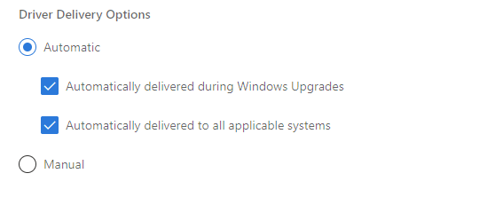

# Understanding Windows Update rules for driver distribution

This article describes how you can control when Windows Update distributes your driver.

When [submitting a driver to Windows Update](publish-a-driver-to-windows-update.md), the **Driver Delivery Options** section presents two radio buttons: **Automatic** and **Manual**

Under the **Automatic** option there are two checkboxes: **Automatically delivered during Windows Upgrades** and **Automatically delivered to all applicable systems**. **Automatic** is the default setting for all new shipping labels.

When the first checkbox is selected, the driver is classified as a **Dynamic Update** (a term that applies to *upgrade* scenarios). Windows automatically preloads drivers in this category when upgrading the OS.

When the second checkbox is selected, the driver is downloaded and installed automatically on all applicable systems once it is released. All **Automatic** drivers must first have been evaluated by Microsoft through [Driver Flighting](driver-flighting.md).

For more info about the **Manual** option, see [Publish a driver to Windows Update](publish-a-driver-to-windows-update.md).

## User plugs in a device

When a device is connected to a Windows system:

* [Plug and Play (PnP)](../kernel/introduction-to-plug-and-play.md) looks for a compatible driver already available on the computer. If one exists, Windows installs it on the device. Then, during the next daily scan of Windows Update, Windows searches for a more up-to-date version of the driver. This can take up to 24 hours from when the device is plugged in.

* If there is no compatible driver on the computer, Windows searches Windows Update for the highest-ranking **Automatic** driver.

When searching Windows Update:

* In Windows 10, version 1909 and earlier, if no **Automatic** driver is available for the device, Windows proceeds to the highest-ranking **Manual** driver.

* Starting in Windows 10, version 2004, Windows does not search for a **Manual** driver when an **Automatic** driver is not available. For info on how to access **Manual** drivers, see the [Windows Update](#windows-update) section of this page.

## Device Manager

In Device Manager, when a user selects **Update driver**:

* In Windows 10, version 1909 and earlier, Windows installs the highest-ranking driver from Windows Update, regardless of whether it is classified as **Automatic** or **Manual**.
* Starting in Windows 10 version 2004, Windows only searches the local computer.

When it fails to find a driver, Device Manager shows a button labeled **Search for updated drivers on Windows Update**, which opens the Settings app to the Windows Update page. To find this button, right-click a device and select **Properties**. On the **Driver** tab, select **Update Driver** and then **Search automatically for drivers**.

* Starting in Windows 10, version 2004, click **Search for updated drivers on Windows Update** and then select **View optional updates->Driver updates** to download **Manual** drivers.
* In earlier versions of Windows, Device Manager downloads **Manual** drivers on its own.

## Windows Update

During a Windows Update scan (scheduled or user-initiated):

* In Windows 10, version 1909 and earlier, Windows Update automatically distributes **Manual** drivers in either of the following scenarios:

    * A device has no applicable drivers available in the Driver Store (raising a "driver not found" error), and there is no applicable **Automatic** driver
    * A device has only a generic driver in the Driver Store, which provides only basic device functionality, and there is no applicable **Automatic** driver

* Starting in Windows 10, version 2004, Windows Update distributes only **Automatic** drivers for a system's devices. When **Manual** drivers are available for devices on the computer, the Windows Update page in the Settings app displays **View optional updates** .

## Summary

The following table summarizes the information above. Windows Update is abbreviated WU.

|Driver delivery options|OS upgrades|Connecting new device|Device Manager|WU scan|WU Optional updates page|
|-|-|-|-|-|-|
|Automatic (both checkboxes)|Yes|Only if the local driver is generic or missing|Only in Windows 10, version 1909 and earlier|Yes|No|
|Automatic (to all applicable systems)|Yes|Only if the local driver is generic or missing|Only in Windows 10, version 1909 and earlier|Yes|No|
|Automatic (during Windows Upgrades)|Yes|No|Only in Windows 10, version 1909 and earlier|No|Yes|
|Manual in Windows 10, version 1909 and earlier|No|Only if the local driver is generic or missing, and WU has no applicable **Automatic** driver|Yes|Only if the local driver is generic or missing, and WU has no applicable **Automatic** driver|N/A|
|Manual in Windows 10, version 2004 and later|No|No|No|No|Yes|

