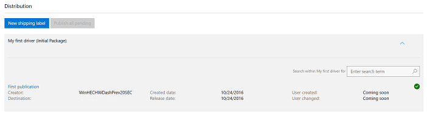

# View partner shipping labels for a shared driver

After you share a driver with a partner, the partner can create shipping labels for your driver. To view a list of partner shipping labels for your shared driver, follow the steps below.

1.  [Find the hardware submission](manage-your-hardware-submissions.md) that contains the shared driver.

2.  Go to the **Distribution** section of the hardware submission. You can view a list of shipping labels for this shared driver.

    

## Related topics

- [Share a driver with a partner](sharing-drivers-with-your-partners.md)

- [Publish a shared driver to Windows Update](https://msdn.microsoft.com/library/windows/hardware/mt786464)

 

 

