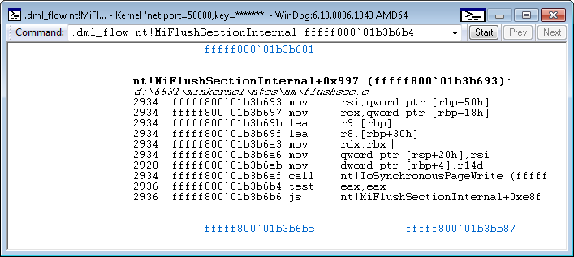

# .dml\_flow (Unasemmble with Links)


The **.dml\_flow** command displays a disassembled code block and provides links that you can use to construct a code flow graph.

```dbgcmd
.dml_flow Start Target
```

## <span id="Parameters"></span><span id="parameters"></span><span id="PARAMETERS"></span>Parameters


<span id="Start"></span><span id="start"></span><span id="START"></span>*Start*  
The address of an instruction from which the target address can be reached.

<span id="Target"></span><span id="target"></span><span id="TARGET"></span>*Target*  
An address in the code block to be disassembled.

Remarks
-------

Consider the call stack shown in the following example.

```dbgcmd
0: kd> kL
Child-SP          RetAddr           Call Site
fffff880`0335c688 fffff800`01b41f1c nt!IofCallDriver
fffff880`0335c690 fffff800`01b3b6b4 nt!IoSynchronousPageWrite+0x1cc
fffff880`0335c700 fffff800`01b4195e nt!MiFlushSectionInternal+0x9b8
...
```

Suppose you want to examine all code paths from the start of **nt!MiFlushSectionInternal** to the code block that contains the return adress, `` fffff800`01b3b6b4 ``. The following command gets you started.

```dbgcmd
.browse .dml_flow nt!MiFlushSectionInternal fffff800`01b3b6b4
```

The output, in the [Command Browser window](command-browser-window.md), is shown in the following image.



The preceding image shows the code block that contains the target address, `` fffff800`01b3b6b4 ``. There is only one link (`` fffff800`01b3b681 ``) at the top of the image. That indicates that there is only one code block from which the current code block can be reached. If you click the link, you will see that code block disassembled, and you will see links that enable you to further explore the code flow graph.

The two links at the bottom of the preceding image indicate that there are two code blocks that can be reached from the current code block.

## <span id="see_also"></span>See also


[Debugger Markup Language Commands](debugger-markup-language-commands.md)

[**uf (Unasemmble Function)**](uf--unassemble-function-.md)

 

 


