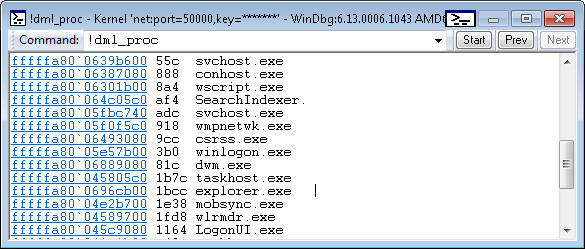
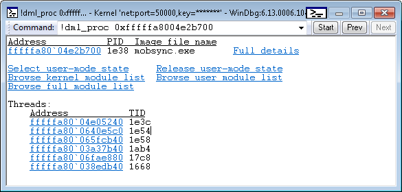

# !dml\_proc


The **!dml\_proc** extension displays a list of processes and provides links for obtaining more detailed information about processes.

```dbgcmd
!dml_proc
```

Remarks
-------

The following image shows a portion of the output displayed by **!dml\_proc**.



In the preceding output, the process addresses are links that you can click to see more detailed information. For example, if you click **fffffa80\`04e2b700** (the address for mobsync.exe), you will see detailed information about the mobsync.exe process as shown in the following image.



The preceding output, which describes an individual process, contains links that you can click to explore the process and its threads in more detail.

## <span id="see_also"></span>See also


[Debugger Markup Language Commands](debugger-markup-language-commands.md)

 

 


