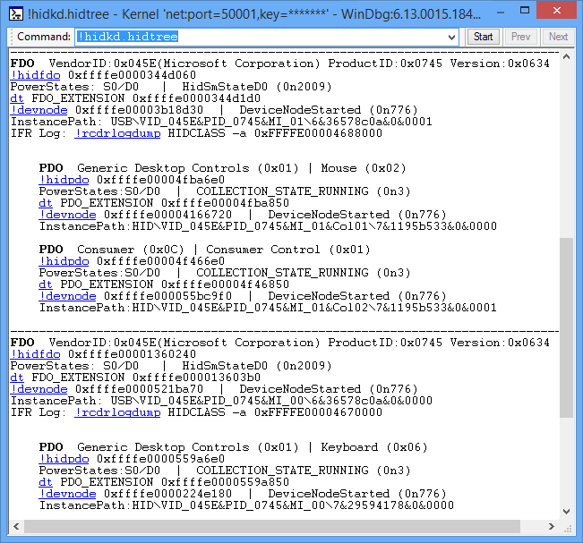

# !hidkd.hidtree


The **!hidkd.hidtree** command displays a list of all device nodes that have a HID function driver along with their child nodes. The child nodes have a physical device object (PDO) that was created by the parent node's HID function driver.

```dbgcmd
!hidkd.hidtree
```

This screen shot shows an example of the output of the **!hidtree** command.



O

In this example, there are two device nodes that have a HID function driver. A functional device object (FDO) represents the HID driver in those two nodes. The first FDO node has two child nodes, and the second FDO node has one child node. In the debugger output, the child nodes have the PDO heading.

**Note**  This set of device nodes does not form a tree that has a single root node. The device nodes that have HID function drivers can be isolated from each other.

 

When you are debugging a HID issue, the **!hidtree** is a good place to start, because the command displays several addresses that you can pass to other HID debugger commands. The output uses [Debugger Markup Language (DML)](debugger-markup-language-commands.md) to provide links. The links execute commands that give detailed information related to an individual device node. For example, you could get information about an FDO by clicking one of the [**!hidfdo**](-hidkd-hidfdo.md) links. As an alternative to clicking a link, you can enter a command. For example, to see detailed information about the first node in the preceding output, you could enter the command **!devnode 0xffffe00003b18d30**.

**Note**  The DML feature is available in WinDbg, but not in Visual Studio or KD.

 

## <span id="DLL"></span><span id="dll"></span>DLL


Hidkd.dll

## <span id="see_also"></span>See also


[HID Extensions](hid-extensions.md)

 

 


