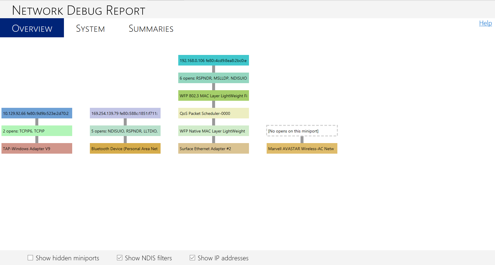
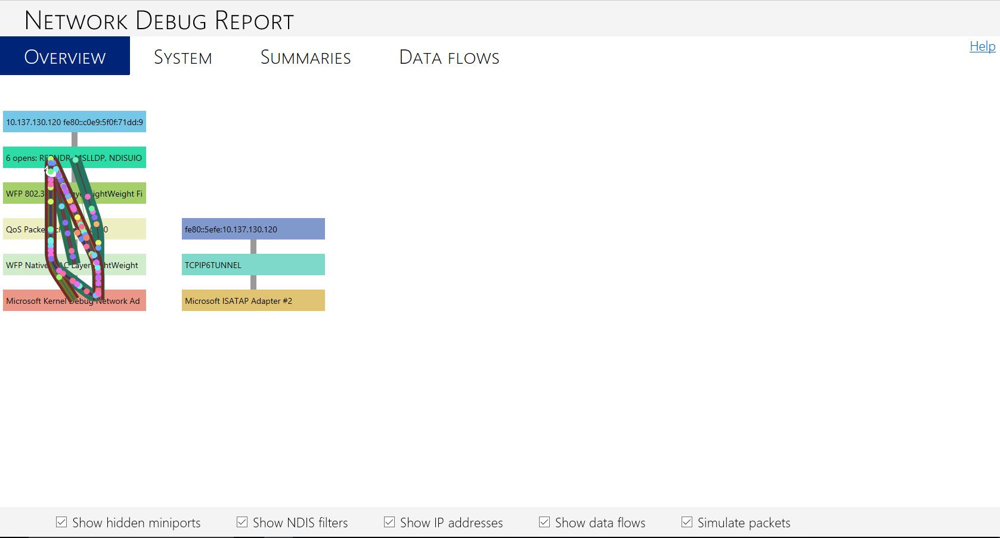
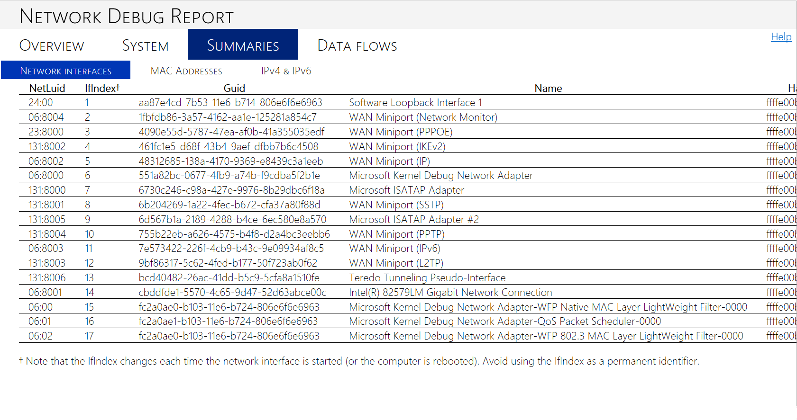
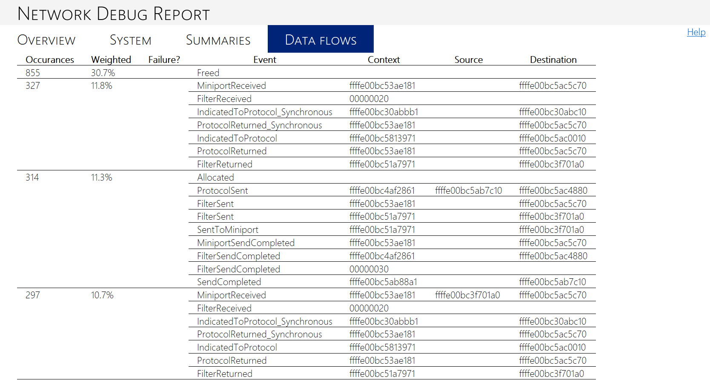

# !ndiskd.netreport


The **!ndiskd.netreport** extension generates a visual report of the entire network stack. The report **!ndiskd.netreport** generates is an HTML file, and it will give you a link to its location. The HTML file contains detailed information about the network stack, so if you need to share it for analysis you can email it instead of having to send a large crash dump file.

```console
!ndiskd.netreport [-outputpath <str>] [-jsononly] 
```

## <span id="Parameters"></span><span id="parameters"></span><span id="PARAMETERS"></span>Parameters


<span id="_______-outputpath______"></span><span id="_______-OUTPUTPATH______"></span> *-outputpath*   
Specifies where to write the report file.

<span id="_______-jsononly______"></span><span id="_______-JSONONLY______"></span> *-jsononly*   
Only writes the raw data, no HTML.

### <span id="DLL"></span><span id="dll"></span>DLL

Ndiskd.dll

Examples
--------

Run the **!ndiskd.netreport** extension to draw a box diagram of your network stack.

```console
1: kd> !ndiskd.netreport


NETWORK STACK REPORT


    Want more stuff?  Rerun with the -verbose flag
                                                                                            

    Report was saved to C:\Users\******\AppData\Local\Temp\NKDFE9F.html
    View the report                        Send in email
```

Click the "View the report" link at the bottom to see the report generated. The following image shows a net report generated from a crash dump file. Each vertical stack is a network adapter, broken down into layers showing the components of the stack. The color of each box is generated by hashing the name of the component, which means the same components will render with the same color every time you run the report. This means you can easily pick out a particular driver or adapter if you are debugging an issue with it.



As a comparison, the following image shows a net report generated from an active system instead of a crash dump file. Note that there are two more options at the bottom of the HTML page to "Show data flows" and "Simulate packets," and there is a fourth tab at the top of the report for "Data flows." These options appeared because the debugee machine had NBL tracking enabled, which lets **!ndiskd.netreport** parse the NBL tracking log to display the information visually. If NBL tracking is not turned on, these options will not appear. For more information about NBL tracking and the NBL log, see [**!ndiskd.nbllog**](-ndiskd-nbllog.md).

By checking the "Show data flows" box, you can see the paths where the data is flowing. By checking the "Simulate packets" box, you can see animated circles moving up and down the data flow paths. Each circle represents a network packet.



This second example from an active system also shows another difference from the first example, which used a crash dump file. The target debugee machine in the second example was provisioned for kernel debugging over a network, so you can see the network adapter on the stack with the data flows is the Microsoft Kernel Debug Network Adapter. This adapter is usually hidden unless kernel debugging has been enabled on the debugee machine. In reality, the Kernel Debug Network Adapter has reserved the machine's Ethernet adapter for the debug session, so traffic is flowing over Ethernet.

The ability to visualize the network stack and see where traffic is flowing can enable you to quickly identify where a problem might be. This can be particularly helpful for virtual switches or servers, which have more complicated network diagrams than the previous examples. For example, on a Windows Server that uses NIC Teaming, you can see if multiple network stacks cross each other to balance the traffic load and identify if there is an issue at the bottom of one stack that is affecting another stack. To see an example of a network debug report that shows this, see [Debugging the Network Stack](https://go.microsoft.com/fwlink/p/?linkid=845311). For more information about NIC Teaming, see [Using NIC Teaming for Network Subsystem Performance](https://msdn.microsoft.com/library/windows/hardware/dn567652).

**!ndiskd.netreport** also has other tabs at the top of the page for System, Summaries, and Data Flows (if applicable). These tabs contain further useful information about the state of the network stack. The following image shows the Network Interfaces tab, under the Summaries tab. The table in this tab lets you see more information about the names and identifiers for the network interfaces in the system.



The Data flows tab, which appears if NBL tracking was enabled on the target system, shows a table of traffic events and details about each one. The following image shows the Data flows tab from the active system in the second example debug report described previously.



## <span id="see_also"></span>See also


[Network Driver Design Guide](https://msdn.microsoft.com/windows/hardware/drivers/network/index)

[Windows Vista and Later Networking Reference](https://msdn.microsoft.com/library/windows/hardware/ff571081)

[Debugging the Network Stack](https://go.microsoft.com/fwlink/p/?linkid=845311)

[**NDIS extensions (Ndiskd.dll)**](ndis-extensions--ndiskd-dll-.md)

[**!ndiskd.help**](-ndiskd-help.md)

[**!ndiskd.nbllog**](-ndiskd-nbllog.md)

[Using NIC Teaming for Network Subsystem Performance](https://msdn.microsoft.com/library/windows/hardware/dn567652)

 

 


