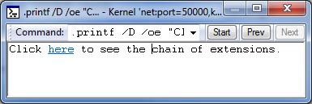
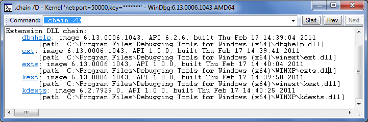

# .printf


The **.printf** token behaves like the **printf** statement in C.

```dbgcmd
.printf [/D] [Option] "FormatString" [, Argument , ...] 
```

## <span id="Syntax_Elements"></span><span id="syntax_elements"></span><span id="SYNTAX_ELEMENTS"></span>Syntax Elements


<span id="_D"></span><span id="_d"></span>**/D**  
Specifies that the format string contains [Debugger Markup Language](debugger-markup-language-commands.md) (DML).

<span id="_______Option______"></span><span id="_______option______"></span><span id="_______OPTION______"></span> *Option*   
(WinDbg only) Specifies the type of text message that WinDbg should interpret the FormatString as. WinDbg assigns each type of Debugger Command window message a background and text color; choosing one of these options causes the message to be displayed in the appropriate colors. The default is to display the text as a normal-level message. For more information on message colors and how to set them, see [View | Options](view---options.md).

The following options are available.

<table>
<colgroup>
<col width="33%" />
<col width="33%" />
<col width="33%" />
</colgroup>
<thead>
<tr class="header">
<th align="left">Option</th>
<th align="left">Type of message</th>
<th align="left">Title of colors in Options dialog box</th>
</tr>
</thead>
<tbody>
<tr class="odd">
<td align="left"><p>/od</p></td>
<td align="left"><p>debuggee</p></td>
<td align="left"><p>Debuggee level command window</p></td>
</tr>
<tr class="even">
<td align="left"><p>/oD</p></td>
<td align="left"><p>debuggee prompt</p></td>
<td align="left"><p>Debuggee prompt level command window</p></td>
</tr>
<tr class="odd">
<td align="left"><p>/oe</p></td>
<td align="left"><p>error</p></td>
<td align="left"><p>Error level command window</p></td>
</tr>
<tr class="even">
<td align="left"><p>/on</p></td>
<td align="left"><p>normal</p></td>
<td align="left"><p>Normal level command window</p></td>
</tr>
<tr class="odd">
<td align="left"><p>/op</p></td>
<td align="left"><p>prompt</p></td>
<td align="left"><p>Prompt level command window</p></td>
</tr>
<tr class="even">
<td align="left"><p>/oP</p></td>
<td align="left"><p>prompt registers</p></td>
<td align="left"><p>Prompt registers level command window</p></td>
</tr>
<tr class="odd">
<td align="left"><p>/os</p></td>
<td align="left"><p>symbols</p></td>
<td align="left"><p>Symbol message level command window</p></td>
</tr>
<tr class="even">
<td align="left"><p>/ov</p></td>
<td align="left"><p>verbose</p></td>
<td align="left"><p>Verbose level command window</p></td>
</tr>
<tr class="odd">
<td align="left"><p>/ow</p></td>
<td align="left"><p>warning</p></td>
<td align="left"><p>Warning level command window</p></td>
</tr>
</tbody>
</table>

 

<span id="_______FormatString______"></span><span id="_______formatstring______"></span><span id="_______FORMATSTRING______"></span> *FormatString*   
Specifies the format string, as in **printf**. In general, conversion characters work exactly as in C. For the floating-point conversion characters, the 64-bit argument is interpreted as a 32-bit floating-point number unless the **l** modifier is used.

The "I64" modifier can be added to indicate that a value should be interpreted as 64-bits. For instance, "%I64x" can be used to print a 64-bit hexadecimal number.

The %p conversion character is supported, but it represents a pointer in the target's virtual address space. It must not have any modifiers and it uses the debugger's internal address formatting. In addition to the standard printf-style format specifiers, the following additional conversion characters are supported.

<table>
<colgroup>
<col width="25%" />
<col width="25%" />
<col width="25%" />
<col width="25%" />
</colgroup>
<thead>
<tr class="header">
<th align="left">Character</th>
<th align="left">Argument type</th>
<th align="left">Argument</th>
<th align="left">Text printed</th>
</tr>
</thead>
<tbody>
<tr class="odd">
<td align="left"><p>%p</p></td>
<td align="left"><p>ULONG64</p></td>
<td align="left"><p>A pointer in the target&#39;s virtual address space.</p></td>
<td align="left"><p>The value of the pointer.</p></td>
</tr>
<tr class="even">
<td align="left"><p>%N</p></td>
<td align="left"><p>DWORD_PTR (32 or 64 bits, depending on the host&#39;s architecture)</p></td>
<td align="left"><p>A pointer in the host&#39;s virtual address space.</p></td>
<td align="left"><p>The value of the pointer. (This is equivalent to the standard C %p character.)</p></td>
</tr>
<tr class="odd">
<td align="left"><p>%ma</p></td>
<td align="left"><p>ULONG64</p></td>
<td align="left"><p>The address of a NULL-terminated ASCII string in the target&#39;s virtual address space.</p></td>
<td align="left"><p>The specified string.</p></td>
</tr>
<tr class="even">
<td align="left"><p>%mu</p></td>
<td align="left"><p>ULONG64</p></td>
<td align="left"><p>The address of a NULL-terminated Unicode string in the target&#39;s virtual address space.</p></td>
<td align="left"><p>The specified string.</p></td>
</tr>
<tr class="odd">
<td align="left"><p>%msa</p></td>
<td align="left"><p>ULONG64</p></td>
<td align="left"><p>The address of an ANSI_STRING structure in the target&#39;s virtual address space.</p></td>
<td align="left"><p>The specified string.</p></td>
</tr>
<tr class="even">
<td align="left"><p>%msu</p></td>
<td align="left"><p>ULONG64</p></td>
<td align="left"><p>The address of a UNICODE_STRING structure in the target&#39;s virtual address space.</p></td>
<td align="left"><p>The specified string.</p></td>
</tr>
<tr class="even">
<td align="left"><p>%y</p></td>
<td align="left"><p>ULONG64</p></td>
<td align="left"><p>The address of a debugger symbol in the target&#39;s virtual address space.</p></td>
<td align="left"><p>A string containing the name of the specified symbol (and displacement, if any).</p></td>
</tr>
<tr class="odd">
<td align="left"><p>%ly</p></td>
<td align="left"><p>ULONG64</p></td>
<td align="left"><p>The address of a debugger symbol in the target&#39;s virtual address space.</p></td>
<td align="left"><p>A string containing the name of the specified symbol (and displacement, if any), as well as any available source line information.</p></td>
</tr>
</tbody>
</table>

 

<span id="_______Arguments______"></span><span id="_______arguments______"></span><span id="_______ARGUMENTS______"></span> *Arguments*   
Specifies arguments for the format string, as in **printf**. The number of arguments that are specified should match the number of conversion characters in *FormatString*. Each argument is an expression that will be evaluated by the default expression evaluator (MASM or C++). For details, see [Numerical Expression Syntax](numerical-expression-syntax.md).

### <span id="Additional_Information"></span><span id="additional_information"></span><span id="ADDITIONAL_INFORMATION"></span>Additional Information

For information about other control flow tokens and their use in debugger command programs, see [Using Debugger Command Programs](using-debugger-command-programs.md).

Remarks
-------

The color settings that you can choose by using the *Options* parameter are by default all set to black text on a white background. To make best use of these options, you must first use [View | Options](view---options.md) to open the Options dialog box and change the color settings for Debugger Command window messages.

The following example shows how to include a DML tag in the format string.

```dbgcmd
.printf /D "Click <link cmd=\".chain /D\">here</link> to see extensions DLLs."
```



The output shown in the preceding image has a link that you can click to execute the command specified in the `<link>` tag. The following image shows the result of clicking the link.



For information about DML tags, see dml.doc in the installation folder for Debugging Tools for Windows.

 

 


