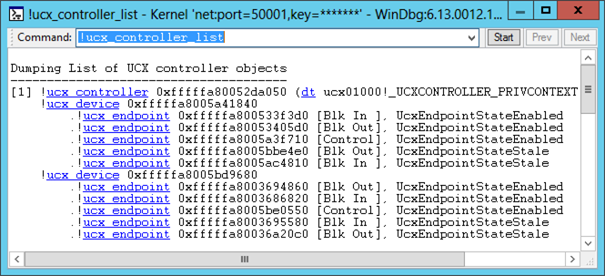

# !usb3kd.ucx\_controller\_list


The [**!usb3kd.ucx\_controller\_list**](-usb3kd-device-info.md) command displays information about all USB 3.0 host controllers on the computer. The display is based on data structures maintained by the USB host controller extension driver (Ucx*Version*.sys).

```
!usb3kd.ucx_controller_list
```

## <span id="Examples"></span><span id="examples"></span><span id="EXAMPLES"></span>Examples


The following screen shot show the output of the [**!ucx\_controller\_list**](-usb3kd-device-info.md) command.



The output shows that there is one USB 3.0 host controller, which is represented by the line that begins with [**!ucx\_controller**](-usb3kd-ucx-controller.md). You can see that two devices are connected to the controller and that each device has four endpoints.

The output uses [Using Debugger Markup Language (DML)](debugger-markup-language-commands.md) to provide links. The links execute commands that give detailed information about individual devices or endpoints. For example, you could get detailed information about an endpoint by clicking one of the [**!ucx\_endpoint**](-usb3kd-ucx-endpoint.md) links. As an alternative to clicking a link, you can enter a command. For example, to see information about the first endpoint of the second device, you could enter the command **!ucx\_endpoint 0xfffffa8003694860**.

**Note**  The DML feature is available in WinDbg, but not in Visual Studio or KD.

 

## <span id="DLL"></span><span id="dll"></span>DLL


Usb3kd.dll

Remarks
-------

The [**!ucx\_controller\_list**](-usb3kd-device-info.md) command is the parent command for this set of commands.

-   [**!ucx\_controller**](-usb3kd-ucx-controller.md)
-   [**!ucx\_device**](-usb3kd-ucx-device.md)
-   [**!ucx\_endpoint**](-usb3kd-ucx-endpoint.md)

The USB host controller extension driver (Ucx*Version*.sys) provides a layer of abstraction between the USB 3.0 hub driver and the USB 3.0 host controller driver. The extension driver has its own representation of host controllers, devices, and endpoints. The outputs of the commands in the [**!ucx\_controller\_list**](-usb3kd-device-info.md) family are based on the data structures maintained by the extension driver. For more information about the USB host controller extension driver and the USB 3.0 host controller driver, see [USB Driver Stack Architecture](http://go.microsoft.com/fwlink/p?LinkID=251983). For an explanation of the data structures used by the drivers in the USB 3.0 stack, see Part 2 of the [USB Debugging Innovations in Windows 8](http://go.microsoft.com/fwlink/p/?LinkID=249153) video.

## <span id="see_also"></span>See also


[USB 3.0 Extensions](usb-3-extensions.md)

[Universal Serial Bus (USB) Drivers](http://go.microsoft.com/fwlink/p?LinkID=227351)

 

 

[Send comments about this topic to Microsoft](mailto:wsddocfb@microsoft.com?subject=Documentation%20feedback%20[debugger\debugger]:%20!usb3kd.ucx_controller_list%20%20RELEASE:%20%285/15/2017%29&body=%0A%0APRIVACY%20STATEMENT%0A%0AWe%20use%20your%20feedback%20to%20improve%20the%20documentation.%20We%20don't%20use%20your%20email%20address%20for%20any%20other%20purpose,%20and%20we'll%20remove%20your%20email%20address%20from%20our%20system%20after%20the%20issue%20that%20you're%20reporting%20is%20fixed.%20While%20we're%20working%20to%20fix%20this%20issue,%20we%20might%20send%20you%20an%20email%20message%20to%20ask%20for%20more%20info.%20Later,%20we%20might%20also%20send%20you%20an%20email%20message%20to%20let%20you%20know%20that%20we've%20addressed%20your%20feedback.%0A%0AFor%20more%20info%20about%20Microsoft's%20privacy%20policy,%20see%20http://privacy.microsoft.com/default.aspx. "Send comments about this topic to Microsoft")


