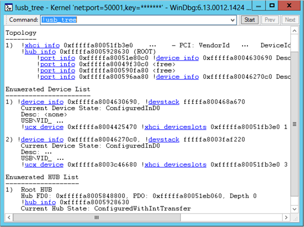

# !usb3kd.usb\_tree


The [**!usb3kd.usb\_tree**](-usb3kd-device-info.md) extension displays information, in tree format, about all USB 3.0 controllers, hubs, and devices on the computer.

```dbgcmd
!usb3kd.usb_tree [1]
```

## <span id="ddk__devobj_dbg"></span><span id="DDK__DEVOBJ_DBG"></span>Parameters


<span id="_______1______"></span> **1**   
The display includes status information for hubs and ports.

## <span id="Examples"></span><span id="examples"></span><span id="EXAMPLES"></span>Examples


The following screen shot shows the output of the [**!usb\_tree**](-usb3kd-device-info.md) command.



The output shows that there is one USB 3.0 host controller, which is represented by the line that begins with [**!xhci\_info**](-usb3kd-xhci-info.md). The next line represents the root hub for the host controller. The next four lines represent ports associated with the root hub. You can see that two ports have devices connected.

The output uses [Using Debugger Markup Language (DML)](debugger-markup-language-commands.md) to provide links. The links execute commands that give detailed information about individual objects in the tree. For example, you could get information about one of the connected devices by clicking one of the [**!device\_info**](-usb3kd-device-info.md) links. As an alternative to clicking a link, you can enter a command. For example, to see information about the first connected device, you could enter the command **!device\_info 0xfffffa8004630690**.

**Note**  The DML feature is available in WinDbg, but not in Visual Studio or KD.

 

## <span id="DLL"></span><span id="dll"></span>DLL


Usb3kd.dll

Remarks
-------

The [**!usb\_tree**](-usb3kd-device-info.md) command is the parent command for this set of commands.

-   [**!hub\_info**](-usb3kd-hub-info.md)
-   [**!hub\_info\_from\_fdo**](-usb3kd-hub-info-from-fdo.md)
-   [**!device\_info**](-usb3kd-device-info.md)
-   [**!device\_info\_from\_pdo**](-usb3kd-device-info-from-pdo.md)
-   [**!port\_info**](-usb3kd-port-info.md)

The information displayed by the [**!usb\_tree**](-usb3kd-device-info.md) family of commands is based on data structures maintained by the USB 3.0 hub driver. For information about the USB 3.0 hub driver and other drivers in the USB 3.0 stack, see [USB Driver Stack Architecture](https://go.microsoft.com/fwlink/p?LinkID=251983). For an explanation of the data structures used by the drivers in the USB 3.0 stack, see Part 2 of the [USB Debugging Innovations in Windows 8](https://go.microsoft.com/fwlink/p/?LinkID=249153) video.

## <span id="see_also"></span>See also


[USB 3.0 Extensions](usb-3-extensions.md)

[Universal Serial Bus (USB) Drivers](https://go.microsoft.com/fwlink/p?LinkID=227351)

 

 


