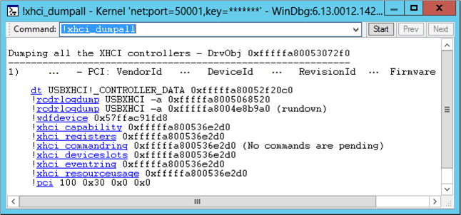

# !usb3kd.xhci\_dumpall


The [**!usb3kd.xhci\_dumpall**](-usb3kd-device-info.md) command displays information about all USB 3.0 host controllers on the computer. The display is based on the data structures maintained by the USB 3.0 host controller driver (UsbXhci.sys).

``` syntax
!usb3kd.xhci_dumpall [1]
```

## <span id="ddk__devobj_dbg"></span><span id="DDK__DEVOBJ_DBG"></span>Parameters


<span id="_____________1"></span> **1**  
Runs all of the XHCI commands and displays the output of each command.

## <span id="Examples"></span><span id="examples"></span><span id="EXAMPLES"></span>Examples


The following screen shot show the output of the **!xhci\_dumpall**l command.



The output shows that there is one USB 3.0 host controller.

The output uses [Using Debugger Markup Language (DML)](debugger-markup-language-commands.md) to provide links. The links execute commands that give detailed information about the state of the host controller as it is maintained by the USB 3.0 host controller driver. For example, you could get detailed information about the host controller capabilities by clicking the [**!xhci\_capability**](-usb3kd-xhci-capability.md) link. As an alternative to clicking a link, you can enter a command. For example, to see information about the host controller's resource usage, you could enter the command **!xhci\_resourceusage 0xfffffa800536e2d0**.

**Note**  The DML feature is available in WinDbg, but not in Visual Studio or KD.

 

## <span id="DLL"></span><span id="dll"></span>DLL


Usb3kd.dll

Remarks
-------

The **!xhci\_dumpall** command is the parent command for this set of commands.

-   [**!xhci\_capability**](-usb3kd-xhci-capability.md)
-   [**!xhci\_info**](-usb3kd-xhci-info.md)
-   [**!xhci\_deviceslots**](-usb3kd-xhci-deviceslots.md)
-   [**!xhci\_commandring**](-usb3kd-xhci-commandring.md)
-   [**!xhci\_eventring**](-usb3kd-xhci-eventring.md)
-   [**!xhci\_transferring**](-usb3kd-xhci-transferring.md)
-   [**!xhci\_trb**](-usb3kd-xhci-trb.md)
-   [**!xhci\_registers**](-usb3kd-xhci-registers.md)
-   [**!xhci\_resourceusage**](-usb3kd-xhci-resourceusage.md)

The information displayed by the **!xhci\_dumpall** family of commands is based on data structures maintained by the USB 3.0 host controller driver. For information about the USB 3.0 host controller driver and other drivers in the USB 3.0 stack, see [USB Driver Stack Architecture](http://go.microsoft.com/fwlink/p?LinkID=251983). For an explanation of the data structures used by the drivers in the USB 3.0 stack, see Part 2 of the [USB Debugging Innovations in Windows 8](http://go.microsoft.com/fwlink/p/?LinkID=249153) video.

## <span id="see_also"></span>See also


[USB 3.0 Extensions](usb-3-extensions.md)

[Universal Serial Bus (USB) Drivers](http://go.microsoft.com/fwlink/p?LinkID=227351)

 

 

[Send comments about this topic to Microsoft](mailto:wsddocfb@microsoft.com?subject=Documentation%20feedback%20[debugger\debugger]:%20!usb3kd.xhci_dumpall%20%20RELEASE:%20%285/15/2017%29&body=%0A%0APRIVACY%20STATEMENT%0A%0AWe%20use%20your%20feedback%20to%20improve%20the%20documentation.%20We%20don't%20use%20your%20email%20address%20for%20any%20other%20purpose,%20and%20we'll%20remove%20your%20email%20address%20from%20our%20system%20after%20the%20issue%20that%20you're%20reporting%20is%20fixed.%20While%20we're%20working%20to%20fix%20this%20issue,%20we%20might%20send%20you%20an%20email%20message%20to%20ask%20for%20more%20info.%20Later,%20we%20might%20also%20send%20you%20an%20email%20message%20to%20let%20you%20know%20that%20we've%20addressed%20your%20feedback.%0A%0AFor%20more%20info%20about%20Microsoft's%20privacy%20policy,%20see%20http://privacy.microsoft.com/default.aspx. "Send comments about this topic to Microsoft")


