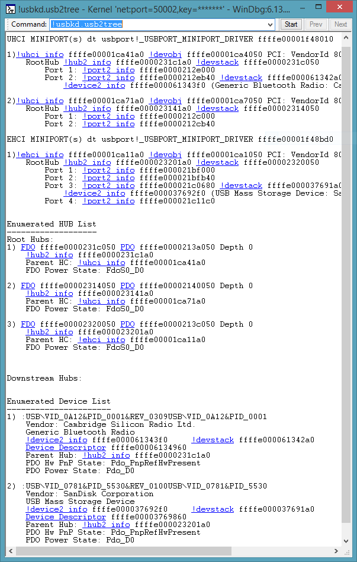

# !usbkd.usb2tree


The **!usbkd.usb2tree** command displays [USB 2.0 tree](usb-2-0-extensions.md#usb-2-tree).

```dbgcmd
!usbkd.usb2tree
```

## <span id="Examples"></span><span id="examples"></span><span id="EXAMPLES"></span>Examples


This screen shot shows and example of the output of the **!usb2tree** command.



The output shows one EHCI execution unit and two UHCI execution units. The execution units shown in this example happen to be on a single USB host controller device. The output also shows the root hubs and connected devices.

The output uses [Using Debugger Markup Language (DML)](debugger-markup-language-commands.md) to provide links. The links execute commands that give detailed information related to objects in the tree. For example, you could click one of the [**!devobj**](-devobj.md) links to get information about the functional device object associated with the EHCI execution unit. As an alternative to clicking the link, you could enter the command manually: **!devobj ffffe00001ca7050**

**Note**  The DML feature is available in WinDbg, but not in Visual Studio or KD.

 

## <span id="DLL"></span><span id="dll"></span>DLL


Usb3kd.dll

Remarks
-------

The **!usb2tree** command is the parent command for many of the [USB 2.0 debugger extensions commands.](usb-2-0-extensions.md) The information displayed by these commands is based on data structures maintained by these drivers:

-   usbehci.sys (miniport driver for USB 2 host controller)
-   usbuhci.sys (miniport driver for USB 2 host controller)
-   usbport.sys (port driver for USB 2 host controller)
-   usbhub.sys (USB 2 hub driver)

For more information about these drivers, see [USB Driver Stack Architecture](https://go.microsoft.com/fwlink/p/?LinkId=251983).

## <span id="see_also"></span>See also


[USB 2.0 Debugger Extensions](usb-2-0-extensions.md)

[Universal Serial Bus (USB) Drivers](https://go.microsoft.com/fwlink/p?LinkID=227351)

 

 


