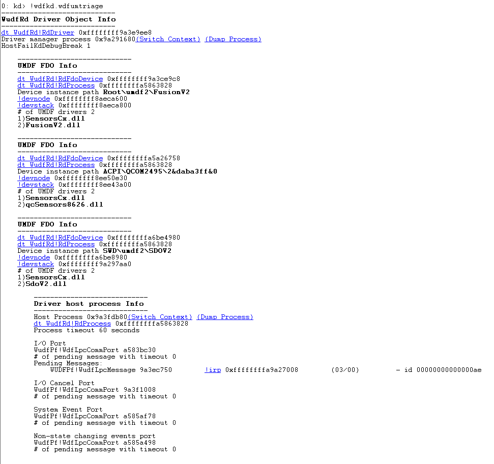

# !wdfkd\_wdfumtriage


The **!wdfkd\_wdfumtriage** extension displays information about all UMDF devices on the system, including device objects, corresponding host process, loaded drivers and class extensions, PnP device stack, PnP device nodes, dispatched IRPs, and problem state if relevant.

```dbgcmd
!wdfkd.wdfumtriage
```

## <span id="DLL"></span><span id="dll"></span>DLL


Wdfkd.dll

## <span id="Frameworks"></span><span id="frameworks"></span><span id="FRAMEWORKS"></span>Frameworks


UMDF 2

## <span id="Additional_Information"></span><span id="additional_information"></span><span id="ADDITIONAL_INFORMATION"></span>Additional Information


For more information, see [Kernel-Mode Driver Framework Debugging](kernel-mode-driver-framework-debugging.md).

Remarks
-------

You can use this command in a kernel-mode debugging session.

Here is an example of the output of **!wdfkd\_wdfumtriage**.



 

 


