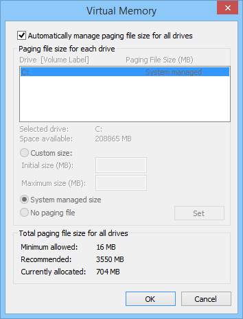

# Automatic Memory Dump

## 

An *Automatic Memory Dump* contains the same information as a [Kernel Memory Dump](kernel-memory-dump.md). The difference between the two is not in the dump file itself, but in the way that Windows sets the size of the system paging file.

If the system paging file size is set to **System managed size**, and the kernel-mode crash dump is set to **Automatic Memory Dump**, then Windows can set the size of the paging file to less than the size of RAM. In this case, Windows sets the size of the paging file large enough to ensure that a kernel memory dump can be captured most of the time.

If the computer crashes and the paging file is not large enough to capture a kernel memory dump, Windows increases the size of the paging file to at least the size of RAM. The time of this event is recorded here in the Registry:

**HKLM**\\**SYSTEM**\\**CurrentControlSet**\\**Control**\\**CrashControl**\\**LastCrashTime**

The increased paging file size stays in place for 4 weeks and then returns to the smaller size. If you want to return to the smaller paging file before 4 weeks, you can delete the Registry entry.

To see the paging file settings, go to **Control Panel &gt; System and Security &gt; System &gt; Advanced system settings**. Under **Performance**, click **Settings**. On the **Advanced** tab, under **Virtual memory**, click **Change**. In the Virtual Memory dialog box, you can see the paging file settings.

The Automatic Memory Dump file is written to %SystemRoot%\\Memory.dmp by default.

The Automatic Memory Dump is available in Windows 8 and later.

**Note**  To suppress missing page error messages when debugging an Automatic Memory Dump, use the [**.ignore\_missing\_pages**](-ignore-missing-pages--suppress-missing-page-errors-.md) command.

 

## Related topics

[Varieties of Kernel-Mode Dump Files](varieties-of-kernel-mode-dump-files.md)

[Kernel-Mode Dump Files](kernel-mode-dump-files.md)

[Creating a Kernel-Mode Dump File](creating-a-kernel-mode-dump-file.md)

 

 

