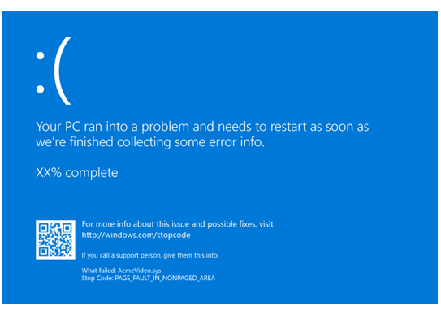

# Blue Screen Data


**Note**  This topic is for programmers. If you are a customer who has received a blue screen error code while using your computer, see [Troubleshoot blue screen errors](https://go.microsoft.com/fwlink/p/?linkid=183646).

 

**Note**   If you are an IT professional or support agent, see this article for additional information, [Troubleshoot "blue screen" or Stop error problems before you contact Microsoft Support](https://support.microsoft.com/help/3106831/troubleshoot-blue-screen-or-stop-error-problems-before-you-contact-microsoft-support).

 

When Microsoft Windows encounters a condition that compromises safe system operation, the system halts. This condition is called a *bug check*. It is also commonly referred to as a *system crash*, a *kernel error*, or a *stop error*.

If the OS were allowed to continue to run after the operating system integrity is compromised, it could corrupt data or compromise the security of the system.

If crash dumps are enabled on the system, a crash dump file is created.

If a kernel debugger is attached and active, the system causes a break so that the debugger can be used to investigate the crash.

If no debugger is attached, a blue text screen appears with information about the error. This screen is called a *blue screen*, a *bug check screen*, or a *stop screen*.

If you are using an insider build of Windows, the text will be displayed on a green background.

The exact appearance of the blue screen depends on the cause of the error.

The following is an example of one possible blue screen:



The stop code is displayed such as [**PAGE\_FAULT\_IN\_NONPAGED\_AREA**](bug-check-0x50--page-fault-in-nonpaged-area.md). When it is available, the module name of the code that was being executed is also displayed, such as AcmeVideo.sys.

If a [kernel-mode dump file](kernel-mode-dump-files.md) has been written, this will be indicated as well with a percentage complete count down as the dump is being written.

There is a stop code hex value associated with each stop code as listed in [Bug Check Code Reference](bug-check-code-reference2.md).

## <span id="ddk_blue_screen_data_dbg"></span><span id="DDK_BLUE_SCREEN_DATA_DBG"></span>


### <span id="Gathering_the_Stop_Code_Parameters"></span><span id="gathering_the_stop_code_parameters"></span><span id="GATHERING_THE_STOP_CODE_PARAMETERS"></span>Gathering the Stop Code Parameters

Each bug check code has four associated parameters that provide additional information. The parameters are described in [Bug Check Code Reference](bug-check-code-reference2.md) for each stop code.

There are multiple ways to gather the four stop code parameters.

-   Examine the Windows system log in the event viewer. The event properties for the BugCheck will list the four stop code parameters. For more information, see [Open Event Viewer](https://windows.microsoft.com/windows/what-information-event-logs-event-viewer#1TC=windows-7).

-   Load the generated dump file and use the [**!analyze**](-analyze.md) command with the debugger attached. For more information, see [Analyzing a Kernel-Mode Dump File with WinDbg](analyzing-a-kernel-mode-dump-file-with-windbg.md).

-   Attach a kernel debugger to the faulting PC. When the stop code occurs, the debugger output will include the four parameters after the stop code hex value.

    ```dbgcmd
    *******************************************************************************
    *                                                                             *
    *                        Bugcheck Analysis                                    *
    *                                                                             *
    *******************************************************************************

    Use !analyze -v to get detailed debugging information.

    BugCheck 9F, {3, ffffe000f38c06a0, fffff803c596cad0, ffffe000f46a1010}

    Implicit thread is now ffffe000`f4ca3040
    Probably caused by : hidusb.sys
    ```

### <span id="bug_check_symbolic_names"></span><span id="BUG_CHECK_SYMBOLIC_NAMES"></span>Bug Check Symbolic Names

[**DRIVER\_POWER\_STATE\_FAILURE**](bug-check-0x9f--driver-power-state-failure.md) is the Bug Check Symbolic Name, with an associated bug check code of 9F. The stop code hex value associated with the Bug Check Symbolic Name is listed in the [Bug Check Code Reference](bug-check-code-reference2.md).

### <span id="reading_bug_check_information_from_the_debugger"></span><span id="READING_BUG_CHECK_INFORMATION_FROM_THE_DEBUGGER"></span>Reading Bug Check Information from the Debugger

If a debugger is attached, a bug check will cause the target computer to break into the debugger. In this case, the blue screen may not appear immediately, the full details on this crash will be sent to the debugger and appear in the debugger window. To see this information a second time, use the [**.bugcheck (Display Bug Check Data)**](-bugcheck--display-bug-check-data-.md) command or the [**!analyze**](-analyze.md) extension command.

**Kernel Debugging and Crash Dump Analysis**

Kernel debugging is especially useful when other troubleshooting techniques fail, or for a recurring problem. Remember to capture the exact text in the bug check information section of the error message. To isolate a complex problem and develop a viable workaround, it is useful to record the exact actions that lead to the failure.

The [**!analyze**](-analyze.md) debug extension displays information about the bug check and can be very helpful in determining the root cause.

You can also set a breakpoint in the code leading up to this stop code and attempt to single step forward into the faulting code.

For more information see the following topics:

[Crash dump analysis using the Windows debuggers (WinDbg)](crash-dump-files.md)

[Analyzing a Kernel-Mode Dump File with WinDbg](analyzing-a-kernel-mode-dump-file-with-windbg.md)

[Using the !analyze Extension](using-the--analyze-extension.md) and [!analyze](-analyze.md)

The Defrag Tools show on Channel 9 - <https://channel9.msdn.com/Shows/Defrag-Tools>

### <span id="Using_Driver_Verifier_to_Gather_Information"></span><span id="using_driver_verifier_to_gather_information"></span><span id="USING_DRIVER_VERIFIER_TO_GATHER_INFORMATION"></span>Using Driver Verifier to Gather Information

It is estimated that about three quarters of blue screens are caused by faulting drivers. Driver Verifier is a tool that runs in real time to examine the behavior of drivers. For example, Driver Verifier checks the use of memory resources, such as memory pools. If it see errors in the execution of driver code, it proactively creates an exception to allow that part of the driver code to be further scrutinized. The driver verifier manager is built into Windows and is available on all Windows PCs. To start the driver verifier manager, type *Verifier* at a command prompt. You can configure which drivers you would like to verify. The code that verifies drivers adds overhead as it runs, so try and verify the smallest number of drivers as possible. For more information, see [Driver Verifier](https://msdn.microsoft.com/library/windows/hardware/ff545448).

## <span id="Tips_for_Software_Engineers"></span><span id="tips_for_software_engineers"></span><span id="TIPS_FOR_SOFTWARE_ENGINEERS"></span>Tips for Software Engineers


When a bug check occurs as a result of code you have written, you should use the kernel debugger to analyze the problem, and then fix the bugs in your code. For full details, see the individual bug check code in the [Bug Check Code Reference](bug-check-code-reference2.md) section.

However, you might also encounter bug checks that are not caused by your own code. In this case, you probably will not be able to fix the actual cause of the problem, so your goal should be to work around the problem, and if possible isolate and remove the hardware or software component that is at fault.

Many problems can be resolved through basic troubleshooting procedures, such as verifying instructions, reinstalling key components, and verifying file dates. Also, the Event Viewer, the Sysinternals diagnostic tools and network monitoring tools might isolate and resolve these issues.

For general troubleshooting of Windows bug check codes, follow these suggestions:

-   If you recently added hardware to the system, try removing or replacing it. Or check with the manufacturer to see if any patches are available.

-   If new device drivers or system services have been added recently, try removing or updating them. Try to determine what changed in the system that caused the new bug check code to appear.

-   Look in **Device Manager** to see if any devices are marked with the exclamation point (!). Review the events log displayed in driver properties for any faulting driver. Try updating the related driver.

-   Check the System Log in Event Viewer for additional error messages that might help pinpoint the device or driver that is causing the error. For more information, see [Open Event Viewer](https://windows.microsoft.com/windows/what-information-event-logs-event-viewer#1TC=windows-7). Look for critical errors in the system log that occurred in the same time window as the blue screen.

-   You can try running the hardware diagnostics supplied by the system manufacturer.

-   Run the Windows Memory Diagnostics tool, to test the memory. In the control panel search box, type Memory, and then click **Diagnose your computer's memory problems**.‌ After the test is run, use Event viewer to view the results under the System log. Look for the *MemoryDiagnostics-Results* entry to view the results.

-   Confirm that any new hardware that is installed is compatible with the installed version of Windows. For example, you can get information about required hardware at [Windows 10 Specifications](https://www.microsoft.com/windows/windows-10-specifications).

-   Run a virus detection program. Viruses can infect all types of hard disks formatted for Windows, and resulting disk corruption can generate system bug check codes. Make sure the virus detection program checks the Master Boot Record for infections.

-   Use the scan disk utility to confirm that there are no file system errors. Right click on the drive you want to scan and select **Properties**. Click on **Tools**. Click the **Check now** button.
-   Use the System File Checker tool to repair missing or corrupted system files. The System File Checker is a utility in Windows that allows users to scan for corruptions in Windows system files and restore corrupted files. Use the following command to run the System File Checker tool (SFC.exe).

    ```console
    SFC /scannow
    ```

    For more information, see [Use the System File Checker tool to repair missing or corrupted system files](https://support.microsoft.com/kb/929833).

-   Confirm that there is sufficient free space on the hard drive. The operating system and some applications require sufficient free space to create swap files and for other functions. Based on the system configuration, the exact requirement varies, but it is normally a good idea to have 10% to 15% free space available.

-   Verify that the system has the latest Service Pack installed. To detect which Service Pack, if any, is installed on your system, click **Start**, click **Run**, type **winver**, and then press ENTER. The **About Windows** dialog box displays the Windows version number and the version number of the Service Pack, if one has been installed.

-   Check with the manufacturer to see if an updated system BIOS or firmware is available.

-   Disable BIOS memory options such as caching or shadowing.

-   For PCs, make sure that all expansion boards are is properly seated and all cables are completely connected.

**Using Safe Mode**

Consider using Safe Mode when removing or disabling components. Using Safe Mode loads only the minimum required drivers and system services during the Windows startup. To enter Safe Mode, use **Update and Security** in Settings. Select **Recovery**-&gt;**Advanced startup** to boot to maintenance mode. At the resulting menu, choose **Troubleshoot**-&gt; **Advanced Options** -&gt; **Startup Settings** -&gt; **Restart**. After Windows restarts to the **Startup Settings** screen, select option, 4, 5 or 6 to boot to Safe Mode.

Safe Mode may be available by pressing a function key on boot, for example F8. Refer to information from the manufacturer for specific startup options.

## <span id="Forced_KeBugCheck"></span><span id="forced_kebugcheck"></span><span id="FORCED_KEBUGCHECK"></span>Forced KeBugCheck


To deliberately cause a bug check from a kernel-mode driver, you need to pass the bug check's symbolic name to the **KeBugCheck** or **KeBugCheckEx** function. This should only be done in circumstances where no other option is available. For more details on these functions, see the Windows Driver Kit.

 

 


