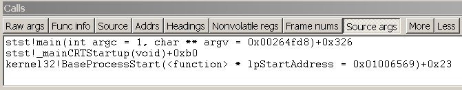
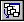

# Viewing the Call Stack in WinDbg

The call stack is the chain of function calls that have led to the current location of the program counter. The top function on the call stack is the current function, the next function is the function that called the current function, and so on. The call stack that is displayed is based on the current program counter, unless you change the register context. For more information about how to change the register context, see [Changing Contexts](changing-contexts.md).

In WinDbg, you can view the call stack by entering commands or by using the Calls window.

## Debugger Command Window

You can view the call stack by entering one of the [**k (Display Stack Backtrace)**](k--kb--kc--kd--kp--kp--kv--display-stack-backtrace-.md) commands in the Debugger Command window.

## Calls Window

As an alternative to the [**k**](k--kb--kc--kd--kp--kp--kv--display-stack-backtrace-.md) command, you can view the call stack in the Calls window. To open the Calls window, choose **Call Stack** from the **View** menu.

The following screen shot shows an example of a Calls window.

## 

Buttons in the Calls window enable you to customize the view of the call stack. To move to the corresponding call location in the [Source window](source-window.md) or [Disassembly window](disassembly-window.md), double-click a line of the call stack, or select a line and press ENTER. This action also changes the [local context](changing-contexts.md#local-context) to the selected stack frame. For more information about running to or from this point, see [Controlling the Target](controlling-the-target.md).

In user mode, the stack trace is based on the stack of the current thread. For more information about the stack of the current thread, see [Controlling Processes and Threads](controlling-processes-and-threads.md).

In kernel mode, the stack trace is based on the current register context. You can set the register context to match a specific thread, context record, or trap frame. For more information about setting the register context, see [Register Context](changing-contexts.md#register-context).

The Calls window has a toolbar that contains several buttons and has a shortcut menu with additional commands. To access this menu, right-click the title bar or click the icon near the upper-right corner of the window (). The toolbar and menu contain the following buttons and commands:

-   **Raw args** displays the first three parameters that are passed to the function. On an x86-based processor, this display includes the first three parameters that are passed to the function ("Args to Child").

-   **Func info** displays Frame Pointer Omission (FPO) data and other internal information about the function. This command is available only on an x86-based processor.

-   **Source** displays source module names and line numbers after the function names (if the debugger has this information).

-   **Addrs** displays various frame-related addresses. On an x86-based processor, this display includes the base pointer for the stack frame ("ChildEBP") and the return address ("RetAddr").

-   **Nonvolatile regs** displays the nonvolatile portion of the register context. This command is available only on an Itanium-based processor.

-   **Frame nums** displays frame numbers. Frames are always numbered consecutively, beginning with zero.

-   **Arg types** displays detailed information about the arguments that are expected and received by the functions in the stack.

-   **Always floating** causes the window to remain undocked even if it is dragged to a docking location.

-   **Move with frame** causes the window to move when the WinDbg frame is moved, even if the window is undocked. For more information about docked, tabbed, and floating windows, see [Positioning the Windows](positioning-the-windows.md).

### Additional Information

For more information about the register context and the local context, see [Changing Contexts](changing-contexts.md).

 

 

