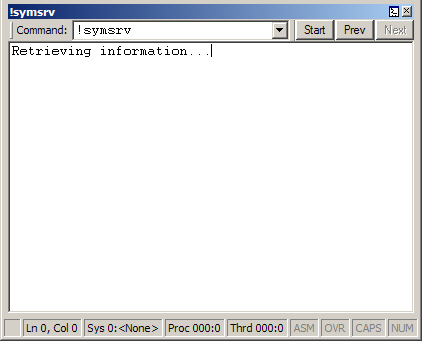

# Using the Command Browser Window in WinDbg

A Command Browser window displays and stores the text results of a debugger command. This window creates a command reference that enables you to view the results of a specific command without re-entering the command. A Command Browser window also provides navigation through the stored commands, so you can more quickly access commands than with the [Debugger Command window](debugger-command-window.md).

### Opening the Command Browser Window

You can open multiple Command Browser windows at one time. To open a Command Browser window, choose **Command Browser** from the **View** menu. (You can also press CTRL+N or click the **Command Browser** button () on the toolbar. ALT+SHIFT+N closes the Command Browser window.)

You can also open a Command Browser window by entering [**.browse (Display Command in Browser)**](-browse--display-command-in-browser-.md) in the regular Debugger Command window.

The following screen shot shows an example of a Command Browser window.

### Using the Command Browser Window

In the Command Browser window, you can do the following:

-   To enter a command, type it in the **Command** box.

-   To view the results of a previously entered command, use the **Start**, **Prev**, and **Next** buttons to scroll through the command list, or select one of the preceding 20 commands from the **Command** menu. To find a command that is not one of the preceding 20 commands, use the **Next** button.

The Command Browser window has a shortcut menu with additional commands. To access the menu, right-click the title bar or click the icon near the upper-right corner of the window (). The following list describes some of the menu commands:

-   **Start**, **Prev**, and **Next** move the cursor to the start of the command history or to the previous or next command, respectively.

-   **Add to Recent Commands** puts the current command into the **Recent Commands** menu of the **View** menu in the WinDbg window. Recent commands are saved in the workspace.

-   **Toolbar** turns the toolbar on and off.

-   **Move to new dock** closes the Command Browser window and opens it in a new dock.

-   **Always floating** causes the window to remain undocked even if it is dragged to a docking location.

-   **Move with frame** causes the window to move when the WinDbg frame is moved, even if the window is undocked. For more information about docked, tabbed, and floating windows, see [Positioning the Windows](positioning-the-windows.md).

Commands that you enter in a Command Browser window are executed by the debugger engine, not by the WinDbg user interface. This means that you cannot enter user interface commands like [**.cls**](-cls--clear-screen-.md) in a Command Browser window. If the user interface is a remote client, the server (not the client) executes the command.

A command that you enter in a Command Browser window executes synchronously, so it does not display output until it has completed.

Command Browser windows are saved in the WinDbg workspace, but the command histories are not saved. Only the current command for each Command Browser window is saved in the workspace.

 

 

[Send comments about this topic to Microsoft](mailto:wsddocfb@microsoft.com?subject=Documentation%20feedback%20[debugger\debugger]:%20Using%20the%20Command%20Browser%20Window%20in%20WinDbg%20%20RELEASE:%20%285/15/2017%29&body=%0A%0APRIVACY%20STATEMENT%0A%0AWe%20use%20your%20feedback%20to%20improve%20the%20documentation.%20We%20don't%20use%20your%20email%20address%20for%20any%20other%20purpose,%20and%20we'll%20remove%20your%20email%20address%20from%20our%20system%20after%20the%20issue%20that%20you're%20reporting%20is%20fixed.%20While%20we're%20working%20to%20fix%20this%20issue,%20we%20might%20send%20you%20an%20email%20message%20to%20ask%20for%20more%20info.%20Later,%20we%20might%20also%20send%20you%20an%20email%20message%20to%20let%20you%20know%20that%20we've%20addressed%20your%20feedback.%0A%0AFor%20more%20info%20about%20Microsoft's%20privacy%20policy,%20see%20http://privacy.microsoft.com/default.aspx. "Send comments about this topic to Microsoft")

