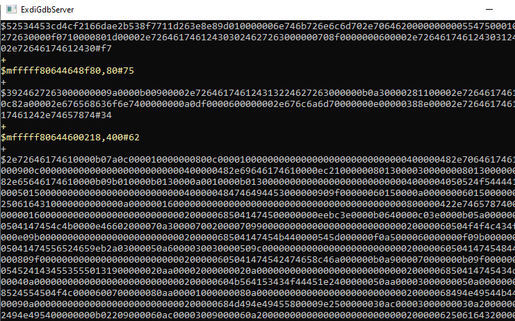
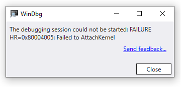

# Configuring the EXDI Debugger Transport

This topic describes how to set up Kernel-Mode Debugging using EXDI. The Extended Debugging Interface (EXDI) is an adaptation layer between a software debugger and a debugging target. The Debugging Tools for Windows supports kernel debugging using EXDI starting with Windows version 22000.

EXDI can be used to establish a connection with the QEMU virtual environment. For more information, see [Setting Up QEMU Kernel-Mode Debugging using EXDI](setting-up-qemu-kernel-mode-debugging-using-exdi.md).

>[!NOTE]
> EXDI is an advanced, specialized form of debugging for specific environments. Using a standard KDNET connection is easier to configure, and is recommended.  To set up network debugging automatically, see **[Setting Up KDNET Network Kernel Debugging Automatically](setting-up-a-network-debugging-connection-automatically.md)**.

## EXDI COM server overview

EXDI is an interface that allows extending WinDbg by adding support for hardware debuggers (e.g. JTAG-based, or GdbServer based). The diagram below illustrates the role of EXDI-GdbServer.


As the EXDI connection has no dependency on Windows or the KDNET protocol being loaded on the target PC. Because these software debugger components are not required, EXDI can be useful in early device bring up and in debugging OS startup issues.

>[!IMPORTANT]
> Because EXDI does not make use of the KDNET protocol, the connected debugger has significantly less information about what is running on the PC and many commands will work differently or may not work at all. Access to private symbols for the code being debugged can help the debugger better understand the target systems code execution. For more information, see [Public and Private Symbols](public-and-private-symbols.md).

### EXDI Kernel-Mode device requirements

The computer that runs the debugger is called the *host computer*, and the computer being debugged is called the *target computer*.

The following is required:

- On the target and host computer, a supported network card supported by the desired environment such as QEMU.

- A network connection between the target and host using TCP/IP.

- Windows 10 or Windows 11 version 22000 or later.

### Limitations

- EXDI Hardware debugging must be configured manually using XML files and there is no related UI in the Windows debuggers.

- As described above, because EXDI does not make use of the KDNET protocol, the connected debugger has less information about the target system and the use of the debugger is different. Without access to private symbols for the target code, many commands that use symbols to understand the state of the target system will not work. In this case, it is possible to view memory and register contents and disassemble code. Determining the location of running code, or performing other common debugger tasks, can be very difficult and time consuming with out private symbols.

### COM GDB Server client

This topic cover the use of the EXDI COM GDB Server client (ExdiGdbSrv.dll), that implements the EXDI COM debugger interface. It is possible to use the same COM interface to implement other interfaces, such as an EXDI COM Server for JTAG-DCI.

### Concurrent EXDI and KDNET debugging

In some complex scenarios, for example in early device bring up, it can be useful to have two connections to the target device. One EXDI and one KDNET. If the target is a Windows OS, KDNET software debugging is configured as it would normally be, for example to connect to a virtual machine. In this setup, either of the two concurrent debuggers can break in to debug code on the target machine.

## Summary of process to configure an EXDI connection

In this topic, we will describe the process to configure an EXDI connection. For an example EXDI usage scenario, see [Setting Up QEMU Kernel-Mode Debugging using EXDI](setting-up-qemu-kernel-mode-debugging-using-exdi.md).

1. Download and install the Windows debugging tools on the host system.
1. Download, build, and register the EXDI server DLL.
1. Configure the connection by editing the EXDI configuration XML files.
1. Launch WinDbg using the -kx option to connect to the EXDI server.
1. Use WinDbg to debug the target system.

## Download and install the Windows debugging tools

Install the Windows Debugging Tools on the host system. For information on downloading and installing the debugger tools, see [Debugging Tools for Windows](debugger-download-tools.md).

## Download, build and register the EXDI server DLL

Download the corresponding ExdiGdbSrv.dll binary (EXDI COM server client) source code from the microsoft/WinDbg-Samples, GitHub https://github.com/microsoft/WinDbg-Samples)

```console
git clone https://github.com/microsoft/WinDbg-Samples
```
Build the VS solution (ExdiGdbSrv.sln) according to the architecture of your Host Debugger installation located in Exdi/exdigdbsrv.

Locate the ExdiGdbSrv.dll produced by the build.

Copy the EXDI com server (ExdiGdbSrv.dll) to the Host machine, into the directory containing your debugger, .g. `C:\Program Files (x86)\Windows Kits\10\Debuggers\x64` or `C:\Debuggers`)

Use regsvr32 to register the DLL in an Administrator command prompt.

```console
C:\Program Files (x86)\Windows Kits\10\Debuggers\x64>regsvr32 ExdiGdbSrv.dll
```

RegSvr32 should return a message indicating that the `DLLRegisterServer in ExdiGdbSrv.dll succeeded`.

This step is only needs to be done once, but if you change the location of the ExdiGdbSrv.dll, then you will need to register the COM server again.

Another option is to use the example PowerShell script is to install the EXDI DLL, and launch the debugger the first time. For more information, see [Example EXDI PowerShell script](#example-exdi-powershell-script).

## Configure WinDbg using the EXDI configuration XML files

Locate the two needed configuration files in `WinDbg-Samples/Exdi/exdigdbsrv/` and copy them to a local to your Host debugger machine to where the debugger is installed.

- `exdiConfigData.xml`
- `systemregisters.xml`

EXDI_GDBSRV_XML_CONFIG_FILE – Describes the full path to the Exdi xml configuration file.

EXDI_SYSTEM_REGISTERS_MAP_XML_FILE – Describes the full path to the Exdi xml system register map file.

See [EXDI XML Configuration files](#exdi-xml-configuration-files) below for more information on the exdiConfigData.xml tags and attributes.

In our scenario, we will set the following value to zero, to disable the debugger from attempting to locate the nt!kdVersionBlock.

```xml
heuristicScanSize = "0"
```

### Set the EXDI Path values to reference the location of the XML configuration files

Set the environment variable EXDI_GDBSRV_XML_CONFIG_FILE and EXDI_SYSTEM_REGISTERS_MAP_XML_FILE to describe the full path to the exdi xml configuration file. Ensure that the path environment value specified is available from the location of the ExdiGdbSrv.dll.

#### Command Prompt

Open a command prompt and set the following environment variables.

```console
set EXDI_GDBSRV_XML_CONFIG_FILE="C:\Program Files (x86)\Windows Kits\10\Debuggers\x64\exdiConfigData.xml"

set EXDI_SYSTEM_REGISTERS_MAP_XML_FILE="C:\Program Files (x86)\Windows Kits\10\Debuggers\x64\systemregisters.xml"
```

Type `SET` to confirm that the path specified is available from the location of the ExdiGdbSrvSample.dll

#### Powershell

Open a PowerShell prompt and set the following environment variables:

```powershell
$env:EXDI_GDBSRV_XML_CONFIG_FILE = 'C:\Program Files (x86)\Windows Kits\10\Debuggers\x64\exdiConfigData.xml'

$env:EXDI_SYSTEM_REGISTERS_MAP_XML_FILE = 'C:\Program Files (x86)\Windows Kits\10\Debuggers\x64\systemregisters.xml'
```

Type `dir env:` to confirm that the path specified is available from the location of the ExdiGdbSrvSample.dll

## Launch WinDbg and connect to the EXDI server

Launch the windbg session via exdi interface at the same command prompt where you set the environment variables
(EXDI_GDBSRV_XML_CONFIG_FILE and EXDI_SYSTEM_REGISTERS_MAP_XML_FILE).

```console
c:\Debuggers> windbg.exe -v -kx exdi:CLSID={29f9906e-9dbe-4d4b-b0fb-6acf7fb6d014},Kd=NtBaseAddr,DataBreaks=Exdi
```

To display additional output useful for diagnostic purposes, the **-v:** verbose session can be used. For general information about the WinDbg options, see [WinDbg Command-Line Options](windbg-command-line-options.md). See [EXDI WinDbg Load Parameters](#exdi-windbg-load-parameters) below for more information.

The debugger will show the successful  EXDI transport initialization.

```dbgcmd
EXDI: DbgCoInitialize returned 0x00000001
EXDI: CoCreateInstance() returned 0x00000000
EXDI: QueryInterface(IExdiServer3) returned 0x00000000
EXDI: Server::GetTargetInfo() returned 0x00000000
EXDI: Server::SetKeepaliveInterface() returned 0x00000000
EXDI: Server::GetNbCodeBpAvail() returned 0x00000000
EXDI: ExdiNotifyRunChange::Initialize() returned 0x00000000
EXDI: LiveKernelTargetInfo::Initialize() returned 0x00000000
EXDI: Target initialization succeeded
Kernel Debugger connection established
```


The EXDIGdbServer console window can also display information about the status of the EXDI connection. For more information about the console, see [Troubleshooting](#troubleshooting).

### EXDI WinDbg Load Parameters

The following parameters are used with WinDbg to start a EXDI kernel session.

-kx: EXDI:*Options*

The following EXDI options are available with the -kx option.

| Parameter       | Description                                                                                           |
|-----------------|-------------------------------------------------------------------------------------------------------|
| CLSID           | Class ID assigned to the LiveExdiGdbSrvServer (as defined in theExdiGdbSrv.idl file).                 |
| Kd=NtBaseAddr   | The debugger engine will look for the NT base address.                                                |
| ForceX86        | Forces the debugger engine to use the IeXdiX86Context3 interface for getting/setting The CPU context. |
| DataBreaks=Exdi | Allow using data breakpoints.                                                                         |
| Inproc          | Allow using an inproc Exdi-Server.                                                                    |

### Use WinDbg to debug the target system

The dbgeng.dll uses a heuristic algorithm to find the location of the NT base load address at the time that the break command occurred.  If private symbols are not available, this process will fail.

This means that under many connection sequences, the break will not function as expected. if you manually break into the code, it will be a random location that Windows happened to be executing at that moment. As symbols for the target code may not be available, it can be difficult to set breakpoints using symbols.

Commands such as the following that access memory directly will work.

[k, kb, kc, kd, kp, kP, kv (Display Stack Backtrace)](k--kb--kc--kd--kp--kp--kv--display-stack-backtrace-.md)

[r (Registers)](r--registers-.md)

[d, da, db, dc, dd, dD, df, dp, dq, du, dw (Display Memory)](d--da--db--dc--dd--dd--df--dp--dq--du--dw--dw--dyb--dyd--display-memor.md)

[u (Unassemble)](u--unassemble-.md)

And you can step through code using [p (Step)](p--step-.md).

There are also commands that can be used to attempt to locate code that you wish to debug.

[s (Search Memory)](s--search-memory-.md)

[.imgscan (Find Image Headers)](-imgscan--find-image-headers-.md)

Imgscan can be helpful with EDXI debugging, as unlike traditional KDNET based kernel debugging, setting breakpoints based on symbols may not be available. Locating a desired target image, can facilitate using its location to set a memory access breakpoint.

### .exdicmd (EXDI Command)

The .exdicmd sends an EXDI command to the target system using the active EXDI debugging connection. For more information, see [.exdicmd (EXDI Command)](-exdicmd--exdi-command-.md).

## Troubleshooting

Use the output from the ExdiGdbServer window to monitor the connection sequence.



**Issue**: Error: Unable to establish a connection with the GbDServer. Please verify the connection string `<hostname/ip>:portnumber`

*This issue could be caused by:*

- The ExdiGdbSrv.dll cannot connect to the target GDB server.
- The GDB server is not running yet at the target.
- Firewall issues, ensure that both IP addresses are reachable by using ping, tracert, or some other tool to verify that the GDB traffic can go through the firewall.

**Issue**: Could not start kernel debugging using EXDI.

*This issue could be caused by:*

- There is another instance of the ExdiGdbSrv.dll (hosted by dllhost.exe) running on the host debugger machine.
- Terminate the extra instance of the COM service hosting the ExdiGdbSrv.dll.
    - First list the processes, using utility such as TList on the host PC. The DLLHost that is hosting the ExdiGdbSrv.dll will show *ExdiGdbServer*.
      > tlist
        261928 dllhost.exe       ExdiGdbServer
     -  Use `kill -f XXXXX` at the debugger command prompt to terminate the process using the process number.

**Issue**: Error: Unable to configure the GdbServer session.

*This issue could be caused by:*

- An error occurred in locating the session information, such as the path to the XML configuration files.

**Issue**: Error: The EXDI_GDBSRV_XML_CONFIG_FILE environment variable is not defined.

*This issue could be caused by:*

- ExdiGdbSrv.dll environment variables are not set or otherwise not available in the environment.

**Issue**: Error: the EXDI_GDBSRV_XML_CONFIG_FILE environment variable is not defined.The Exdi-GdbServer sample won't continue at this point.Please set the full path to the Exdi xml configuration file.

*This issue could be caused by:*

- The EXDI_GDBSRV_XML_CONFIG_FILE environment variable is *not* set. In some situations, ExdiGDbSrv.dll would continue working if you press the “OK” button, but windbg.exe will fail querying system registers (e.g. via rdmsr/wrmsr functions).

**Issue**: Error scenario with the target system is not available - DbgCoInitialize returned 0x00000001

The following output may be returned if the target system is not loaded or otherwise not available.

```console
Microsoft (R) Windows Debugger Version 10.0.20317.1 AMD64
Copyright (c) Microsoft Corporation. All rights reserved.

EXDI: DbgCoInitialize returned 0x00000001
```

This is a common error when the ExdiGdbSrv.dll COM server could not connect to the QEMU GDServer, so it could fail due to:

- Failure at launching the EXDI COM server (ExdiGDbSrv.dll) via the dllhost.exe process (COM related). To resolve this, restart the Host debugger PC or Sign-out Windows and Sign-in again. If that doesn't work, re-register the EXDI COM server after restarting/signing-in again.  
    - `regsvr32.exe <full path to the ExdiGdbSrv.dll)`

- The previous session of the ExdiGdbSrv.dll is still hosted by a dllhost.exe process, so you’ll need to kill the dllhost.exe process. Check tlist for the pid of dllhost.exe that hosts the ExdiGdbSrv.dll and kill the associated pid.

- The QEMU gdbserver has not been launched yet, or the exdiconfigdata.xml file contains an invalid IP:Port values. If the WinDbg session is launched in the same Host pc as the QEMU Windows VM, then the IP=LocalHost.

**Issue**: The debugging session could not be started: FAILURE HR=0x80004005:Failed to AttachKernel.

*This issue could be caused by:*
- As described above, it is possible that the previous session of the ExdiGdbSrv.dll is still active. Locate and terminate the associated DLL host as described above.



## EXDI XML Configuration files

There are two required xml files that are consumed by the EXDI GDB COM server (ExdiGdbSrv.dll).

1. *exdiConfigData.xml* - This file contains the main configuration data that is required by the GDB server client to establish a successfully GDB session with the HW debugger GDB server target, so the GDB server client won’t run if the file location is *not* set by the EXDI_GDBSRV_XML_CONFIG_FILE environment variable.  Each xml tag allows configuring specific set of the GDB server functionality. See below for a list of the attributes you can modify in the XML, and sample XML.

2. *Systemregister.xml* - This file contains a mapping between system registers and theirs access code. This is needed because the access code is not provided by the GDB server in the xml file, and the debugger accesses each system register via the access code. If the file is not set via the environment variable `EXDI_SYSTEM_REGISTERS_MAP_XML_FILE`, then the ExdiGdbSrv.dll will continue working, but the debugger won’t be able to access any system register via rdmsr or wrmsr commands. The list of these registers should be supported by the GDB server hardware debugger (the specific system register name should be present in the list of registers that is sent in the system xml file).

### GDBServer Tags and attributes

The following table describes the GDBServer tags and attributes defined in the `exdiConfigData.xml` file.

|Parameter                  | Description                                        |
|---------------------------|----------------------------------------------------|
ExdiTargets     | Specifies which specific GDB server target configuration will be used by the ExdiGgbSrv.dll to establish the GDB connection with the GDB server target, since the exdiConfigData.xml file includes all GDB server supported currently by the ExdiGdbSrv.dll (this file MUST be filled before using the ExdiGdbSrv.dll with a particular GDB server).
CurrentTarget   | Specifies the name of the GDB server target (e.g. this attribute value should match with the name value of one of the `<ExdiTarget Name=` tags included by the exdiConfigData.xml file.
ExdiTarget      | this is the start tag for all configuration data that is included by each GDB server target component.
Name            | Specifies the name of the GDB server (e.g. QEMU, BMC-OpenOCD, Trace32, VMWare).
agentNamePacket | This is the name of the GDB client as it is recognized by the GDB server HW debugger. This can be used by the GDB server HW debugger to configure itself for specific GDB clients (e.g. Trace32 GDB server requires the ExdiGdbSrv.dll to send “QMS.windbg” name to identify the windbg-GDB client and then enable customized GDB memory packets only supported for MS GDB server client (exdiGdbSrv.dll).
ExdiGdbServerConfigData | Specifies the ExdiGdbSrv.dll component related configuration parameters.
uuid            | specifies the UUI of the ExdiGdbSrv.dll component.
displayCommPackets | Flag if ‘yes’, then we will display the RSP protocol communication characters in the command log window. If ‘no’, then we display just the request-response pair text.
enableThrowExceptionOnMemoryErrors | This attribute will be checked by the GDB server client when there is a GDB error response packet (E0x) to determine if the client should throw an exception and stop reading memory.
qSupportedPacket | This allows configuring the GDB client to request which xml register architecture file should be sent by the GDB server HW debugger following the xml target description file (basically, the client will inform the GDB server which architectures are supported by the client, currently, the client does support the x64 architecture).
ExdiGdbServerTargetData | Specifies the parameters related to the hardware Target that is debugged by the GdbServer session.
targetArchitecture | String containing the target hardware architecture. Possible values: X86, X64, ARM, ARM64. Currently, the exdiGdbSrv.dll supports only X86 and ARM.
targetFamily    | String containing the target hardware family. Possible values: ProcessorFamilyX86, ProcessorFamilyX64, ProcessorFamilyARM, ProcessorFamilyARM64.
numberOfCores   | Number of processor cores that the target support. This parameter will be validated when we use a multi-Gdbserver session (T32-GdbServer session). The below ‘MultiCoreGdbServerSessions’ attribute should be set to ‘yes’.
EnableSseContext | Flag if ‘yes’, then the ‘g’ context RSP packet will include floating point registers values. This parameter makes sense only for Intel family targets.
heuristicScanSize | this configures the debugger engine fast heuristic algorithm to decrease the scanned memory probe by the specified size, if the attribute value is *not* specified (or “0”), then the debugger engine won’t use the fast heuristic and fall back to the legacy heuristic that scan the entire memory looking for the PE DOS signature.
targetDescriptionFile | specifies if the GDB server sends a target description header file before sending each separate xml file. This field is blank then the GDB server client won’t request the xml architecture system register (e.g. Trace32 GDBs server that does not support sending architecture registers in a separate xml file).
GdbServerConnectionParameters | Specifies GdbServer session parameters. These parameters are used to control the RSP GdbServer session between the ExdiGdbSrv.dll component and GdbServer.
MultiCoreGdbServerSessions | Flag If ‘yes’, then we will have multi-core GdbServer session (the one used by T32-GdbServer Back-End). If ‘no’, then we will communicate only with one instance of the GdbServer.
MaximumGdbServerPacketLength | This is the maximum GdbServer supported length for one packet.
MaximumConnectAttempts | This is the maximum connection attempts. It is used by the ExdiGdbSrv.dll when it tries to establish the RSP connection to the GdbServer.
SendPacketTimeout | This is the RSP send timeout.
ReceivePacketTimeout | This is the RSP receive timeout.
HostNameAndPort | This is the connection string in the format `<hostname/ip address:Port number>`. There can be more than one GdbServer connection string (like T32 multi-core GdbServer session). The number of connection strings should match with the numbers of cores.
ExdiGdbServerMemoryCommands | Specifies various ways of issuing the GDB memory commands, in order to obtain system registers values or read/write access memory at different exception CPU levels (e.g. BMC-OpenOCD provides access to CP15 register via “aarch64 mrs nsec/sec `<access code>`” customized command).
GdbSpecialMemoryCommand  | if “yes”, then the GDB server supports customized memory commands (e.g. system register, this should be set for Trace32 GDB server).
PhysicalMemory  | if “yes”, then the GDB server supports customized commands for reading physical memory (it is set for Trace32 GDB server).
SupervisorMemory | if “yes”, then the GDB server supports customized commands for reading supervisor memory (it is set for Trace32 GDB server).
SpecialMemoryRegister | if “yes”, then the GDB server supports customized commands for reading system registers (it is set for Trace32 GDB server)
SystemRegistersGdbMonitor | if “yes”, then the GDB server supports customized commands via GDB monitor command (it is set for BMC Open-OCD).
SystemRegisterDecoding | if “yes”, then the GDB client accepts decoding the access code before sending the GDB monitor command.
ExdiGdbServerRegisters | Specifies the specific architecture register core set.
Architecture | CPU architecture of the defined registers set.
FeatureNameSupported | This is the name of the system register group as it’s provided by the xml system register description file. It’s needed to identify the system register xml group that is part of the xml file as it’s sent by the GDB server.
SystemRegistersStart | This is to identify the first system register (low register number/order) that is reported as part of the core register set (e.g. on X64, QEMU does not report the x64 system register set as a separated xml target desciption file, so system regs are part of the core registers).
SystemRegistersEnd | This is to identify the last system register (high register number/order) that that is reported as part of the core register set.
Name | Name of the register.
Order | This is a number that identifies the index in the array of registers. This number will be used by the GDB client and server set/query (`p<number>”/”q<number>`) register packets.
Size | This is the register size in bytes.

### Sample exdiConfigData.xml file

```xml
<ExdiTargets CurrentTarget = "QEMU">
<!-- QEMU SW simulator GDB server configuration -->
    <ExdiTargets CurrentTarget="QEMU">
    <!--  QEMU SW simulator GDB server configuration  -->
    <ExdiTarget Name="QEMU">
    <ExdiGdbServerConfigData agentNamePacket="" uuid="72d4aeda-9723-4972-b89a-679ac79810ef" displayCommPackets="yes" debuggerSessionByCore="no" enableThrowExceptionOnMemoryErrors="yes" qSupportedPacket="qSupported:xmlRegisters=aarch64,i386">
    <ExdiGdbServerTargetData targetArchitecture="ARM64" targetFamily="ProcessorFamilyARM64" numberOfCores="1" EnableSseContext="no" heuristicScanSize="0xfffe" targetDescriptionFile="target.xml"/>
    <GdbServerConnectionParameters MultiCoreGdbServerSessions="no" MaximumGdbServerPacketLength="1024" MaximumConnectAttempts="3" SendPacketTimeout="100" ReceivePacketTimeout="3000">
    <Value HostNameAndPort="LocalHost:1234"/>
    </GdbServerConnectionParameters>
    <ExdiGdbServerMemoryCommands GdbSpecialMemoryCommand="no" PhysicalMemory="no" SupervisorMemory="no" HypervisorMemory="no" SpecialMemoryRegister="no" SystemRegistersGdbMonitor="no" SystemRegisterDecoding="no"> </ExdiGdbServerMemoryCommands>
        <ExdiGdbServerRegisters Architecture = "ARM64" FeatureNameSupported = "sys">
            <Entry Name ="X0"  Order = "0" Size = "8" />
            <Entry Name ="X1"  Order = "1" Size = "8" />
            <Entry Name ="X2"  Order = "2" Size = "8" />
            <Entry Name ="X3"  Order = "3" Size = "8" />
            <Entry Name ="X4"  Order = "4" Size = "8" />
            <Entry Name ="X5"  Order = "5" Size = "8" />
            <Entry Name ="X6"  Order = "6" Size = "8" />
            <Entry Name ="X7"  Order = "7" Size = "8" />
            <Entry Name ="X8"  Order = "8" Size = "8" />
            <Entry Name ="X9"  Order = "9" Size = "8" />
            <Entry Name ="X10" Order = "a"  Size = "8" />
            <Entry Name ="X11" Order = "b"  Size = "8" />
            <Entry Name ="X12" Order = "c"  Size = "8" />
            <Entry Name ="X13" Order = "d"  Size = "8" />
            <Entry Name ="X14" Order = "e"  Size = "8" />
            <Entry Name ="X15" Order = "f"  Size = "8" />
            <Entry Name ="X16" Order = "10" Size = "8" />
            <Entry Name ="X17" Order = "11" Size = "8" />
            <Entry Name ="X18" Order = "12" Size = "8" />
            <Entry Name ="X19" Order = "13" Size = "8" />
            <Entry Name ="X20" Order = "14" Size = "8" />
            <Entry Name ="X21" Order = "15" Size = "8" />
            <Entry Name ="X22" Order = "16" Size = "8" />
            <Entry Name ="X23" Order = "17" Size = "8" />
            <Entry Name ="X24" Order = "18" Size = "8" />
            <Entry Name ="X25" Order = "19" Size = "8" />
            <Entry Name ="X26" Order = "1a" Size = "8" />
            <Entry Name ="X27" Order = "1b" Size = "8" />
            <Entry Name ="X28" Order = "1c" Size = "8" />
            <Entry Name ="fp"  Order = "1d" Size = "8" />
            <Entry Name ="lr"  Order = "1e" Size = "8" />
            <Entry Name ="sp"  Order = "1f" Size = "8" />
            <Entry Name ="pc"  Order = "20" Size = "8" />
            <Entry Name ="cpsr" Order = "21" Size = "8" />
            <Entry Name ="V0" Order = "22" Size = "16" />
            <Entry Name ="V1" Order = "23" Size = "16" />
            <Entry Name ="V2" Order = "24" Size = "16" />
            <Entry Name ="V3" Order = "25" Size = "16" />
            <Entry Name ="V4" Order = "26" Size = "16" />
            <Entry Name ="V5" Order = "27" Size = "16" />
            <Entry Name ="V6" Order = "28" Size = "16" />
            <Entry Name ="V7" Order = "29" Size = "16" />
            <Entry Name ="V8" Order = "2a" Size = "16" />
            <Entry Name ="V9" Order = "2b" Size = "16" />
            <Entry Name ="V10" Order = "2c" Size = "16" />
            <Entry Name ="V11" Order = "2d" Size = "16" />
            <Entry Name ="V12" Order = "2e" Size = "16" />
            <Entry Name ="V13" Order = "2f" Size = "16" />
            <Entry Name ="V14" Order = "30" Size = "16" />
            <Entry Name ="V15" Order = "31" Size = "16" />
            <Entry Name ="V16" Order = "32" Size = "16" />
            <Entry Name ="V17" Order = "33" Size = "16" />
            <Entry Name ="V18" Order = "34" Size = "16" />
            <Entry Name ="V19" Order = "35" Size = "16" />
            <Entry Name ="V20" Order = "36" Size = "16" />
            <Entry Name ="V21" Order = "37" Size = "16" />
            <Entry Name ="V22" Order = "38" Size = "16" />
            <Entry Name ="V23" Order = "39" Size = "16" />
            <Entry Name ="V24" Order = "3a" Size = "16" />
            <Entry Name ="V25" Order = "3b" Size = "16" />
            <Entry Name ="V26" Order = "3c" Size = "16" />
            <Entry Name ="V27" Order = "3d" Size = "16" />
            <Entry Name ="V28" Order = "3e" Size = "16" />
            <Entry Name ="V29" Order = "3f" Size = "16" />
            <Entry Name ="V30" Order = "3f" Size = "16" />
            <Entry Name ="V31" Order = "3f" Size = "16" />
            <Entry Name ="fpsr" Order = "40" Size = "4" />
            <Entry Name ="fpcr" Order = "41" Size = "4" />
        </ExdiGdbServerRegisters>


        <!-- x64 GDB server core resgisters -->
        <ExdiGdbServerRegisters Architecture = "X64" FeatureNameSupported = "sys" SystemRegistersStart = "18" SystemRegistersEnd = "20" >
            <Entry Name ="rax" Order = "0" Size ="8" />
            <Entry Name ="rbx" Order = "1" Size ="8" />
            <Entry Name ="rcx" Order = "2" Size ="8" />
            <Entry Name ="rdx" Order = "3" Size ="8" />
            <Entry Name ="rsi" Order = "4" Size ="8" />
            <Entry Name ="rdi" Order = "5" Size ="8" />
            <Entry Name ="rbp" Order = "6" Size ="8" />
            <Entry Name ="rsp" Order = "7" Size ="8" />
            <Entry Name ="r8"  Order = "8" Size ="8" />
            <Entry Name ="r9"  Order = "9" Size ="8" />
            <Entry Name ="r10" Order = "a" Size ="8" />
            <Entry Name ="r11" Order = "b" Size ="8" />
            <Entry Name ="r12" Order = "c" Size ="8" />
            <Entry Name ="r13" Order = "d" Size ="8" />
            <Entry Name ="r14" Order = "e" Size ="8" />
            <Entry Name ="r15" Order = "f" Size ="8" />
            <Entry Name ="rip" Order = "10" Size ="8" />
            <!-- <flags id="x64_eflags" size="4">
                <field name="" start="22" end="31"/>
                <field name="ID" start="21" end="21"/>
                <field name="VIP" start="20" end="20"/>
                <field name="VIF" start="19" end="19"/>
                <field name="AC" start="18" end="18"/>
                <field name="VM" start="17" end="17"/>
                <field name="RF" start="16" end="16"/>
                <field name="" start="15" end="15"/>
                <field name="NT" start="14" end="14"/>
                <field name="IOPL" start="12" end="13"/>
                <field name="OF" start="11" end="11"/>
                <field name="DF" start="10" end="10"/>
                <field name="IF" start="9" end="9"/>
                <field name="TF" start="8" end="8"/>
                <field name="SF" start="7" end="7"/>
                <field name="ZF" start="6" end="6"/>
                <field name="" start="5" end="5"/>
                <field name="AF" start="4" end="4"/>
                <field name="" start="3" end="3"/>
                <field name="PF" start="2" end="2"/>
                <field name="" start="1" end="1"/>
                <field name="CF" start="0" end="0"/>
            </flags> -->
            <Entry Name ="eflags" Order = "11" Size ="4" />

            <!-- Segment registers -->
            <Entry Name ="cs" Order = "12" Size ="4" />
            <Entry Name ="ss" Order = "13" Size ="4" />
            <Entry Name ="ds" Order = "14" Size ="4" />
            <Entry Name ="es" Order = "15" Size ="4" />
            <Entry Name ="fs" Order = "16" Size ="4" />
            <Entry Name ="gs" Order = "17" Size ="4" />

            <!-- Segment descriptor caches and TLS base MSRs -->
            <!--Entry Name ="cs_base" Order = "18" Size="8"/
            <Entry Name ="ss_base" Order = "18" Size ="8" />
            <Entry Name ="ds_base" Order = "19" Size ="8" />
            <Entry Name ="es_base" Order = "1a" Size ="8" /> -->
            <Entry Name ="fs_base" Order = "18" Size ="8" />
            <Entry Name ="gs_base" Order = "19" Size ="8" />
            <Entry Name ="k_gs_base" Order = "1a" Size ="8" />

            <!-- Control registers -->
            <!-- the cr0 register format fields:
            <flags id="x64_cr0" size="8">
            <field name="PG" start="31" end="31"/>
            <field name="CD" start="30" end="30"/>
            <field name="NW" start="29" end="29"/>
            <field name="AM" start="18" end="18"/>
            <field name="WP" start="16" end="16"/>
            <field name="NE" start="5" end="5"/>
            <field name="ET" start="4" end="4"/>
            <field name="TS" start="3" end="3"/>
            <field name="EM" start="2" end="2"/>
            <field name="MP" start="1" end="1"/>
            <field name="PE" start="0" end="0"/>
            </flags> -->
            <Entry Name ="cr0" Order = "1b" Size ="8" />
            <Entry Name ="cr2" Order = "1c" Size ="8" />

            <!-- the cr3 register format fields:
            <flags id="x64_cr3" size="8">
                <field name="PDBR" start="12" end="63"/>
                <field name="PCID" start="0" end="11"/>
            </flags> -->
            <Entry Name ="cr3" Order = "1d" Size ="8" />

            <!-- the cr4 register format fields:
            <flags id="x64_cr4" size="8">
                <field name="PKE" start="22" end="22"/>
                <field name="SMAP" start="21" end="21"/>
                <field name="SMEP" start="20" end="20"/>
                <field name="OSXSAVE" start="18" end="18"/>
                <field name="PCIDE" start="17" end="17"/>
                <field name="FSGSBASE" start="16" end="16"/>
                <field name="SMXE" start="14" end="14"/>
                <field name="VMXE" start="13" end="13"/>
                <field name="LA57" start="12" end="12"/>
                <field name="UMIP" start="11" end="11"/>
                <field name="OSXMMEXCPT" start="10" end="10"/>
                <field name="OSFXSR" start="9" end="9"/>
                <field name="PCE" start="8" end="8"/>
                <field name="PGE" start="7" end="7"/>
                <field name="MCE" start="6" end="6"/>
                <field name="PAE" start="5" end="5"/>
                <field name="PSE" start="4" end="4"/>
                <field name="DE" start="3" end="3"/>
                <field name="TSD" start="2" end="2"/>
                <field name="PVI" start="1" end="1"/>
                <field name="VME" start="0" end="0"/>
            </flags> -->
            <Entry Name ="cr4" Order = "1e" Size ="8" />
            <Entry Name ="cr8" Order = "1f" Size ="8" />

            <!-- the efer register format fields:
            <flags id="x64_efer" size="8">
            <field name="TCE" start="15" end="15"/>
            <field name="FFXSR" start="14" end="14"/>
            <field name="LMSLE" start="13" end="13"/>
            <field name="SVME" start="12" end="12"/>
            <field name="NXE" start="11" end="11"/>
            <field name="LMA" start="10" end="10"/>
            <field name="LME" start="8" end="8"/>
            <field name="SCE" start="0" end="0"/>
            </flags> -->
            <Entry Name ="efer" Order = "20" Size ="8"/>

            <!-- x87 FPU -->
            <Entry Name ="st0" Order = "21" Size ="10" />
            <Entry Name ="st1" Order = "22" Size ="10" />
            <Entry Name ="st2" Order = "23" Size ="10" />
            <Entry Name ="st3" Order = "24" Size ="10" />
            <Entry Name ="st4" Order = "25" Size ="10" />
            <Entry Name ="st5" Order = "26" Size ="10" />
            <Entry Name ="st6" Order = "27" Size ="10" />
            <Entry Name ="st7" Order = "28" Size ="10" />
            <Entry Name ="fctrl" Order = "29" Size ="4" />
            <Entry Name ="fstat" Order = "2a" Size ="4" />
            <Entry Name ="ftag"  Order = "2b" Size ="4" />
            <Entry Name ="fiseg" Order = "2c" Size ="4" />
            <Entry Name ="fioff" Order = "2d" Size ="4" />
            <Entry Name ="foseg" Order = "2e" Size ="4" />
            <Entry Name ="fooff" Order = "2f" Size ="4" />
            <Entry Name ="fop" Order = "30" Size ="4" />
            <Entry Name ="xmm0" Order = "31" Size ="16"  />
            <Entry Name ="xmm1" Order = "32" Size ="16"  />
            <Entry Name ="xmm2" Order = "33" Size ="16"  />
            <Entry Name ="xmm3" Order = "34" Size ="16"  />
            <Entry Name ="xmm4" Order = "35" Size ="16"  />
            <Entry Name ="xmm5" Order = "36" Size ="16"  />
            <Entry Name ="xmm6" Order = "37" Size ="16"  />
            <Entry Name ="xmm7" Order = "38" Size ="16"  />
            <Entry Name ="xmm8" Order = "39" Size ="16"  />
            <Entry Name ="xmm9" Order = "3a" Size ="16"  />
            <Entry Name ="xmm10" Order = "3b" Size ="16"  />
            <Entry Name ="xmm11" Order = "3c" Size ="16"  />
            <Entry Name ="xmm12" Order = "3d" Size ="16"  />
            <Entry Name ="xmm13" Order = "3e" Size ="16"  />
            <Entry Name ="xmm14" Order = "3f" Size ="16"  />
            <Entry Name ="xmm15" Order = "40" Size ="16"  />
            
            <!-- the mxcsr register format fields:
            <flags id="x64_mxcsr" size="4">
                <field name="IE" start="0" end="0"/>
                <field name="DE" start="1" end="1"/>
                <field name="ZE" start="2" end="2"/>
                <field name="OE" start="3" end="3"/>
                <field name="UE" start="4" end="4"/>
                <field name="PE" start="5" end="5"/>
                <field name="DAZ" start="6" end="6"/>
                <field name="IM" start="7" end="7"/>
                <field name="DM" start="8" end="8"/>
                <field name="ZM" start="9" end="9"/>
                <field name="OM" start="10" end="10"/>
                <field name="UM" start="11" end="11"/>
                <field name="PM" start="12" end="12"/>
                <field name="FZ" start="15" end="15"/>
            </flags> -->
            <Entry Name ="mxcsr" Order = "41" Size ="4" />

        </ExdiGdbServerRegisters>
    </ExdiGdbServerConfigData>
    </ExdiTarget>
    </ExdiTargets>
</ExdiTargets>
```

## Example EXDI PowerShell script

This sample PowerShell script installs EXDI and then launches the debugger. The Start-ExdiDebugger.ps1 script will install ExdiGdbSrv.dll if required, configure the xml settings files, check for running dllhost.exe processes, and launch the debugger to connect to an already running gdb server hardware debugging target.

This is an example of calling the start up script.

```powershell
PS>.\Start-ExdiDebugger.ps1 -ExdiTarget "QEMU" -GdbPort 1234 -Architecture x64
```

You can also specify the built files if necessary.

```powershell
PS>.\Start-ExdiDebugger.ps1 -ExdiTarget "QEMU" -GdbPort 1234 -Architecture x64 -ExdiDropPath "C:\path\to\built\exdi\files"
```

The Start-ExdiDebugger.ps1 has the following setttings options.

| Parameter                            | Description                      |
|--------------------------------------|----------------------------------|
ExdiTarget | The type of target to connect to. This corresponds to a specific section in the settings xml file
HostName   | The IP address or hostname of the computer hosting the gdb server session (defaults to "LocalHost")
GdbPort    | The Port that the gdb server is listening on.
Architecture | Architecture of the hardware debugging target (this parameter also implies the ArchitectureFamily parameter in the xml settings file)
ExdiDropPath | Location of the ExdiGdbSrv.dll, exdiConfigData.xml, and systemregisters.xml files. These will only be copied if ExdiGdbSrv.dll is not installed or is installed incorrectly.
ExtraDebuggerArgs | Extra arguments to pass on the debugger command line
PreNTAppDebugging | Changes the value of the heuristicScanSize from 0xfffe (best for NT) to 0xffe (for pre-NT Apps)
DontTryDllHostCleanup | Checking for existing running instances of ExdiGdbSrv.dll in dllhost.exe requires elevation. Providing this switch will allow the script to run without elevation (although the debugger may not function correctly).

To enable packets to be displayed, set the value of *displayCommPackets* to yes. 

```powershell
    [pscustomobject]@{ Path = 'displayCommPackets'                                  ; value = "yes" } 
```

```powershell
.\Start-ExdiDebugger.ps1 -ExdiTarget "QEMU" -GdbPort 1234 -Architecture x64 -ExdiDropPath "C:\path\to\built\exdi\files"
```

See the code comments for more settings options.

```powershell
<#
.Synopsis
    Installs and launches exdi debugger (automating xml file editing)

.Description
    This script will install ExdiGdbSrv.dll if required, configure the xml settings
    files, check for running dllhost.exe processes, and launch the debugger to connect to
    an already running gdb server hardware debugging target.

.Parameter ExdiTarget
    Type of target to connect to. This corresponds to a specific section in the settings xml file

.Parameter HostName
    IP address or hostname of the computer hosting the gdb server session (defaults to "LocalHost")

.Parameter GdbPort
    Port that the gdb server is listening on.

.Parameter Architecture
    Architecture of the hardware debugging target (this parameter also implies the ArchitectureFamily
    parameter in the xml settings file)

.Parameter ExdiDropPath
    Location of the ExdiGdbSrv.dll, exdiConfigData.xml, and systemregisters.xml files. These will
    only be copied if ExdiGdbSrv.dll is not installed or is installed incorrectly.

.Parameter ExtraDebuggerArgs
    Extra arguments to pass on the debugger command line

.Parameter PreNTAppDebugging
    Changes the value of the heuristicScanSize from 0xfffe (best for NT) to 0xffe (for pre-NT Apps)

.Parameter DontTryDllHostCleanup
    Checking for existing running instances of ExdiGdbSrv.dll in dllhost.exe requires elevation.
    Providing this switch will allow the script to run without elevation (although the debugger may not
    function correctly).

.Example
    >---------------- (first run) ------------<
    .\Start-ExdiDebugger.ps1 -ExdiTarget "QEMU" -GdbPort 1234 -Architecture x64 -ExdiDropPath "C:\path\to\built\exdi\files"

.Example
    PS>.\Start-ExdiDebugger.ps1 -ExdiTarget "QEMU" -GdbPort 1234 -Architecture x64
#>

[CmdletBinding()]
param
(
    [ValidateSet("QEMU")]
    [string]
    $ExdiTarget = "QEMU",

    [string]
    $HostName = "LocalHost",

    [Parameter(Mandatory=$true)]
    [Int]
    $GdbPort,

    [Parameter(Mandatory=$true)]
    [string]
    [ValidateSet("x86", "x64", "arm64")]
    $Architecture,

    [string]
    $ExdiDropPath,

    [string]
    $DebuggerPath,

    [string[]]
    $ExtraDebuggerArgs = @(),

    [switch]
    $PreNTAppDebugging,

    [switch]
    $DontTryDllHostCleanup
)

$ErrorActionPreference = "Stop"

#region Functions

Function Test-Admin
{
    ([Security.Principal.WindowsPrincipal] [Security.Principal.WindowsIdentity]::GetCurrent()).IsInRole([Security.Principal.WindowsBuiltInRole]"Administrator")
}

Function Find-PathToWindbgX
{
    $InternalWindbgXPath = "$env:LOCALAPPDATA\DBG\UI\WindbgX.exe"
    $ExternalWindbgXPath = "$env:LOCALAPPDATA\Microsoft\WindowsApps\WinDbgX.exe"

    if (Test-Path $InternalWindbgXPath -PathType Leaf)
    {
        return $InternalWindbgXPath
    }
    elseif (Test-Path $ExternalWindbgXPath -PathType Leaf)
    {
        return $ExternalWindbgXPath
    }
}

Function Test-ParameterValidation
{
    $CommandName = $PSCmdlet.MyInvocation.InvocationName
    $ParameterList = (Get-Command -Name $CommandName).Parameters

    foreach ($Parameter in $ParameterList) {
        Get-Variable -Name $Parameter.Values.Name -ErrorAction SilentlyContinue | Out-String | Write-Verbose
    }

    if (-not $DebuggerPath)
    {
        throw "WindbgX is not installed"
    }
    elseif (-not (Test-Path $DebuggerPath -PathType Leaf))
    {
        throw "DebuggerPath param ($DebuggerPath) does not point to a debugger."
    }

    # Searching for loaded instances of ExdiGdbSrv.dll in dllhost.exe requires elevation
    if (-not $DontTryDllHostCleanup -and
        -not $(Test-Admin))
    {
        throw "Searching for loaded instances of ExdiGdbSrv.dll in dllhost.exe requires elevation. Run with the -DontTryDllHostCleanup parameter to skip this check (debugger session init may fail)."
    }
}

Function Get-ExdiInstallPath
{
    Get-ItemPropertyValue -Path "Registry::HKEY_CLASSES_ROOT\CLSID\{29f9906e-9dbe-4d4b-b0fb-6acf7fb6d014}\InProcServer32" -Name "(default)" -ErrorAction SilentlyContinue
}

Function Test-ExdiServerInstalled
{
    # Check registration of exdi server class
    if ($(Get-ExdiInstallPath) -ne $null -and $(Test-Path "$(Get-ExdiInstallPath)"))
    {
        Write-Verbose "Exdi server is installed. Checking installation..."
        $ExdiInstallDir = [System.IO.Path]::GetDirectoryName($(Get-ExdiInstallPath))
        if (-not (Test-Path $ExdiInstallDir))
        {
            Write-Host "Currently Registered exdi server does not exist. Reinstalling..."
            return $false
        }
        elseif (-not ((Test-Path "$ExdiInstallDir\exdiConfigData.xml") -and (Test-Path "$ExdiInstallDir\systemregisters.xml")))
        {
            Write-Host "Currently Registered exdi server does not have required xml settings files. Reinstalling..."
            return $false
        }
        else
        {
            Write-Verbose "Exdi server is insalled correctly. Skipping installation..."
            return $true
        }
    }
    else
    {
        Write-Host "Exdi server is not installed. Installing..."
        return $false
    }
}

Function Install-ExdiServer
{
    [CmdletBinding()]
    param
    (
        [string] $InstallFrom,
        [string] $InstallTo
    )
    
    if (-not $(Test-Admin))
    {
        throw "Script needs to be run as an Admin to install exdi software."
    }

    New-Item -ItemType Directory $InstallTo -ErrorAction SilentlyContinue | Write-Verbose
    Copy-Item -Path "$InstallFrom\ExdiGdbSrv.dll" -Destination $InstallTo -ErrorAction stop | Write-Verbose
    Copy-Item -Path "$InstallFrom\exdiConfigData.xml" -Destination $InstallTo -ErrorAction stop | Write-Verbose
    Copy-Item -Path "$InstallFrom\systemregisters.xml" -Destination $InstallTo -ErrorAction stop | Write-Verbose
    regsvr32 /s "$InstallTo\ExdiGdbSrv.dll"

    if ($(Get-ExdiInstallPath) -eq $null)
    {
        throw "Unable to install exdi server"
    }
}

Function Edit-ExdiConfigFile
{
    [CmdletBinding()]
    param
    (
        [string] $ExdiFilePath,
        [string] $ExdiTargetType,
        [PSCustomObject[]] $XmlSettingPathValueList
    )
    
    # Edit exdiConfigData.xml
    [xml]$exdiConfigXml = Get-Content "$ExdiFilePath"

    # Set current target
    $exdiConfigXml.ExdiTargets.CurrentTarget = $ExdiTarget

    # set HostNameAndPort
    $ExdiTargetXmlNode = $exdiConfigXml.SelectSingleNode("//ExdiTargets/ExdiTarget[@Name='$ExdiTarget']/ExdiGdbServerConfigData")

    foreach ($XmlSettingPathValue in $XmlSettingPathValueList)
    {
        Write-Verbose "Processing $XmlSettingPathValue"
        if ($XmlSettingPathValue.Value -eq $null)
        {
            continue
        }

        $PathParts = $XmlSettingPathValue.Path.Split(".")
        $curNode = $ExdiTargetXmlNode
        if ($PathParts.Count -gt 1)
        {
            foreach ($PathPart in $PathParts[0..($PathParts.Count-2)])
            {
                Write-Verbose $PathPart
                $curNode = $curNode.($PathPart)
            }
        }
        $curNode.($PathParts[-1]) = $XmlSettingPathValue.Value
    }

    $exdiConfigXml.Save("$ExdiFilePath")
}

Function Stop-ExdiContainingDllHosts
{
    $DllHostPids = Get-Process dllhost | ForEach-Object { $_.Id }
    foreach ($DllHostPid in $DllHostPids)
    {
        $DllHostExdiDlls = Get-Process -Id $DllHostPid -Module | Where-Object { $_.FileName -like "*ExdiGdbSrv.dll" }
        if ($DllHostExdiDlls.Count -ne 0)
        {
            Write-Verbose "Killing dllhost.exe with pid $DllHostPid (Contained instance of ExdiGdbSrv.dll)"
            Stop-Process -Id $DllHostPid -Force
        }
    }
}

#endregion

#region Script

# Apply defaults for $DebuggerPath before Parameter validation
if (-not $DebuggerPath)
{
    $DebuggerPath = Find-PathToWindbgX
}

Test-ParameterValidation

# look clean up dllhost.exe early since it can hold a lock on files which
# need to be overwritten
if (-not $DontTryDllHostCleanup)
{
    Stop-ExdiContainingDllHosts
}

if (-not $(Test-ExdiServerInstalled))
{
    if (-not $ExdiDropPath)
    {
        throw "ExdiServer is not installed and -ExdiDropPath is not valid"
    }

    $ExdiInstallDir = Join-Path -Path "$([System.IO.Path]::GetDirectoryName($DebuggerPath))" -ChildPath "exdi"
    Install-ExdiServer -InstallFrom "$ExdiDropPath" -InstallTo "$ExdiInstallDir"
}

$SystemRegistersFilepath = Join-Path -Path "$([System.IO.Path]::GetDirectoryName($(Get-ExdiInstallPath)))" -ChildPath "systemregisters.xml"
$ExdiConfigFilepath      = Join-Path -Path "$([System.IO.Path]::GetDirectoryName($(Get-ExdiInstallPath)))" -ChildPath "exdiConfigData.xml"

# Calculate implied parameters
$HeuristicScanSize = if ($PreNTAppDebugging) { "0xffe" } else { "0xfffe" }
$ArchitectureFamily = switch($Architecture)
{
    x64   { "ProcessorFamilyx64" }
    x86   { "ProcessorFamilyx86" }
    arm64 { "ProcessorFamilyARM64" }
}

# Path is evaluated relative to the relevant ExdiTarget's ExdiGdbServerConfigData node in the xml schema
$SettingsToChange = @(
    [pscustomobject]@{ Path = 'GdbServerConnectionParameters.Value.HostNameAndPort' ; Value = "${HostName}:$GdbPort" },
    [pscustomobject]@{ Path = 'ExdiGdbServerTargetData.targetArchitecture'          ; Value = "$Architecture" },
    [pscustomobject]@{ Path = 'ExdiGdbServerTargetData.targetFamily'                ; Value = "$ArchitectureFamily" },
    [pscustomobject]@{ Path = 'ExdiGdbServerTargetData.heuristicScanSize'           ; Value = "$HeuristicScanSize" },
    [pscustomobject]@{ Path = 'displayCommPackets'                                  ; value = "no" }
)
Edit-ExdiConfigFile -ExdiFilePath "$ExdiConfigFilepath" -ExdiTargetType "$ExdiTarget" -XmlSettingPathValueList $SettingsToChange

# Set env vars for debugger
[System.Environment]::SetEnvironmentVariable('EXDI_GDBSRV_XML_CONFIG_FILE',"$ExdiConfigFilepath")
[System.Environment]::SetEnvironmentVariable('EXDI_SYSTEM_REGISTERS_MAP_XML_FILE',"$SystemRegistersFilepath")

$DebuggerArgs = @("-v", "-kx exdi:CLSID={29f9906e-9dbe-4d4b-b0fb-6acf7fb6d014},Kd=Guess,DataBreaks=Exdi")
Write-Verbose "DebuggerPath = $DebuggerPath"
Start-Process -FilePath "$DebuggerPath" -ArgumentList ($DebuggerArgs + $ExtraDebuggerArgs)

#endregion
```

## See also

[Setting Up QEMU Kernel-Mode Debugging using EXDI](setting-up-qemu-kernel-mode-debugging-using-exdi.md)

[.exdicmd (EXDI Command)](-exdicmd--exdi-command-.md)

[Setting Up KDNET Network Kernel Debugging Automatically](setting-up-a-network-debugging-connection-automatically.md)

[Setting Up KDNET Network Kernel Debugging Manually](setting-up-a-network-debugging-connection.md)

[Setting Up Kernel-Mode Debugging Manually](setting-up-kernel-mode-debugging-in-windbg--cdb--or-ntsd.md)
