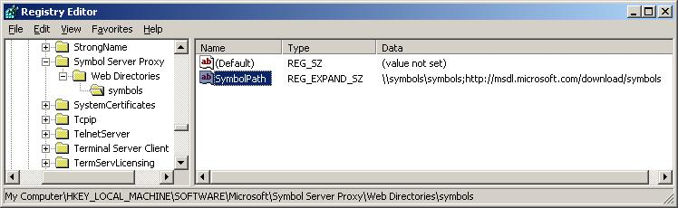

# Configuring the Registry


SymProxy stores its settings in this registry key.

```text
HKLM/Software/Microsoft/Symbol Server Proxy
```

This registry key controls the location from which to find symbols to store in the Web site, the logging level, and whether or not SymProxy operates with a direct connection to the network. You can create this key by running the SymProxy registration tool (Symproxy.reg) provided with Debugging Tools for Windows. Type **symproxy.reg** at the command prompt or double-click it from Windows Explorer.

This will add entries for the settings that will be prefixed with an "x" so that they are disabled. To enable a setting, remove the "x" from in front of the desired setting.

```text
[HKEY_LOCAL_MACHINE\SOFTWARE\Microsoft\Symbol Server Proxy]
"Available Settings"="Remove the 'x' prefix to use the setting"
"xLogLevel"=dword:0000000f
"xNoInternetProxy"=dword:00000001
"xNoFilePointers"=dword:00000001
"xNoUncompress"=dword:00000001
"xNoCache"=dword:00000001
"xMissTimeout"=dword:00000e10
"xMissAgeTimeout"=dword:00015180
"xMissAgeCheck"=dword:00000e10
"xMissFileCache"=dword:00000001
"xMissFileThreads"=dword:00000010
"xFailureCount"=dword:00000004
"xFailurePeriod"=dword:00000078
"xFailureTimeout"=dword:00002d
"xFailureBlackout"=dword:0000384
```

The symproxy.reg registry file assumes a virtual directory name of Symbols and configures the Symbol Path to use the Microsoft Public Symbol Server.

```text
[HKEY_LOCAL_MACHINE\SOFTWARE\Microsoft\Symbol Server Proxy\Web Directories]

[HKEY_LOCAL_MACHINE\SOFTWARE\Microsoft\Symbol Server Proxy\Web Directories\Symbols]
"SymbolPath"="https://msdl.microsoft.com/download/symbols"
```

The event logging entries in symproxy.reg are covered latter in the Event Log section of this topic.

```text
[HKEY_LOCAL_MACHINE\SYSTEM\CurrentControlSet\Services\EventLog\Application\Microsoft-Windows-SymProxy]
"ProviderGuid"="{0876099c-a903-47ff-af14-52035bb479ef}"
"EventMessageFile"=hex(2):25,00,53,00,79,00,73,00,74,00,65,00,6d,00,52,00,6f,\
  00,6f,00,74,00,25,00,5c,00,73,00,79,00,73,00,74,00,65,00,6d,00,33,00,32,00,\
  5c,00,69,00,6e,00,65,00,74,00,73,00,72,00,76,00,5c,00,53,00,79,00,6d,00,50,\
  00,72,00,6f,00,78,00,79,00,2e,00,64,00,6c,00,6c,00,00,00
"TypesSupported"=dword:00000007
```

The web directory entries in symproxy.reg are discussed in this topic.

### <span id="web_directories"></span><span id="WEB_DIRECTORIES"></span>Web Directories

For each virtual directory generated in IIS that you are using as a symbol store, you must setup a registry key below the **Web Directories** subkey of the following registry key.

```text
HKLM/Software/Microsoft/Symbol Server Proxy
```

**To edit the registry key for a symbol store virtual directory**

-   Edit the contents of **SymbolPath** to contain all of the symbol stores used by the SymProxy symbol store. If there is more than one symbol store being used, separate them with semicolons. A maximum of 10 stores is supported for each value. HTTP paths must include the **https:// prefix**, and UNC paths must include the **\\\\** prefix.

For example, if one of the virtual directories is called Symbols, and the symbols stores that it accesses are located at the UNC store \\\\symbols\\symbols and the HTTP store https://msdl.microsoft.com/download/symbols, create the following registry key.

```text
HKLM/Software/Microsoft/Symbol Server Proxy/Web Directories/Symbols
```

After this key is created, edit its **SymbolPath** to be \\\\symbols\\symbols;<https://msdl.microsoft.com/download/symbols>. This can be seen in the following screenshot of the Registry Editor.



In this example, SymProxy first searches for symbols in \\\\symbols\\symbols. If the files are not found there, the Microsoft Symbol Store will be used.

-   In each of the keys under Web Directories that match the Virtual Directory names, a REG\_SZ called SymbolPath needs to be created. The value contains all the upstream symbol stores that will be used to populate the SymProxy symbol store.

-   A maximum of 10 entries are supported.

-   Separate entries with semicolons.

-   UNC paths need to include the “\\\\” prefix

-   HTTP paths need to include the “https://” prefix

-   Order the values from least expensive to most expensive.

    - You will need to balance usage performance goals vs. server and data communications costs in the calculation.

    - In general, put local SMB/HTTP servers before internet HTTP servers.

### <span id="SymProxy_Performance_Counters"></span><span id="symproxy_performance_counters"></span><span id="SYMPROXY_PERFORMANCE_COUNTERS"></span>SymProxy Performance Counters

SymProxy can emit performance counters via a provider called SymProxy.

To enable the performance counters support, register the symproxy manifest file in an administrator command window:

```console
C:\> lodctr.exe /m:%WINDIR%\system32\inetsrv\symproxy.man
```

To disable the performance counters support, unregister the manifest:

```console
C:\> unlodctr.exe /m:%WINDIR%\system32\inetsrv\symproxy.man
```

### <span id="SymProxy_Event_Tracing_for_Windows"></span><span id="symproxy_event_tracing_for_windows"></span><span id="SYMPROXY_EVENT_TRACING_FOR_WINDOWS"></span>SymProxy Event Tracing for Windows

SymProxy can create ETW events via a provider called Microsoft-Windows-SymProxy.

```console
C:\> logman query providers | findstr SymProxy
Microsoft-Windows-SymProxy {0876099C-A903-47FF-AF14-52035BB479EF}
```

To enable the ETW support, register the manifest file:

```console
C:\> wevtutil.exe install-manifest %WINDIR%\system32\inetsrv\symproxy.man
```

To disable the ETW support, unregister the manifest file:

```console
C:\> wevtutil.exe uninstall-manifest %WINDIR%\system32\inetsrv\symproxy.man
```

### <span id="Event_Log"></span><span id="event_log"></span><span id="EVENT_LOG"></span>Event Log

If ETW is configured, the events are recorded as events in the *Operational and Analytic* channels under *Applications and Services Logs\\Microsoft\\Windows\\SymProxy* in the Event Log.

To correctly view the message of the Event Log entries, the Event Log area of the symproxy.reg file needs to be added to the registry:

```text
[HKEY_LOCAL_MACHINE\SYSTEM\CurrentControlSet\Services\EventLog\Application\Microsoft-Windows-SymProxy]
"ProviderGuid"="{0876099c-a903-47ff-af14-52035bb479ef}"
"EventMessageFile"=hex(2):25,00,53,00,79,00,73,00,74,00,65,00,6d,00,52,00,6f,\
  00,6f,00,74,00,25,00,5c,00,73,00,79,00,73,00,74,00,65,00,6d,00,33,00,32,00,\
  5c,00,69,00,6e,00,65,00,74,00,73,00,72,00,76,00,5c,00,53,00,79,00,6d,00,50,\
  00,72,00,6f,00,78,00,79,00,2e,00,64,00,6c,00,6c,00,00,00
"TypesSupported"=dword:00000007
```

### <span id="SymProxy_Events"></span><span id="symproxy_events"></span><span id="SYMPROXY_EVENTS"></span>SymProxy Events

SymProxy logs the following events:

|              |                                   |             |
|--------------|-----------------------------------|-------------|
| **Event ID** | **Description**                   | **Channel** |
| 1            | Start of the ISAPI filter         | Admin       |
| 2            | Stop of the ISAPI filter          | Admin       |
| 3            | Configuration of the ISAPI filter | Admin       |
| 4            | Miss Cache Statistics             | Admin       |
| 10           | URL Request - Local Cache Hit     | Operational |
| 11           | URL Request - Local Cache Miss    | Operational |
| 20           | Symbol Download via SymSrv        | Operational |
| 30           | Critical Symbol Missing           | Admin       |
| 31           | Critical Image Missing            | Admin       |
| 40           | SymSrv – Path Not Found           | Admin       |
| 41           | SymSrv – File Not Found           | Admin       |
| 42           | SymSrv – Access Denied            | Admin       |
| 43           | SymSrv – Path Too Long            | Admin       |
| 49           | SymSrv – Error Code               | Admin       |
| 90           | Lock Contention                   | Operational |
| 100          | General Critical Message          | Analytic    |
| 101          | General Error Message             | Analytic    |
| 102          | General Warning Message           | Analytic    |
| 103          | General Informational Message     | Analytic    |
| 104          | General Analytic Message          | Analytic    |
| 105          | General Debug Message             | Debug       |


### <span id="Symbol_Server_Proxy_Configuration"></span><span id="symbol_server_proxy_configuration"></span><span id="SYMBOL_SERVER_PROXY_CONFIGURATION"></span>Symbol Server Proxy Configuration

SymProxy stores its configuration settings in the following registry key area:

```text
HKLM/Software/Microsoft/Symbol Server Proxy
```

From this location, SymProxy acquires its global settings and the symbol paths of upstream symbol stores.

You can create this key by merging in the symproxy.reg file you customized as discussed earlier.

### <span id="Symbol_Server_Proxy__key"></span><span id="symbol_server_proxy__key"></span><span id="SYMBOL_SERVER_PROXY__KEY"></span>Symbol Server Proxy’ key

The Symbol Server Proxy registry key supports the following global settings (all REG\_DWORD). Settings can be applied live by recycling the application pool. A new w3wp.exe process will be created and it will read the new values. Once all pending requests to the old w3wp.exe process have completed, the old w3wp.exe process will end. IIS by default recycles w3wp.exe processes every 1,740 minutes (29 hours).

<table>
<colgroup>
<col width="50%" />
<col width="50%" />
</colgroup>
<tbody>
<tr class="odd">
<td align="left">REG_DWORDl</td>
<td align="left">Description</td>
</tr>
<tr class="even">
<td align="left">LogLevel</td>
<td align="left"><p>By default, SymProxy doesn’t log an extensive amount of information about its use of SymSrv.dll. Creating REG_DWORD:&quot;LogLevel &quot; with a value of 5 (Analytic) or 6 (Debug), enables the additional logging.</p></td>
</tr>
<tr class="odd">
<td align="left">NoInternetProxy</td>
<td align="left"><p>When running as a service, SymSrv.dll uses WinHTTP instead of WinInet to make HTTP requests. Consequently, you may need to set up HTTP proxy settings so that the service can access outside network resources. You can do this using the netsh program. Type “netsh.exe winhttp -?” for instructions.</p>
<p>By default, SymProxy uses the designated HTTP proxy. If no HTTP proxy is configured, SymProxy will use a dummy proxy. This allows secure access to HTTP sites within your intranet. As a side effect, this prevents SymProxy from directly connecting to non-secure sites.</p>
<p>Creating the REG_DWORD:&quot;NoInternetProxy&quot; value configures SymProxy to operate without a proxy, allowing a direct connection.</p></td>
</tr>
<tr class="even">
<td align="left">NoFilePointers</td>
<td align="left"><p>By default, for symbols that don’t exist, SymProxy will look for a file.ptr file next to the requested file (in the local cache). If found, it will return the location specified by the file.ptr file. This ability is only required when the local cache is being populated by SymStore.exe.</p>
<p>Create the REG_DWORD:&quot;NoFilePointers&quot; value to skip the lookup.</p></td>
</tr>
<tr class="odd">
<td align="left">NoUncompress</td>
<td align="left"><p>By default, SymProxy will decompress downloaded symbols before returning the file to the caller. This reduces CPU at the client, but increases I/O.</p>
<p>Create the REG_DWORD:&quot;NoUncompress&quot; value to skip the decompression.</p></td>
</tr>
<tr class="even">
<td align="left">NoCache</td>
<td align="left"><p>By default, SymProxy will cache downloaded symbols to the local file system, defined by the virtual directory’s path.</p>
<p>Create the REG_DWORD:&quot;NoCache&quot; value to skip the download and to provide the remote path of the file to the client instead.</p></td>
</tr>
<tr class="odd">
<td align="left">MissTimeout</td>
<td align="left"><p>Timeout period, in seconds, for which missing symbols are reported as missing without re-querying the upstream symbol servers.</p>
<p>A miss is associated with a UTC based time. Subsequent requests for the file are immediately rejected for N seconds.</p>
<p>The first request for the file after N seconds causes the upstream symbol stores to be re-queried.</p>
<p>On success, the symbol file is returned and the miss is deleted.</p>
<p>On failure, the miss is moved forward to the current time (in UTC) to start a new timeout period.</p>
<p>Use the “Miss Cache <em>” counters to monitor the misses.</p>
<p>• Unspecified - (default) 300 seconds/5 minutes</p>
<p>• 0 – Feature disabled</p>
<p>• N – Timeout lasts N seconds</p></td>
</tr>
<tr class="even">
<td align="left">MissAgeCheck</td>
<td align="left"><p>Period between Miss Age checks. The Miss cache is scanned and records older than MissAgeTimeout seconds are removed.</p>
<p>The current statistics are saved to the Event Log using Event ID 4.</p>
<p>• Unspecified - (default) 3600 seconds / 1 hour</p>
<p>• 0 – Feature disabled</p>
<p>• N – Period between checks in N seconds</p></td>
</tr>
<tr class="odd">
<td align="left">MissFileCache</td>
<td align="left"><p>By default, SymProxy does not save miss information to disk. Create the REG_DWORD:&quot;MissFileCache&quot; value to cache miss information in the symbol folder tree. Create the REG_DWORD:&quot;MissFileCache&quot; value to cache miss information in the symbol folder tree.</p>
<p>Enable MissFileCache when miss informarion needs to be shared across an IIS farm. Enabling MissFileCache also makes worker process recycling more efficient.</p>
<p>MissFileCache causes an I/O operation on the first request for a missing symbol (Miss File Read), the download of a symbol (Miss File Delete), and a failed symbol lookup (Miss File Write).</p>
<p>Use the “Miss File XXX/sec” counters to monitor the operations.</p>
<p>It is safe to delete .miss files while the SymProxy is running:</p>
<p>C:&amp;gt; del C:\SymStore\Symbols</em>.miss /s</p></td>
</tr>
<tr class="even">
<td align="left">MissFileThreads</td>
<td align="left"><p>By default, SymProxy performs up to 16 concurrent asynchronous file I/O operations for the Miss File feature. Creating the REG_DWORD:&quot; MissFileThreads&quot; value overrides the default limit. Values can be between 1 and 64.</p>
<p>Use the “Miss File Queue Depth” counter to monitor the load.</p></td>
</tr>
<tr class="odd">
<td align="left"><p>FailureTimeout</p>
<p>FailureCount</p>
<p>FailurePeriod</p>
<p>FailureBlackout</p></td>
<td align="left"><p>The Blackout feature is used to termporarly disable upstream symbol stores that are unresponsive. The Blackout feature uses 4 REG_DWORD values to define the behaviour. By default, the feature is disabled.</p>
<p>For each upstream symbol store defined in a Symbol Path, failures are individually recorded. If a request takes longer than FailureTimeout (msec), the failure count is incremented.</p>
<p>The Symbol Path is marked as dead after FailureCount failures in FailurePeriod seconds. At this time, all requests are ignored until FailureBlackout seconds have elapsed. The first caller after the timeout tests the upstream symbol store. On success, the timeout is removed and requests are allowed. On failure, the time is set to Now+FailureBlackout seconds. After that time, the upstream symbol store is tested again.</p></td>
</tr>
</tbody>
</table>


### <span id="accessing_outside_network_resources"></span><span id="ACCESSING_OUTSIDE_NETWORK_RESOURCES"></span>Accessing Outside Network Resources

When SymSrv is used in conjunction with SymProxy, it runs as a service and uses the WinHTTP API to access symbols over an HTTP connection. This differs from its usual behavior of using WinInet for this purpose.

Consequently, you may need to set up HTTP proxy settings so that this service can access outside network resources. Use one of the following methods to configure these settings:

-   Use the Netsh tool (netsh.exe). For instructions, type the following in a Command Prompt window:

    ```console
    netsh winhttp -? 
    ```

The default behavior of SymProxy is to use whatever HTTP proxy is designated by either ProxyCfg or Netsh. If no HTTP proxy is configured, SymProxy uses a dummy proxy to allow access to secure HTTP sites within your intranet. As a side effect, this technique prevents SymProxy from working with direct connections to the external Internet. If you wish to permit SymProxy to operate with a direct connection to the Internet, create a REG\_DWORD value named **NoInternetProxy** in the **Symbol Server Proxy** key of your registry. Set the value of **NoInternetProxy** to 1 and verify that there is no HTTP proxy indicated by ProxyCfg.


