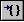
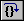

# Controlling the Target


## <span id="ddk_controlling_the_target_dbg"></span><span id="DDK_CONTROLLING_THE_TARGET_DBG"></span>


While you are debugging a target application in user mode or a target computer in kernel mode, the target can be *running* or *stopped*.

When the debugger connects to a kernel-mode target, the debugger leaves the target running, unless you use the **-b** [command-line option](command-line-options.md), the target system has stopped responding (that is, *crashed*), or the target system is still stopped because of an earlier kernel debugging action.

When the debugger starts or connects to a user-mode target, the debugger immediately stops the target, unless you use the **-g** command-line option. For more information, see [Initial Breakpoint](initial-breakpoint.md).

### <span id="when_the_target_is_running"></span><span id="WHEN_THE_TARGET_IS_RUNNING"></span>When the Target is Running

When the target is running, most debugger actions are unavailable.

If you want to stop a running target, you can issue a **Break** command. This command causes the debugger to *break into the target*. That is, the debugger stops the target and all control is given to the debugger. The application might not break immediately. For example, if all threads are currently executing system code, or are in a wait operation, the application breaks only after control has returned to the application's code.

If a running target encounters an exception, if certain [events](controlling-exceptions-and-events.md) occur, if a [breakpoint](using-breakpoints.md) is hit, or if the application closes normally, the target *breaks into the debugger*. This action stops the target and gives all control to the debugger. A message appears in the [Debugger Command window](debugger-command-window.md) and describes the error, event, or breakpoint.

### <span id="when_the_target_is_stopped"></span><span id="WHEN_THE_TARGET_IS_STOPPED"></span>When the Target is Stopped

To start or control the target's execution, you can do the following:

-   To cause the application to begin running, issue the **Go** command.

-   To step through the application one instruction at a time, use the **Step Into** or **Step Over** commands. If a function call occurs, **Step Into** enters the function and continues stepping through each instruction. **Step Over** treats the function call as a single step. When the debugger is in [Assembly Mode](debugging-in-assembly-mode.md), stepping occurs one machine instruction at a time. When the debugger is in [Source Mode](debugging-in-source-mode.md), stepping occurs one source line at a time.

-   To finish the current function and stop when the return occurs, use the **Step Out** or **Trace and Watch** commands. The **Step Out** command continues until the current function ends. **Trace and Watch** continues until the current function ends and also displays a summary of the function's calls. However, you must issue the **Trace and Watch** command on the first instruction of the function in question.

-   If an exception occurs, you can use the **Go with Exception Handled** and **Go with Exception Not Handled** commands to resume execution and control the status of the exception. (For more information about exceptions, see [Controlling Exceptions and Events](controlling-exceptions-and-events.md).)

-   (WinDbg only) If you select a line in the [Disassembly window](disassembly-window.md) or a [Source window](source-window.md) and then use the **Run to Cursor** command, the program runs until it encounters the selected line.

-   (User Mode only) To close the target application and restart it from the beginning, use the **Restart** command. You can use this command only with a process that the debugger created. After the process is restarted, it immediately breaks into the debugger.

-   (WinDbg only) To close the target application and clear the debugger, use the **Stop Debugging** command. This command enables you to start debugging a different target.

### <span id="command_forms"></span><span id="COMMAND_FORMS"></span>Command Forms

Most commands for starting or controlling the target's execution exist as text commands, menu commands, toolbar buttons, and shortcut keys. As basic text commands, you can use these commands in CDB, KD, or WinDbg. (The text form of the commands frequently supports additional options, such as changing the location of the program counter or executing a fixed number of instructions.) You can use the menu commands, toolbar buttons, and shortcut keys in WinDbg.

You can use the commands in the following forms.

<table>
<colgroup>
<col width="20%" />
<col width="20%" />
<col width="20%" />
<col width="20%" />
<col width="20%" />
</colgroup>
<thead>
<tr class="header">
<th align="left">Command</th>
<th align="left">WinDbg button</th>
<th align="left">WinDbg command</th>
<th align="left">WinDbg shortcut keys</th>
<th align="left">Effect</th>
</tr>
</thead>
<tbody>
<tr class="odd">
<td align="left"></td>
<td align="left"></td>
<td align="left"><p><a href="debug---run-to-cursor.md" data-raw-source="[Debug | Run to Cursor](debug---run-to-cursor.md)">Debug | Run to Cursor</a></p></td>
<td align="left"><p>F7</p>
<p>CTRL + F10</p></td>
<td align="left"><p>(WinDbg only) Executes until it reaches the line that the cursor marks.</p></td>
</tr>
<tr class="even">
<td align="left"></td>
<td align="left"></td>
<td align="left"><p><a href="debug---stop-debugging.md" data-raw-source="[Debug | Stop Debugging](debug---stop-debugging.md)">Debug | Stop Debugging</a></p></td>
<td align="left"><p>SHIFT + F5</p></td>
<td align="left"><p>Stops all debugging and closes the target.</p></td>
</tr>
<tr class="odd">
<td align="left"><p>(CDB/KD only) <strong><a href="ctrl-c--break-.md" data-raw-source="[CTRL+C](ctrl-c--break-.md)">CTRL+C</a></strong></p></td>
<td align="left"></td>
<td align="left"><p><a href="debug---break.md" data-raw-source="[Debug | Break](debug---break.md)">Debug | Break</a></p></td>
<td align="left"><p>CTRL + BREAK</p></td>
<td align="left"><p>Execution stops, and the debugger breaks into the target.</p></td>
</tr>
<tr class="even">
<td align="left"><p><strong><a href="-restart--restart-target-application-.md" data-raw-source="[.restart (Restart Target Application)](-restart--restart-target-application-.md)">.restart (Restart Target Application)</a></strong></p></td>
<td align="left"></td>
<td align="left"><p><a href="debug---restart.md" data-raw-source="[Debug | Restart](debug---restart.md)">Debug | Restart</a></p></td>
<td align="left"><p>CTRL + SHIFT + F5</p></td>
<td align="left"><p>(User mode only) Restarts the target application.</p></td>
</tr>
<tr class="odd">
<td align="left"><p><strong><a href="g--go-.md" data-raw-source="[g (Go)](g--go-.md)">g (Go)</a></strong></p></td>
<td align="left"></td>
<td align="left"><p><a href="debug---go.md" data-raw-source="[Debug | Go](debug---go.md)">Debug | Go</a></p></td>
<td align="left"><p>F5</p></td>
<td align="left"><p>Target executes freely.</p></td>
</tr>
<tr class="even">
<td align="left"><p><strong><a href="gc--go-from-conditional-breakpoint-.md" data-raw-source="[gc (Go from Conditional Breakpoint)](gc--go-from-conditional-breakpoint-.md)">gc (Go from Conditional Breakpoint)</a></strong></p></td>
<td align="left"></td>
<td align="left"></td>
<td align="left"></td>
<td align="left"><p>Resumes execution after a <a href="setting-a-conditional-breakpoint.md" data-raw-source="[conditional breakpoint](setting-a-conditional-breakpoint.md)">conditional breakpoint</a>.</p></td>
</tr>
<tr class="odd">
<td align="left"><p><strong><a href="gh--go-with-exception-handled-.md" data-raw-source="[gh (Go with Exception Handled)](gh--go-with-exception-handled-.md)">gh (Go with Exception Handled)</a></strong></p></td>
<td align="left"></td>
<td align="left"><p><a href="debug---go-handled-exception.md" data-raw-source="[Debug | Go Handled Exception](debug---go-handled-exception.md)">Debug | Go Handled Exception</a></p></td>
<td align="left"></td>
<td align="left"><p>Same as <strong>g (Go)</strong>, except that the current exception is treated as handled.</p></td>
</tr>
<tr class="even">
<td align="left"><p><strong><a href="gn--gn--go-with-exception-not-handled-.md" data-raw-source="[gn (Go with Exception Not Handled)](gn--gn--go-with-exception-not-handled-.md)">gn (Go with Exception Not Handled)</a></strong></p></td>
<td align="left"></td>
<td align="left"><p><a href="debug---go-unhandled-exception.md" data-raw-source="[Debug | Go Unhandled Exception](debug---go-unhandled-exception.md)">Debug | Go Unhandled Exception</a></p></td>
<td align="left"></td>
<td align="left"><p>Same as <strong>g (Go)</strong>, except that the current exception is treated as unhandled.</p></td>
</tr>
<tr class="odd">
<td align="left"><p><strong><a href="gu--go-up-.md" data-raw-source="[gu (Go Up)](gu--go-up-.md)">gu (Go Up)</a></strong></p></td>
<td align="left"></td>
<td align="left"><p><a href="debug---step-out.md" data-raw-source="[Debug | Step Out](debug---step-out.md)">Debug | Step Out</a></p></td>
<td align="left"><p>SHIFT + F11</p></td>
<td align="left"><p>Target executes until the current function is complete.</p></td>
</tr>
<tr class="even">
<td align="left"><p><strong><a href="p--step-.md" data-raw-source="[p (Step)](p--step-.md)">p (Step)</a></strong></p></td>
<td align="left"></td>
<td align="left"><p><a href="debug---step-over.md" data-raw-source="[Debug | Step Over](debug---step-over.md)">Debug | Step Over</a></p></td>
<td align="left"><p>F10</p></td>
<td align="left"><p>Target executes one instruction. If this instruction is a function call, that function is executed as a single step.</p></td>
</tr>
<tr class="odd">
<td align="left"><p><strong><a href="pa--step-to-address-.md" data-raw-source="[pa (Step to Address)](pa--step-to-address-.md)">pa (Step to Address)</a></strong></p></td>
<td align="left"></td>
<td align="left"></td>
<td align="left"></td>
<td align="left"><p>Target executes until it reaches the specified address. All steps in this function are displayed (but steps in called functions are not).</p></td>
</tr>
<tr class="even">
<td align="left"><p><strong><a href="pc--step-to-next-call-.md" data-raw-source="[pc (Step to Next Call)](pc--step-to-next-call-.md)">pc (Step to Next Call)</a></strong></p></td>
<td align="left"></td>
<td align="left"></td>
<td align="left"></td>
<td align="left"><p>Target executes until the next <strong>call</strong> instruction. If the current instruction is a <strong>call</strong> instruction, this call is executed completely and execution continues until the next <strong>call</strong>.</p></td>
</tr>
<tr class="odd">
<td align="left"><p><strong><a href="pct--step-to-next-call-or-return-.md" data-raw-source="[pct (Step to Next Call or Return)](pct--step-to-next-call-or-return-.md)">pct (Step to Next Call or Return)</a></strong></p></td>
<td align="left"></td>
<td align="left"></td>
<td align="left"></td>
<td align="left"><p>Target executes until it reaches a <strong>call</strong> instruction or a <strong>return</strong> instruction.</p></td>
</tr>
<tr class="even">
<td align="left"><p><strong><a href="ph--step-to-next-branching-instruction-.md" data-raw-source="[ph (Step to Next Branching Instruction)](ph--step-to-next-branching-instruction-.md)">ph (Step to Next Branching Instruction)</a></strong></p></td>
<td align="left"></td>
<td align="left"></td>
<td align="left"></td>
<td align="left"><p>Target executes until it reaches any kind of branching instruction, including conditional or unconditional branches, calls, returns, and system calls.</p></td>
</tr>
<tr class="odd">
<td align="left"><p><strong><a href="pt--step-to-next-return-.md" data-raw-source="[pt (Step to Next Return)](pt--step-to-next-return-.md)">pt (Step to Next Return)</a></strong></p></td>
<td align="left"></td>
<td align="left"></td>
<td align="left"></td>
<td align="left"><p>Target executes until it reaches a <strong>return</strong> instruction.</p></td>
</tr>
<tr class="even">
<td align="left"><p><strong><a href="t--trace-.md" data-raw-source="[t (Trace)](t--trace-.md)">t (Trace)</a></strong></p></td>
<td align="left"></td>
<td align="left"><p><a href="debug---step-into.md" data-raw-source="[Debug | Step Into](debug---step-into.md)">Debug | Step Into</a></p></td>
<td align="left"><p>F11</p>
<p>F8</p></td>
<td align="left"><p>Target executes one instruction. If this instruction is a function call, debugger traces into that call.</p></td>
</tr>
<tr class="odd">
<td align="left"><p><strong><a href="ta--trace-to-address-.md" data-raw-source="[ta (Trace to Address)](ta--trace-to-address-.md)">ta (Trace to Address)</a></strong></p></td>
<td align="left"></td>
<td align="left"></td>
<td align="left"></td>
<td align="left"><p>Target executes until it reaches the specified address. All steps in this function and called functions are displayed.</p></td>
</tr>
<tr class="even">
<td align="left"><p><strong><a href="tb--trace-to-next-branch-.md" data-raw-source="[tb (Trace to Next Branch)](tb--trace-to-next-branch-.md)">tb (Trace to Next Branch)</a></strong></p></td>
<td align="left"></td>
<td align="left"></td>
<td align="left"></td>
<td align="left"><p>(All modes, except kernel mode, only on x86-based systems) Target executes until it reaches the next branch instruction.</p></td>
</tr>
<tr class="odd">
<td align="left"><p><strong><a href="tc--trace-to-next-call-.md" data-raw-source="[tc (Trace to Next Call)](tc--trace-to-next-call-.md)">tc (Trace to Next Call)</a></strong></p></td>
<td align="left"></td>
<td align="left"></td>
<td align="left"></td>
<td align="left"><p>Target executes until the next <strong>call</strong> instruction. If the current instruction is a <strong>call</strong> instruction, the instruction is traced into until a new <strong>call</strong> is reached.</p></td>
</tr>
<tr class="even">
<td align="left"><p><strong><a href="tct--trace-to-next-call-or-return-.md" data-raw-source="[tct (Trace to Next Call or Return)](tct--trace-to-next-call-or-return-.md)">tct (Trace to Next Call or Return)</a></strong></p></td>
<td align="left"></td>
<td align="left"></td>
<td align="left"></td>
<td align="left"><p>Target executes until it reaches a <strong>call</strong> instruction or <strong>return</strong> instruction. If the current instruction is a <strong>call</strong> instruction or <strong>return</strong> instruction, the instruction is traced into until a new <strong>call</strong> or <strong>return</strong> is reached.</p></td>
</tr>
<tr class="odd">
<td align="left"><p><strong><a href="th--trace-to-next-branching-instruction-.md" data-raw-source="[th (Trace to Next Branching Instruction)](th--trace-to-next-branching-instruction-.md)">th (Trace to Next Branching Instruction)</a></strong></p></td>
<td align="left"></td>
<td align="left"></td>
<td align="left"></td>
<td align="left"><p>Target executes until it reaches any kind of branching instruction, including conditional or unconditional branches, calls, returns, and system calls. If the current instruction is a branching instruction, the instruction is traced into until a new branching instruction is reached.</p></td>
</tr>
<tr class="even">
<td align="left"><p><strong><a href="tt--trace-to-next-return-.md" data-raw-source="[tt (Trace to Next Return)](tt--trace-to-next-return-.md)">tt (Trace to Next Return)</a></strong></p></td>
<td align="left"></td>
<td align="left"></td>
<td align="left"></td>
<td align="left"><p>Target executes until it reaches a <strong>return</strong> instruction. If the current instruction is a <strong>return</strong> instruction, the instruction is traced into until a new <strong>return</strong> is reached.</p></td>
</tr>
<tr class="odd">
<td align="left"><p><strong><a href="wt--trace-and-watch-data-.md" data-raw-source="[wt (Trace and Watch Data)](wt--trace-and-watch-data-.md)">wt (Trace and Watch Data)</a></strong></p></td>
<td align="left"></td>
<td align="left"></td>
<td align="left"></td>
<td align="left"><p>Target executes until the completion of the whole specified function. Statistics are then displayed.</p></td>
</tr>
</tbody>
</table>

 

For more information about how to restart the target computer, see [Crashing and Rebooting the Target Computer](crashing-and-rebooting-the-target-computer.md).

### <span id="command_line_options"></span><span id="COMMAND_LINE_OPTIONS"></span>Command-Line Options

If you do not want the application to stop immediately when it starts or loads, use CDB or WinDbg together with the **-g** command-line option. For more information about this situation, see [Initial Breakpoint](initial-breakpoint.md).

CDB and WinDbg also support the **-G** [command-line option](command-line-options.md). This option causes the debugging session to end if the application completes properly.

The following command tries to run the application from start to finish, and the debugger prompt appears only if an error occurs.

```console
cdb -g -G ApplicationName 
```

You can use the **-pt** [command-line option](command-line-options.md) to set the break time-out. There are certain problems that can make the target unable to communicate with the debugger. If a break command is issued and the debugger cannot break into the target after this time, the debugger displays a "Break-in timed out" message.

At this point, the debugger stops trying to break into the target. Instead, the debugger pauses the target and enables you to examine (but not control) the target application.

The default time-out is 30 seconds.

 

 


