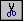

# Cutting and Pasting Text

## 

WinDbg uses many common methods of manipulating text and several methods that are less familiar.

### Selecting Text

To select text in a [Source window](source-window.md), in the [Disassembly window](disassembly-window.md), in either pane of the [Debugger Command window](debugger-command-window.md), or in a dialog box, point to one end of the text, press and hold the left mouse button, and drag the pointer to the other end of the text.

To select all of the text in a window, you can also click [Select All](edit---select-all.md) on the **Edit** menu or press CTRL+A.

In the [Calls window](calls-window.md), Watch window, [Locals window](locals-window.md), [Registers window](registers-window.md), and [Memory window](memory-window.md), you cannot select an arbitrary span of text, but you can select a whole line or cell. Click in the desired line or cell to select its text.

While you are entering text, press the DELETE and BACKSPACE keys to delete the text to the right or left of the cursor, respectively. If you select text, you can press these keys to delete the selection. If you select text and then type any characters, the new characters replace what you selected.

### Copying Text

To copy text, select that text and then do one of the following:

-   Press the right mouse button. (This method works only in some locations. For more information about how to use the right mouse button, see The Right Mouse Button.)

-   Press CTRL+C.

-   Press CTRL+INSERT.

-   (Docked and tabbed windows only) Click **Copy** on the **Edit** menu.

-   Click the **Copy (Ctrl+C)** button () on the toolbar.

### Cutting Text

To cut text and move it to the clipboard, select the text and then do one of the following:

-   Press CTRL+X.

-   Press SHIFT+DELETE.

-   (Docked and tabbed windows only) Click **Cut** on the **Edit** menu.

-   Click the **Cut (Ctrl+X)** button () on the toolbar.

You can cut text from the bottom pane of the Debugger Command window, from the left column of the Watch window, and from any dialog box (that is, from any location that supports text entry).

### Pasting Text

To paste text from the clipboard, put the cursor where you want to insert the text (or select the text that you want to replace) and then do one of the following:

-   Press the right mouse button. (This method works only in some locations, and you cannot use this method to replace text. For more inormation about how to use this method, see The Right Mouse Button.)

-   Press CTRL+V.

-   Press SHIFT+INSERT.

-   (Docked and tabbed windows only) Click **Paste** on the **Edit** menu.

-   Click the **Paste (Ctrl+V)** button () on the tooblar.

You can paste text into the bottom pane of the Debugger Command window, into the left column of the Watch window, and into any dialog box (that is, into any location that supports text entry).

### Right Mouse Button

The right mouse button has several effects that can make copying and pasting much quicker:

-   If you select text in either pane of the Debugger Command window, in the Scratch Pad, in the Disassembly window, or in any Source window, and then you press the right mouse button, the text is copied to the clipboard. However, if **QuickEdit Mode** has been deselected in [View | Options](view---options.md), right-clicking in these locations will pop up the menu most relevant to the current location.

-   If you put the cursor (without selecting any text) in either pane of the Debugger Command window, in the Scratch Pad, or in the text entry space of the Watch window, and then you press the right mouse button, the contents of the clipboard are pasted into the window. However, if **QuickEdit Mode** has been deselected in [View | Options](view---options.md), right-clicking in these locations will pop up the menu most relevant to the current location.

-   If you put the cursor in any box and then press the right mouse button, a menu with **Undo**, **Cut**, **Copy**, **Paste**, and **Select All** options appears. You can choose any of these options.

 

 

