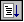

# Debug | Go

## 

Click **Go** on the **Debug** menu to resume (or begin) execution on the target. This execution will continue until a breakpoint is reached, an exception or event occurs, the process ends, or the debugger breaks into the target.

This command is equivalent to pressing F5 or clicking the **Go (F5)** button () on the toolbar.

### Additional Information

For more information about the effects of this action, other methods of issuing this command, and other ways to control program execution, see [Controlling the Target](controlling-the-target.md).

 

 

