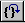

# Debug | Step Out

## 

Click **Step Out** on the **Debug** menu to resume running on the target. This command executes the rest of the current function and breaks when the function return is completed.

This command is equivalent to pressing SHIFT+F11 or clicking the **Step out (Shift+F11)** button () on the toolbar.

### Additional Information

For more information about the effects of this action, other methods of issuing this command, and other ways to control program execution, see [Controlling the Target](controlling-the-target.md).

 

 

