# <span id="debugger.debug_universal_drivers_-_step_by_step_lab__echo_kernel-mode_"></span>Debug Universal Drivers - Step by Step Lab (Echo Kernel-Mode)


This lab introduces the WinDbg kernel debugger. WinDbg is used to debug the echo kernel mode sample driver code.

## <span id="Lab_objectives"></span><span id="lab_objectives"></span><span id="LAB_OBJECTIVES"></span>Lab objectives


This lab includes exercises that introduce the debugging tools, teach common debugging commands, illustrate the use of break points, and show the use of the debugging extensions.

In this lab, a live kernel debug connection is used to explore the following:

-   Use the Windows debugger commands
-   Use standard commands (Call stacks, variables, threads, IRQL)
-   Use advanced driver debugging commands (!commands)
-   Use symbols
-   Set breakpoints in live debugging
-   View call stacks
-   Display the Plug and Play device tree
-   Work with thread and process context

**Note**  When working with the Windows debugger, there are two types of debugging that can be performed - user or kernel mode debugging.

*User mode* - Applications and subsystems run on the computer in user mode. Processes that run in user mode do so within their own virtual address spaces. They are restricted from gaining direct access to many parts of the system, including system hardware, memory that was not allocated for their use, and other portions of the system that might compromise system integrity. Because processes that run in user mode are effectively isolated from the system and other user mode processes, they cannot interfere with these resources.

*Kernel mode* - Kernel mode is the processor access mode in which the operating system and privileged programs run. Kernel mode code has permission to access any part of the system, and is not restricted like user mode code. It can gain access to any part of any other process running in either user mode or kernel mode. Much of the core OS functionality and many hardware device drivers run in kernel mode.

This lab will focus on kernel mode debugging, as that is the method used to debug many device drivers.


This exercise covers debug commands that are frequently used during both user-mode and kernel-mode debugging. The exercise also covers debug extensions (sometimes called "!commands") that are used for kernel-mode debugging.

## <span id="Lab_setup"></span><span id="lab_setup"></span><span id="LAB_SETUP"></span>Lab setup


You will need the following hardware to be able to complete the lab.

-   A laptop or desktop computer (host) running Windows 10
-   A laptop or desktop computer (target) running Windows 10
-   A network hub/router and network cables to connect the two PCs
-   Access to the internet to download symbol files

You will need the following software to be able to complete the lab.

-   Visual Studio 2017
-   Windows Software Development Kit (SDK) for Windows 10
-   Windows Driver Kit (WDK) for Windows 10
-   The sample echo driver for Windows 10

The lab has the following eleven sections.

-   [Section 1: Connect to a kernel mode WinDbg session](#connectto)
-   [Section 2: Kernel mode debugging commands and techniques](#kernelmodedebuggingcommandsandtechniques)
-   [Section 3: Download and build the KMDF Universal Echo Driver](#download)
-   [Section 4: Install the KMDF Echo driver sample on the target system](#install)
-   [Section 5: Use WinDbg to display information about the driver](#usewindbgtodisplayinformation)
-   [Section 6: Display Plug and Play device tree information](#displayingtheplugandplaydevicetree)
-   [Section 7: Work with breakpoints and source code](#workingwithbreakpoints)
-   [Section 8: View variables and call stacks](#viewingvariables)
-   [Section 9: Display processes and threads](#displayingprocessesandthreads)
-   [Section 10: IRQL, Registers and Ending the WinDbg session](#irqlregistersmemory)
-   [Section 11: Windows debugging resources](#windowsdebuggingresources)

## <span id="connectto"></span><span id="CONNECTTO"></span>Section 1: Connect to a kernel mode WinDbg session


*In Section 1, you will configure network debugging on the host and target system.*

The PCs in this lab need to be configured to use an Ethernet network connection for kernel debugging.

This lab uses two PCs. Windows debugger runs on the *host* system and the KMDF Echo driver runs on the *target* system.

 Use a network hub/router and network cables to connect the two PCs.


To work with kernel mode applications and use WinDbg, we recommend that you use the KDNET over Ethernet transport. For information about how to use the Ethernet transport protocol, see [Getting Started with WinDbg (Kernel-Mode)](getting-started-with-windbg--kernel-mode-.md). For more information about setting up the target computer, see [Preparing a Computer for Manual Driver Deployment](https://msdn.microsoft.com/windows-drivers/develop/preparing_a_computer_for_manual_driver_deployment) and [Setting Up KDNET Network Kernel Debugging Automatically](setting-up-a-network-debugging-connection-automatically.md).

### <span id="Configure__kernel_mode_debugging_using_ethernet"></span><span id="configure__kernel_mode_debugging_using_ethernet"></span><span id="CONFIGURE__KERNEL_MODE_DEBUGGING_USING_ETHERNET"></span>Configure kernel–mode debugging using ethernet

To enable kernel mode debugging on the target system, perform the following steps.

**&lt;- On the host system**

1. Open a command prompt on the host system and type **ipconfig** to determine its IP address.

```console
C:\>ipconfig
Windows IP Configuration
Ethernet adapter Ethernet:
   Connection-specific DNS Suffix  . :
   Link-local IPv6 Address . . . . . : fe80::c8b6:db13:d1e8:b13b%3
   Autoconfiguration IPv4 Address. . : 169.182.1.1
   Subnet Mask . . . . . . . . . . . : 255.255.0.0
   Default Gateway . . . . . . . . . :
```

2. Record the IP address of the host system: \_\_\_\_\_\_\_\_\_\_\_\_\_\_\_\_\_\_\_\_\_\_\_\_\_\_\_\_\_\_\_\_\_\_\_\_\_\_

**-&gt; On the target system**

3. Open a command prompt on the target system and use the **ping** command to confirm network connectivity between the two systems. Use the actual IP address of the host system you recorded instead of 169.182.1.1 that is shown in the sample output.

```console
C:\> ping 169.182.1.1

Pinging 169.182.1.1 with 32 bytes of data:
Reply from 169.182.1.1: bytes=32 time=1ms TTL=255
Reply from 169.182.1.1: bytes=32 time<1ms TTL=255
Reply from 169.182.1.1: bytes=32 time<1ms TTL=255
Reply from 169.182.1.1: bytes=32 time<1ms TTL=255

Ping statistics for 169.182.1.1:
    Packets: Sent = 4, Received = 4, Lost = 0 (0% loss),
Approximate round trip times in milli-seconds:
    Minimum = 0ms, Maximum = 1ms, Average = 0ms
```

Enable kernel mode debugging on the target system by completing the following steps.

> [!IMPORTANT]
> Before using BCDEdit to change boot information you may need to temporarily suspend Windows security features such as BitLocker and Secure Boot on the test PC.
> Re-enable these security features when testing is complete and appropriately manage the test PC, when the security features are disabled.

1. On the target computer, open a Command Prompt window as Administrator. Enter this command to enable debugging.

    ```console
    C:\> bcdedit /set {default} DEBUG YES
    ```

2. Type this command to enable test signing.

    ```console
    C:\> bcdedit /set TESTSIGNING ON 
    ```


3. Type this command to set the IP address of the host system. Use the IP address of the host system that you recorded earlier, not the one shown.

    ```console
    C:\> bcdedit /dbgsettings net hostip:192.168.1.1 port:50000 key:1.2.3.4
    ```

**Warning**  To increase the security of the connection and decrease the risk of the random client debugger connection requests, consider using an auto generated random key. For more information, see [Setting Up KDNET Network Kernel Debugging Automatically](setting-up-a-network-debugging-connection-automatically.md).

4. Type this command to confirm that the dbgsettings they are set properly.

    ```console
    C:\> bcdedit /dbgsettings
    key                     1.2.3.4
    debugtype               NET
    hostip                  169.168.1.1
    port                    50000
    dhcp                    Yes
    The operation completed successfully.
    ```

**Note**  
**Firewalls and debuggers**

If you receive a pop-up message from the firewall, and you wish to use the debugger, uand you wish to use the debugger, check **all three** of the boxes.

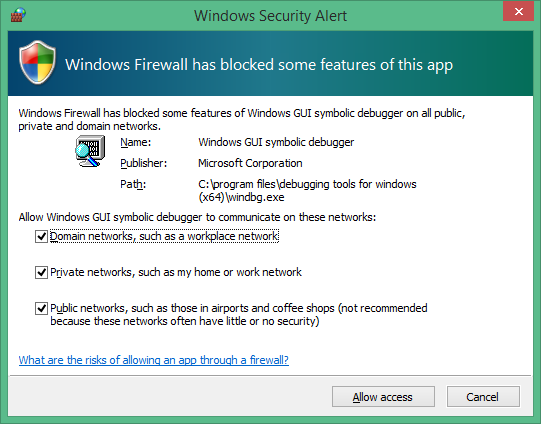


**&lt;- On the host system**

1. On the host computer, open a Command Prompt window as Administrator. We will use the x64 version of WinDbg.exe from the Windows Driver Kit (WDK) that was installed as part of the Windows kit installation. By default it is located here.

    ```console
    C:\> Cd C:\Program Files(x86)\Windows Kits\10\Debuggers\x64 
    ```

> [!NOTE]
> This labs assumes that both PCs are running a 64 bit version of Windows on both the target and host. 
> If that is not the case, the best approach is to run the same "bitness" of tools on the host that the target is running. 
For example if the target is running 32 bit Windows, run a 32 version of the debugger on the host. 
> For more information, see [Choosing the 32-Bit or 64-Bit Debugging Tools](choosing-a-32-bit-or-64-bit-debugger-package.md).
> 

2. Launch WinDbg with remote user debug using the following command. The value for the key and port match what we set earlier using BCDEdit on the target.

    ```console
    WinDbg –k net:port=50000,key=1.2.3.4
    ```

**-&gt;On the target system**

Reboot the target system.

**&lt;-On the host system**

In a minute or two, debug output should be displayed on the host system.

```dbgcmd
Microsoft (R) Windows Debugger Version 10.0.17074.1002 AMD64
Copyright (c) Microsoft Corporation. All rights reserved.

Using NET for debugging
Opened WinSock 2.0
Waiting to reconnect...
Connected to target 169.182.1.1 on port 50005 on local IP 169.182.1.2
You can get the target MAC address by running .kdtargetmac command.
Connected to Windows 10 16299 x64 target at (Wed Feb 28 17:16:23.051 2018 (UTC - 8:00)), ptr64 TRUE
Kernel Debugger connection established.  (Initial Breakpoint requested)
Symbol search path is: srv*
Executable search path is: 
Windows 10 Kernel Version 16299 MP (4 procs) Free x64
Product: WinNt, suite: TerminalServer SingleUserTS
Built by: 16299.15.amd64fre.rs3_release.170928-1534
Machine Name:
Kernel base = 0xfffff800`9540d000 PsLoadedModuleList = 0xfffff800`95774110
Debug session time: Wed Feb 28 17:16:23.816 2018 (UTC - 8:00)
System Uptime: 0 days 0:00:20.534
```

The Debugger Command window is the primary debugging information window in WinDbg. You can enter debugger commands and view the command output in this window.

The Debugger Command window is split into two panes. You type commands in the smaller pane (the command entry pane) at the bottom of the window and view the command output in the larger pane at the top of the window.

In the command entry pane, use the up arrow and down arrow keys to scroll through the command history. When a command appears, you can edit it or press **ENTER** to run the command.

## <span id="KernelModeDebuggingCommandsAndTechniques"></span><span id="kernelmodedebuggingcommandsandtechniques"></span><span id="KERNELMODEDEBUGGINGCOMMANDSANDTECHNIQUES"></span>Section 2: Kernel mode debugging commands and techniques


*In Section 2, you will use debug commands to display information about the target system.*

**&lt;- On the host system**

**Enable Debugger Markup Language (DML) with .prefer\_dml**

Some debug commands display text using Debugger Markup Language that you can click on to quickly gather more information.

1. Use Ctrl+Break (Scroll Lock) in WinDBg to break into the code running on the target system. It may take a bit of time for the target system to respond.

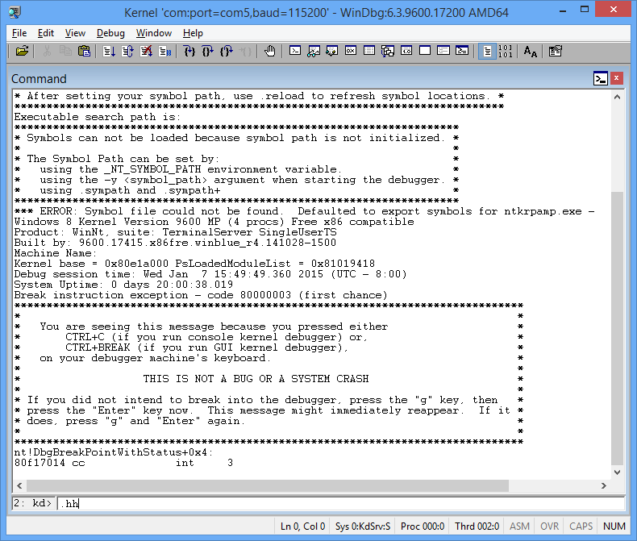


2. Type the following command to enable DML in the Debugger Command window.

```dbgcmd
0: kd> .prefer_dml 1
DML versions of commands on by default
```

**Use .hh to get help**

You can access reference command help using the **.hh** command.

3. Type the following command to view the command reference help for **.prefer\_dml**.

```dbgcmd
0: kd> .hh .prefer_dml
```

The Debugger help file will display help for the **.prefer\_dml** command.

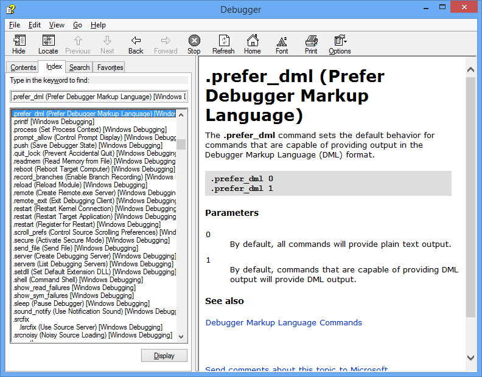

**Display the version of Windows on the target system**

5. Display detailed version information on the target system by typing the [**vertarget (Show Target Computer Version)**](vertarget--show-target-computer-version-.md) command in the WinDbg window.

```dbgcmd
0: kd> vertarget
Windows 10 Kernel Version 9926 MP (4 procs) Free x64
Product: WinNt, suite: TerminalServer SingleUserTS
Built by: 9926.0.amd64fre.fbl_awesome1501.150119-1648
Machine Name: ""
Kernel base = 0xfffff801`8d283000 PsLoadedModuleList = 0xfffff801`8d58aef0
Debug session time: Fri Feb 20 10:15:17.807 2015 (UTC - 8:00)
System Uptime: 0 days 01:31:58.931
```

**List the loaded modules**

6. You can verify that you are working with the right kernel mode process by displaying the loaded modules by typing the [**lm (List Loaded Modules)**](lm--list-loaded-modules-.md) command in the WinDbg window.

```dbgcmd
0: Kd> lm
start             end                 module name
fffff801`09200000 fffff801`0925f000   volmgrx    (no symbols)           
fffff801`09261000 fffff801`092de000   mcupdate_GenuineIntel   (no symbols)           
fffff801`092de000 fffff801`092ec000   werkernel   (export symbols)       werkernel.sys
fffff801`092ec000 fffff801`0934d000   CLFS       (export symbols)       CLFS.SYS
fffff801`0934d000 fffff801`0936f000   tm         (export symbols)       tm.sys
fffff801`0936f000 fffff801`09384000   PSHED      (export symbols)       PSHED.dll
fffff801`09384000 fffff801`0938e000   BOOTVID    (export symbols)       BOOTVID.dll
fffff801`0938e000 fffff801`093f7000   spaceport   (no symbols)           
fffff801`09400000 fffff801`094cf000   Wdf01000   (no symbols)           
fffff801`094d9000 fffff801`09561000   CI         (export symbols)       CI.dll
...
```

**Note**  Output that has been omitted is indicated with "… " in this lab.


7. To request detailed information about a specific module, use the v (verbose) option as shown.

```dbgcmd
0: Kd> lm v m tcpip
Browse full module list
start             end                 module name
fffff801`09eeb000 fffff801`0a157000   tcpip      (no symbols)           
    Loaded symbol image file: tcpip.sys
    Image path: \SystemRoot\System32\drivers\tcpip.sys
    Image name: tcpip.sys
    Browse all global symbols  functions  data
    Timestamp:        Sun Nov 09 18:59:03 2014 (546029F7)
    CheckSum:         00263DB1
    ImageSize:        0026C000
    Translations:     0000.04b0 0000.04e4 0409.04b0 0409.04e4

Unable to enumerate user-mode unloaded modules, Win32 error 0n30
```

8. Because we have yet to set the symbol path and loaded symbols, limited information is available in the debugger.

## <span id="Download"></span><span id="download"></span><span id="DOWNLOAD"></span>Section 3: Download and build the KMDF universal echo driver

*In Section 3, you will download and build the KMDF universal echo driver.*

Typically, you would be working with your own driver code when you use WinDbg. To become familiar with WinDbg operation, the KMDF Template "Echo" sample driver is used. With the source code available, it will also be easier to understand the information that is displayed in WinDbg. In addition, this sample is used to illustrate how you can single step through native kernel mode code. This technique can be very valuable for debugging complex kernel mode code issues.

To download and build the Echo sample audio driver, perform the following steps.

1.  **Download and extract the KMDF Echo sample from GitHub**

    You can use a browser to view the echo sample in GitHub here:

    [https://github.com/Microsoft/Windows-driver-samples/tree/97cf5197cf5b882b2c689d8dc2b555f2edf8f418/general/echo/kmdf](https://github.com/Microsoft/Windows-driver-samples/blob/97cf5197cf5b882b2c689d8dc2b555f2edf8f418/general/echo/kmdf/ReadMe.md)

    You can read about the sample here:

    <https://github.com/Microsoft/Windows-driver-samples/blob/97cf5197cf5b882b2c689d8dc2b555f2edf8f418/general/echo/kmdf/ReadMe.md>

    You can browse all of the universal driver samples here:

    <https://github.com/Microsoft/Windows-driver-samples>

    The KMDF Echo sample is located in the general folder.

    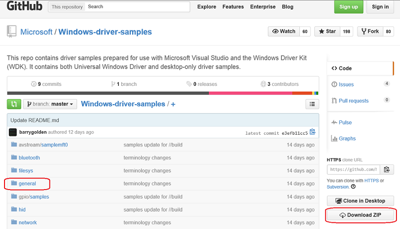

    a. This lab, shows how to download the universal driver samples in one zip file.

    <https://github.com/Microsoft/Windows-driver-samples/archive/master.zip>

    b. Download the master.zip file to your local hard drive.

    c. Right-click *Windows-driver-samples-master.zip*, and choose **Extract All**. Specify a new folder, or browse to an existing one that will store the extracted files. For example, you could specify *C:\\DriverSamples\\* as the new folder into which the files are extracted.

    d. After the files are extracted, navigate to the following subfolder.

    *C:\\DriverSamples\\general\\echo\\kmdf*

2.  **Open the driver solution in Visual Studio**

    In Microsoft Visual Studio, click **File** &gt; **Open** &gt; **Project/Solution...** and navigate to the folder that contains the extracted files (for example, *C:\\DriverSamples\\general\\echo\\kmdf*). Double-click the *kmdfecho* solution file to open it.

    In Visual Studio, locate the Solution Explorer. (If this is not already open, choose **Solution Explorer** from the **View** menu.) In Solution Explorer, you can see one solution that has three projects.

    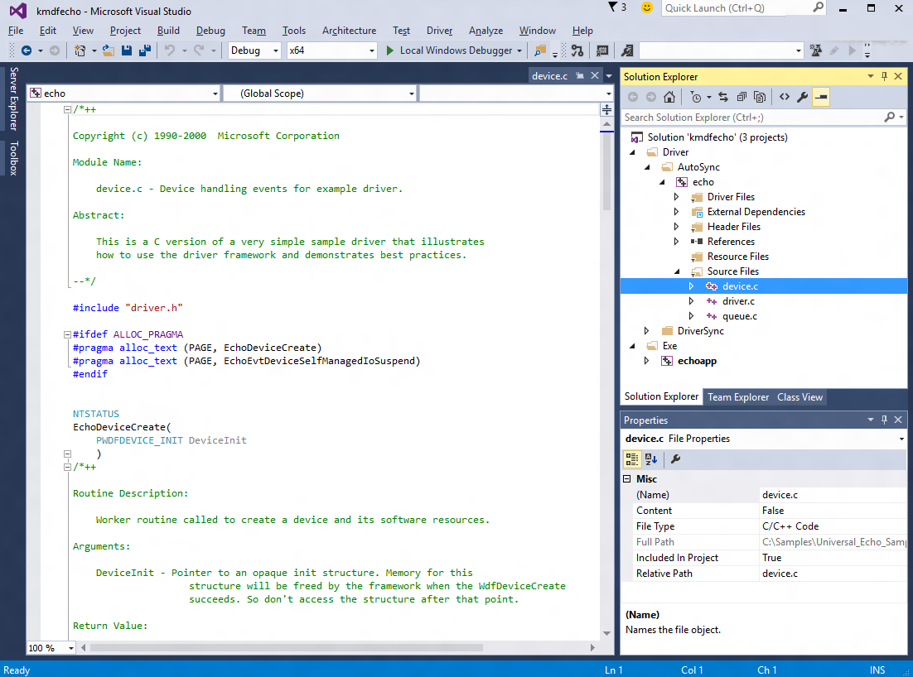

3.  **Set the sample's configuration and platform**

    In Solution Explorer, right-click **Solution 'kmdfecho' (3 projects)**, and choose **Configuration Manager**. Make sure that the configuration and platform settings are the same for the three projects. By default, the configuration is set to "Win10 Debug", and the platform is set to "Win64" for all the projects. If you make any configuration and/or platform changes for one project, you must make the same changes for the remaining three projects.

4.  **Set the runtime library**

    Set the runtime library - Open the echo driver’s property page and locate **C/C++** &gt; **Code Generation**.  Change Runtime Library from DLL version to non DLL version. Without this setting, you have to install the MSVC runtime to the target computer separately.

    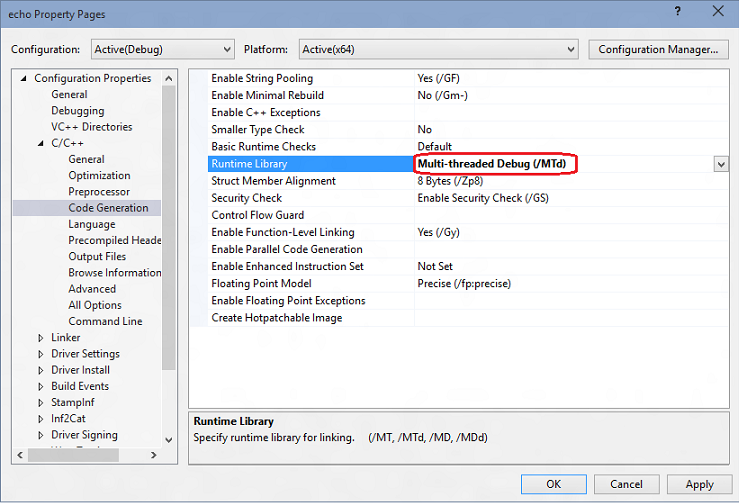

5.  **Check driver signing**

    Also on the driver’s properties make sure **Driver Signing** &gt; **Sign Mode** is set to “Test Sign”. This is required because Windows requires that drivers are signed.

    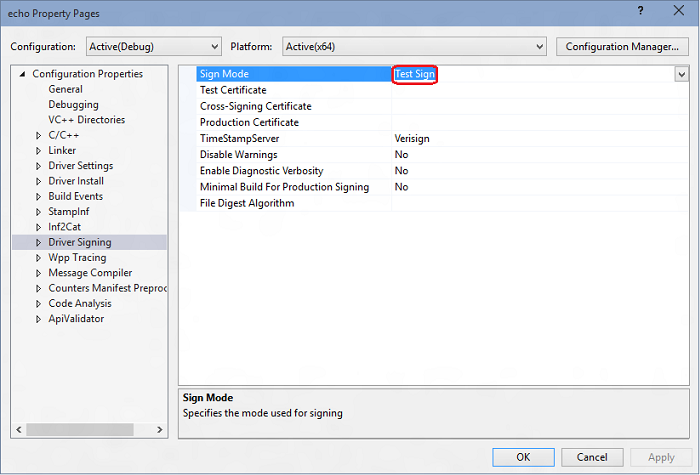

6.  **Build the sample using Visual Studio**

    In Visual Studio, click **Build** &gt; **Build Solution**.

    If all goes well, the build windows should display a message indicating that the build for all three projects succeeded.

7.  **Locate the built driver files**

    In File Explorer, navigate to the folder that contains the extracted files for the sample. For example, you would navigate to *C:\\DriverSamples\\general\\echo\\kmdf*, if that's the folder you specified earlier. Within that folder, the location of the compiled driver files varies depending on the configuration and platform settings that you selected in the **Configuration Manager**. For example, if you left the default settings unchanged, then the compiled driver files will be saved to a folder named *\\x64\\Debug* for a 64 bit, debug build.

    Navigate to the folder that contains the built files for the Autosync driver:

    *C:\\DriverSamples\\general\\echo\\kmdf\\driver\\AutoSync\\x64\\Debug*. 

    The folder should contain these files:

    | File     | Description                                                                       |
    |----------|-----------------------------------------------------------------------------------|
    | Echo.sys | The driver file.                                                                  |
    | Echo.inf | An information (INF) file that contains information needed to install the driver. |

    In addition, the echoapp.exe file was built and it should be located here: *C:\\DriverSamples\\general\\echo\\kmdf\\exe\\x64\\Debug*

    | File        | Description                                                                       |
    |-------------|-----------------------------------------------------------------------------------|
    | EchoApp.exe | A command prompt executable test file that communicates with the echo.sys driver. |     

8.  Locate a USB thumb drive or set up a network share to copy the built driver files and the test EchoApp from the host to the target system.

In the next section, you will copy the code to the target system, and install and test the driver.

## <span id="Install"></span><span id="install"></span><span id="INSTALL"></span>Section 4: Install the KMDF echo driver sample on the target system

*In Section 4, you will use devcon to install the echo sample driver.*

**-&gt; On the target system**

The computer where you install the driver is called the *target computer* or the *test computer*. Typically, this is a separate computer from the computer on which you develop and build the driver package. The computer where you develop and build the driver is called the *host computer*.

The process of moving the driver package to the target computer and installing the driver is called *deploying* the driver. You can deploy the sample echo driver, automatically or manually.

Before you manually deploy a driver, you must prepare the target computer by turning on test signing. You also need to locate the DevCon tool in your WDK installation. After that you’re ready to run the built driver sample.

To install the driver on the target system, perform the following steps.

**Enable test signed drivers**

Enable the ability to run test signed drivers:

a. Open Windows Settings.

b. In Update and Security, select **Recovery**.

c. Under Advanced startup, click **Restart Now**.

d. When the PC reboots, select **Startup options**. In Windows 10, select **Troubleshoot** > **Advanced options** > **Startup Settings** , then click Restart button. 

e. Select Disable driver signature enforcement by pressing the **F7** key.

f. Reboot the target computer.


**&lt;- On the host system**

Navigate to the Tools folder in your WDK installation and locate the DevCon tool. For example, look in the following folder:

*C:\\Program Files (x86)\\Windows Kits\\10.0\\Tools\\x64\\devcon.exe*
Create a folder on the target for the built driver package (for example, *C:\\EchoDriver*). Copy all the files from the built driver described earlier on the host computer and save them to the folder that you created on the target computer.

Locate the .cer certificate on the host system, it is in the same folder on the host computer in the folder that contains the built driver files. On the target computer, right-click the certificate file, and click **Install**, then follow the prompts to install the test certificate.

If you need more detailed instructions for setting up the target computer, see [Preparing a Computer for Manual Driver Deployment](../develop/preparing-a-computer-for-manual-driver-deployment.md).

**-&gt; On the target system**

**Install the driver**

The following instructions show you how to install and test the sample driver. Here's the general syntax for the devcon tool that you will use to install the driver:

*devcon install &lt;INF file&gt; &lt;hardware ID&gt;*

The INF file required for installing this driver is *echo.inf*. The inf file contains the hardware ID for installing the *echo.sys*. For the echo sample the hardware ID is **root\\ECHO**.

On the target computer, open a Command Prompt window as Administrator. Navigate to your driver package folder, and enter the following command:

**devcon install echo.inf root\\ECHO**
If you get an error message about *devcon* not being recognized, try adding the path to the *devcon* tool. For example, if you copied it to a folder called *C:\\Tools*, then try using the following command:

**c:\\tools\\devcon install echo.inf root\\ECHO**
A dialog box will appear indicating that the test driver is an unsigned driver. Click **Install this driver anyway** to proceed.

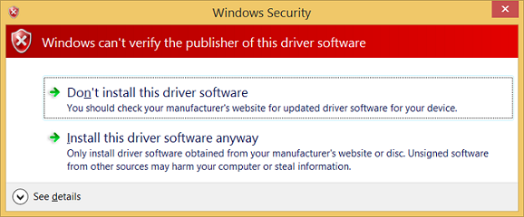

For more detailed instructions, see [Configuring a Computer for Driver Deployment, Testing, and Debugging](https://docs.microsoft.com/windows-hardware/drivers/gettingstarted/provision-a-target-computer-wdk-8-1).

After successfully installing the sample driver, you're now ready to test it.

**Examine the driver in Device Manager**

On the target computer, in a Command Prompt window, enter **devmgmt** open Device Manager. In Device Manager, on the View menu, choose Devices by type. In the device tree, locate *Sample WDF Echo Driver* in the Sample Device node.

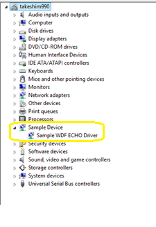

**Test the driver**

Type **echoapp** to start the test echo app to confirm that the driver is functional.

```dbgcmd
C:\Samples\KMDF_Echo_Sample> echoapp
DevicePath: \\?\root#sample#0005#{cdc35b6e-0be4-4936-bf5f-5537380a7c1a}
Opened device successfully
512 Pattern Bytes Written successfully
512 Pattern Bytes Read successfully
Pattern Verified successfully
30720 Pattern Bytes Written successfully
30720 Pattern Bytes Read successfully
Pattern Verified successfully
```

## <span id="UseWinDbgToDisplayInformation"></span><span id="usewindbgtodisplayinformation"></span><span id="USEWINDBGTODISPLAYINFORMATION"></span>Section 5: Use WinDbg to display information about the driver

*In Section 5, you will set the symbol path and use kernel debugger commands to display information about the KMDF echo sample driver.*

View information about the driver by performing the following steps.

**&lt;-On the host system**

1.  If you closed the debugger, open it again using the following command in the administrator command prompt window.

    ```dbgcmd
    WinDbg -k net:port=50000,key=1.2.3.4
    ```

2.  Use Ctrl+Break (Scroll Lock) to break into the code running on the target system.

**Setting the symbol path**

1.  To set the symbols path to the Microsoft symbol server in the WinDbg environment, use the **.symfix** command.

    ```dbgcmd
    0: kd> .symfix
    ```

2.  To add your local symbol location to use your local symbols, add the path using **.sympath+** and then **.reload /f**.

    ```dbgcmd
    0: kd> .sympath+ C:\DriverSamples\general\echo\kmdf
    0: kd> .reload /f
    ```

    **Note**  The **.reload** command with the **/f** force option deletes all symbol information for the specified module and reloads the symbols. In some cases, this command also reloads or unloads the module itself.


**Note**  You must load the proper symbols to use advanced functionality that WinDbg provides. If you do not have symbols properly configured, you will receive messages indicating that symbols are not available when you attempt to use functionality that is dependent on symbols.

```dbgcmd
0:000> dv
Unable to enumerate locals, HRESULT 0x80004005
Private symbols (symbols.pri) are required for locals.
Type “.hh dbgerr005” for details.
```


**Note**  
**Symbol servers**

There are a number of approaches that can be used to work with symbols. In many situations, you can configure the PC to access symbols from a symbol server that Microsoft provides when they are needed. This walkthrough assumes that this approach will be used. If the symbols in your environment are in a different location, modify the steps to use that location. For additional information, see [Symbol Stores and Symbol Servers](symbol-stores-and-symbol-servers.md).


**Note**  
**Understand source code symbol requirements**

To perform source debugging, you must build a checked (debug) version of your binaries. The compiler will create symbol files (.pdb files). These symbol files will show the debugger how the binary instructions correspond to the source lines. The actual source files themselves must also be accessible to the debugger.

The symbol files do not contain the text of the source code. For debugging, it is best if the linker does not optimize your code. Source debugging and access to local variables are more difficult, and sometimes nearly impossible, if the code has been optimized. If you are having problems viewing local variables or source lines, set the following build options:

```console
set COMPILE_DEBUG=1
set ENABLE_OPTIMIZER=0
```


1. Type the following in the command area of the debugger to display information about the echo driver :

   ```dbgcmd
   0: kd> lm m echo* v
   Browse full module list
   start             end                 module name
   fffff801`4ae80000 fffff801`4ae89000   ECHO       (private pdb symbols)  C:\Samples\KMDF_ECHO_SAMPLE\echo.pdb
       Loaded symbol image file: ECHO.sys
       Image path: \SystemRoot\system32\DRIVERS\ECHO.sys
       Image name: ECHO.sys
   ...  
   ```

   For information, see [**lm**](lm--list-loaded-modules-.md).

2. Because we set prefer\_dml =1 earlier, some elements of the output are hot links that you can click on. Click on the *Browse all global symbols link* in the debug output to display information about items symbols that start with the letter “a”.

   ```dbgcmd
   0: kd> x /D Echo!a*
   ```

3. As it turns out, the echo sample doesn’t contain any symbols that start with the letter “a”, so to display information about all of the symbols associated with echo driver that start with Echo, type **x ECHO!Echo\\***.

   ```dbgcmd
   0: kd> x ECHO!Echo*
   fffff801`0bf95690 ECHO!EchoEvtIoQueueContextDestroy (void *)
   fffff801`0bf95000 ECHO!EchoEvtDeviceSelfManagedIoStart (struct WDFDEVICE__ *)
   fffff801`0bf95ac0 ECHO!EchoEvtTimerFunc (struct WDFTIMER__ *)
   fffff801`0bf9b120 ECHO!EchoEvtDeviceSelfManagedIoSuspend (struct WDFDEVICE__ *)
   ...
   ```

   For information, see [**x (Examine Symbols)**](x--examine-symbols-.md).

4. The **!lmi** extension displays detailed information about a module. Type **!lmi echo**. Your output should be similar to the text shown below.

   ```dbgcmd
   0: kd> !lmi echo
   Loaded Module Info: [echo] 
            Module: ECHO
      Base Address: fffff8010bf94000
        Image Name: ECHO.sys
   … 
   ```

5. Use the **!dh** extension to display header information as shown below.

   ```dbgcmd
   0: kd> !dh echo

   File Type: EXECUTABLE IMAGE
   FILE HEADER VALUES
        14C machine (i386)
          6 number of sections
   54AD8A42 time date stamp Wed Jan 07 11:34:26 2015
   ...
   ```

6. **Setting the debug mask**

   Type the following to change the default debug bit mask so that all debug messages from the target system will be displayed in the debugger.

   ```dbgcmd
   0: kd> ed nt!Kd_DEFAULT_MASK  0xFFFFFFFF
   ```

   Some drivers will display additional information when the mask of 0xFFFFFFFF is used. Set the mask to 0x00000000 if you would like to reduce the amount of information that is displayed.

   ```dbgcmd
   0: kd> ed nt!Kd_DEFAULT_MASK  0x00000000
   ```

   Use the dd command to display confirm the mask is set to display all of the debugger messages. 

   ```dbgcmd
   0: kd> dd nt!kd_DEFAULT_MASK 
   fffff802`bb4057c0  ffffffff 00000000 00000000 00000000
   fffff802`bb4057d0  00000000 00000000 00000000 00000000
   fffff802`bb4057e0  00000001 00000000 00000000 00000000
   fffff802`bb4057f0  00000000 00000000 00000000 00000000
   fffff802`bb405800  00000000 00000000 00000000 00000000
   fffff802`bb405810  00000000 00000000 00000000 00000000
   fffff802`bb405820  00000000 00000000 00000000 00000000
   fffff802`bb405830  00000000 00000000 00000000 00000000
   ```


## <span id="DisplayingThePlugAndPlayDeviceTree"></span><span id="displayingtheplugandplaydevicetree"></span><span id="DISPLAYINGTHEPLUGANDPLAYDEVICETREE"></span>Section 6: Displaying Plug and Play device tree information

*In Section 6, you will display information about the echo sample device driver and where it lives in the Plug and Play device tree.*

Information about the device driver in the Plug and Play device tree can be useful for troubleshooting. For example, if a device driver is not resident in the device tree, there may an issue with the installation of the device driver.

For more information about the device node debug extension, see [**!devnode**](-devnode.md).

**&lt;-On the host system**

1. To see all the device nodes in the Plug and Play device tree, enter the **!devnode 0 1** command.

   ```dbgcmd
   0: kd> !devnode 0 1
   Dumping IopRootDeviceNode (= 0xffffe0005a3a8d30)
   DevNode 0xffffe0005a3a8d30 for PDO 0xffffe0005a3a9e50
     InstancePath is "HTREE\ROOT\0"
     State = DeviceNodeStarted (0x308)
     Previous State = DeviceNodeEnumerateCompletion (0x30d)
     DevNode 0xffffe0005a3a3d30 for PDO 0xffffe0005a3a4e50
       InstancePath is "ROOT\volmgr\0000"
       ServiceName is "volmgr"
       State = DeviceNodeStarted (0x308)
       Previous State = DeviceNodeEnumerateCompletion (0x30d)
       DevNode 0xffffe0005a324560 for PDO 0xffffe0005bd95ca0…
   …
   ```

2. Use Ctrl+F to search in the output that is generated to look for the name of the device driver, *echo*.

   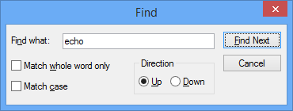

3. The echo device driver should be loaded. Use the **!devnode 0 1 echo** command to display Plug and Play information associated with our echo device driver as shown below.

   ```dbgcmd
   0: Kd> !devnode 0 1 echo
   Dumping IopRootDeviceNode (= 0xffffe0007b725d30)
   DevNode 0xffffe0007b71a630 for PDO 0xffffe0007b71a960
     InstancePath is "ROOT\SAMPLE\0000"
     ServiceName is "ECHO"
     State = DeviceNodeStarted (0x308)
     Previous State = DeviceNodeEnumerateCompletion (0x30d)
   …
   ```

4. The output displayed in the previous command includes the PDO associated with the running instance of our driver, in this example it is *0xffffe0007b71a960*. Enter the **!devobj**<em>&lt;PDO address&gt;</em> command to display Plug and Play information associated with the echo device driver. Use the PDO address that **!devnode** displays on your PC, not the one shown here.

   ```dbgcmd
   0: kd> !devobj 0xffffe0007b71a960
   Device object (ffffe0007b71a960) is for:
    0000000e \Driver\PnpManager DriverObject ffffe0007b727e60
   Current Irp 00000000 RefCount 0 Type 00000004 Flags 00001040
   Dacl ffffc102c9b36031 DevExt 00000000 DevObjExt ffffe0007b71aab0 DevNode ffffe0007b71a630 
   ExtensionFlags (0x00000800)  DOE_DEFAULT_SD_PRESENT
   Characteristics (0x00000180)  FILE_AUTOGENERATED_DEVICE_NAME, FILE_DEVICE_SECURE_OPEN
   AttachedDevice (Upper) ffffe000801fee20 \Driver\ECHO
   Device queue is not busy.
   ```

5. The output displayed in the **!devnode 0 1** command includes the PDO address associated with the running instance of our driver, in this example it is *0xffffe0007b71a960*. Enter the **!devstack**<em>&lt;PDO address&gt;</em> command to display Plug and Play information associated with the device driver. Use the PDO address that **!devnode** displays on your PC, not the one shown below.

   ```dbgcmd
   0: kd> !devstack 0xffffe0007b71a960
     !DevObj           !DrvObj            !DevExt           ObjectName
     ffffe000801fee20  \Driver\ECHO       ffffe0007f72eff0  
   > ffffe0007b71a960  \Driver\PnpManager 00000000  0000000e
   !DevNode ffffe0007b71a630 :
     DeviceInst is "ROOT\SAMPLE\0000"
     ServiceName is "ECHO"
   ```

The output shows that we have a fairly simple device driver stack. The echo driver is a child of the PnPManager node. The PnPManager is a root node.

\Driver\ECHO      

\Driver\PnpManager

This diagram shows a more complex device node tree.

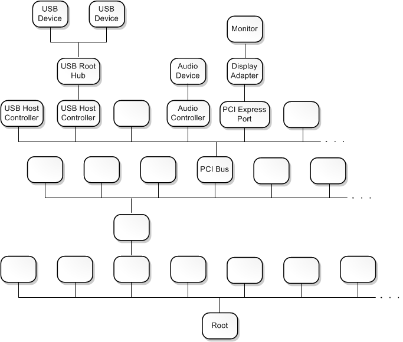

**Note**  For more information about more complex driver stacks, see [Driver stacks](https://msdn.microsoft.com/library/windows/hardware/hh439632) and [Device nodes and device stacks](https://msdn.microsoft.com/library/windows/hardware/ff554721).


## <span id="WorkingWithBreakpoints"></span><span id="workingwithbreakpoints"></span><span id="WORKINGWITHBREAKPOINTS"></span>Section 7: Working with breakpoints and source code

*In Section 7, you will set breakpoints and single step through kernel mode source code.*

**Note**  
**Setting breakpoints using commands**

To be able to step through code and check the values of variables in real time, we need to enable breakpoints and set a path to the source code.

Breakpoints are used to stop code execution at a particular line of code. You can then step forward in the code from that point, to debug that specific section of code.

To set a breakpoint using a debug command, use one of the following **b** commands.

<table>
<colgroup>
<col width="50%" />
<col width="50%" />
</colgroup>
<tbody>
<tr class="odd">
<td align="left"><p>bp</p></td>
<td align="left"><p>Sets a breakpoint that will be active until the module it is in is unloaded.</p></td>
</tr>
<tr class="even">
<td align="left"><p>bu</p></td>
<td align="left"><p>Sets a breakpoint that is unresolved when the module is unloaded and re-enables when the module reloads.</p></td>
</tr>
<tr class="odd">
<td align="left"><p>bm</p></td>
<td align="left"><p>Sets a breakpoint for a symbol. This command will use bu or bp appropriately and allows wildcards * to be used to set breakpoints on every symbols that matches (like all methods in a class).</p></td>
</tr>
</tbody>
</table>


For more information, see [Source Code Debugging in WinDbg](source-window.md) in the debugging reference documentation.

**&lt;-On the host system**

1.  Use the WinDbg UI to confirm that **Debug** &gt; **Source Mode** is enabled in the current WinDbg session.

2.  Add your local code location to the source path by typing the following command.

    ```dbgcmd
    .srcpath+ C:\DriverSamples\KMDF_Echo_Sample\driver\AutoSync
    ```

3.  Add your local symbol location to the symbol path by typing the following command.

    ```dbgcmd
    .sympath+ C:\DriverSamples\KMDF_Echo_Sample\driver\AutoSync
    ```

4.  We will use the **x** command to examine the symbols associated with the echo driver to determine the function name to use for the breakpoint. We can use a wild card or Ctrl+F to locate the **DeviceAdd** function name.

    ```dbgcmd
    0: kd> x ECHO!EchoEvt*
    8b4c7490          ECHO!EchoEvtIoQueueContextDestroy (void *)
    8b4c7000          ECHO!EchoEvtDeviceSelfManagedIoStart (struct WDFDEVICE__ *)
    8b4c7820          ECHO!EchoEvtTimerFunc (struct WDFTIMER__ *)
    8b4cb0e0          ECHO!EchoEvtDeviceSelfManagedIoSuspend (struct WDFDEVICE__ *)
    8b4c75d0          ECHO!EchoEvtIoWrite (struct WDFQUEUE__ *, struct WDFREQUEST__ *, unsigned int)
    8b4cb170          ECHO!EchoEvtDeviceAdd (struct WDFDRIVER__ *, struct 
    …
    ```

    The output above shows that **DeviceAdd** method for our echo driver is *ECHO!EchoEvtDeviceAdd*.

    Alternatively, we could review the source code to locate the desired function name for our breakpoint.

5.  Set the breakpoint with the **bm** command using the name of the driver, followed by the function name (for example **AddDevice**) where you want to set the breakpoint, separated by an exclamation mark. We will use **AddDevice** to watch the driver being loaded.

    ```dbgcmd
    0: kd> bm ECHO!EchoEvtDeviceAdd
      1: fffff801`0bf9b1c0 @!"ECHO!EchoEvtDeviceAdd"
    ```

    **Note**  
    You can use different syntax in conjunction with setting variables like &lt;module&gt;!&lt;symbol&gt;, &lt;class&gt;::&lt;method&gt;,‘&lt;file.cpp&gt;:&lt;line number&gt;’, or skip a number of times &lt;condition&gt; &lt;\#&gt;. For more information, see [Conditional breakpoints in WinDbg and other Windows debuggers](setting-a-conditional-breakpoint.md).


6.  List the current breakpoints to confirm that the breakpoint was set by typing the **bl** command.

    ```dbgcmd
    0: kd> bl
    1 e fffff801`0bf9b1c0     0001 (0001) ECHO!EchoEvtDeviceAdd
    ```

    The "e" in the output shown above indicates that the breakpoint number 1 is enabled to fire.

7.  Restart code execution on the target system by typing the **go** command **g**.

8.  **-&gt; On the target system**

    In Windows, open **Device Manager** using the icon or by entering **mmc devmgmt.msc**. In Device Manager, expand the **Samples** node.

9.  Right-click the KMDF Echo driver entry and select **Disable** from the menu.

10. Right-click the KMDF Echo driver entry again and select **Enable** from the menu.

11. **&lt;- On the host system**

    When the driver is enabled, the [*AddDevice*](https://msdn.microsoft.com/library/windows/hardware/ff540521) debug breakpoint should fire, and the execution of the driver code on the target system should halt. When the breakpoint is hit, the execution should be stopped at the start of the *AddDevice* routine. The debug command output will display "Breakpoint 1 hit".

    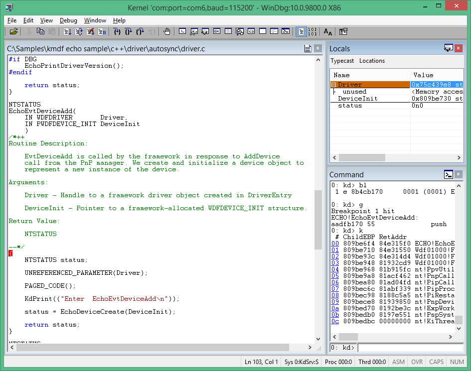

12. Step through the code line-by-line by typing the **p** command or pressing F10 until you reach the following end of the [*AddDevice*](https://msdn.microsoft.com/library/windows/hardware/ff540521) routine. The Brace character “}” will be highlighted as shown.

    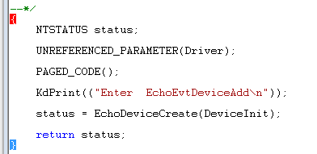

13. In the next section, we will examine the state of the variables after the DeviceAdd code has executed.

**Note**  
**Modifying breakpoint state**

You can modify existing breakpoints by using the following commands:

<table>
<colgroup>
<col width="50%" />
<col width="50%" />
</colgroup>
<tbody>
<tr class="odd">
<td align="left"><p>bl</p></td>
<td align="left"><p>Lists breakpoints.</p></td>
</tr>
<tr class="even">
<td align="left"><p>bc</p></td>
<td align="left"><p>Clears a breakpoint from the list. Use bc * to clear all breakpoints.</p></td>
</tr>
<tr class="odd">
<td align="left"><p>bd</p></td>
<td align="left"><p>Disables a breakpoint. Use bd * to disable all breakpoints.</p></td>
</tr>
<tr class="even">
<td align="left"><p>be</p></td>
<td align="left"><p>Enables a breakpoint. Use be * to enable all breakpoints.</p></td>
</tr>
</tbody>
</table>


Alternatively, you can also modify breakpoints by clicking **edit** &gt; **breakpoints** in WinDbg. Note that the breakpoint dialog box only works with existing breakpoints. New breakpoints must be set from the command line.


**Note**  
**Setting memory access breakpoints**

You can also set breakpoints that fire when a memory location is accessed. Use the **ba** (break on access) command, with the following syntax.

```dbgcmd
ba <access> <size> <address> {options}
```

<table>
<colgroup>
<col width="50%" />
<col width="50%" />
</colgroup>
<thead>
<tr class="header">
<th align="left">Option</th>
<th align="left">Description</th>
</tr>
</thead>
<tbody>
<tr class="odd">
<td align="left"><p>e</p></td>
<td align="left"><p>execute (when CPU fetches an instruction from the address)</p></td>
</tr>
<tr class="even">
<td align="left"><p>r</p></td>
<td align="left"><p>read/write (when CPU reads or writes to the address)</p></td>
</tr>
<tr class="odd">
<td align="left"><p>w</p></td>
<td align="left"><p>write (when the CPU writes to the address)</p></td>
</tr>
</tbody>
</table>


Note that you can only set four data breakpoints at any given time and it is up to you to make sure that you are aligning your data correctly or you won’t trigger the breakpoint (words must end in addresses divisible by 2, dwords must be divisible by 4, and quadwords by 0 or 8).

For example, to set a read/write breakpoint on a specific memory address, you could use a command like this.

```dbgcmd
ba r 4 0x0003f7bf0
```


**Note**  
**Stepping through code from the Debugger Command window**

The following are the commands that you can use to step through your code (with the associated keyboard short cuts shown in parentheses).

-   Break in (Ctrl+Break) - This command will interrupt a system as long as the system is running and is in communication with WinDbg (the sequence in the Kernel Debugger is Ctrl+C).

-   Run to cursor (F7 or Ctrl+F10) – Place the cursor in a source or disassembly window where you want the execution to break, then press F7; code execution will run to that point. Note that if the flow of code execution does not reach the point indicated by the cursor (an IF statement isn't executed), WinDbg would not break, because the code execution did not reach the indicated point.

-   Run (F5) – Run until a breakpoint is encountered or an event like a bug check occurs.

-   Step over (F10) – This command causes code execution to proceed one statement or one instruction at a time. If a call is encountered, code execution passes over the call without entering the called routine. (If the programming language is C or C++ and WinDbg is in source mode, source mode can be turned on or off using **Debug**&gt;**Source Mode**).

-   Step in (F11) – This command is like step-over, except that the execution of a call does go into the called routine.

-   Step out (Shift+F11) – This command causes execution to run to and exit from the current routine (current place in the call stack). This is useful if you've seen enough of the routine.


For more information, see [Source Code Debugging in WinDbg](source-window.md) in the debugging reference documentation.

## <span id="ViewingVariables"></span><span id="viewingvariables"></span><span id="VIEWINGVARIABLES"></span>Section 8: Viewing variables and call stacks

*In Section 8, you will display information about variables and call stacks.*

This lab assumes that you are stopped at the [*AddDevice*](https://msdn.microsoft.com/library/windows/hardware/ff540521) routine using the process described earlier. To view the output show here, repeat the steps described previously, if necessary.

**&lt;- On the host system**

**Display variables**

Use the **view**&gt; **local** menu item to display local variables.

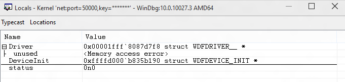

**Global variables**

You can find the location of a global variable address by typing *? &lt;variable name&gt;*.

**Local variables**

You can display the names and values of all local variables for a given frame by typing the **dv** command.

```dbgcmd
0: kd> dv
         Driver = 0x00001fff`7ff9c838
     DeviceInit = 0xffffd001`51978190
         status = 0n0
```

**Callstacks**

**Note**  
The call stack is the chain of function calls that have led to the current location of the program counter. The top function on the call stack is the current function, and the next function is the function that called the current function, and so on.

To display the call stack, use the k\* commands.

<table>
<colgroup>
<col width="50%" />
<col width="50%" />
</colgroup>
<tbody>
<tr class="odd">
<td align="left"><p>kb</p></td>
<td align="left"><p>Displays the stack and first three parameters.</p></td>
</tr>
<tr class="even">
<td align="left"><p>kp</p></td>
<td align="left"><p>Displays the stacks and the full list of parameters.</p></td>
</tr>
<tr class="odd">
<td align="left"><p>kn</p></td>
<td align="left"><p>Allows you to see the stack with the frame information next to it.</p></td>
</tr>
</tbody>
</table>


**&lt;-On the host system**

1. If you want to keep the call stack available, you can click **view** &gt; **call stack** to view it. Click on the columns at the top of the window to toggle the display of additional information.

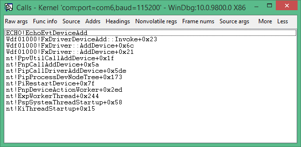

2. Use the **kn** command to show the call stack while debugging the sample adapter code in a break state.

```dbgcmd
3: kd> kn
# Child-SP          RetAddr           Call Site
00 ffffd001`51978110 fffff801`0942f55b ECHO!EchoEvtDeviceAdd+0x66 [c:\Samples\kmdf echo sample\c++\driver\autosync\driver.c @ 138]
01 (Inline Function) --------`-------- Wdf01000!FxDriverDeviceAdd::Invoke+0x30 [d:\wbrtm\minkernel\wdf\framework\shared\inc\private\common\fxdrivercallbacks.hpp @ 61]
02 ffffd001`51978150 fffff801`eed8097d Wdf01000!FxDriver::AddDevice+0xab [d:\wbrtm\minkernel\wdf\framework\shared\core\km\fxdriverkm.cpp @ 72]
03 ffffd001`51978570 fffff801`ef129423 nt!PpvUtilCallAddDevice+0x35 [d:\9142\minkernel\ntos\io\pnpmgr\verifier.c @ 104]
04 ffffd001`519785b0 fffff801`ef0c4112 nt!PnpCallAddDevice+0x63 [d:\9142\minkernel\ntos\io\pnpmgr\enum.c @ 7397]
05 ffffd001`51978630 fffff801`ef0c344f nt!PipCallDriverAddDevice+0x6e2 [d:\9142\minkernel\ntos\io\pnpmgr\enum.c @ 3390]
...
```

The call stack shows that the kernel (nt) called into Plug and Play code (PnP), that called driver framework code (WDF) that subsequently called the echo driver **DeviceAdd** function.

## <span id="DisplayingProcessesAndThreads"></span><span id="displayingprocessesandthreads"></span><span id="DISPLAYINGPROCESSESANDTHREADS"></span>Section 9: Displaying processes and threads

### <span id="Processes"></span><span id="processes"></span><span id="PROCESSES"></span>Processes

*In Section 9, you will display information about the process and threads running in kernel mode.*

**Note**  
You can display or set process information by using the [**!process**](-process.md) debugger extension. We will set a breakpoint to examine the process that are used when a sound is played.


1. **&lt;- On the host system**

   Type the **dv** command to examine the locale variables associated with the **EchoEvtIo** routine as shown.

   ```dbgcmd
   0: kd> dv ECHO!EchoEvtIo*
   ECHO!EchoEvtIoQueueContextDestroy
   ECHO!EchoEvtIoWrite
   ECHO!EchoEvtIoRead         
   ```

2. Clear the previous breakpoints using **bc \\***.

   ```dbgcmd
   0: kd> bc *  
   ```

3. 3. Set a symbol breakpoint on the **EchoEvtIo** routines using the following command.

   ```dbgcmd
   0: kd> bm ECHO!EchoEvtIo*
     2: aade5490          @!”ECHO!EchoEvtIoQueueContextDestroy”
     3: aade55d0          @!”ECHO!EchoEvtIoWrite”
     4: aade54c0          @!”ECHO!EchoEvtIoRead”
   ```

4. List the breakpoints to confirm that the breakpoint is set properly.

   ```dbgcmd
   0: kd> bl
   1 e aabf0490 [c:\Samples\kmdf echo sample\c++\driver\autosync\queue.c @ 197]    0001 (0001) ECHO!EchoEvtIoQueueContextDestroy
   ...
   ```

5. Type **g** to restart code execution.

   ```dbgcmd
   0: kd> g
   ```

6. **-&gt; On the target system**

   Run the EchoApp.exe driver test program on the target system.

7. **&lt;- On the host system**

   When the test app runs, the I/O routine in the driver will be called. This will cause the breakpoint to fire, and execution of the driver code on the target system will halt.

   ```dbgcmd
   Breakpoint 2 hit
   ECHO!EchoEvtIoWrite:
   fffff801`0bf95810 4c89442418      mov     qword ptr [rsp+18h],r8
   ```

8. Use the **!process** command to display the current process that is involved in running echoapp.exe.

   ```dbgcmd
   0: kd> !process
   PROCESS ffffe0007e6a7780
       SessionId: 1  Cid: 03c4    Peb: 7ff7cfec4000  ParentCid: 0f34
       DirBase: 1efd1b000  ObjectTable: ffffc001d77978c0  HandleCount:  34.
       Image: echoapp.exe
       VadRoot ffffe000802c79f0 Vads 30 Clone 0 Private 135. Modified 5. Locked 0.
       DeviceMap ffffc001d83c6e80
       Token                             ffffc001cf270050
       ElapsedTime                       00:00:00.052
       UserTime                          00:00:00.000
       KernelTime                        00:00:00.000
       QuotaPoolUsage[PagedPool]         33824
       QuotaPoolUsage[NonPagedPool]      4464
       Working Set Sizes (now,min,max)  (682, 50, 345) (2728KB, 200KB, 1380KB)
       PeakWorkingSetSize                652
       VirtualSize                       16 Mb
       PeakVirtualSize                   16 Mb
       PageFaultCount                    688
       MemoryPriority                    BACKGROUND
       BasePriority                      8
       CommitCharge                      138

           THREAD ffffe00080e32080  Cid 03c4.0ec0  Teb: 00007ff7cfece000 Win32Thread: 0000000000000000 RUNNING on processor 1
   ```

   The output shows that the process is associated with the echoapp.exe which was running when our breakpoint on the driver write event was hit. For more information, see [**!process**](-process.md).

9. Use the **!process 0 0** to display summary information for all processes. In the output, use CTRL+F to locate the same process address for the process associated with the echoapp.exe image. In the example shown below, the process address is ffffe0007e6a7780.

   ```dbgcmd
   ...

   PROCESS ffffe0007e6a7780
       SessionId: 1  Cid: 0f68    Peb: 7ff7cfe7a000  ParentCid: 0f34
       DirBase: 1f7fb9000  ObjectTable: ffffc001cec82780  HandleCount:  34.
       Image: echoapp.exe

   ...
   ```

10. Record the process ID associated with echoapp.exe to use later in this lab. You can also use CTRL+C, to copy the address to the copy buffer for later use.

    \_\_\_\_\_\_\_\_\_\_\_\_\_\_\_\_\_\_\_\_\_\_\_\_\_\_\_\_\_\_\_\_\_\_\_\_\_\_\_\_\_\_\_\_\_\_\_\_\_\_\_\_\_(echoapp.exe process address)

11. Enter **g** as required into the debugger to run the code forward until the echoapp.exe finishes running. It will hit the breakpoint in the read and write event a number of times. When echoapp.exe finishes, break in to the debugger, by pressing CTRL+ScrLk (Ctrl+Break).

12. Use the **!process** command to confirm that you are now running a different process. In the output shown below, the process with the Image value of *System* is different from the *Echo* Image value.

    ```dbgcmd
    1: kd> !process
    PROCESS ffffe0007b65d900
        SessionId: none  Cid: 0004    Peb: 00000000  ParentCid: 0000
        DirBase: 001ab000  ObjectTable: ffffc001c9a03000  HandleCount: 786.
        Image: System
        VadRoot ffffe0007ce45930 Vads 14 Clone 0 Private 22. Modified 131605. Locked 64.
        DeviceMap ffffc001c9a0c220
        Token                             ffffc001c9a05530
        ElapsedTime                       21:31:02.516
    ...
    ```

    The output above shows that a system process ffffe0007b65d900 was running, when we stopped the OS.

13. Now, use the **!process** command to try to look at the process ID that had been associated with echoapp.exe that you recorded earlier. Provide your echoapp.exe process address that you recorded earlier, instead of the example process address shown below.

    ```dbgcmd
    0: kd> !process ffffe0007e6a7780
    TYPE mismatch for process object at 82a9acc0
    ```

    The process object is no longer available, as the echoapp.exe process is no longer running.

### <span id="Threads"></span><span id="threads"></span><span id="THREADS"></span>Threads

**Note**  
The commands to view and set threads are very similar to those of processes. Use the [**!thread**](-thread.md) command to view threads. Use [**.thread**](-thread--set-register-context-.md) to set the current threads.


1.  **&lt;- On the host system**

    Enter **g** into the debugger to restart code execution on the target system.

2.  **-&gt; On the target system**

    Run the EchoApp.exe driver test program on the target system.

3.  **&lt;- On the host system**

    The breakpoint will be hit and code execution will halt.

    ```dbgcmd
    Breakpoint 4 hit
    ECHO!EchoEvtIoRead:
    aade54c0 55              push    ebp
    ```

4.  To view the threads that are running, type [**!thread**](-thread.md). Information similar to the following should be displayed:

    ```dbgcmd
    0: kd>  !thread
    THREAD ffffe000809a0880  Cid 0b28.1158  Teb: 00007ff7d00dd000 Win32Thread: 0000000000000000 RUNNING on processor 0
    IRP List:
        ffffe0007bc5be10: (0006,01f0) Flags: 00060a30  Mdl: 00000000
    Not impersonating
    DeviceMap                 ffffc001d83c6e80
    Owning Process            ffffe0008096c900       Image:         echoapp.exe
    ...
    ```

    Note the image name of *echoapp.exe*, indicating that we are looking at the thread associated with the test app.

5.  4. Use the **!process** command to determine if this is the only thread running in the process associated with echoapp.exe. Note that the thread number of the running thread in the process is the same thread running that the !thread command displayed.

    ```dbgcmd
    0: kd> !process
    PROCESS ffffe0008096c900
        SessionId: 1  Cid: 0b28    Peb: 7ff7d00df000  ParentCid: 0f34
        DirBase: 1fb746000  ObjectTable: ffffc001db6b52c0  HandleCount:  34.
        Image: echoapp.exe
        VadRoot ffffe000800cf920 Vads 30 Clone 0 Private 135. Modified 8. Locked 0.
        DeviceMap ffffc001d83c6e80
        Token                             ffffc001cf5dc050
        ElapsedTime                       00:00:00.048
        UserTime                          00:00:00.000
        KernelTime                        00:00:00.000
        QuotaPoolUsage[PagedPool]         33824
        QuotaPoolUsage[NonPagedPool]      4464
        Working Set Sizes (now,min,max)  (681, 50, 345) (2724KB, 200KB, 1380KB)
        PeakWorkingSetSize                651
        VirtualSize                       16 Mb
        PeakVirtualSize                   16 Mb
        PageFaultCount                    686
        MemoryPriority                    BACKGROUND
        BasePriority                      8
        CommitCharge                      138

            THREAD ffffe000809a0880  Cid 0b28.1158  Teb: 00007ff7d00dd000 Win32Thread: 0000000000000000 RUNNING on processor 0
    ```

6.  Use the **!process 0 0 command** to locate the process address of two related processes and record those process address here.

    Cmd.exe: \_\_\_\_\_\_\_\_\_\_\_\_\_\_\_\_\_\_\_\_\_\_\_\_\_\_\_\_\_\_\_\_\_\_\_\_\_\_\_\_\_\_\_\_\_\_\_\_\_\_\_\_\_\_\_\_\_\_\_\_

    EchoApp.exe: \_\_\_\_\_\_\_\_\_\_\_\_\_\_\_\_\_\_\_\_\_\_\_\_\_\_\_\_\_\_\_\_\_\_\_\_\_\_\_\_\_\_\_\_\_\_\_\_\_\_\_\_\_\_\_

    ```dbgcmd
    0: kd> !process 0 0 

    …

    PROCESS ffffe0007bbde900
        SessionId: 1  Cid: 0f34    Peb: 7ff72dfa7000  ParentCid: 0c64
        DirBase: 19c5fa000  ObjectTable: ffffc001d8c2f300  HandleCount:  31.
        Image: cmd.exe
    …
    PROCESS ffffe0008096c900
        SessionId: 1  Cid: 0b28    Peb: 7ff7d00df000  ParentCid: 0f34
        DirBase: 1fb746000  ObjectTable: ffffc001db6b52c0  HandleCount:  34.
        Image: echoapp.exe
    …
    ```

    **Note**  You can alternatively use **!process 0 17** to display detailed information about every process. The output from this command can be lengthy. The output can be searched using Ctrl+F.


7.  Use the **!process** command to list process information for both processes running your PC. Provide the process address from your **!process 0 0** output, not the address shown below.

    This example output is for the cmd.exe process ID that was recorded earlier. Note that the image name for this process ID is cmd.exe.

    ```dbgcmd
    0: kd>  !process ffffe0007bbde900
    PROCESS ffffe0007bbde900
        SessionId: 1  Cid: 0f34    Peb: 7ff72dfa7000  ParentCid: 0c64
        DirBase: 19c5fa000  ObjectTable: ffffc001d8c2f300  HandleCount:  31.
        Image: cmd.exe
        VadRoot ffffe0007bb8e7b0 Vads 25 Clone 0 Private 117. Modified 20. Locked 0.
        DeviceMap ffffc001d83c6e80
        Token                             ffffc001d8c48050
        ElapsedTime                       21:33:05.840
        UserTime                          00:00:00.000
        KernelTime                        00:00:00.000
        QuotaPoolUsage[PagedPool]         24656
        QuotaPoolUsage[NonPagedPool]      3184
        Working Set Sizes (now,min,max)  (261, 50, 345) (1044KB, 200KB, 1380KB)
        PeakWorkingSetSize                616
        VirtualSize                       2097164 Mb
        PeakVirtualSize                   2097165 Mb
        PageFaultCount                    823
        MemoryPriority                    FOREGROUND
        BasePriority                      8
        CommitCharge                      381

            THREAD ffffe0007cf34880  Cid 0f34.0f1c  Teb: 00007ff72dfae000 Win32Thread: 0000000000000000 WAIT: (UserRequest) UserMode Non-Alertable
                ffffe0008096c900  ProcessObject
            Not impersonating
    ...
    ```

    This example output is for the echoapp.exe process ID that was recorded earlier.

    ```dbgcmd
    0: kd>  !process ffffe0008096c900
    PROCESS ffffe0008096c900
        SessionId: 1  Cid: 0b28    Peb: 7ff7d00df000  ParentCid: 0f34
        DirBase: 1fb746000  ObjectTable: ffffc001db6b52c0  HandleCount:  34.
        Image: echoapp.exe
        VadRoot ffffe000800cf920 Vads 30 Clone 0 Private 135. Modified 8. Locked 0.
        DeviceMap ffffc001d83c6e80
        Token                             ffffc001cf5dc050
        ElapsedTime                       00:00:00.048
        UserTime                          00:00:00.000
        KernelTime                        00:00:00.000
        QuotaPoolUsage[PagedPool]         33824
        QuotaPoolUsage[NonPagedPool]      4464
        Working Set Sizes (now,min,max)  (681, 50, 345) (2724KB, 200KB, 1380KB)
        PeakWorkingSetSize                651
        VirtualSize                       16 Mb
        PeakVirtualSize                   16 Mb
        PageFaultCount                    686
        MemoryPriority                    BACKGROUND
        BasePriority                      8
        CommitCharge                      138

            THREAD ffffe000809a0880  Cid 0b28.1158  Teb: 00007ff7d00dd000 Win32Thread: 0000000000000000 RUNNING on processor 0
            IRP List:
                ffffe0007bc5be10: (0006,01f0) Flags: 00060a30  Mdl: 00000000
            Not impersonating
    ...
    ```

8.  Record the first thread address associated with the two processes here.

    Cmd.exe: \_\_\_\_\_\_\_\_\_\_\_\_\_\_\_\_\_\_\_\_\_\_\_\_\_\_\_\_\_\_\_\_\_\_\_\_\_\_\_\_\_\_\_\_\_\_\_\_\_\_\_\_

    EchoApp.exe: \_\_\_\_\_\_\_\_\_\_\_\_\_\_\_\_\_\_\_\_\_\_\_\_\_\_\_\_\_\_\_\_\_\_\_\_\_\_\_\_\_\_\_\_\_\_\_\_\_

9.  Use the **!Thread** command to display information about the current thread.

    ```dbgcmd
    0: kd>  !Thread
    THREAD ffffe000809a0880  Cid 0b28.1158  Teb: 00007ff7d00dd000 Win32Thread: 0000000000000000 RUNNING on processor 0
    IRP List:
        ffffe0007bc5be10: (0006,01f0) Flags: 00060a30  Mdl: 00000000
    Not impersonating
    DeviceMap                 ffffc001d83c6e80
    Owning Process            ffffe0008096c900       Image:         echoapp.exe
    Attached Process          N/A            Image:         N/A
    ...
    ```

    As expected, the current thread is the thread associated with echoapp.exe and it is in a running state.

10. Use the **!Thread** command to display information about the thread associated with cmd.exe process. Provide the thread address you recorded earlier.

    ```dbgcmd
    0: kd> !Thread ffffe0007cf34880
    THREAD ffffe0007cf34880  Cid 0f34.0f1c  Teb: 00007ff72dfae000 Win32Thread: 0000000000000000 WAIT: (UserRequest) UserMode Non-Alertable
        ffffe0008096c900  ProcessObject
    Not impersonating
    DeviceMap                 ffffc001d83c6e80
    Owning Process            ffffe0007bbde900       Image:         cmd.exe
    Attached Process          N/A            Image:         N/A
    Wait Start TickCount      4134621        Ticks: 0
    Context Switch Count      4056           IdealProcessor: 0             
    UserTime                  00:00:00.000
    KernelTime                00:00:01.421
    Win32 Start Address 0x00007ff72e9d6e20
    Stack Init ffffd0015551dc90 Current ffffd0015551d760
    Base ffffd0015551e000 Limit ffffd00155518000 Call 0
    Priority 14 BasePriority 8 UnusualBoost 3 ForegroundBoost 2 IoPriority 2 PagePriority 5
    Child-SP          RetAddr           : Args to Child                                                           : Call Site
    ffffd001`5551d7a0 fffff801`eed184fe : fffff801`eef81180 ffffe000`7cf34880 00000000`fffffffe 00000000`fffffffe : nt!KiSwapContext+0x76 [d:\9142\minkernel\ntos\ke\amd64\ctxswap.asm @ 109]
    ffffd001`5551d8e0 fffff801`eed17f79 : ffff03a5`ca56a3c8 000000de`b6a6e990 000000de`b6a6e990 00007ff7`d00df000 : nt!KiSwapThread+0x14e [d:\9142\minkernel\ntos\ke\thredsup.c @ 6347]
    ffffd001`5551d980 fffff801`eecea340 : ffffd001`5551da18 00000000`00000000 00000000`00000000 00000000`00000388 : nt!KiCommitThreadWait+0x129 [d:\9142\minkernel\ntos\ke\waitsup.c @ 619]
    ...
    ```

    This thread is associated with cmd.exe and is in a wait state.

11. Provide the thread address of the waiting CMD.exe thread to change the context to that waiting thread.

    ```dbgcmd
    0: kd> .Thread ffffe0007cf34880
    Implicit thread is now ffffe000`7cf34880
    ```

12. Use the **k** command to view the call stack associated with the waiting thread.

    ```dbgcmd
    0: kd> k
      *** Stack trace for last set context - .thread/.cxr resets it
    # Child-SP          RetAddr           Call Site
    00 ffffd001`5551d7a0 fffff801`eed184fe nt!KiSwapContext+0x76 [d:\9142\minkernel\ntos\ke\amd64\ctxswap.asm @ 109]
    01 ffffd001`5551d8e0 fffff801`eed17f79 nt!KiSwapThread+0x14e [d:\9142\minkernel\ntos\ke\thredsup.c @ 6347]
    02 ffffd001`5551d980 fffff801`eecea340 nt!KiCommitThreadWait+0x129 [d:\9142\minkernel\ntos\ke\waitsup.c @ 619]
    03 ffffd001`5551da00 fffff801`ef02e642 nt!KeWaitForSingleObject+0x2c0 [d:\9142\minkernel\ntos\ke\wait.c @ 683]
    ...
    ```

    Call stack elements such as **KiCommitThreadWait** indicate that this thread is not running as is expected.

**Note**  
For more information about threads and processes, see the following references:

[Threads and Processes](threads-and-processes.md)

[Changing Contexts](changing-contexts.md)


## <span id="Section_10__IRQL__Registers_and_Ending_the_WinDbg_session"></span><span id="section_10__irql__registers_and_ending_the_windbg_session"></span><span id="SECTION_10__IRQL__REGISTERS_AND_ENDING_THE_WINDBG_SESSION"></span>Section 10: IRQL, Registers and Ending the WinDbg session

### <span id="IRQLRegistersMemory"></span><span id="irqlregistersmemory"></span><span id="IRQLREGISTERSMEMORY"></span>Viewing the saved IRQL

*In Section 10, you will display the IRQL, and the contents of the regsisters.*

**&lt;- On the host system**

The interrupt request level (IRQL) is used to manage the priority of interrupt servicing. Each processor has an IRQL setting that threads can raise or lower. Interrupts that occur at or below the processor's IRQL setting are masked and will not interfere with the current operation. Interrupts that occur above the processor's IRQL setting take precedence over the current operation. The [**!irql**](-irql.md) extension displays the interrupt request level (IRQL) on the current processor of the target computer before the debugger break occurred. When the target computer breaks into the debugger, the IRQL changes, but the IRQL that was effective just before the debugger break is saved and is displayed by **!irql**.

```dbgcmd
0: kd> !irql
Debugger saved IRQL for processor 0x0 -- 2 (DISPATCH_LEVEL)
```

### <span id="ViewingTheRegisters"></span><span id="viewingtheregisters"></span><span id="VIEWINGTHEREGISTERS"></span>Viewing the registers

**&lt;-On the host system**

Display the contents of the registers for the current thread on the current processor by using the [**r (Registers)**](r--registers-.md) command.

```dbgcmd
0: kd> r
rax=000000000000c301 rbx=ffffe00173eed880 rcx=0000000000000001
rdx=000000d800000000 rsi=ffffe00173eed8e0 rdi=ffffe00173eed8f0
rip=fffff803bb757020 rsp=ffffd001f01f8988 rbp=ffffe00173f0b620
 r8=000000000000003e  r9=ffffe00167a4a000 r10=000000000000001e
r11=ffffd001f01f88f8 r12=0000000000000000 r13=ffffd001f01efdc0
r14=0000000000000001 r15=0000000000000000
iopl=0         nv up ei pl nz na pe nc
cs=0010  ss=0018  ds=002b  es=002b  fs=0053  gs=002b             efl=00000202
nt!DbgBreakPointWithStatus:
fffff803`bb757020 cc              int     3
```

Alternatively, you can display the contents of the registers by clicking **view** &gt; **registers**. For more information see [**r (Registers)**](r--registers-.md).

Viewing the contents of the registers can be helpful when stepping through assembly language code execution and in other scenarios. For more information about assembly language disassembly, see [Annotated x86 Disassembly](annotated-x86-disassembly.md) and [Annotated x64 Disassembly](annotated-x64-disassembly.md).

For information about contents of the register, see [x86 Architecture](x86-architecture.md) and [x64 Architecture](x64-architecture.md).

### <span id="EndingTheSession"></span><span id="endingthesession"></span><span id="ENDINGTHESESSION"></span>Ending the WinDbg session

**&lt;-On the host system**

To end a user-mode debugging session, return the debugger to dormant mode, and set the target application to run again, enter the **qd** (Quit and Detach) command.

Be sure and use the **g** command to let the target computer run code, so that it can be used. It also a good idea to clear any break points using **bc \\***, so that the target computer won't break and try to connect to the host computer debugger.

```dbgcmd
0: kd> qd
```

For more information, see [Ending a Debugging Session in WinDbg](ending-a-debugging-session-in-windbg.md) in the debugging reference documentation.

## <span id="WindowsDebuggingResources"></span><span id="windowsdebuggingresources"></span><span id="WINDOWSDEBUGGINGRESOURCES"></span>Section 11: Windows debugging resources


Additional information is available on Windows debugging. Note that some of these books will use older versions of Windows such as Windows Vista in their examples, but the concepts discussed are applicable to most versions of Windows.

**Books**

-   Advanced Windows Debugging by Mario Hewardt and Daniel Pravat

-   Inside Windows Debugging: A Practical Guide to Debugging and Tracing Strategies in Windows® by Tarik Soulami

-   Windows Internals by Mark E. Russinovich, David A. Solomon and Alex Ionescu

**Video**

The Defrag Tools Show WinDbg Episodes 13-29 <https://channel9.msdn.com/Shows/Defrag-Tools>

**Training Vendors:**

OSR <https://www.osr.com/>

## <span id="related_topics"></span>Related topics


[Standard Debugging Techniques](standard-debugging-techniques.md)

[Specialized Debugging Techniques](specialized-debugging-techniques.md)

[Getting Started with Windows Debugging](getting-started-with-windows-debugging.md)


