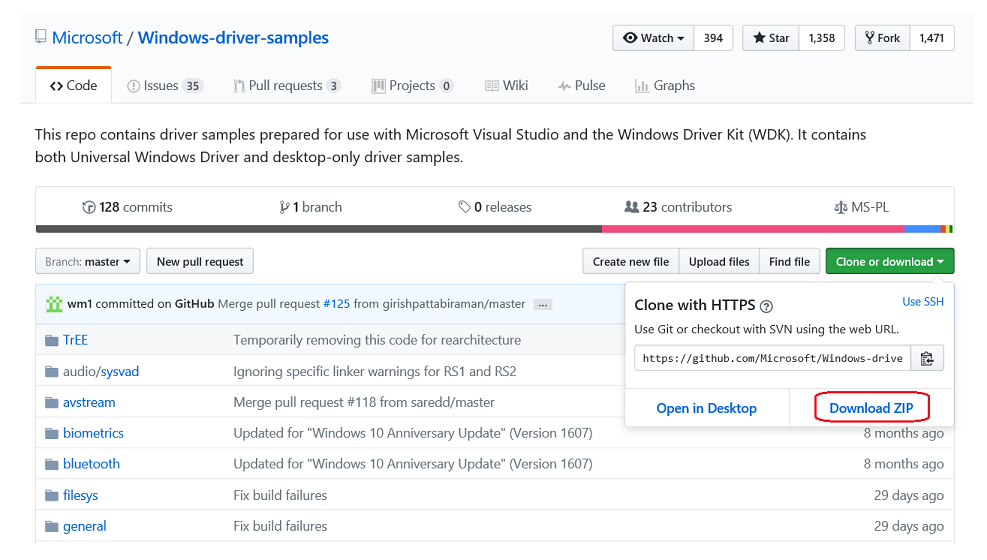
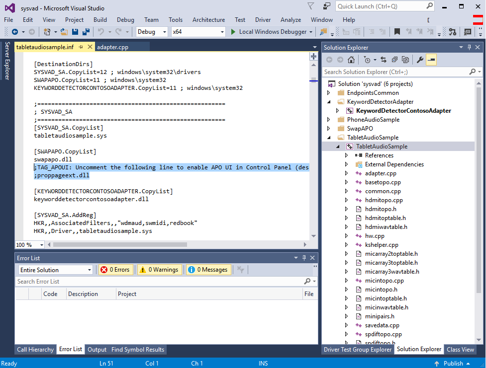
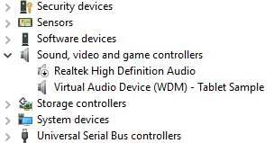
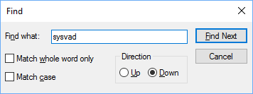
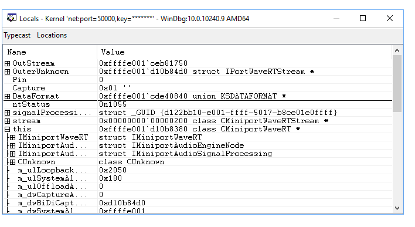
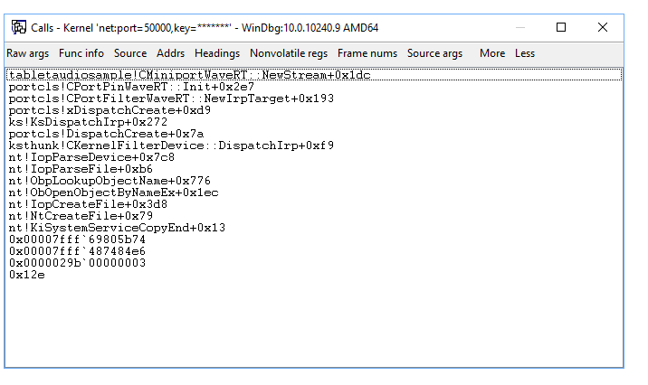
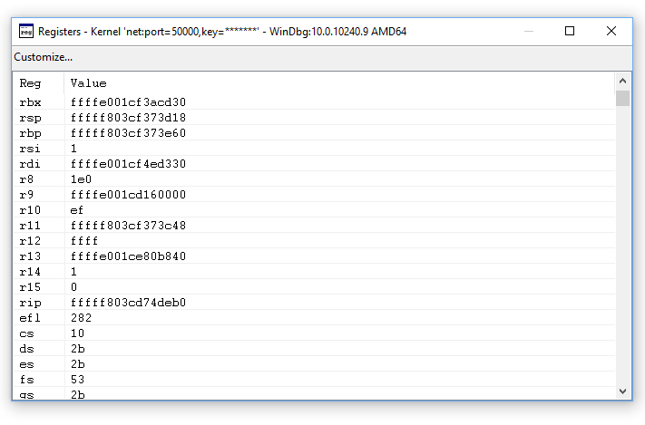
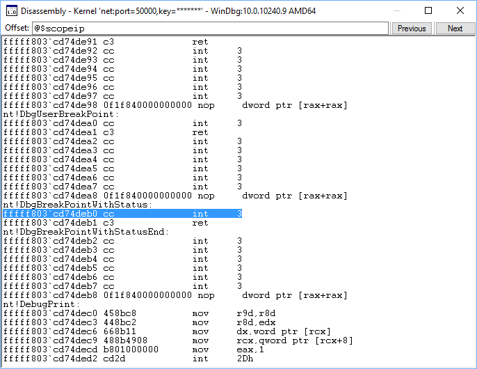
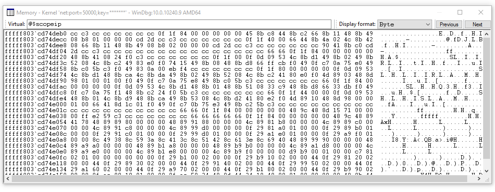

# <span id="debugger.debug_universal_drivers__kernel-mode_"></span>Debug Drivers - Step by Step Lab (Sysvad Kernel Mode)

This lab provides hands-on exercises that demonstrate how to debug the Sysvad audio kernel-mode device driver.

Microsoft Windows Debugger (WinDbg) is a powerful Windows-based debugging tool that you can use to perform user-mode and kernel-mode debugging. WinDbg provides source-level debugging for the Windows kernel, kernel-mode drivers, and system services, as well as user-mode applications and drivers.

WinDbg can step through source code, set breakpoints, view variables (including C++ objects), stack traces, and memory. Its Debugger Command window allows the user to issue a wide variety of commands.

## <span id="lab_setup"></span>Lab setup

You will need the following hardware to be able to complete the lab:

-   A laptop or desktop computer (host) running Windows 10
-   A laptop or desktop computer (target) running Windows 10
-   A network hub/router and network cables to connect the two PCs
-   Access to the internet to download symbol files

You will need the following software to be able to complete the lab.

-   Microsoft Visual Studio 2017
-   Windows Software Development Kit (SDK) for Windows 10
-   Windows Driver Kit (WDK) for Windows 10
-   The sample Sysvad audio driver for Windows 10

For information on downloading and installing the WDK, see [Download the Windows Driver Kit (WDK)](https://developer.microsoft.com/windows/hardware/windows-driver-kit).

## <span id="sysvad_debugging_walkthrough_overview"></span>Sysvad debugging walkthrough


This lab walk you through the process of debugging a kernel-mode driver. The exercises use the Syvad virtual audio driver sample. Because the Syvad audio driver doesn't interact with actual audio hardware, it can be used on most devices. The lab covers the following tasks:

-   [Section 1: Connect to a kernel-mode WinDbg session](#connectto)
-   [Section 2: kernel-mode debugging commands and techniques](#kernelmodedebuggingcommandsandtechniques)
-   [Section 3: Download and build the Sysvad audio driver](#download)
-   [Section 4: Install the Sysvad audio driver on the target system](#install)
-   [Section 5: Use WinDbg to display information about the driver](#usewindbgtodisplayinformation)
-   [Section 6: Display Plug and Play device tree information](#displayingtheplugandplaydevicetree)
-   [Section 7: Work with breakpoints and source code](#workingwithbreakpoints)
-   [Section 8: Look at variables](#lookingatvariables)
-   [Section 9: View call stacks](#viewingcallstacks)
-   [Section 10: Display processes and threads](#displayingprocessesandthreads)
-   [Section 11: IRQL, registers and disassembly](#irqlregistersmemory)
-   [Section 12: Work with memory](#workingwithmemory)
-   [Section 13: Ending the WinDbg session](#endingthesession)
-   [Section 14: Windows debugging resources](#windowsdebuggingresources)

## <span id="echo_driver_lab"></span>Echo driver lab


The Echo driver is a simpler driver then the Sysvad audio driver. If you are new to WinDbg, you may want to consider first completing the [Debug Universal Drivers - Step-by-Step Lab (Echo kernel mode)](debug-universal-drivers---step-by-step-lab--echo-kernel-mode-.md). This lab reuses the setup directions from that lab, so if you have completed that lab you can skip sections 1 and 2 here.

## <span id="connectto"></span>Section 1: Connect to a kernel-mode WinDbg session


*In Section 1, you will configure network debugging on the host and target system.*

The PCs in this lab need to be configured to use an Ethernet network connection for kernel debugging.

This lab uses two computers. WinDbg runs on the *host* system and the Sysvad driver runs on the *target* system.

 Use a network hub/router and network cables to connect the two PCs.


To work with kernel-mode applications and use WinDbg, we recommend that you use the KDNET over Ethernet transport. For information about how to use the Ethernet transport protocol, see [Getting Started with WinDbg (Kernel-Mode)](getting-started-with-windbg--kernel-mode-.md). For more information about setting up the target computer, see [Preparing a Computer for Manual Driver Deployment](https://msdn.microsoft.com/windows-drivers/develop/preparing_a_computer_for_manual_driver_deployment) and [Setting Up KDNET Network Kernel Debugging Automatically](setting-up-a-network-debugging-connection-automatically.md).

### <span id="configure__kernel_mode_debugging_using_ethernet"></span>Configure kernel–mode debugging using ethernet

To enable kernel-mode debugging on the target system, perform the following steps.

**&lt;- On the host system**

1. Open a command prompt on the host system and type **ipconfig /all** to determine its IP address.

```console
C:\>ipconfig /all
Windows IP Configuration

 Host Name . . . . . . . . . . . . : TARGETPC
...

Ethernet adapter Ethernet:
   Connection-specific DNS Suffix  . :
   Link-local IPv6 Address . . . . . : fe80::c8b6:db13:d1e8:b13b3
   Autoconfiguration IPv4 Address. . : 169.182.1.1
   Subnet Mask . . . . . . . . . . . : 255.255.0.0
   Default Gateway . . . . . . . . . :
```

2. Record the IP address of the host System: \_\_\_\_\_\_\_\_\_\_\_\_\_\_\_\_\_\_\_\_\_\_\_\_\_\_\_\_\_\_\_\_\_\_\_\_\_\_

3. Record the Host Name of the host System: \_\_\_\_\_\_\_\_\_\_\_\_\_\_\_\_\_\_\_\_\_\_\_\_\_\_\_\_\_\_\_\_\_\_\_\_\_\_

**-&gt; On the target system**

4. Open a command prompt on the target system and use the **ping** command to confirm network connectivity between the two systems. Use the actual IP address of the host system you recorded instead of 169.182.1.1 that is shown in the sample output.

```console
C:\> ping 169.182.1.1

Pinging 169.182.1.1 with 32 bytes of data:
Reply from 169.182.1.1: bytes=32 time=1ms TTL=255
Reply from 169.182.1.1: bytes=32 time<1ms TTL=255
Reply from 169.182.1.1: bytes=32 time<1ms TTL=255
Reply from 169.182.1.1: bytes=32 time<1ms TTL=255

Ping statistics for 169.182.1.1:
    Packets: Sent = 4, Received = 4, Lost = 0 (0% loss),
Approximate round trip times in milli-seconds:
    Minimum = 0ms, Maximum = 1ms, Average = 0ms
```

To use the KDNET utility to enable kernel-mode debugging on the target system, peform the following steps.

1. On the host system, locate the WDK KDNET directory. By default it is located here.

   C:\Program Files (x86)\Windows Kits\10\Debuggers\x64

> [!NOTE]
> This labs assumes that both PCs are running a 64 bit version of Windowson both the target and host. 
> If that is not the case, the best approach is to run the same "bitness" of tools on the host that the target is running. 
For example if the target is running 32 bit Windows, run a 32 version of the debugger on the host. 
> For more information, see [Choosing the 32-Bit or 64-Bit Debugging Tools](choosing-a-32-bit-or-64-bit-debugger-package.md).
> 

2. Locate these two files and copy them to a network share or thumb drive, so that they will be available on the target computer.

    kdnet.exe

    VerifiedNICList.xml


3. On the target computer, open a Command Prompt window as Administrator. Enter this command to validate that the NIC on the target PC is suported.

```console
C:\KDNET>kdnet

Network debugging is supported on the following NICs:
busparams=0.25.0, Intel(R) 82579LM Gigabit Network Connection, KDNET is running on this NIC.kdnet.exe
```

4. Type this command to set the IP address of the host system. Use the actual IP address of the host system you recorded instead of 169.182.1.1 that is shown in the sample output. Pick a unique port address for each target/host pair that you work with, such as 50010.

```console
C:\>kdnet 169.182.1.1 50010

Enabling network debugging on Intel(R) 82577LM Gigabit Network Connection.
Key=2steg4fzbj2sz.23418vzkd4ko3.1g34ou07z4pev.1sp3yo9yz874p
```

> [!IMPORTANT]
> Before using BCDEdit to change boot information you may need to temporarily suspend Windows security features such as BitLocker and Secure Boot on the test PC.
> Re-enable these security features when testing is complete and appropriately manage the test PC, when the security features are disabled.

5. Type this command to confirm that the dbgsettings are set properly.

```console
C:\> bcdedit /dbgsettings
busparams               0.25.0
key                     2steg4fzbj2sz.23418vzkd4ko3.1g34ou07z4pev.1sp3yo9yz874p
debugtype               NET
hostip                  169.182.1.1
port                    50010
dhcp                    Yes
The operation completed successfully.
```

Copy the auto generated unique key into a text file, to avoid having to type it in on the host PC. Copy the text file with the key over to the host system.

**Note**  
**Firewalls and debuggers**

If you receive a pop-up message from the firewall, and you wish to use the debugger, check **all three** of the boxes.


 

**&lt;- On the host system**

1. On the host computer, open a Command Prompt window as Administrator. Change to the WinDbg.exe directory. We will use the x64version of WinDbg.exe from the Windows Driver Kit (WDK) that was installed as part of the Windows kit installation.

```console
C:\> Cd C:\Program Files (x86)\Windows Kits\10\Debuggers\x64 
```

2. Launch WinDbg with remote user debug using the following command. The value for the key and port match what you set earlier using BCDEdit on the target.

```console
C:\> WinDbg –k net:port=50010,key=2steg4fzbj2sz.23418vzkd4ko3.1g34ou07z4pev.1sp3yo9yz874p
```

**-&gt;On the target system**

Reboot the target system.

**&lt;-On the host system**

In a minute or two, debug output should be displayed on the host system.


The Debugger Command window is the primary debugging information window in WinDbg. You can enter debugger commands and view the command output in this window.

The Debugger Command window is split into two panes. You type commands in the smaller pane (the command entry pane) at the bottom of the window and view the command output in the larger pane at the top of the window.

In the command entry pane, use the up arrow and down arrow keys to scroll through the command history. When a command appears, you can edit it or press **ENTER** to run the command.

## <span id="kernelmodedebuggingcommandsandtechniques"></span>Section 2: kernel-mode debugging commands and techniques


*In Section 2, you will use debug commands to display information about the target system.*

**&lt;- On the host system**

**Enable Debugger Markup Language (DML) with .prefer\_dml**

Some debug commands display text using Debugger Markup Language that you can click on to quickly gather more information.

1. Use Ctrl+Break (Scroll Lock) in WinDBg to break into the code running on the target system. It may take a bit of time for the target system to respond.
2. Type the following command to enable DML in the Debugger Command window.

```dbgcmd
0: kd> .prefer_dml 1
DML versions of commands on by default
```

**Use .hh to get help**

You can access reference command help using the **.hh** command.

3. Type the following command to view the command reference help for **.prefer\_dml**.
   ```dbgcmd
   0: kd> .hh .prefer_dml
   ```

The Debugger help file will display help for the **.prefer\_dml** command.


**Display the version of Windows on the target system**

5. Display detailed version information on the target system by typing the [**vertarget (Show Target Computer Version)**](vertarget--show-target-computer-version-.md) command in the WinDbg window.

```dbgcmd
0: kd> vertarget
Windows 10 Kernel Version 9926 MP (4 procs) Free x64
Product: WinNt, suite: TerminalServer SingleUserTS
Built by: 9926.0.amd64fre.fbl_awesome1501.150119-1648
Machine Name: ""
Kernel base = 0xfffff801`8d283000 PsLoadedModuleList = 0xfffff801`8d58aef0
Debug session time: Fri Feb 20 10:15:17.807 2015 (UTC - 8:00)
System Uptime: 0 days 01:31:58.931
```

**List the loaded modules**

6. You can verify that you are working with the right kernel-mode process by displaying the loaded modules by typing the [**lm (List Loaded Modules)**](lm--list-loaded-modules-.md) command in the WinDbg window.

```dbgcmd
0: Kd> lm
start             end                 module name
fffff801`09200000 fffff801`0925f000   volmgrx    (no symbols)           
fffff801`09261000 fffff801`092de000   mcupdate_GenuineIntel   (no symbols)           
fffff801`092de000 fffff801`092ec000   werkernel   (export symbols)       werkernel.sys
fffff801`092ec000 fffff801`0934d000   CLFS       (export symbols)       CLFS.SYS
fffff801`0934d000 fffff801`0936f000   tm         (export symbols)       tm.sys
fffff801`0936f000 fffff801`09384000   PSHED      (export symbols)       PSHED.dll
fffff801`09384000 fffff801`0938e000   BOOTVID    (export symbols)       BOOTVID.dll
fffff801`0938e000 fffff801`093f7000   spaceport   (no symbols)           
fffff801`09400000 fffff801`094cf000   Wdf01000   (no symbols)           
fffff801`094d9000 fffff801`09561000   CI         (export symbols)       CI.dll
...
```

**Note**  Output that has been omitted is indicated with "… " in this lab.

 

Because we have yet to set the symbol path and loaded symbols, limited information is available in the debugger.

## <span id="download"></span>Section 3: Download and build the Sysvad audio driver


*In Section 3, you will download and build the Sysvad audio driver.*

Typically, you would be working with your own driver code when you use WinDbg. To become familiar with debugging audio drivers, the Sysvad virtual audio sample driver is used. This sample is used to illustrate how you can single step through native kernel-mode code. This technique can be very valuable for debugging complex kernel-mode code issues.

To download and build the Sysvad sample audio driver, perform the following steps.

1.  **Download and extract the Sysvad audio sample from GitHub**

    You can use a browser to view the Sysvad sample and Readme.md file here:

    [https://github.com/Microsoft/Windows-driver-samples/tree/master/audio/sysvad](https://github.com/Microsoft/Windows-driver-samples/blob/97cf5197cf5b882b2c689d8dc2b555f2edf8f418/general/echo/kmdf/ReadMe.md)

    

    This lab, shows how to download the universal driver samples in one zip file.

    a. Download the master.zip file to your local hard drive.

    <https://github.com/Microsoft/Windows-driver-samples/archive/master.zip>

    b. Right-click *Windows-driver-samples-master.zip*, and choose **Extract All**. Specify a new folder, or browse to an existing one that will store the extracted files. For example, you could specify *C:\\WDK\_Samples\\* as the new folder into which the files are extracted.

    c. After the files are extracted, navigate to the following subfolder.

    *C:\\WDK\_Samples\\Sysvad*

2.  **Open the driver solution in Visual Studio**

    In Visual Studio, click **File** &gt; **Open** &gt; **Project/Solution...** and navigate to the folder that contains the extracted files (for example, *C:\\WDK\_Samples\\Sysvad*). Double-click the *Syvad* solution file.

    In Visual Studio locate the Solution Explorer. (If this is not already open, choose **Solution Explorer** from the **View** menu.) In Solution Explorer, you can see one solution that has four (4) projects. Note that the project titled SwapAPO is actually a folder that contains two projects - APO and PropPageExtensions.

    

3.  **Set the sample's configuration and platform**

    In Solution Explorer, right-click **Solution 'sysvad' (6 projects)**, and choose **Configuration Manager**. Make sure that the configuration and platform settings are the same for the four projects. By default, the configuration is set to "Win10 Debug", and the platform is set to "Win64" for all the projects. If you make any configuration and/or platform changes for one project, you must make the same changes for the remaining three projects.

    **Note**  This lab assumes that 64 bit Windows is being used. If you are using 32 bit Windows, build the driver for 32 bit.

     

4.  **Check driver signing**

    Locate the TabletAudioSample. Open the Sysvad driver’s property page and make sure **Driver Signing** &gt; **Sign Mode** is set to *Test Sign*.

5.  **Build the sample using Visual Studio**

    In Visual Studio, click **Build** &gt; **Build Solution**.

    The build windows should display a message indicating that the build for all six projects succeeded.

6.  **Locate the built driver files**

    In File Explorer, navigate to the folder that contains the extracted files for the sample. For example, you would navigate to *C:\\WDK\_Samples\\Sysvad*, if that's the folder you specified earlier. Within that folder, the location of the compiled driver files varies depending on the configuration and platform settings that you selected in the **Configuration Manager**. For example, if you left the default settings unchanged, then the compiled driver files will be saved to a folder named *\\x64\\Debug* for a 64-bit, debug build.

    Navigate to the folder that contains the built files for the TabletAudioSample driver:

    *C:\\WDK\_Samples\\Sysvad\\TabletAudioSample\\x64\\Debug*. The folder will contain the TabletAudioSample .SYS driver, symbol pdp file and the inf file. You will also need to locate the SwapAPO, PropPageExt and KeywordDetectorContosoAdapter dlls and symbol files.

    To install the driver, you will need the following files.

    |                                   |                                                                                   |
    |-----------------------------------|-----------------------------------------------------------------------------------|
    | TabletAudioSample.sys             | The driver file.                                                                  |
    | TabletAudioSample.pdb             | The driver symbol file.                                                           |
    | tabletaudiosample.inf             | An information (INF) file that contains information needed to install the driver. |
    | KeywordDetectorContosoAdapter.dl  | A sample keyword detector.                                                        |
    | KeywordDetectorContosoAdapter.pdb | The sample keyword detector symbol file.                                          |
    | lSwapAPO.dll                      | A sample driver extension for a UI to manage APOs.                                |
    | lSwapAPO.pdb                      | The APO UI symbol file.                                                           |
    | PropPageExt.dll                   | A sample driver extension for a property page.                                    |
    | PropPageExt.pdb                   | The property page symbol file.                                                    |
    | TabletAudioSample.cer             | The TabletAudioSample certificate file.                                           |

     

7.  Locate a USB thumb drive or set up a network share to copy the built driver files from the host to the target system.

In the next section, you will copy the code to the target system, and install and test the driver.

## <span id="install"></span>Section 4: Install the Sysvad audio driver sample on the target system


*In Section 4, you will use devcon to install the Sysvad audio driver.*

**-&gt; On the target system**

The computer where you install the driver is called the *target computer* or the *test computer*. Typically, this is a separate computer from the computer on which you develop and build the driver package. The computer where you develop and build the driver is called the *host computer*.

The process of moving the driver package to the target computer and installing the driver is called *deploying* the driver. You can deploy the sample Sysvad driver, automatically or manually.

Before you manually deploy a driver, you must prepare the target computer by turning on test signing. You also need to locate the DevCon tool in your WDK installation. After that you’re ready to run the built driver sample on the target system.

To install the driver on the target system, perform the following steps.

1.  **Enable test signed drivers**

    To enable the ability to run test signed drivers:

    1. Open Windows Settings.

    2. In **Update and Security**, select **Recovery**.

    3. Under **Advanced startup**, click **Restart Now**.

    4. When the PC restarts, select **Troubleshoot**.

    5. Then select **Advanced options**, **Startup Settings** and then click **Restart**.

    6. Select Disable driver signature enforcement by pressing the **F7** key.

    7. The PC will start with the new values in place.

2.  **&lt;- On the host system**

    Navigate to the Tools folder in your WDK installation and locate the DevCon tool. For example, look in the following folder:

    *C:\\Program Files (x86)\\Windows Kits\\10\\Tools\\x64\\devcon.exe*

3.  **-&gt; On the target system**

    **Install the driver**

    The following instructions show you how to install and test the sample driver.

    The INF file required for installing this driver is *TabletAudioSample.inf*. On the target computer, open a Command Prompt window as Administrator. Navigate to your driver package folder, right-click the TabletAudioSample.inf file, and then select **Install**.

    A dialog box will appear indicating that the test driver is an unsigned driver. Click **Install this driver anyway** to proceed.

    

    [!TIP] If you have any issues with the installation, check the following file for more information.
    `%windir%\\inf\\setupapi.dev.log`
 
    For more detailed instructions, see [Configuring a Computer for Driver Deployment, Testing, and Debugging](https://docs.microsoft.com/windows-hardware/drivers/gettingstarted/provision-a-target-computer-wdk-8-1).

    The INF file contains the hardware ID for installing the *tabletaudiosample.sys*. For the Syvad sample, the hardware ID is:
    `root\\sysvad\_TabletAudioSample`

    On the target computer, open a Command Prompt window as Administrator. Navigate to your driver package folder, and enter the following command: `devcon status root\\sysvad\_TabletAudioSample`
       
    Status information is displayed durring the devcon install.


4.  **Examine the driver in Device Manager**

    On the target computer, in a Command Prompt window, enter **devmgmt** to open Device Manager. In Device Manager, on the View menu, select **Devices by type**.

    In the device tree, locate *Virtual Audio Device (WDM) - Tablet Sample* in the Audio Device node. This is typically under the **Sound, video and game controllers** node. Confirm that it is installed and active.

    Highlight the driver for the actual hardware on the PC in Device Manager. Then right-click the driver and click disable to disable the driver.

    Confirm in Device Manager that audio hardware driver, displays the a down arrow, indicating that it is disabled.

    

    After successfully installing the sample driver, you're now ready to test it.

**Test the Sysvad audio driver**

1. On the target computer, in a Command Prompt window, enter **devmgmt** to open Device Manager. In Device Manager, on the **View** menu, select **Devices by type**. In the device tree, locate *Virtual Audio Device (WDM) - Tablet Sample*.

2. Open Control Panel and navigate to **Hardware and Sound** &gt; **Manage audio devices**. In the Sound dialog box, select the speaker icon labeled as *Virtual Audio Device (WDM) - Tablet Sample*, and then click **Set Default**, but do not click **OK**. This will keep the Sound dialog box open.
3. Locate an MP3 or other audio file on the target computer and double-click to play it. Then in the Sound dialog box, verify that there is activity in the volume level indicator associated with the *Virtual Audio Device (WDM) - Tablet Sample* driver.

## <span id="usewindbgtodisplayinformation"></span>Section 5: Use WinDbg to display information about the driver


*In Section 5, you will set the symbol path and use kernel debugger commands to display information about the Sysvad sample driver.*

Symbols allow for WinDbg to display additional information such as variable names, that can be invaluable when debugging. WinDbg uses the Microsoft Visual Studio debug symbol formats for source-level debugging. It can access any symbol or variable from a module that has PDB symbol files.

To load the debugger, perform the following steps.

**&lt;-On the host system**

1.  If you closed the debugger, open it again using the following command in the administrator command prompt window. Replace the key and port with what you previously configured.

    ```console
    C:\> WinDbg –k net:port=50010,key=2steg4fzbj2sz.23418vzkd4ko3.1g34ou07z4pev.1sp3yo9yz874p
    ```

2.  Use Ctrl+Break (Scroll Lock) to break into the code running on the target system.

**Set the symbol path**

1.  To set the symbols path to the Microsoft symbol server in the WinDbg environment, use the **.symfix** command.

    ```dbgcmd
    0: kd> .symfix
    ```

2.  To add your local symbol location to use your local symbols, add the path using **.sympath+** and then **.reload /f**.

    ```dbgcmd
    0: kd> .sympath+ C:\WDK_Samples\Sysvad
    0: kd> .reload /f
    ```

    **Note**  The **.reload** command with the **/f** force option deletes all symbol information for the specified module and reloads the symbols. In some cases, this command also reloads or unloads the module itself.

     

**Note**  You must load the proper symbols to use advanced functionality that WinDbg provides. If you do not have symbols properly configured, you will receive messages indicating that symbols are not available when you attempt to use functionality that is dependent on symbols.

```dbgcmd
0:000> dv
Unable to enumerate locals, HRESULT 0x80004005
Private symbols (symbols.pri) are required for locals.
Type “.hh dbgerr005” for details.
```

 

**Note**  
**Symbol servers**

There are a number of approaches that can be used to work with symbols. In many situations, you can configure the PC to access symbols from a symbol server that Microsoft provides when they are needed. This walkthrough assumes that this approach will be used. If the symbols in your environment are in a different location, modify the steps to use that location. For additional information, see [Symbol Stores and Symbol Servers](symbol-stores-and-symbol-servers.md).

 

**Note**  
**Understand source code symbol requirements**

To perform source debugging, you must build a checked (debug) version of your binaries. The compiler will create symbol files (.pdb files). These symbol files will show the debugger how the binary instructions correspond to the source lines. The actual source files themselves must also be accessible to the debugger.

The symbol files do not contain the text of the source code. For debugging, it is best if the linker does not optimize your code. Source debugging and access to local variables are more difficult, and sometimes nearly impossible, if the code has been optimized. If you are having problems viewing local variables or source lines, set the following build options.

set COMPILE_DEBUG=1

set ENABLE_OPTIMIZER=0

 

1.  Type the following in the command area of the debugger to display information about the Sysvad driver.

    ```dbgcmd
    0: kd> lm m tabletaudiosample v
    Browse full module list
    start             end                 module name
    fffff801`14b40000 fffff801`14b86000   tabletaudiosample   (private pdb symbols)  C:\Debuggers\sym\TabletAudioSample.pdb\E992C4803EBE48C7B23DC1596495CE181\TabletAudioSample.pdb
        Loaded symbol image file: tabletaudiosample.sys
        Image path: \SystemRoot\system32\drivers\tabletaudiosample.sys
        Image name: tabletaudiosample.sys
        Browse all global symbols  functions  data
        Timestamp:        Thu Dec 10 12:20:26 2015 (5669DE8A)
        CheckSum:         0004891E
    ...  
    ```

    For more information, see [**lm**](lm--list-loaded-modules-.md).

2.  Click the **Browse all global symbols** link in the debug output to display information about items symbols that start with the letter a.
3.  Because DML is enabled, some elements of the output are hot links that you can click on. Click on the *data* link in the debug output to display information about items symbols that start with the letter a.

    ```dbgcmd
    0: kd> x /D /f tabletaudiosample!a*
     A B C D E F G H I J K L M N O P Q R S T U V W X Y Z

    fffff806`9adb1000 tabletaudiosample!AddDevice (struct _DRIVER_OBJECT *, struct _DEVICE_OBJECT *)
    ```

    For information, see [**x (Examine Symbols)**](x--examine-symbols-.md).

4.  The **!lmi** extension displays detailed information about a module. Type **!lmi tabletaudiosample**. Your output should be similar to the text shown below.

    ```dbgcmd
    0: kd> !lmi tabletaudiosample
    Loaded Module Info: [tabletaudiosample] 
             Module: tabletaudiosample
       Base Address: fffff8069ad90000
         Image Name: tabletaudiosample.sys
       Machine Type: 34404 (X64)
         Time Stamp: 58ebe848 Mon Apr 10 13:17:12 2017
               Size: 48000
           CheckSum: 42df7
    Characteristics: 22  
    Debug Data Dirs: Type  Size     VA  Pointer
                 CODEVIEW    a7,  e5f4,    d1f4 RSDS - GUID: {5395F0C5-AE50-4C56-AD31-DD5473BD318F}
                   Age: 1, Pdb: C:\Windows-driver-samples-master\audio\sysvad\TabletAudioSample\x64\Debug\TabletAudioSample.pdb
                       ??   250,  e69c,    d29c [Data not mapped]
         Image Type: MEMORY   - Image read successfully from loaded memory.
        Symbol Type: PDB      - Symbols loaded successfully from image header.
                     C:\Program Files (x86)\Windows Kits\10\Debuggers\x64\sym\TabletAudioSample.pdb\5395F0C5AE504C56AD31DD5473BD318F1\TabletAudioSample.pdb
           Compiler: Resource - front end [0.0 bld 0] - back end [14.0 bld 24210]
        Load Report: private symbols & lines, not source indexed 
                     C:\Program Files (x86)\Windows Kits\10\Debuggers\x64\sym\TabletAudioSample.pdb\5395F0C5AE504C56AD31DD5473BD318F1\TabletAudioSample.pdb
    ```

5.  Use the **!dh** extension to display header information as shown below.

    ```dbgcmd
    0: kd> !dh tabletaudiosample 

    File Type: EXECUTABLE IMAGE
    FILE HEADER VALUES
        8664 machine (X64)
           9 number of sections
    5669DE8A time date stamp Thu Dec 10 12:20:26 2015

           0 file pointer to symbol table
           0 number of symbols
          F0 size of optional header
          22 characteristics
                Executable
                App can handle >2gb addresses
    ...
    ```

## <span id="displayingtheplugandplaydevicetree"></span>Section 6: Displaying Plug and Play device tree information


*In Section 6, you will display information about the Sysvad sample device driver and where it lives in the Plug and Play device tree.*

Information about the device driver in the Plug and Play device tree can be useful for troubleshooting. For example, if a device driver is not resident in the device tree, there may an issue with the installation of the device driver.

For more information about the device node debug extension, see [**!devnode**](-devnode.md).

**&lt;-On the host system**

1. To see all the device nodes in the Plug and Play device tree, enter the **!devnode 0 1** command. This command can take a minute or two to run. During that time, "\*Busy" will be displayed in the status area of WinDbg.

   ```dbgcmd
   0: kd> !devnode 0 1
   Dumping IopRootDeviceNode (= 0xffffe0005a3a8d30)
   DevNode 0xffffe0005a3a8d30 for PDO 0xffffe0005a3a9e50
     InstancePath is "HTREE\ROOT\0"
     State = DeviceNodeStarted (0x308)
     Previous State = DeviceNodeEnumerateCompletion (0x30d)
     DevNode 0xffffe0005a3a3d30 for PDO 0xffffe0005a3a4e50
       InstancePath is "ROOT\volmgr\0000"
       ServiceName is "volmgr"
       State = DeviceNodeStarted (0x308)
       Previous State = DeviceNodeEnumerateCompletion (0x30d)
       DevNode 0xffffe0005a324560 for PDO 0xffffe0005bd95ca0…
   ...
   ```

2. Use Ctrl+F to search in the output that is generated to look for the name of the device driver, *sysvad*.

   

   A device node entry with a name of sysvad\_TabletAudioSample will be present in the !devnode output for Syvad.

   ```dbgcmd
     DevNode 0xffffe00086e68190 for PDO 0xffffe00089c575a0
       InstancePath is "ROOT\sysvad_TabletAudioSample\0000"
       ServiceName is "sysvad_tabletaudiosample"
       State = DeviceNodeStarted (0x308)
   ...
   ```

   Note that the PDO address and the DevNode address are displayed.

3. Use the **!devnode 0 1 sysvad\_TabletAudioSample** command to display Plug and Play information associated with our Sysvad device driver.

   ```dbgcmd 
   0: kd> !devnode 0 1 sysvad_TabletAudioSample
   Dumping IopRootDeviceNode (= 0xffffe00082df8d30)
   DevNode 0xffffe00086e68190 for PDO 0xffffe00089c575a0
     InstancePath is "ROOT\sysvad_TabletAudioSample\0000"
     ServiceName is "sysvad_tabletaudiosample"
     State = DeviceNodeStarted (0x308)
     Previous State = DeviceNodeEnumerateCompletion (0x30d)
     DevNode 0xffffe000897fb650 for PDO 0xffffe00089927e30
       InstancePath is "SWD\MMDEVAPI\{0.0.0.00000000}.{64097438-cdc0-4007-a19e-62e789062e20}"
       State = DeviceNodeStarted (0x308)
       Previous State = DeviceNodeStartPostWork (0x307)
     DevNode 0xffffe00086d2f5f0 for PDO 0xffffe00089939ae0
       InstancePath is "SWD\MMDEVAPI\{0.0.0.00000000}.{78880f4e-9571-44a4-a9df-960bde446487}"
       State = DeviceNodeStarted (0x308)
       Previous State = DeviceNodeStartPostWork (0x307)
     DevNode 0xffffe00089759bb0 for PDO 0xffffe000875aa060
       InstancePath is "SWD\MMDEVAPI\{0.0.0.00000000}.{7cad07f2-d0a0-4b9b-8100-8dc735e9c447}"
       State = DeviceNodeStarted (0x308)
       Previous State = DeviceNodeStartPostWork (0x307)
     DevNode 0xffffe00087735010 for PDO 0xffffe000872068c0
       InstancePath is "SWD\MMDEVAPI\{0.0.0.00000000}.{fc38551b-e69f-4b86-9661-ae6da78bc3c6}"
       State = DeviceNodeStarted (0x308)
       Previous State = DeviceNodeStartPostWork (0x307)
     DevNode 0xffffe00088457670 for PDO 0xffffe0008562b830
       InstancePath is "SWD\MMDEVAPI\{0.0.1.00000000}.{0894b831-c9fe-4c56-86a6-092380fc5628}"
       State = DeviceNodeStarted (0x308)
       Previous State = DeviceNodeStartPostWork (0x307)
     DevNode 0xffffe000893dbb70 for PDO 0xffffe00089d68060
       InstancePath is "SWD\MMDEVAPI\{0.0.1.00000000}.{15eb6b5c-aa54-47b8-959a-0cff2c1500db}"
       State = DeviceNodeStarted (0x308)
       Previous State = DeviceNodeStartPostWork (0x307)
     DevNode 0xffffe00088e6f250 for PDO 0xffffe00089f6e990
       InstancePath is "SWD\MMDEVAPI\{0.0.1.00000000}.{778c07f0-af9f-43f2-8b8d-490024f87239}"
       State = DeviceNodeStarted (0x308)
       Previous State = DeviceNodeStartPostWork (0x307)
     DevNode 0xffffe000862eb4b0 for PDO 0xffffe000884443a0
       InstancePath is "SWD\MMDEVAPI\{0.0.1.00000000}.{e4b72c7c-be50-45df-94f5-0f2922b85983}"
       State = DeviceNodeStarted (0x308)
       Previous State = DeviceNodeStartPostWork (0x307)
   ```

4. The output displayed in the previous command includes the PDO associated with the running instance of our driver, in this example it is *0xffffe00089c575a0*. Enter the **!devobj**<em>&lt;PDO address&gt;</em> command to display Plug and Play information associated with the Sysvad device driver. Use the PDO address that **!devnode** displays on your PC, not the one shown here.

   ```dbgcmd 
   0: kd> !devobj 0xffffe00089c575a0
   Device object (ffffe00089c575a0) is for:
   0000004e \Driver\PnpManager DriverObject ffffe00082d47e60
   Current Irp 00000000 RefCount 65 Type 0000001d Flags 00001040
   SecurityDescriptor ffffc102b0f6d171 DevExt 00000000 DevObjExt ffffe00089c576f0 DevNode ffffe00086e68190 
   ExtensionFlags (0000000000)  
   Characteristics (0x00000180)  FILE_AUTOGENERATED_DEVICE_NAME, FILE_DEVICE_SECURE_OPEN
   AttachedDevice (Upper) ffffe00088386a50 \Driver\sysvad_tabletaudiosample
   Device queue is not busy.
   ```

5. The output displayed in the **!devobj** command includes the name of the attached device: *\\Driver\\sysvad\_tabletaudiosample*. Use the **!drvobj** command with a bit mask of 2, to display information associated with the attached device.

   ```dbgcmd 
   0: kd> !drvobj \Driver\sysvad_tabletaudiosample 2
   Driver object (ffffe0008834f670) is for:
   \Driver\sysvad_tabletaudiosample
   DriverEntry:   fffff80114b45310  tabletaudiosample!FxDriverEntry
   DriverStartIo: 00000000 
   DriverUnload:  fffff80114b5fea0                tabletaudiosample!DriverUnload
   AddDevice:     fffff80114b5f000  tabletaudiosample!AddDevice

   Dispatch routines:
   [00] IRP_MJ_CREATE                      fffff80117b49a20             portcls!DispatchCreate
   [01] IRP_MJ_CREATE_NAMED_PIPE           fffff8015a949a00          nt!IopInvalidDeviceRequest
   [02] IRP_MJ_CLOSE                       fffff80115e26f90                ks!DispatchCleanup
   [03] IRP_MJ_READ                        fffff80115e32710                ks!DispatchRead
   [04] IRP_MJ_WRITE                       fffff80115e327e0              ks!DispatchWrite
   [05] IRP_MJ_QUERY_INFORMATION           fffff8015a949a00         nt!IopInvalidDeviceRequest
   [06] IRP_MJ_SET_INFORMATION             fffff8015a949a00              nt!IopInvalidDeviceRequest
   [07] IRP_MJ_QUERY_EA                    fffff8015a949a00         nt!IopInvalidDeviceRequest
   [08] IRP_MJ_SET_EA                      fffff8015a949a00              nt!IopInvalidDeviceRequest
   [09] IRP_MJ_FLUSH_BUFFERS               fffff80115e32640  ks!DispatchFlush
   [0a] IRP_MJ_QUERY_VOLUME_INFORMATION    fffff8015a949a00           nt!IopInvalidDeviceRequest
   [0b] IRP_MJ_SET_VOLUME_INFORMATION      fffff8015a949a00               nt!IopInvalidDeviceRequest
   [0c] IRP_MJ_DIRECTORY_CONTROL           fffff8015a949a00           nt!IopInvalidDeviceRequest
   [0d] IRP_MJ_FILE_SYSTEM_CONTROL         fffff8015a949a00         nt!IopInvalidDeviceRequest
   [0e] IRP_MJ_DEVICE_CONTROL              fffff80115e27480               ks!DispatchDeviceIoControl
   [0f] IRP_MJ_INTERNAL_DEVICE_CONTROL     fffff8015a949a00   nt!IopInvalidDeviceRequest
   [10] IRP_MJ_SHUTDOWN                    fffff8015a949a00      nt!IopInvalidDeviceRequest
   [11] IRP_MJ_LOCK_CONTROL                fffff8015a949a00  nt!IopInvalidDeviceRequest
   [12] IRP_MJ_CLEANUP                     fffff8015a949a00           nt!IopInvalidDeviceRequest
   [13] IRP_MJ_CREATE_MAILSLOT             fffff8015a949a00               nt!IopInvalidDeviceRequest
   [14] IRP_MJ_QUERY_SECURITY              fffff80115e326a0 ks!DispatchQuerySecurity
   [15] IRP_MJ_SET_SECURITY                fffff80115e32770      ks!DispatchSetSecurity
   [16] IRP_MJ_POWER                       fffff80117b3dce0            portcls!DispatchPower
   [17] IRP_MJ_SYSTEM_CONTROL              fffff80117b13d30              portcls!PcWmiSystemControl
   [18] IRP_MJ_DEVICE_CHANGE               fffff8015a949a00 nt!IopInvalidDeviceRequest
   [19] IRP_MJ_QUERY_QUOTA                 fffff8015a949a00  nt!IopInvalidDeviceRequest
   [1a] IRP_MJ_SET_QUOTA                   fffff8015a949a00       nt!IopInvalidDeviceRequest
   [1b] IRP_MJ_PNP                         fffff80114b5f7d0 tabletaudiosample!PnpHandler
   ```

6. Enter the **!devstack**<em>&lt;PDO address&gt;</em> command to display Plug and Play information associated with the device driver. The output displayed in the **!devnode 0 1** command includes the PDO address associated with the running instance of our driver. In this example it is *0xffffe00089c575a0*. Use the PDO address that **!devnode** displays on your PC, not the one shown below.

   ```dbgcmd
   0: kd> !devstack 0xffffe00089c575a0
     !DevObj           !DrvObj            !DevExt           ObjectName
     ffffe00088d212e0  \Driver\ksthunk    ffffe00088d21430  0000007b
     ffffe00088386a50  \Driver\sysvad_tabletaudiosampleffffe00088386ba0  0000007a
   > ffffe00089c575a0  \Driver\PnpManager 00000000  0000004e
   !DevNode ffffe00086e68190 :
     DeviceInst is "ROOT\sysvad_TabletAudioSample\0000"
     ServiceName is "sysvad_tabletaudiosample"
   ```

The output shows that we have a farily simple device driver stack. The sysvad\_TabletAudioSample driver is a child of the PnPManager node. The PnPManager is a root node.

This diagram shows a more complex device node tree.


**Note**  For more information about more complex driver stacks, see [Driver stacks](https://msdn.microsoft.com/library/windows/hardware/hh439632) and [Device nodes and device stacks](https://msdn.microsoft.com/library/windows/hardware/ff554721).

 

## <span id="workingwithbreakpoints"></span>Section 7: Working with breakpoints


*In Section 7, you will work with breakpoints to stop code execution at specific points.*

**Setting breakpoints using commands**

Breakpoints are used to stop code execution at a particular line of code. You can then step forward in the code from that point, to debug that specific section of code.

To set a breakpoint using a debug command, use one of the following **b** commands.

<table>
<colgroup>
<col width="50%" />
<col width="50%" />
</colgroup>
<tbody>
<tr class="odd">
<td align="left"><p>bp</p></td>
<td align="left"><p>Sets a breakpoint that will be active until the module it is in is unloaded.</p></td>
</tr>
<tr class="even">
<td align="left"><p>bu</p></td>
<td align="left"><p>Sets a breakpoint that is unresolved when the module is unloaded and re-enables when the module reloads.</p></td>
</tr>
<tr class="odd">
<td align="left"><p>bm</p></td>
<td align="left"><p>Sets a breakpoint for a symbol. This command will use bu or bp appropriately and allows wildcards * to be used to set breakpoints on every symbols that matches (like all methods in a class).</p></td>
</tr>
</tbody>
</table>

 

1.  Use the WinDbg UI to confirm that **Debug** &gt; **Source Mode** is enabled in the current WinDbg session.

2.  Add your local code location to the source path by typing the following command.

    ```dbgcmd
    .sympath+ C:\WDK_Samples\Sysvad
    ```

3.  Add your local symbol location to the symbol path by typing the following command.

    ```dbgcmd
    .sympath+ C:\WDK_Samples\Sysvad
    ```

4.  **Set the debug mask**

    As you are working with a driver it can be handy to see all of the messages that it may display. Type the following to change the default debug bit mask so that all debug messages from the target system will be displayed in the debugger.

    ```dbgcmd
    0: kd> ed nt!Kd_DEFAULT_MASK 0xFFFFFFFF
    ```

5.  Set the breakpoint with the **bm** command using the name of the driver, followed by the function name (AddDevice) where you want to set the breakpoint, separated by an exclamation mark.

    ```dbgcmd
    0: kd> bm tabletaudiosample!AddDevice
    breakpoint 1 redefined
      1: fffff801`14b5f000 @!"tabletaudiosample!AddDevice"
    ```

    You can use different syntax in conjunction with setting variables like &lt;module&gt;!&lt;symbol&gt;, &lt;class&gt;::&lt;method&gt;,‘&lt;file.cpp&gt;:&lt;line number&gt;’, or skip a number of times &lt;condition&gt; &lt;\#&gt;. For more information, see [Using Breakpoints](using-breakpoints.md).

6.  List the current breakpoints to confirm that the breakpoint was set by typing the **bl** command.

    ```dbgcmd
    0: kd> bl
    1 e fffff801`14b5f000     0001 (0001) tabletaudiosample!AddDevice
    ```

7.  Restart code execution on the target system by typing the go command **g**.

8.  **-&gt;On the target system**

    In Windows, open Device Manager by using the icon or by entering **mmc devmgmt.msc**. In **Device Manager** expand the **Sound, video and game controllers** node. Right click the virtual audio driver entry and select **Disable** from the menu.

9.  Right click the virtual audio driver entry again and select **Enable** from the menu.
10. **&lt;- On the host system**

    This should cause Windows to reload the driver, which calls AddDevice. This will cause the AddDevice debug breakpoint to fire and the execution of the driver code on the target system should halt.

    ```dbgcmd
    Breakpoint 1 hit
    tabletaudiosample!AddDevice:
    fffff801`14baf000 4889542410      mov     qword ptr [rsp+10h],rdx
    ```

    If your source path is set properly, you should stop at the AddDevice routine in adapter.cpp

    ```dbgcmd
    {
        PAGED_CODE();

        NTSTATUS        ntStatus;
        ULONG           maxObjects;

        DPF(D_TERSE, ("[AddDevice]"));

        maxObjects = g_MaxMiniports;
        
        #ifdef SYSVAD_BTH_BYPASS
        // 
        // Allow three (3) Bluetooth hands-free profile devices.
        //
        maxObjects += g_MaxBthHfpMiniports * 3; 
        #endif // SYSVAD_BTH_BYPASS

        // Tell the class driver to add the device.
        //
        ntStatus = 
            PcAddAdapterDevice
            ( 
                DriverObject,
                PhysicalDeviceObject,
                PCPFNSTARTDEVICE(StartDevice),
                maxObjects,
                0
            );
        return ntStatus;
    } // AddDevice
    ```

11. Step line-by-line through the code by typing the **p** command or pressing F10. You can step forward out of the sysvad AddDevice code to PpvUtilCall, PnpCallAddDevice and then to the PipCallDriverAddDevice Windows code. You can provide a number to the **p** command to step forward multiple lines, for example *p 5*.

12. When you are done stepping through the code, use the go command **g** to restart execution on the target system.

**Setting memory access breakpoints**

You can also set breakpoints that fire when a memory location is accessed. Use the **ba** (break on access) command, with the following syntax.

```dbgcmd
ba <access> <size> <address> {options}
```

<table>
<colgroup>
<col width="50%" />
<col width="50%" />
</colgroup>
<thead>
<tr class="header">
<th align="left">Option</th>
<th align="left">Description</th>
</tr>
</thead>
<tbody>
<tr class="odd">
<td align="left"><p>e</p></td>
<td align="left"><p>execute (when CPU fetches an instruction from the address)</p></td>
</tr>
<tr class="even">
<td align="left"><p>r</p></td>
<td align="left"><p>read/write (when CPU reads or writes to the address)</p></td>
</tr>
<tr class="odd">
<td align="left"><p>w</p></td>
<td align="left"><p>write (when the CPU writes to the address)</p></td>
</tr>
</tbody>
</table>

 

Note that you can only set four data breakpoints at any given time and it is up to you to make sure that you are aligning your data correctly or you won’t trigger the breakpoint (words must end in addresses divisible by 2, dwords must be divisible by 4, and quadwords by 0 or 8)

For example, to set a read/write breakpoint on a specific memory address, use a command like this.

```dbgcmd
ba r 4 fffff800`7bc9eff0
```

**Modifying breakpoint state**

You can modify existing breakpoints by using the following commands.

<table>
<colgroup>
<col width="50%" />
<col width="50%" />
</colgroup>
<tbody>
<tr class="odd">
<td align="left"><p>bl</p></td>
<td align="left"><p>Lists breakpoints.</p></td>
</tr>
<tr class="even">
<td align="left"><p>bc</p></td>
<td align="left"><p>Clears a breakpoint from the list. Use bc * to clear all breakpoints.</p></td>
</tr>
<tr class="odd">
<td align="left"><p>bd</p></td>
<td align="left"><p>Disables a breakpoint. Use bd * to disable all breakpoints.</p></td>
</tr>
<tr class="even">
<td align="left"><p>be</p></td>
<td align="left"><p>Enables a breakpoint. Use be * to enable all breakpoints.</p></td>
</tr>
</tbody>
</table>

 

Alternatively, you can also modify breakpoints by clicking **edit** &gt; **breakpoints**. Note that the breakpoint dialog box only works with existing breakpoints. New breakpoints must be set from the command line.

**Set a breakpoint on MixerVolume**

Different parts of the audio driver code is called to respond to various events, after the device driver is loaded. In the next section, we set a breakpoint that will fire when the user adjusts the volume control for the virtual audio driver.

To set a breakpoint on MixerVolume, perform the following steps.

1.  **&lt;- On the host system**

    To locate the method that changes the volume, use the x command to list the symbols in CAdapterCommon, that contain the string volume.

    ```dbgcmd
    kd> x tabletaudiosample!CAdapterCommon::*
    ...
    fffff800`7bce26a0 tabletaudiosample!CAdapterCommon::MixerVolumeWrite (unsigned long, unsigned long, long)
    …
    ```

    Use CTRL+F to search upward in the output for volume and locate the MixerVolumeWrite method.

2.  Clear the previous breakpoints using bc \*.
3.  Set a symbol breakpoint on the CAdapterCommon::MixerVolumeWrite routine using the following command.

    ```dbgcmd
    kd> bm tabletaudiosample!CAdapterCommon::MixerVolumeWrite
      1: fffff801`177b26a0 @!"tabletaudiosample!CAdapterCommon::MixerVolumeWrite"
    ```

4.  List the breakpoints to confirm that the breakpoint is set properly.

    ```dbgcmd
    kd> bl
    1 e fffff801`177b26a0 [c:\WDK_Samples\audio\sysvad\common.cpp @ 1668]    0001 (0001) tabletaudiosample!CAdapterCommon::MixerVolumeWrite
    ```

5.  Restart code execution on the target system by typing the go command **g**.

6.  In Control Panel select **Hardware and Sound** &gt;**Sound**. Right click **Sink Description Sample** and select **Properties**. Select the **Levels** tab. Adjust the slider volume.

7.  This should cause the SetMixerVolume debug breakpoint to fire and execution of the driver code on the target system should halt.

    ```dbgcmd
    kd> g
    Breakpoint 1 hit
    tabletaudiosample!CAdapterCommon::MixerVolumeWrite:
    fffff801`177b26a0 44894c2420      mov     dword ptr [rsp+20h],r9d
    ```

    You should stop at this line in common.cpp

    ```dbgcmd
    {
        if (m_pHW)
        {
            m_pHW->SetMixerVolume(Index, Channel, Value);
        }
    } // MixerVolumeWrite
    ```

8.  Use the dv command to display the current variables and their values. More information on variables is provided in the next section of this lab.

    ```dbgcmd
    2: kd> dv
               this = 0x00000000`00000010
             ulNode = 0x344
          ulChannel = 0x210a45f8
            lVolume = 0n24
    ```

9.  Press **F10** to single step through the code.

10. Press **F5** to finish the execution of the MixerVolumeWrite code.

**Summary - Stepping through code from the Debugger Command window**

The following are the commands that you can use to step through your code (with the associated keyboard short cuts shown in parentheses).

-   Break in (Ctrl+Break) - This command will interrupt a system as long as the system is running and is in communication with WinDbg (the sequence in the Kernel Debugger is Ctrl+C).

-   Step over (F10) – This command causes code execution to proceed one statement or one instruction at a time. If a call is encountered, code execution passes over the call without entering the called routine. (If the programming language is C or C++ and WinDbg is in source mode, source mode can be turned on or off using **Debug**&gt;**Source Mode**).

-   Step in (F11) – This command is like step-over, except that the execution of a call does go into the called routine.

-   Step out (Shift+F11) – This command causes execution to run to and exit from the current routine (current place in the call stack). This is useful if you've seen enough of the routine.

-   Run to cursor (F7 or Ctrl+F10) – Place the cursor in a source or disassembly window where you want the execution to break, then press F7; code execution will run to that point. Note that if the flow of code execution does not reach the point indicated by the cursor (e.g., an IF statement isn't executed), WinDbg would not break, because the code execution did not reach the indicated point.

-   Run (F5) – Run until a breakpoint is encountered or an event like a bug check occurs.

**Advanced options**

-   Set instruction to the current line (Ctrl+Shift+I) – In a source window, you can place your cursor on a line, enter this keyboard shortcut, and code execution will start from that point as soon as you let it proceed (for example using F5 or F10). This is handy if you want to retry a sequence, but it requires some care. For example, registers and variables are not set to what they would be if code execution had reached that line naturally.

-   Direct setting of the eip register -- You can put a value into the eip register, and as soon as you press F5 (or F10, F11, etc.), execution commences from that address. This is similar to setting instruction to the cursor-designated current line, except that you specify the address of an assembly instruction.

It can be easier to step through UI rather than from the command line so this method is recommended. If necessary, the following commands can be used to step through a source file at the command line:

-   .lines - Enable source line information.

-   bp main - Set the initial breakpoint at the beginning of your module.

-   l+t - Stepping will be done by source line.

-   Select **Debug**&gt;**Source Mode** to enter source mode; the `L+t` command is not sufficient.

-   l+s - Source lines will be displayed at prompt.

-   g - Run program until "main" is entered.

-   p - Execute one source line.

For more information, see [Source Code Debugging in WinDbg](source-window.md) in the debugging reference documentation.

**Set breakpoints in code**

You can set a breakpoint in code by adding the `DebugBreak()` statement and rebuilding the project and re-installing the driver. This breakpoint will fire each time the driver is enabled, so it would be a techniques to be used in the early development stages, not in production code. This technique is not as flexible as dynamically setting breakpoints using the breakpoint commands.

Tip: You may want to keep a copy of the Sysvad driver with out the breakpoint added for further lab work.

1.  Set a break to occur each time the AddDevice method is run by adding the `DebugBreak()` statement to the sample code.

    ```dbgcmd
    ...
        // Insert the DebugBreak() statment before the  PcAddAdapterDevice is called.
        //

        DebugBreak()
        
        // Tell the class driver to add the device.
        //
        ntStatus = 
            PcAddAdapterDevice
            ( 
                DriverObject,
                PhysicalDeviceObject,
                PCPFNSTARTDEVICE(StartDevice),
                maxObjects,
                0
            );

        return ntStatus;
    } // AddDevice
    ```

2.  Follow all of the steps previously described to rebuild the driver in Microsoft Visual Studio and re-install it to the target machine. Be sure to uninstall the existing driver before installing the updated driver.
3.  Clear any previous breakpoints and make sure that the debugger is attached to the target PC.

4.  When the code runs and reaches the `DebugBreak` statement, execution will stop and a message will be displayed.

    ```dbgcmd
    KERNELBASE!DebugBreak:
    77b3b770 defe     __debugbreak
    ```

## <span id="LookingAtVariables"></span><span id="lookingatvariables"></span><span id="LOOKINGATVARIABLES"></span>Section 8: Display variables


*In Section 8, you will use debugger commands to display variables.*

It can be useful to examine variables as the code executes to confirm that the code is working as expected. This labs examines variables as the audio driver produces sound.

1.  Use the **dv** command to examine the locale variables associated with the tabletaudiosample!CMiniportWaveRT::New\*.

    ```dbgcmd
    kd> dv tabletaudiosample!CMiniportWaveRT::New*
    ```

2.  Clear the previous breakpoints

    ```dbgcmd
    bc *
    ```

3.  Set a symbol breakpoint on the CMiniportWaveCyclicStreamMSVAD routines using the following command.

    ```dbgcmd
    0: kd> bm tabletaudiosample!CMiniportWaveRT::NewStream
      1: fffff801`177dffc0 @!"tabletaudiosample!CMiniportWaveRT::NewStream"
    ```

4.  Restart code execution on the target system by typing the go command **g**.

5.  **-&gt; On the target system**

    Locate a small media file (such as Windows notification sound file with a .wav file extension) and click the file to play it. For example you can use Ring05.wav located in the Windows\\Media directory.

6.  **&lt;- On the host system**

    When the media file is played, the breakpoint should fire, and execution of the driver code on the target system should halt.

    ```dbgcmd
    Breakpoint 1 hit
    tabletaudiosample!CMiniportWaveRT::NewStream:
    fffff801`177dffc0 44894c2420      mov     dword ptr [rsp+20h],r9d
    ```

    The source code Window should be highlighting the brace on the entrance to the NewStream function.

    ```dbgcmd
    /*++

    Routine Description:

      The NewStream function creates a new instance of a logical stream 
      associated with a specified physical channel. Callers of NewStream should 
      run at IRQL PASSIVE_LEVEL.

    Arguments:

      OutStream -

      OuterUnknown -

      Pin - 

      Capture - 

      DataFormat -

    Return Value:

      NT status code.

    --*/
    {

    ...
    ```

7.  **Local variables**

    You can display the names and values of all local variables for a given frame by typing the **dv** command.

    ```dbgcmd
    0: kd> dv
                    this = 0xffffe000`4436f8e0
               OutStream = 0xffffe000`49d2f130
            OuterUnknown = 0xffffe000`4436fa30
                     Pin = 0
                 Capture = 0x01 '
              DataFormat = 0xffffe000`44227790
    signalProcessingMode = {487E9220-E000-FFFF-30F1-D24900E0FFFF}
                ntStatus = 0n1055
                  stream = 0x00000000`00000200
    ```

8.  **Use DML to Display Variables**

    To use DML to explore variables, click the underlined elements. The click action builds a [**dx (Display NatVis Expression)**](dx--display-visualizer-variables-.md) command that allows you to drill down on nested data structures.

    ```dbgcmd
    0: kd> dx -r1 (*((tabletaudiosample!CMiniportWaveRT *)0xffffe001d10b8380))
    (*((tabletaudiosample!CMiniportWaveRT *)0xffffe001d10b8380)) :  [Type: CMiniportWaveRT]
        [+0x020] m_lRefCount      : 0
        [+0x028] m_pUnknownOuter  : 0xffffe001d1477e50 : [Type: IUnknown *]
        [+0x030] m_ulLoopbackAllocated : 0x2050
        [+0x034] m_ulSystemAllocated : 0x180
        [+0x038] m_ulOffloadAllocated : 0x0
        [+0x03c] m_dwCaptureAllocatedModes : 0x0

    0: kd> dx -r1 (*((tabletaudiosample!_GUID *)0xffffd001c8acd348))
    (*((tabletaudiosample!_GUID *)0xffffd001c8acd348)) : {487E9220-E000-FFFF-30F1-D24900E0FFFF} [Type: _GUID]
        [<Raw View>]    

    0: kd> dx -r1 -n (*((tabletaudiosample!_GUID *)0xffffd001c8acd348))
    (*((tabletaudiosample!_GUID *)0xffffd001c8acd348)) :  [Type: _GUID]
        [+0x000] Data1            : 0x487e9220
        [+0x004] Data2            : 0xe000
        [+0x006] Data3            : 0xffff
        [+0x008] Data4            :  [Type: unsigned char [8]]

    0: kd> dx -r1 -n (*((tabletaudiosample!unsigned char (*)[8])0xffffd001c8acd350))
    (*((tabletaudiosample!unsigned char (*)[8])0xffffd001c8acd350)) :  [Type: unsigned char [8]]
        [0]              : 0x30
        [1]              : 0xf1
        [2]              : 0xd2
        [3]              : 0x49
        [4]              : 0x0
        [5]              : 0xe0
        [6]              : 0xff
        [7]              : 0xff
    ```

9.  **Global variables**

    You can find the memory location of a global variable by typing **? &lt;variable name&gt;**.

    ```dbgcmd
    0: kd> ? signalProcessingMode
    Evaluate expression: -52768896396472 = ffffd001`c8acd348
    ```

10. This returns the memory location of the variable, in this case *ffffd001\`c8acd348*. You can view the contents of the memory location by dumping the value of that location typing the **dd** command using the memory location returned by the previous command.

    ```dbgcmd
    0: kd> dd ffffd001`c8acd348
    ffffd001`c8acd348  487e9220 ffffe000 49d2f130 ffffe000
    ffffd001`c8acd358  4837c468 ffffe000 18221570 ffffc000
    ffffd001`c8acd368  4436f8e0 ffffe000 487e9220 ffffe000
    ffffd001`c8acd378  18ab145b fffff801 4837c420 ffffe000
    ffffd001`c8acd388  4436f8e0 ffffe000 49d2f130 ffffe000
    ffffd001`c8acd398  4436fa30 ffffe000 00000000 00000000
    ffffd001`c8acd3a8  00000001 00000000 44227790 ffffe000
    ffffd001`c8acd3b8  18adc7f9 fffff801 495972a0 ffffe000
    ```

11. You can also use variable names with the **dd** command.

    ```dbgcmd
    0: kd> dd signalProcessingMode
    ffffd001`c8acd348  487e9220 ffffe000 49d2f130 ffffe000
    ffffd001`c8acd358  4837c468 ffffe000 18221570 ffffc000
    ffffd001`c8acd368  4436f8e0 ffffe000 487e9220 ffffe000
    ffffd001`c8acd378  18ab145b fffff801 4837c420 ffffe000
    ffffd001`c8acd388  4436f8e0 ffffe000 49d2f130 ffffe000
    ffffd001`c8acd398  4436fa30 ffffe000 00000000 00000000
    ffffd001`c8acd3a8  00000001 00000000 44227790 ffffe000
    ffffd001`c8acd3b8  18adc7f9 fffff801 495972a0 ffffe000
    ```

12. **Display variables**

    Use the **View**&gt; **Locals** menu item to display local variables. This interface also provides this ability to drill down on more complex data structures.

    

13. Use p or F10 to step forward about 10 lines in the code until you are highlighting the ntStatus = IsFormatSupported(Pin, Capture, DataFormat); line of code.

    ```cpp
        PAGED_CODE();

        ASSERT(OutStream);
        ASSERT(DataFormat);

        DPF_ENTER(("[CMiniportWaveRT::NewStream]"));

        NTSTATUS                    ntStatus = STATUS_SUCCESS;
        PCMiniportWaveRTStream      stream = NULL;
        GUID                        signalProcessingMode = AUDIO_SIGNALPROCESSINGMODE_DEFAULT;
        
        *OutStream = NULL;

         //
        // If the data format attributes were specified, extract them.
        //
        if ( DataFormat->Flags & KSDATAFORMAT_ATTRIBUTES )
        {
            // The attributes are aligned (QWORD alignment) after the data format
            PKSMULTIPLE_ITEM attributes = (PKSMULTIPLE_ITEM) (((PBYTE)DataFormat) + ((DataFormat->FormatSize + FILE_QUAD_ALIGNMENT) & ~FILE_QUAD_ALIGNMENT));
            ntStatus = GetAttributesFromAttributeList(attributes, attributes->Size, &signalProcessingMode);
        }

        // Check if we have enough streams.
        //
        if (NT_SUCCESS(ntStatus))
        {
            ntStatus = ValidateStreamCreate(Pin, Capture, signalProcessingMode);
        }

        // Determine if the format is valid.
        //
        if (NT_SUCCESS(ntStatus))
        {
            ntStatus = IsFormatSupported(Pin, Capture, DataFormat);
        }

    ...
    ```

14. Use the **dv** command to display the names and values of all local variables for a given frame. Note that, as expected, the values are different from the last time we ran this command, as additional code has been run that changes the local variables and some variables are now not in the current frame or their values have changed.

    ```dbgcmd
    2: kd> dv
                    this = 0xffffe001`d1182000
               OutStream = 0xffffe001`d4776d20
            OuterUnknown = 0xffffe001`d4776bc8
                     Pin = 0
                 Capture = 0x00 '
              DataFormat = 0xffffe001`cd7609b0
    signalProcessingMode = {4780004E-7133-41D8-8C74-660DADD2C0EE}
                ntStatus = 0n0
                  stream = 0x00000000`00000000
    ```

## <span id="viewingcallstacks"></span>Section 9: View call stacks


*In Section 9, you will view call stacks to examine caller/calle code.*

The call stack is the chain of function calls that have led to the current location of the program counter. The top function on the call stack is the current function, and the next function is the function that called the current function, and so on.

To display the call stack, use the k\* commands:

<table>
<colgroup>
<col width="50%" />
<col width="50%" />
</colgroup>
<tbody>
<tr class="odd">
<td align="left"><p>kb</p></td>
<td align="left"><p>Displays the stack and first three parameters.</p></td>
</tr>
<tr class="even">
<td align="left"><p>kp</p></td>
<td align="left"><p>Displays the stacks and the full list of parameters.</p></td>
</tr>
<tr class="odd">
<td align="left"><p>kn</p></td>
<td align="left"><p>Allows you to see the stack with the frame information next to it.</p></td>
</tr>
</tbody>
</table>

 

If you want to keep the call stack available, you can click **View**&gt; **Call stack** to view it. Click the columns at the top of the window to toggle the display of additional information.



This output shows the call stack while debugging the sample adapter code in a break state.

```dbgcmd
0: kd> kb
# RetAddr           : Args to Child                                                           : Call Site
00 fffff800`7a0fa607 : ffffe001`d1182000 ffffe001`d4776d20 ffffe001`d4776bc8 ffffe001`00000000 : tabletaudiosample!CMiniportWaveRT::NewStream+0x1dc [c:\data1\threshold\audio\endpointscommon\minwavert.cpp @ 597]
01 fffff800`7a0fb2c3 : 00000000`00000000 ffffe001`d122bb10 ffffe001`ceb81750 ffffe001`d173f058 : portcls!CPortPinWaveRT::Init+0x2e7
02 fffff800`7a0fc7f9 : ffffe001`d4776bc0 00000000`00000000 ffffe001`d10b8380 ffffe001`d122bb10 : portcls!CPortFilterWaveRT::NewIrpTarget+0x193
03 fffff800`7a180552 : 00000000`00000000 ffffe001`d10b8380 ffffe001`d122bb10 ffffe001`d4565600 : portcls!xDispatchCreate+0xd9
04 fffff800`7a109a9a : ffffe001`d10b84d0 ffffe001`d10b8380 00000000`00000000 ffffe001`00000000 : ks!KsDispatchIrp+0x272
05 fffff800`7bd314b1 : ffffe001`d122bb10 ffffd001`c3098590 ffffe001`d122bd90 ffffe001`ce80da70 : portcls!DispatchCreate+0x7a
06 fffff803`cda1bfa8 : 00000000`00000024 00000000`00000000 00000000`00000000 ffffe001`d122bb10 : ksthunk!CKernelFilterDevice::DispatchIrp+0xf9
07 fffff803`cda7b306 : 00000000`000001f0 ffffe001`d48ce690 ffffe001`d13d6400 ffffe001`d13d64c0 : nt!IopParseDevice+0x7c8
08 fffff803`cda12916 : 00000000`000001f0 ffffd001`c30988d0 ffffe001`d13d6490 fffff803`cda7b250 : nt!IopParseFile+0xb6
09 fffff803`cda1131c : ffffe001`d2ccb001 ffffd001`c30989e0 00ffffe0`00000040 ffffe001`cd127dc0 : nt!ObpLookupObjectName+0x776
0a fffff803`cd9fedb8 : ffffe001`00000001 ffffe001`d48ce690 00000000`00000000 00000000`00000000 : nt!ObOpenObjectByNameEx+0x1ec
0b fffff803`cd9fe919 : 000000ee`6d1fc8d8 000000ee`6d1fc788 000000ee`6d1fc7e0 000000ee`6d1fc7d0 : nt!IopCreateFile+0x3d8
0c fffff803`cd752fa3 : ffffc000`1f296870 fffff803`cd9d9fbd ffffd001`c3098be8 00000000`00000000 : nt!NtCreateFile+0x79
0d 00007fff`69805b74 : 00007fff`487484e6 0000029b`00000003 00000000`0000012e 00000000`00000000 : nt!KiSystemServiceCopyEnd+0x13
0e 00007fff`487484e6 : 0000029b`00000003 00000000`0000012e 00000000`00000000 00000000`00000000 : 0x00007fff`69805b74
0f 0000029b`00000003 : 00000000`0000012e 00000000`00000000 00000000`00000000 00000000`00000000 : 0x00007fff`487484e6
10 00000000`0000012e : 00000000`00000000 00000000`00000000 00000000`00000000 00000000`00000080 : 0x0000029b`00000003
11 00000000`00000000 : 00000000`00000000 00000000`00000000 00000000`00000080 00000000`00000000 : 0x12e
```

You can use DML to further explore the code. When you click on the first 00 entry, the [**.frame (Set Local Context)**](-frame--set-local-context-.md) command is used to set the context and then, the [**dv (Display Local Variables)**](dv--display-local-variables-.md) command displays the local variables.

```dbgcmd
0: kd> .frame 0n0;dv /t /v
00 ffffd001`c30981d0 fffff800`7a0fa607 tabletaudiosample!CMiniportWaveRT::NewStream+0x1dc [c:\data1\threshold\audio\endpointscommon\minwavert.cpp @ 597]
ffffd001`c30982b0 class CMiniportWaveRT * this = 0xffffe001`d1182000
ffffd001`c30982b8 struct IMiniportWaveRTStream ** OutStream = 0xffffe001`d4776d20
ffffd001`c30982c0 struct IPortWaveRTStream * OuterUnknown = 0xffffe001`d4776bc8
ffffd001`c30982c8 unsigned long Pin = 0
ffffd001`c30982d0 unsigned char Capture = 0x00 '
ffffd001`c30982d8 union KSDATAFORMAT * DataFormat = 0xffffe001`cd7609b0
ffffd001`c3098270 struct _GUID signalProcessingMode = {4780004E-7133-41D8-8C74-660DADD2C0EE}
ffffd001`c3098210 long ntStatus = 0n0
ffffd001`c3098218 class CMiniportWaveRTStream * stream = 0x00000000`00000000
```

## <span id="displayingprocessesandthreads"></span>Section 10: Display processes and threads


*In Section 10, you will use debugger commands to display processes and threads.*

**Process**

To change the current process context, use the .process &lt;process&gt; command. The following example demonstrates how to identify a process and switch context to it.

-   Use the `!process` command to display the current process that is involved in playing the sound.

    For more information see [**!process**](-process.md)

The output shows that the process is associated with audiodg.exe. If you are still at the breakpoint described in the previous section of this topic, the current process should be associated with the audiodg.exe image.

**&lt;- On the host system**

```dbgcmd
0: kd> !process
PROCESS ffffe001d147c840
    SessionId: 0  Cid: 10f0    Peb: ee6cf8a000  ParentCid: 0434
    DirBase: d2122000  ObjectTable: ffffc0001f191ac0  HandleCount: <Data Not Accessible>
    Image: audiodg.exe
    VadRoot ffffe001d4222f70 Vads 70 Clone 0 Private 504. Modified 16. Locked 0.
    DeviceMap ffffc00019113080
    Token                             ffffc0001f1d4060
    ElapsedTime                       <Invalid>
    UserTime                          00:00:00.000
    KernelTime                        00:00:00.000
    QuotaPoolUsage[PagedPool]         81632
    QuotaPoolUsage[NonPagedPool]      9704
    Working Set Sizes (now,min,max)  (2154, 1814, 2109) (8616KB, 7256KB, 8436KB)
    PeakWorkingSetSize                2101
    VirtualSize                       2097192 Mb
    PeakVirtualSize                   2097192 Mb
    PageFaultCount                    2336
    MemoryPriority                    BACKGROUND
    BasePriority                      8
    CommitCharge                      1573

        THREAD ffffe001d173e840  Cid 10f0.1dac  Teb: 000000ee6cf8b000 Win32Thread: ffffe001d1118cf0 WAIT: (UserRequest) UserMode Non-Alertable
            ffffe001d16c4dd0  NotificationEvent
            ffffe001d08b0840  ProcessObject

        THREAD ffffe001ceb77080  Cid 10f0.16dc  Teb: 000000ee6cf8d000 Win32Thread: 0000000000000000 WAIT: (WrQueue) UserMode Alertable
            ffffe001cf2d1840  QueueObject

        THREAD ffffe001d112c840  Cid 10f0.0a4c  Teb: 000000ee6cf8f000 Win32Thread: 0000000000000000 WAIT: (WrQueue) UserMode Alertable
            ffffe001cf2d1840  QueueObject

        THREAD ffffe001d16c7840  Cid 10f0.13c4  Teb: 000000ee6cf91000 Win32Thread: 0000000000000000 WAIT: (WrQueue) UserMode Alertable
            ffffe001cf2d1840  QueueObject

        THREAD ffffe001cec67840  Cid 10f0.0dbc  Teb: 000000ee6cf93000 Win32Thread: 0000000000000000 WAIT: (WrQueue) UserMode Alertable
            ffffe001d173e5c0  QueueObject

        THREAD ffffe001d1117840  Cid 10f0.1d6c  Teb: 000000ee6cf95000 Win32Thread: 0000000000000000 WAIT: (WrQueue) UserMode Alertable
            ffffe001d173e5c0  QueueObject

        THREAD ffffe001cdeae840  Cid 10f0.0298  Teb: 000000ee6cf97000 Win32Thread: 0000000000000000 RUNNING on processor 2
```

Note that one of the threads associated with this process is in the RUNNING state. This thread was supporting the playing of the media clip when the breakpoint was hit.

Use the **!process 0 0** command to display summary information for all processes. In the command output use CTRL+F to locate the process ID for the process associated with the audiodg.exe image. In the example shown below, the process ID is *ffffe001d147c840*.

Record the process ID associated with audiodg.exe on your PC to use later in this lab. \_\_\_\_\_\_\_\_\_\_\_\_\_\_\_\_\_\_\_\_\_\_\_\_

```dbgcmd
...

PROCESS ffffe001d147c840
    SessionId: 0  Cid: 10f0    Peb: ee6cf8a000  ParentCid: 0434
    DirBase: d2122000  ObjectTable: ffffc0001f191ac0  HandleCount: <Data Not Accessible>
    Image: audiodg.exe
...
```

Enter g into the debugger to run the code forward until the media clip is done playing. Then break in to the debugger, by pressing Ctrl+ScrLk (Ctrl+Break) Use the !process command to confirm that you are now running a different process.

```dbgcmd
!process
PROCESS ffffe001cd0ad040
    SessionId: none  Cid: 0004    Peb: 00000000  ParentCid: 0000
    DirBase: 001aa000  ObjectTable: ffffc00017214000  HandleCount: <Data Not Accessible>
    Image: System
    VadRoot ffffe001d402b820 Vads 438 Clone 0 Private 13417. Modified 87866. Locked 64.
    DeviceMap ffffc0001721a070
    Token                             ffffc00017216a60
    ElapsedTime                       05:04:54.716
    UserTime                          00:00:00.000
    KernelTime                        00:00:20.531
    QuotaPoolUsage[PagedPool]         0
    QuotaPoolUsage[NonPagedPool]      0
    Working Set Sizes (now,min,max)  (1720, 50, 450) (6880KB, 200KB, 1800KB)
    PeakWorkingSetSize                15853
    VirtualSize                       58 Mb
    PeakVirtualSize                   74 Mb
    PageFaultCount                    46128
   MemoryPriority                    BACKGROUND
    BasePriority                      8
    CommitCharge                      66

        THREAD ffffe001cd0295c0  Cid 0004.000c  Teb: 0000000000000000 Win32Thread: 0000000000000000 WAIT: (Executive) KernelMode Non-Alertable
            fffff803cd8e0120  SynchronizationEvent

        THREAD ffffe001cd02a6c0  Cid 0004.0010  Teb: 0000000000000000 Win32Thread: 0000000000000000 WAIT: (Executive) KernelMode Non-Alertable
            fffff803cd8e0ba0  Semaphore Limit 0x7fffffff
...
```

The output above shows that a different system process of *ffffe001cd0ad040* is running. The image name shows System, not audiodg.exe.

Now use the !process command to switch to the process that was associated with audiodg.exe. In the example, the process ID is *ffffe001d147c840*. Substitute the process ID in the example with your process ID, that you recorded earlier.

```dbgcmd
0: kd> !process  ffffe001d147c840
PROCESS ffffe001d147c840
    SessionId: 0  Cid: 10f0    Peb: ee6cf8a000  ParentCid: 0434
    DirBase: d2122000  ObjectTable: ffffc0001f191ac0  HandleCount: <Data Not Accessible>
    Image: audiodg.exe
    VadRoot ffffe001d4222f70 Vads 60 Clone 0 Private 299. Modified 152. Locked 0.
    DeviceMap ffffc00019113080
    Token                             ffffc0001f1d4060
    ElapsedTime                       1 Day 01:53:14.490
    UserTime                          00:00:00.031
    KernelTime                        00:00:00.031
    QuotaPoolUsage[PagedPool]         81552
    QuotaPoolUsage[NonPagedPool]      8344
    Working Set Sizes (now,min,max)  (1915, 1814, 2109) (7660KB, 7256KB, 8436KB)
    PeakWorkingSetSize                2116
    VirtualSize                       2097189 Mb
    PeakVirtualSize                   2097192 Mb
    PageFaultCount                    2464
    MemoryPriority                    BACKGROUND
    BasePriority                      8
    CommitCharge                      1418

        THREAD ffffe001d173e840  Cid 10f0.1dac  Teb: 000000ee6cf8b000 Win32Thread: ffffe001d1118cf0 WAIT: (UserRequest) UserMode Non-Alertable
            ffffe001d16c4dd0  NotificationEvent
            ffffe001d08b0840  ProcessObject
        Not impersonating
        DeviceMap                 ffffc00019113080
        Owning Process            ffffe001d147c840       Image:         audiodg.exe
        Attached Process          N/A            Image:         N/A
        Wait Start TickCount      338852         Ticks: 197682 (0:00:51:28.781)
        Context Switch Count      36             IdealProcessor: 0             
        UserTime                  00:00:00.015
        KernelTime                00:00:00.000
        Win32 Start Address 0x00007ff7fb928de0
        Stack Init ffffd001c2ec6dd0 Current ffffd001c2ec60c0
        Base ffffd001c2ec7000 Limit ffffd001c2ec1000 Call 0
        Priority 8 BasePriority 8 UnusualBoost 0 ForegroundBoost 0 IoPriority 2 PagePriority 5
        Kernel stack not resident.

        THREAD ffffe001d115c080  Cid 10f0.15b4  Teb: 000000ee6cf9b000 Win32Thread: 0000000000000000 WAIT: (WrQueue) UserMode Alertable
            ffffe001d0bf0640  QueueObject
        Not impersonating
        DeviceMap                 ffffc00019113080
        Owning Process            ffffe001d147c840       Image:         audiodg.exe
        Attached Process          N/A            Image:         N/A
        Wait Start TickCount      338852         Ticks: 197682 (0:00:51:28.781)
        Context Switch Count      1              IdealProcessor: 0             
        UserTime                  00:00:00.000
        KernelTime                00:00:00.000
        Win32 Start Address 0x00007fff6978b350
        Stack Init ffffd001c3143dd0 Current ffffd001c3143520
        Base ffffd001c3144000 Limit ffffd001c313e000 Call 0
        Priority 8 BasePriority 8 UnusualBoost 0 ForegroundBoost 0 IoPriority 2 PagePriority 5
        Kernel stack not resident.

        THREAD ffffe001d3a27040  Cid 10f0.17f4  Teb: 000000ee6cf9d000 Win32Thread: 0000000000000000 WAIT: (WrQueue) UserMode Alertable
            ffffe001d173e5c0  QueueObject
        Not impersonating
        DeviceMap                 ffffc00019113080
        Owning Process            ffffe001d147c840       Image:         audiodg.exe
        Attached Process          N/A            Image:         N/A
        Wait Start TickCount      518918         Ticks: 17616 (0:00:04:35.250)
        Context Switch Count      9              IdealProcessor: 1             
        UserTime                  00:00:00.000
        KernelTime                00:00:00.000
        Win32 Start Address 0x00007fff6978b350
        Stack Init ffffd001c70c6dd0 Current ffffd001c70c6520
        Base ffffd001c70c7000 Limit ffffd001c70c1000 Call 0
        Priority 9 BasePriority 8 UnusualBoost 0 ForegroundBoost 0 IoPriority 2 PagePriority 5
        Kernel stack not resident.
```

Because this code is not active, all of the threads are in WAIT state, as expected.

**Threads**

The commands to view and set threads are very similar to those of processes. Use the [**!thread**](-thread.md) command to view threads. Use [**.thread**](-thread--set-register-context-.md) to set the current threads.

To explore threads associated with the media player, play the media clip again. If the breakpoint described in the previous section is still in place, you will stop in the context of audiodg.exe.

Use the !thread -1 0 to display brief information for the current thread. This shows the thread address, the thread and process IDs, the thread environment block (TEB) address, the address of the Win32 function (if any) the thread was created to run, and the thread’s scheduling state.

```dbgcmd
0: kd> !thread -1 0
THREAD ffffe001d3a27040  Cid 10f0.17f4  Teb: 000000ee6cf9d000 Win32Thread: 0000000000000000 RUNNING on processor 0
```

To view more information about the thread that is running, type [**!thread**](-thread.md). Information similar to the following should be displayed.

```dbgcmd
0: kd> !thread
THREAD ffffe001d3a27040  Cid 10f0.17f4  Teb: 000000ee6cf9d000 Win32Thread: 0000000000000000 RUNNING on processor 0
IRP List:
    ffffe001d429e580: (0006,02c8) Flags: 000008b4  Mdl: 00000000
Not impersonating
DeviceMap                 ffffc00019113080
Owning Process            ffffe001d147c840       Image:         audiodg.exe
Attached Process          N/A            Image:         N/A
Wait Start TickCount      537630         Ticks: 0
Context Switch Count      63             IdealProcessor: 1             
UserTime                  00:00:00.000
KernelTime                00:00:00.015
Win32 Start Address 0x00007fff6978b350
Stack Init ffffd001c70c6dd0 Current ffffd001c70c6520
Base ffffd001c70c7000 Limit ffffd001c70c1000 Call 0
Priority 8 BasePriority 8 UnusualBoost 0 ForegroundBoost 0 IoPriority 2 PagePriority 5
Child-SP          RetAddr           : Args to Child                                                           : Call Site
ffffd001`c70c62a8 fffff800`7a0fa607 : ffffe001`d4aec5c0 ffffe001`cdefd3d8 ffffe001`d4aec5c0 ffffe001`cdefd390 : tabletaudiosample!CMiniportWaveRT::NewStream [c:\data1\threshold\audio\endpointscommon\minwavert.cpp @ 562]
ffffd001`c70c62b0 fffff800`7a0fb2c3 : 00000000`00000000 ffffe001`d429e580 ffffe001`d4ea47b0 ffffe001`cdefd3d8 : portcls!CPortPinWaveRT::Init+0x2e7
ffffd001`c70c6340 fffff800`7a0fc7f9 : ffffe001`d4aec430 00000000`00000000 ffffe001`d10b8380 ffffe001`d429e580 : portcls!CPortFilterWaveRT::NewIrpTarget+0x193
ffffd001`c70c63c0 fffff800`7a180552 : 00000000`00000000 ffffe001`d10b8380 ffffe001`d429e580 ffffe001`d4565600 : portcls!xDispatchCreate+0xd9
ffffd001`c70c6450 fffff800`7a109a9a : ffffe001`d10b84d0 ffffe001`d10b8380 00000000`00000000 ffffe001`00000000 : ks!KsDispatchIrp+0x272
ffffd001`c70c6510 fffff800`7bd314b1 : ffffe001`d429e580 ffffd001`c70c6590 ffffe001`d429e800 ffffe001`ce80da70 : portcls!DispatchCreate+0x7a
ffffd001`c70c6540 fffff803`cda1bfa8 : 00000000`00000025 00000000`00000000 00000000`00000000 ffffe001`d429e580 : ksthunk!CKernelFilterDevice::DispatchIrp+0xf9
ffffd001`c70c65a0 fffff803`cda7b306 : 00000000`000002fc ffffe001`d5e0d510 00000000`00000000 ffffe001`d3341bd0 : nt!IopParseDevice+0x7c8
ffffd001`c70c6770 fffff803`cda12916 : 00000000`000002fc ffffd001`c70c68d0 ffffe001`d3341ba0 fffff803`cda7b250 : nt!IopParseFile+0xb6
ffffd001`c70c67d0 fffff803`cda1131c : ffffe001`ceb6c601 ffffd001`c70c69e0 00000000`00000040 ffffe001`cd127dc0 : nt!ObpLookupObjectName+0x776
ffffd001`c70c6970 fffff803`cd9fedb8 : ffff8ab8`00000001 ffffe001`d5e0d510 00000000`00000000 00000000`00000000 : nt!ObOpenObjectByNameEx+0x1ec
ffffd001`c70c6a90 fffff803`cd9fe919 : 000000ee`6d37c6e8 00000004`6d37c500 000000ee`6d37c5f0 000000ee`6d37c5e0 : nt!IopCreateFile+0x3d8
ffffd001`c70c6b40 fffff803`cd752fa3 : fffff6fb`7da05360 fffff6fb`40a6c0a8 fffff681`4d815760 ffff8ab8`92895e23 : nt!NtCreateFile+0x79
ffffd001`c70c6bd0 00007fff`69805b74 : 00007fff`487484e6 0000029b`00000003 00000000`0000012e 00000000`00000000 : nt!KiSystemServiceCopyEnd+0x13 (TrapFrame @ ffffd001`c70c6c40)
000000ee`6d37c568 00007fff`487484e6 : 0000029b`00000003 00000000`0000012e 00000000`00000000 00000000`00000000 : 0x00007fff`69805b74
000000ee`6d37c570 0000029b`00000003 : 00000000`0000012e 00000000`00000000 00000000`00000000 00000000`00000000 : 0x00007fff`487484e6
000000ee`6d37c578 00000000`0000012e : 00000000`00000000 00000000`00000000 00000000`00000000 00000000`00000080 : 0x0000029b`00000003
000000ee`6d37c580 00000000`00000000 : 00000000`00000000 00000000`00000000 00000000`00000080 00000000`00000000 : 0x12e
```

Use the k command to view the call stack associated with the thread.

```dbgcmd
0: kd> k
# Child-SP          RetAddr           Call Site
00 ffffd001`c70c62a8 fffff800`7a0fa607 tabletaudiosample!CMiniportWaveRT::NewStream [c:\data1\threshold\audio\endpointscommon\minwavert.cpp @ 562]
01 ffffd001`c70c62b0 fffff800`7a0fb2c3 portcls!CPortPinWaveRT::Init+0x2e7
02 ffffd001`c70c6340 fffff800`7a0fc7f9 portcls!CPortFilterWaveRT::NewIrpTarget+0x193
03 ffffd001`c70c63c0 fffff800`7a180552 portcls!xDispatchCreate+0xd9
04 ffffd001`c70c6450 fffff800`7a109a9a ks!KsDispatchIrp+0x272
05 ffffd001`c70c6510 fffff800`7bd314b1 portcls!DispatchCreate+0x7a
06 ffffd001`c70c6540 fffff803`cda1bfa8 ksthunk!CKernelFilterDevice::DispatchIrp+0xf9
07 ffffd001`c70c65a0 fffff803`cda7b306 nt!IopParseDevice+0x7c8
08 ffffd001`c70c6770 fffff803`cda12916 nt!IopParseFile+0xb6
09 ffffd001`c70c67d0 fffff803`cda1131c nt!ObpLookupObjectName+0x776
0a ffffd001`c70c6970 fffff803`cd9fedb8 nt!ObOpenObjectByNameEx+0x1ec
0b ffffd001`c70c6a90 fffff803`cd9fe919 nt!IopCreateFile+0x3d8
0c ffffd001`c70c6b40 fffff803`cd752fa3 nt!NtCreateFile+0x79
0d ffffd001`c70c6bd0 00007fff`69805b74 nt!KiSystemServiceCopyEnd+0x13
0e 000000ee`6d37c568 00007fff`487484e6 0x00007fff`69805b74
0f 000000ee`6d37c570 0000029b`00000003 0x00007fff`487484e6
10 000000ee`6d37c578 00000000`0000012e 0x0000029b`00000003
11 000000ee`6d37c580 00000000`00000000 0x12e
```

Enter g into the debugger to run the code forward until the media clip is done playing. Then break in to the debugger, by pressing Ctrl - ScrLk (Ctrl-Break) Use the !thread command to confirm that you are now running a different thread.

```dbgcmd
0: kd> !thread
THREAD ffffe001ce80b840  Cid 17e4.01ec  Teb: 00000071fa9b9000 Win32Thread: ffffe001d41690d0 RUNNING on processor 0
Not impersonating
DeviceMap                 ffffc0001974e2c0
Owning Process            ffffe001d1760840       Image:         rundll32.exe
Attached Process          N/A            Image:         N/A
Wait Start TickCount      538040         Ticks: 0
Context Switch Count      3181840        IdealProcessor: 0             
UserTime                  00:00:08.250
KernelTime                00:00:10.796
Win32 Start Address 0x00007ff6d2f24270
Stack Init ffffd001cd16afd0 Current ffffd001cd16a730
Base ffffd001cd16b000 Limit ffffd001cd165000 Call 0
Priority 8 BasePriority 8 UnusualBoost 0 ForegroundBoost 0 IoPriority 2 PagePriority 5

Child-SP          RetAddr           : Args to Child                                                           : Call Site
fffff803`cf373d18 fffff800`7a202852 : fffff803`cf373e60 00000000`00000001 ffffe001`cf4ed330 00000000`0000ffff : nt!DbgBreakPointWithStatus
fffff803`cf373d20 fffff803`cd6742c6 : ffffe001`cf4ed2f0 fffff803`cf373e60 00000000`00000001 00000000`0004e4b8 : kdnic!TXSendCompleteDpc+0x142
fffff803`cf373d60 fffff803`cd74d495 : 00000000`00000000 fffff803`cd923180 fffff803`cde1f4b0 fffff901`40669010 : nt!KiRetireDpcList+0x5f6
fffff803`cf373fb0 fffff803`cd74d2a0 : 00000000`00000090 0000000e`0000006a 00000000`00000092 00000000`00000000 : nt!KxRetireDpcList+0x5 (TrapFrame @ fffff803`cf373e70)
ffffd001`cd16a6c0 fffff803`cd74bd75 : 00000000`00000000 fffff803`cd74a031 00000000`00000000 00000000`00000000 : nt!KiDispatchInterruptContinue
ffffd001`cd16a6f0 fffff803`cd74a031 : 00000000`00000000 00000000`00000000 ffffe001`cff4d2a0 fffff803`cd67738e : nt!KiDpcInterruptBypass+0x25
ffffd001`cd16a700 fffff960`50cdb5a4 : fffff901`400006d0 00000000`00000001 fffff901`40000d60 ffffd001`cd16a9f0 : nt!KiInterruptDispatchNoLockNoEtw+0xb1 (TrapFrame @ ffffd001`cd16a700)
ffffd001`cd16a890 fffff960`50c66b2f : 00000000`00000000 fffff901`40669010 fffff901`42358580 fffff901`40000d60 : win32kfull!Win32FreePoolImpl+0x34
ffffd001`cd16a8c0 fffff960`50c68cd6 : 00000000`00000000 ffffd001`cd16a9f0 fffff901`400006d0 fffff901`400c0460 : win32kfull!EXLATEOBJ::vAltUnlock+0x1f
ffffd001`cd16a8f0 fffff803`cd752fa3 : 00000000`00000000 00000000`00000000 ffffe001`ce80b840 00000000`00000000 : win32kfull!NtGdiAlphaBlend+0x1d16
ffffd001`cd16add0 00007fff`674c1494 : 00007fff`674b1e97 0000a7c6`daee0559 00000000`00000001 0000020b`741f3c50 : nt!KiSystemServiceCopyEnd+0x13 (TrapFrame @ ffffd001`cd16ae40)
00000071`fa74c9a8 00007fff`674b1e97 : 0000a7c6`daee0559 00000000`00000001 0000020b`741f3c50 00000000`00ffffff : 0x00007fff`674c1494
00000071`fa74c9b0 0000a7c6`daee0559 : 00000000`00000001 0000020b`741f3c50 00000000`00ffffff 00000000`00000030 : 0x00007fff`674b1e97
00000071`fa74c9b8 00000000`00000001 : 0000020b`741f3c50 00000000`00ffffff 00000000`00000030 00000000`01010bff : 0x0000a7c6`daee0559
00000071`fa74c9c0 0000020b`741f3c50 : 00000000`00ffffff 00000000`00000030 00000000`01010bff 00000000`00000000 : 0x1
00000071`fa74c9c8 00000000`00ffffff : 00000000`00000030 00000000`01010bff 00000000`00000000 00000000`000000c0 : 0x0000020b`741f3c50
00000071`fa74c9d0 00000000`00000030 : 00000000`01010bff 00000000`00000000 00000000`000000c0 00000000`00000030 : 0xffffff
00000071`fa74c9d8 00000000`01010bff : 00000000`00000000 00000000`000000c0 00000000`00000030 00000071`00000030 : 0x30
00000071`fa74c9e0 00000000`00000000 : 00000000`000000c0 00000000`00000030 00000071`00000030 00000071`01ff8000 : 0x1010bff
```

The image name is rundll32.exe, which is indeed not the image name associated with playing the media clip.

**Note**  
To set the current thread, type .thread &lt;thread number&gt;.

For more information about threads and processes, see the following references:

[Threads and Processes](threads-and-processes.md)

[Changing Contexts](changing-contexts.md)

 

## <span id="irqlregistersmemory"></span>Section 11: IRQL, registers, and disassembly


### <span id="view_the_saved_irql"></span>View the saved IRQL

*In Section 11, you will display the IRQL, and the contents of the regsisters.*

**&lt;- On the host system**

The interrupt request level (IRQL) is used to manage the priority of interrupt servicing. Each processor has an IRQL setting that threads can raise or lower. Interrupts that occur at or below the processor's IRQL setting are masked and will not interfere with the current operation. Interrupts that occur above the processor's IRQL setting take precedence over the current operation. The [**!irql**](-irql.md) extension displays the interrupt request level (IRQL) on the current processor of the target computer before the debugger break occurred. When the target computer breaks into the debugger, the IRQL changes, but the IRQL that was effective just before the debugger break is saved and is displayed by !irql.

```dbgcmd
0: kd> !irql
Debugger saved IRQL for processor 0x0 -- 2 (DISPATCH_LEVEL)
```

### <<span id="viewingtheregisters"></span>View the registers and disassembly

**View the registers**

Display the contents of the registers for the current thread on the current processor by using the [**r (Registers)**](r--registers-.md) command.

```dbgcmd
0: kd> r
rax=000000000000c301 rbx=ffffe00173eed880 rcx=0000000000000001
rdx=000000d800000000 rsi=ffffe00173eed8e0 rdi=ffffe00173eed8f0
rip=fffff803bb757020 rsp=ffffd001f01f8988 rbp=ffffe00173f0b620
 r8=000000000000003e  r9=ffffe00167a4a000 r10=000000000000001e
r11=ffffd001f01f88f8 r12=0000000000000000 r13=ffffd001f01efdc0
r14=0000000000000001 r15=0000000000000000
iopl=0         nv up ei pl nz na pe nc
cs=0010  ss=0018  ds=002b  es=002b  fs=0053  gs=002b             efl=00000202
nt!DbgBreakPointWithStatus:
fffff803`bb757020 cc              int     3
```

Alternatively, you can display the contents of the registers by clicking **View** &gt; **Registers**.



Viewing the contents of the registers can be helpful when stepping through assembly language code execution and in other scenarios. For more information see [**r (Registers)**](r--registers-.md).

For information about contents of the register, see [x86 Architecture](x86-architecture.md) and [x64 Architecture](x64-architecture.md).

**Disassembly**

You can disassemble the code that is under execution to view the assembly language code that is being run by clicking **View** &gt; **Disassembly**.



For more information about assembly language disassembly, see [Annotated x86 Disassembly](annotated-x86-disassembly.md) and [Annotated x64 Disassembly](annotated-x64-disassembly.md).

## <span id="workingwithmemory"></span>Section 12: Work with memory


*In Section 12, you will use debugger commands to display the contents of memory.*

**View memory**

You may need to examine memory to identify an issue or to inspect variables, pointers, and so on. You can display memory by typing one of the following **d\* &lt;address&gt;** commands.

<table>
<colgroup>
<col width="50%" />
<col width="50%" />
</colgroup>
<tbody>
<tr class="odd">
<td align="left"><p>db</p></td>
<td align="left"><p>Displays data in byte values and ASCII characters.</p></td>
</tr>
<tr class="even">
<td align="left"><p>dd</p></td>
<td align="left"><p>Displays data as double wide words (4 bytes).</p></td>
</tr>
<tr class="odd">
<td align="left"><p>du</p></td>
<td align="left"><p>Displays data as Unicode characters.</p></td>
</tr>
<tr class="even">
<td align="left"><p>dw</p></td>
<td align="left"><p>Displays data as word values (2 bytes) and ASCII characters.</p></td>
</tr>
</tbody>
</table>

 

**Note**  
If you attempt to display an invalid address, its contents are shown as question marks (?).

 

Alternatively, you can view the memory by clicking **View** &gt; **Memory**. Use the **Display format** pull down to change how the memory is displayed.



1.  To view data associated with the volume control, set a breakpoint to fire on the PropertyHandlerAudioEngineVolumeLevel routine using the bm command. Before we set the new breakpoint, we will clear all of the previous breakpoints using bc \*.

    ```dbgcmd
    kd> bc *
    ```

2.  Set a breakpoint to fire on the PropertyHandlerAudioEngineVolumeLevel routine using the bm command.

    ```dbgcmd
    kd> bm tabletaudiosample!CMiniportWaveRT::SetDeviceChannelVolume
      1: fffff80f`02c3a4b0 @!"tabletaudiosample!CMiniportWaveRT::SetDeviceChannelVolume"
    ```

3.  List the breakpoints to confirm that the breakpoint is set properly.

    ```dbgcmd
    kd> bl
      1: fffff80f`02c3a4b0 @!"tabletaudiosample!CMiniportWaveRT::SetDeviceChannelVolume"
    ```

4.  Use the **g** command to restart code execution.

    On the target system adjust the volume in the system tray. This will cause the breakpoint to fire.

    ```dbgcmd
    Breakpoint 1 hit
    tabletaudiosample!CMiniportWaveRT::SetDeviceChannelVolume:
    fffff80f`02c3a4b0 44894c2420      mov     dword ptr [rsp+20h],r9d
    ```

5.  Use the **View**&gt; **Local** menu item to display local variables. Note the current value of the IVolume variable.

6.  You can display the data type and the current value for the IVolume variable in the sample code by typing the **dt** command and the name of the variable.

    ```dbgcmd
    kd> dt lVolume
    Local var @ 0xa011ea50 Type long
    0n-6291456
    ```

7.  The breakpoint is hit on entering SetDeviceChannelVolume.

    ```dbgcmd
    STDMETHODIMP_(NTSTATUS) CMiniportWaveRT::SetDeviceChannelVolume(_In_  ULONG _ulNodeId, _In_ UINT32 _uiChannel, _In_  LONG  _Volume)
    {
        NTSTATUS ntStatus = STATUS_INVALID_DEVICE_REQUEST;

        PAGED_CODE ();

        DPF_ENTER(("[CMiniportWaveRT::SetEndpointChannelVolume]"));
        IF_TRUE_ACTION_JUMP(_ulNodeId != KSNODE_WAVE_AUDIO_ENGINE, ntStatus = STATUS_INVALID_DEVICE_REQUEST, Exit);

        // Snap the volume level to our range of steppings.
        LONG lVolume = VOLUME_NORMALIZE_IN_RANGE(_Volume); 

        ntStatus = SetChannelVolume(_uiChannel, lVolume);
    Exit:
        return ntStatus;
    }
    ```

8.  Attempt to display the value at the memory location of IVolume by using the [**dt (Display Type)**](dt--display-type-.md) command.

    ```dbgcmd
    kd> dt dt lVolume
    Local var @ 0xffffb780b7eee664 Type long
    0n0
    ```

    Because the variable is yet to be defined, it does not contain information.

9.  Press F10 to run forward to the last line of code in SetDeviceChannelVolume.

    ```dbgcmd
        return ntStatus;
    ```

10. Display the value at the memory location of IVolume by using the [**dt (Display Type)**](dt--display-type-.md) command.

    ```dbgcmd
    kd> dt lVolume
    Local var @ 0xffffb780b7eee664 Type long
    0n-6291456
    ```

    Now that the variable is active, a value of 6291456 is displayed in this example.

11. You can also display the memory location of IVolume by using the [**? (Evaluate Expression)**](---evaluate-expression-.md) command.

    ```dbgcmd
    kd> ? lVolume
    Evaluate expression: -79711507126684 = ffffb780`b7eee664
    ```

12. The address shown, *ffffb780\`b7eee664* is the address of the lVolume variable. Use the dd command to display the contents of memory at that location.

    ```dbgcmd
    kd>  dd ffffb780`b7eee664
    ffffb780`b7eee664  ffa00000 00000018 00000000 c52d7008
    ffffb780`b7eee674  ffffc98e e0495756 fffff80e c52d7008
    ffffb780`b7eee684  ffffc98e 00000000 fffff80e 00000000
    ffffb780`b7eee694  ffffc98e ffa00000 ffffb780 b7eee710
    ffffb780`b7eee6a4  ffffb780 00000000 00000000 c7477260
    ffffb780`b7eee6b4  ffffc98e b7eee7a0 ffffb780 b7eee6f0
    ffffb780`b7eee6c4  ffffb780 e04959ca fffff80e 00000000
    ffffb780`b7eee6d4  00000000 00000028 00000000 00000002
    ```

13. You can display the first four bytes of an address by specifying the range parameter L4.

    ```dbgcmd
    kd> dd ffffb780`b7eee664 l4
    ffffb780`b7eee664  ffa00000 00000018 00000000 c52d7008
    ```

14. To see the different types of memory output displayed, type the **du**, **da** and **db** commands.

    ```dbgcmd
    kd> du ffffb780`b7eee664 
    ffffb780`b7eee664  ""

    kd> a ffffb780`b7eee664 
    ffffb780`b7eee664  ""

    kd> db 0xffffae015ff97664 
    ffffae01`5ff97664  00 80 bc ff 18 00 00 00-00 00 00 00 08 50 e0 51  .............P.Q
    ffffae01`5ff97674  00 c0 ff ff 56 57 da 56-0e f8 ff ff 08 50 e0 51  ....VW.V.....P.Q
    ffffae01`5ff97684  00 c0 ff ff 00 00 00 00-0e f8 ff ff 00 00 00 00  ................
    ffffae01`5ff97694  00 c0 ff ff aa 80 bc ff-01 ae ff ff 10 77 f9 5f  .............w._
    ffffae01`5ff976a4  01 ae ff ff 40 00 00 00-00 e6 ff ff 10 dc 30 55  ....@.........0U
    ffffae01`5ff976b4  00 c0 ff ff a0 77 f9 5f-01 ae ff ff f0 76 f9 5f  .....w._.....v._
    ffffae01`5ff976c4  01 ae ff ff ca 59 da 56-0e f8 ff ff 00 00 00 00  .....Y.V........
    ffffae01`5ff976d4  00 00 00 00 28 00 00 00-00 00 00 00 02 00 00 00  ....(...........
    ```

    Use the df float option to display data as single-precision floating-point numbers (4 bytes).

    ```dbgcmd
    df ffffb780`b7eee664 
    ffffb780`b7eee664          -1.#QNAN   3.3631163e-044                0        -2775.002
    ffffb780`b7eee674          -1.#QNAN  -5.8032637e+019         -1.#QNAN        -2775.002
    ffffb780`b7eee684          -1.#QNAN                0         -1.#QNAN                0
    ffffb780`b7eee694          -1.#QNAN         -1.#QNAN         -1.#QNAN  -2.8479408e-005
    ```

**Write to memory**

Similar to the commands that are used for reading memory, you can use the e\* commands to change memory contents.

<table>
<colgroup>
<col width="50%" />
<col width="50%" />
</colgroup>
<thead>
<tr class="header">
<th align="left">Command</th>
<th align="left">Description</th>
</tr>
</thead>
<tbody>
<tr class="odd">
<td align="left"><p>ea</p></td>
<td align="left"><p>ASCII string (not NULL-terminated)</p></td>
</tr>
<tr class="even">
<td align="left"><p>eu</p></td>
<td align="left"><p>Unicode string (not NULL-terminated</p></td>
</tr>
<tr class="odd">
<td align="left"><p>ew</p></td>
<td align="left"><p>Word values (2 bytes)</p></td>
</tr>
<tr class="even">
<td align="left"><p>eza</p></td>
<td align="left"><p>NULL-terminated ASCII string</p></td>
</tr>
<tr class="odd">
<td align="left"><p>ezu</p></td>
<td align="left"><p>NULL-terminated Unicode string</p></td>
</tr>
<tr class="even">
<td align="left"><p>eb</p></td>
<td align="left"><p>Byte values</p></td>
</tr>
<tr class="odd">
<td align="left"><p>ed</p></td>
<td align="left"><p>Double-word values (4 bytes)</p></td>
</tr>
</tbody>
</table>

 

The following example shows how to overwrite memory.

1.  First, locate the address of the lVolume that is used in the sample code.

    ```dbgcmd
    kd> ? lVolume
    Evaluate expression: -79711507126684 = ffffb780`b7eee664
    ```

2.  Overwrite that memory address with new characters using the **eb** command.

    ```dbgcmd
    kd> eb 0xffffb780`b7eee664 11 11 11 11 11
    ```

3.  Display the memory location to confirm that the characters have been overwritten by typing the **db** command.

    ```dbgcmd
    kd> db 0xffffb780`b7eee664
    ffffb780`b7eee664  11 11 11 11 11 00 00 00-00 00 00 00 08 70 2d c5  .............p-.
    ffffb780`b7eee674  8e c9 ff ff 56 57 49 e0-0e f8 ff ff 08 70 2d c5  ....VWI......p-.
    ffffb780`b7eee684  8e c9 ff ff 00 00 00 00-0e f8 ff ff 00 00 00 00  ................
    ffffb780`b7eee694  8e c9 ff ff 00 00 a0 ff-80 b7 ff ff 10 e7 ee b7  ................
    ffffb780`b7eee6a4  80 b7 ff ff 00 00 00 00-00 00 00 00 60 72 47 c7  ............`rG.
    ffffb780`b7eee6b4  8e c9 ff ff a0 e7 ee b7-80 b7 ff ff f0 e6 ee b7  ................
    ffffb780`b7eee6c4  80 b7 ff ff ca 59 49 e0-0e f8 ff ff 00 00 00 00  .....YI.........
    ffffb780`b7eee6d4  00 00 00 00 28 00 00 00-00 00 00 00 02 00 00 00  ....(...........
    ```

Alternatively, you can modify the contents of the memory in a watch or locals window. For the watch window, you may see variables that are out of context of the current frame. Modifying them is not relevant if they are not in context.

## <span id="endingthesession"></span>Section 13: End the WinDbg session


**&lt;-On the host system**

To end a user-mode debugging session, return the debugger to dormant mode, and set the target application to run again, enter the **qd** (Quit and Detach) command.

Be sure and use the **g** command to let the target computer run code, so that it can be used. It also a good idea to clear any break points using **bc \\***, so that the target computer won't break and try to connect to the host computer debugger.

```dbgcmd
0: kd> qd
```

For more information, see [Ending a Debugging Session in WinDbg](ending-a-debugging-session-in-windbg.md) in the debugging reference documentation.

## <span id="windowsdebuggingresources"></span>Section 14: Windows debugging resources


Additional information is available on Windows debugging. Note that some of these books will use older versions of Windows such as Windows Vista in their examples, but the concepts discussed are applicable to most versions of Windows.

**Books**

-   *Advanced Windows Debugging* by Mario Hewardt and Daniel Pravat

-   *Inside Windows Debugging: A Practical Guide to Debugging and Tracing Strategies in Windows®* by Tarik Soulami

-   *Windows Internals* by Mark E. Russinovich, David A. Solomon and Alex Ionescu

**Video**

The Defrag Tools Show WinDbg Episodes 13-29 <https://channel9.msdn.com/Shows/Defrag-Tools>

**Training Vendors:**

OSR  - <https://www.osr.com/>


## See Also

[Getting Started with Windows Debugging](getting-started-with-windows-debugging.md) 

 


