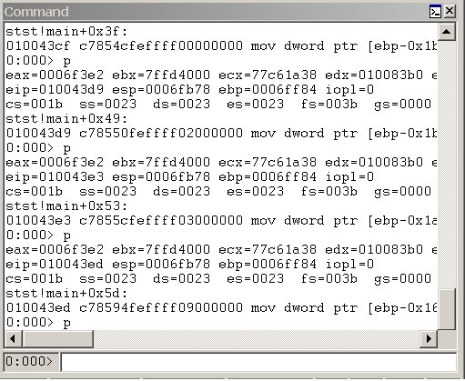

# Entering Debugger Commands in WinDbg

## 

The Debugger Command window is the primary debugging information window in WinDbg. You can enter debugger commands and view the command output in this window.

**Note**   This window displays "Command" in the title bar. However, this documentation always refers to this window as "the Debugger Command window" to avoid confusing it with the Command Prompt windows that are used to issue Microsoft MS-DOS commands.

 

### Opening the Debugger Command Window

To open the Debugger Command window, choose **Command** from the **View** menu. (You can also press ALT+1 or click the **Command** button () on the toolbar. ALT+SHIFT+1 closes the Debugger Command window.)

The following screen shot shows an example of a Debugger Command window.

### Using the Debugger Command Window

The Debugger Command window is split into two panes. You type commands in the smaller pane (the command entry pane) at the bottom of the window and view the output in the larger pane at the top of the window.

In the command entry pane, use the UP ARROW and DOWN ARROW keys to scroll through the command history. When a command appears, you can edit it or press ENTER to run the command.

The Debugger Command window contains a shortcut menu with additional commands. To access this menu, right-click the title bar of the window or click the icon near the upper-right corner of the window (). The following list describes some of the menu commands:

-   **Add to command output** adds a comment to the command output, similar to the [Edit | Add to Command Output](edit---add-to-command-output.md) command.

-   **Clear command output** deletes all of the text in the window.

-   **Choose text color and recolor selection...** opens a dialog box that enables you to choose the text color in which to display the text that is selected in the Debugger Command window.

-   **Word wrap** turns the word wrap status on and off. This command affects the whole window, not only commands that you use after this state is selected. Because many commands and extensions produce formatted displays, it is not recommended that you use word wrap.

-   **Mark current location** sets a marker at the current cursor location in the command window. The name of the mark is the contents of the line to the right of the cursor.

-   **Go to mark** causes the window to scroll so that the line that contains the chosen mark is positioned at the top of the window.

-   **Always floating** causes the window to remain undocked, even if it is dragged to a docking location.

-   **Move with frame** causes the window to move when the WinDbg frame is moved, even if the window is undocked. For more information about docked, tabbed, and floating windows, see [Positioning the Windows](positioning-the-windows.md).

 

 

[Send comments about this topic to Microsoft](mailto:wsddocfb@microsoft.com?subject=Documentation%20feedback%20[debugger\debugger]:%20Entering%20Debugger%20Commands%20in%20WinDbg%20%20RELEASE:%20%285/15/2017%29&body=%0A%0APRIVACY%20STATEMENT%0A%0AWe%20use%20your%20feedback%20to%20improve%20the%20documentation.%20We%20don't%20use%20your%20email%20address%20for%20any%20other%20purpose,%20and%20we'll%20remove%20your%20email%20address%20from%20our%20system%20after%20the%20issue%20that%20you're%20reporting%20is%20fixed.%20While%20we're%20working%20to%20fix%20this%20issue,%20we%20might%20send%20you%20an%20email%20message%20to%20ask%20for%20more%20info.%20Later,%20we%20might%20also%20send%20you%20an%20email%20message%20to%20let%20you%20know%20that%20we've%20addressed%20your%20feedback.%0A%0AFor%20more%20info%20about%20Microsoft's%20privacy%20policy,%20see%20http://privacy.microsoft.com/default.aspx. "Send comments about this topic to Microsoft")

