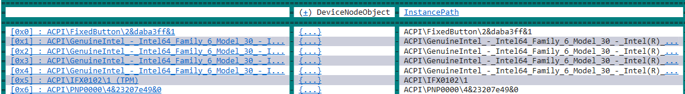

# Debugger Data Model Function Aliases

Function aliases are a unique short name by which a user of the debugger can access functionality defined in a debugger extension (whether written in C++ or some scripting environment such as JavaScript). This short name gets associated with a data model function object (an object which implements IModelMethod). That function takes an arbitrary number of arguments and returns a single value. The effect of invoking a function alias and what is done with that value depend on how the function alias is invoked and what host debugger it is invoked within. 

This topic assumes the reader is familiar with the debugger object model and JavaScript. For information about using debugger objects with JavaScript, see [Native Debugger Objects in JavaScript Extensions](native-objects-in-javascript-extensions.md).

Some of the examples shown here use the dx command, for more information about working with the dx command, see [dx (Display Debugger Object Model Expression)](dx--display-visualizer-variables-.md). In addition the LINQ is used which is described in [Using LINQ With the debugger objects](https://docs.microsoft.com/windows-hardware/drivers/debugger/using-linq-with-the-debugger-objects).


## Using function alias as extension commands

All function aliases created in WinDbg Preview can be invoked as if they were debug extension **!** "bang" commands. If the function takes no arguments, simply invoking !aliasName will cause the function to be called and the result value to be displayed. As an example (created with JavaScript extensibility)

As an example, this function provides two constant values, *pi* and *e*.

```cpp
function __constants()
{
    return { math_constants : { pi :  3.1415926535 , e :  2.7182818284}, description : "Archimedes' pi and Euler's number e" };
}

function initializeScript()
{
    return [new host.functionAlias(__constants, "constants")];
}
```

The results of calling the function alias are shown here. 

```dbgcmd
0:000> !constants
@$constants()                 : [object Object]
    math_constants   : [object Object]
    description      : Archimedes' pi and Euler's number e
```

DML links to complex objects will be generated automatically. Clicking the math_constants shown above will result in the following output. 

```dbgcmd
0:000> dx -r1 @$constants().math_constants
@$constants().math_constants                 : [object Object]
    pi               : 3.141593
    e                : 2.718282
```


If the function has arguments, they can be supplied after the function alias command itself. Note that whatever comes after the function alias command is considered an expression and is evaluated as such. The text string is not passed directly to the function. For a single argument expression, it can come after the function alias command itself. For multiple arguments, they should be parenthesized as if it were a function call as illustrated in this next example.


```cpp
function __oneArgument(x)
{
    return -x;
}

function __twoArguments(x, y)
{
    return x + y;
}

function initializeScript()
{
    return [new host.functionAlias(__oneArgument, "neg"),
            new host.functionAlias(__twoArguments, "add")];
}
```

These two functions can be called as shown here.

```dbgcmd
0:000> !neg 42
@$neg(42)        : -42

0:000> !add (5, 7)
@$add(5, 7)      : 0xc
```


## Function alias use with the dx expression evaluator

In addition to the debug extension **!** "bang" command syntax for invoking an aliased function, all of the names associated with function aliases are directly available in the dx expression evaluator when prefixed by *@$* as shown here.  

```dbgcmd
0:000> dx @$neg(42)
@$neg(42)        : -42

0:000> dx @$add(99, 77)
@$add(99, 77)    : 0xb0
```


## Function alias design considerations

A function alias should never be the sole way in which functionality in the vast majority of data model extensions is exposed. A data model extension (be it in C++ or JavaScript) should nearly always include the data it is exposing associated with a type or other debugger concept. Things associated with processes should be under Debugger.Models.Process or a sub-namespace of that object. A function alias can be a convenient way for getting to (or transforming) data that might require a significantly longer query. 

As a kernel mode example, the following query takes the PnP device tree and flattens it into a simple flat list of devices: 

```dbgcmd
0: kd> dx @$cursession.Devices.DeviceTree.Flatten(n => n.Children),5
@$cursession.Devices.DeviceTree.Flatten(n => n.Children),5                
    [0x0]            : HTREE\ROOT\0
    [0x1]            : ROOT\volmgr\0000 (volmgr)
    [0x2]            : ROOT\BasicDisplay\0000 (BasicDisplay)
    [0x3]            : ROOT\CompositeBus\0000 (CompositeBus)
    [0x4]            : ROOT\vdrvroot\0000 (vdrvroot)
    [...]     
```

This JavaScript code shows how this can be implemented as a function alias. 

```dbgcmd
function __flatDevices()
{
    return host.currentSession.Devices.DeviceTree.Flatten(n => n.Children);
}

function initializeScript()
{
    return [new host.functionAlias(__flatDevices, "devices")];
}
```

The function alias can then be invoked as a debug extension command. 

```dbgcmd
0: kd> !devices
@$devices()                
    [0x0]            : HTREE\ROOT\0
    [0x1]            : ROOT\volmgr\0000 (volmgr)
    [0x2]            : ROOT\BasicDisplay\0000 (BasicDisplay)
    [0x3]            : ROOT\CompositeBus\0000 (CompositeBus)
    [0x4]            : ROOT\vdrvroot\0000 (vdrvroot)
    [0x5]            : ROOT\spaceport\0000 (spaceport)

    ...
```

One of the advantages with using a function alias, is that it can be further refined using the dx syntax. In this example, a where clause is added to look for device nodes that contain "Harddisk".

```dbgcmd
0: kd> dx @$devices().Where(n => n.InstancePath.Contains("Harddisk"))
@$devices().Where(n => n.InstancePath.Contains("Harddisk"))                
    [0x0]            : STORAGE\VolumeSnapshot\HarddiskVolumeSnapshot1
    [0x1]            : STORAGE\VolumeSnapshot\HarddiskVolumeSnapshot2
    [0x2]            : STORAGE\VolumeSnapshot\HarddiskVolumeSnapshot3
    [0x3]            : STORAGE\VolumeSnapshot\HarddiskVolumeSnapshot4
    [0x4]            : STORAGE\VolumeSnapshot\HarddiskVolumeSnapshot5
    [0x5]            : STORAGE\VolumeSnapshot\HarddiskVolumeSnapshot6
```


LINQ commands such as the following can be used with functional aliases -  .All, .Any, .Count, .First, .Flatten, .GroupBy, .Last, .OrderBy, .OrderByDescending, .Select, and .Where. These methods follow (as closely as possible) the C# LINQ method form. For more information see [Using LINQ With the debugger objects](https://docs.microsoft.com/windows-hardware/drivers/debugger/using-linq-with-the-debugger-objects).


**Grid Display**

As with other dx commands, you can right click on a command after it was executed and click "Display as grid" or add "-g" to the command to get a grid view of the results. You can then click on any column to sort, for example on InstancePath.

```dbgcmd
0: kd> dx -g @$devices().OrderBy(obj => obj.@"InstancePath")
```

 


## Process Threads Example

Debugger objects are projected into a namespace rooted at "Debugger". Processes, modules, threads, stacks, stack frames, and local variables are all available to be used in a LINQ query.

This example JavaScript shows how to display the thread count for the current sessions processes:

```dbgcmd
function __Processes()
{
    return host.currentSession.Processes.Select(p => ({Name: p.Name, ThreadCount: p.Threads.Count()}));
}

function initializeScript()
{
    return [new host.functionAlias(__Processes, "Processes")];
}
```
This shows the example output with the !Processes function alias.


```dbgcmd
0: kd> !Processes
@$Processes()                
    [0x0]            : [object Object]
    [0x4]            : [object Object]
    [0x1b4]          : [object Object]
    [0x248]          : [object Object]
    [0x2c4]          : [object Object]
    [0x340]          : [object Object]
    [0x350]          : [object Object]
    [0x3d4]          : [object Object]
    [0x3e8]          : [object Object]
    [0x4c]           : [object Object]
    [0x214]          : [object Object]
    [0x41c]          : [object Object]
    [0x494]          : [object Object]

...    
```
In this example the top 5 process with the largest thread count are displayed.

```dbgcmd
0: kd> dx -r1 @$Processes().OrderByDescending(p =>p.ThreadCount),5
@$Processes().OrderByDescending(p =>p.ThreadCount),5                
    [0x4]            : [object Object]
    [0x180]          : [object Object]
    [0x978]          : [object Object]
    [0xda4]          : [object Object]
    [0x3e8]          : [object Object]
    [...]   
```


## <span id="see_also"></span>See also

[dx (Display Debugger Object Model Expression)](dx--display-visualizer-variables-.md)

[Using LINQ With the debugger objects](using-linq-with-the-debugger-objects.md)

[Native Debugger Objects in NatVis](native-debugger-objects-in-natvis.md)

[Native Debugger Objects in JavaScript Extensions](native-objects-in-javascript-extensions.md) 

---


