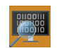

# Download Debugging Tools for Windows

The Windows Debugger (WinDbg) can be used to debug kernel and user mode code, analyze crash dumps and to examine the CPU registers as code executes. 

##  Download WinDbg Preview
 
WinDbg Preview is a new version of WinDbg with more modern visuals, faster windows, a full-fledged scripting experience, built with the extensible debugger data model front and center. WinDbg Preview is using the same underlying engine as WinDbg today, so all the commands, extensions, and workflows still work as they did before. 

[Download WinDbg Preview from the Microsoft Store](https://microsoft.com/store/p/windbg/9pgjgd53tn86) 

[Learn more about installation and configuration](https://docs.microsoft.com/windows-hardware/drivers/debugger/windbg-install-preview)  

##  Debugging Tools for Windows 10 (WinDbg) 

If you just need the Debugging Tools for Windows 10, and not WDK 10 or Visual Studio 2017, you can install the debugging tools as a standalone component from Windows SDK. In the installation wizard, select *Debugging Tools for Windows*, and deselect all other components. 

[Get Debugging Tools for Windows (WinDbg) (from the SDK)](https://developer.microsoft.com/windows/downloads/windows-10-sdk) 

[Learn more about WinDbg and other debuggers (WinDbg, KD, CDB, NTSD)](https://docs.microsoft.com/windows-hardware/drivers/debugger/) 

> [!TIP]
> If the Windows SDK is already installed, use Add/Remove programs to modify the install to add *Debugging Tools for Windows*.
> 

-------------------

## Looking for related downloads?

[Download Windows Debugger Symbols](debugger-download-symbols.md)  

[Download the Windows Driver Kit (WDK)](https://developer.microsoft.com/windows/hardware/windows-driver-kit) 

[Download the Windows Assessment and Deployment Kit (Windows ADK)](https://developer.microsoft.com/windows/hardware/windows-assessment-deployment-kit) 

[Download the Windows HLK, HCK, or Logo Kit](https://developer.microsoft.com/windows/hardware/windows-hardware-lab-kit) 

[Download Windows Insider Preview builds](https://insider.windows.com/) 
 

