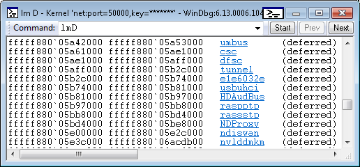
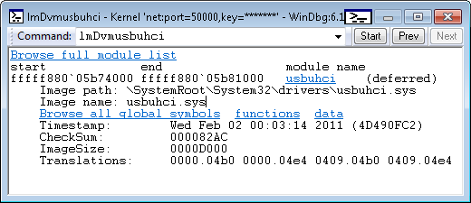
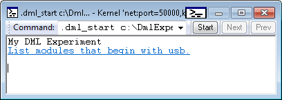
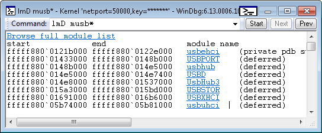

# Using Debugger Markup Language


Debugger commands can provide output in plain text or in an enhanced format that uses Debugger Markup Language (DML). Output that is enhanced with DML includes links that you can click to execute related commands.

DML is available in Windows 10 and later.

**DML Capable Commands**

The following commands are capable of generating DML output:

-   [**.dml\_start**](-dml-start.md)
-   [**.dml\_flow**](-dml-flow.md)
-   [**!dml\_proc**](-dml-proc.md)
-   [**lmD**](lm--list-loaded-modules-.md)
-   [**kM**](k--kb--kc--kd--kp--kp--kv--display-stack-backtrace-.md)
-   [**.chain /D**](-chain--list-debugger-extensions-.md)
-   [**.help /D**](-help--meta-command-help-.md)
-   [**.printf /D**](-printf.md)

The [**lmD**](lm--list-loaded-modules-.md) command is an example of a command that is capable of providing DML output. The **lmD** command displays a list of loaded modules. As the following image shows, each module name is a link that you can click to get more detailed information about the module.



The following image shows the result of clicking the **usbuhci** link. The output includes additional links that enable you to explore further details of the usbuhci module.



**Turning DML On and Off**

The [**.prefer\_dml**](-prefer-dml.md) command turns DML on or off. When DML is turned on (.prefer\_dml 1), commands that are capable of generating DML output will generate DML output by default.

### <span id="Console_Enhancements"></span><span id="console_enhancements"></span><span id="CONSOLE_ENHANCEMENTS"></span>Console Enhancements

All of the Windows debuggers now have command output areas which support DML parsing. In windbg the command window supports all DML behavior and will show colors, font styles and links. The console debuggers, ntsd, cdb and kd, only support the color attributes of DML, and the only when running in a true console with color mode enabled. Debuggers with redirected I/O, ntsd –d or remote.exe sessions will not display any colors.

### <span id="Console_Debugger_Color_Mode"></span><span id="console_debugger_color_mode"></span><span id="CONSOLE_DEBUGGER_COLOR_MODE"></span>Console Debugger Color Mode

The console debuggers, ntsd, cdb and kd now have the ability to display colored output when running in a true console. This is not the default, it requires color mode to be explicitly enabled via tools.ini. The new col\_mode &lt;true|false&gt; token in tools.ini controls the color mode setting. For more information about working with the tools.ini file, see [Configuring tools.ini](configuring-tools-ini.md)

When color mode is enabled the debugger can produce colored output. By default most colors are not set and instead default to the current console colors.

### <span id="_Windbg_Command_Browser_Window"></span><span id="_windbg_command_browser_window"></span><span id="_WINDBG_COMMAND_BROWSER_WINDOW"></span> Windbg Command Browser Window

In Windows 10 and later Windbg the command browser window parses and displays DML. All tags such as &lt;link&gt;, &lt;exec&gt; and appearance modifications, are fully supported.

To start a command browser session using the menu in WinDbg, select **View**, **Command Browser**. The .browse &lt;command&gt; in the command window will open a new command browser window and execute the given command. For more information see [Using the Command Browser Window in WinDbg](command-browser-window.md). A new command browser window can also be opened with Ctrl+N.

The command browser window deliberately mimics the behavior of a web browser, with a drop-down history and previous/next buttons. The history drop-down only displays the last twenty commands but full history is kept so by going back in the commands you can get the drop-down to display older history.

You can have as many command windows open at once as you like. Command windows persist in workspaces but only save the current command; the history is not kept.

The WinDbg **View** menu has a **Set Browser Start Command** option which allows a user to set a preferred command for new browser windows to start with, such as .dml\_start. This command is saved in workspaces.

A **Recent Commands** sub-window is available on the **View** menu to hold commands of interest. Selecting a recent command opens a new browser with the given command. There is a menu item on the browser window’s context menu that adds the window’s current command to the list of recent commands. The list of recent commands is persisted in workspaces.

The command browser window executes the command synchronously and so does not display output until the command has completed. Long-running commands will not show anything until they have finished.

Links have a right-click context menu similar to the right-click context menu in a web browser. Links can be opened in a new browser window. A link’s command can be copied to the clipboard for use.

Clicking the icon near the upper-right corner of the title bar to set the command browser windows to either auto-refresh or manual-refresh. Auto-refresh browsers will automatically re-run their command on debugger state changes. This keeps the output live but at the cost of executing the command on all changes. Auto-refresh is on by default. If the browser does not need to be live the window’s context menu can be used to disable auto-refresh.

Because commands are executed by the engine, not by the user interface, user-interface specific commands, such as [**.cls (Clear Screen)**](-cls--clear-screen-.md), will return a syntax error in when used in command browser windows. It also means that when the user interface is a remote client, the command will be executed by the server, not by the client, and the command output will show server state.

Command browser windows can run any debugger command, it does not have to be a command that produces DML. You can use browser windows to have an arbitrary set of commands active for use.

## <span id="Customizing_DML"></span><span id="customizing_dml"></span><span id="CUSTOMIZING_DML"></span>Customizing DML


DML defines a small set of tags that can be included in command output. One example is the &lt;link&gt; tag. You can experiment with the &lt;link&gt; tag (and other DML tags) by using the [**.dml\_start**](-dml-start.md) and [**.browse**](-browse--display-command-in-browser-.md) commands. The command **.browse .dml\_start** *filepath* executes the commands stored in a DML file. The output is displayed in the [Command Browser window](command-browser-window.md) instead of the regular command window.

Suppose the file c:\\DmlExperiment.txt contains the following lines.

```text
My DML Experiment
<link cmd="lmD musb*">List modules that begin with usb.</link>
```

The following command displays the text and link in the Command Browser window.

```dbgcmd
.browse .dml_start c:\Dml_Experiment.txt
```



If you click the **List modules that begin with usb** link, you see output similar to the following image.



For a thorough discussion of DML customization and a complete list of DML tags, see [Customizing Debugger Output Using DML](customizing-debugger-output-using-dml.md).

 

 


