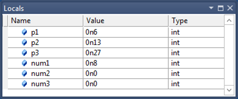
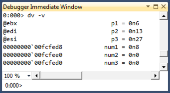

# Debugging Optimized Code and Inline Functions


For Windows 8, the debugger and the Windows compiler have been enhanced so that you can debug optimized code and debug inline functions. The debugger displays parameters and local variables regardless of whether they are stored in registers or on the stack. The debugger also displays inline functions in the call stack. For inline functions, the debugger displays local variables, but not parameters.

When code gets optimized, it is transformed to run faster and use less memory. Sometimes functions are removed as a result of dead code removal, code being merged, or functions being placed inline. Local variables and parameters can also be removed. Many code optimizations remove local variables that are not needed or used; other optimizations remove induction variables in loops. Common sub-expression elimination merges local variables together.

Retail builds of Windows are optimized. So if you are running a retail build of Windows, it is especially helpful to have a debugger that is designed to work well with optimized code. To make debugging of optimized code effective, two primary features are required: 1) accurate display of local variables, and 2) display of inline functions on the call stack.

## <span id="Accurate_display_of_local_variables_and_parameters"></span><span id="accurate_display_of_local_variables_and_parameters"></span><span id="ACCURATE_DISPLAY_OF_LOCAL_VARIABLES_AND_PARAMETERS"></span>Accurate display of local variables and parameters


To facilitate the accurate display of local variables and parameters, the compiler records information about the locations of local variables and parameters in symbol (PDB) files. These location records track the variables’ storage locations and the specific code ranges where these locations are valid. These records not only help track the locations (in registers or in stack slots) of the variables, but also the movement of the variables. For example, a parameter might first be in register RCX, but is moved to a stack slot to free up RCX, then moved to register R8 when it is heavily used in a loop, and then moved to different stack slot when the code is out of the loop. The Windows debugger consumes the rich location records in the PDB files and uses the current instruction pointer to select the appropriate location records for the local variables and parameters.

This screen shot of the Locals window in Visual Studio shows the parameters and local variables for a function in an optimized 64-bit application. The function is not inline, so we see both parameters and local variables.



You can use the [**dv -v**](dv--display-local-variables-.md) command to see the locations of the parameters and local variables.



Notice that the Locals window displays the parameters correctly even though they are stored in registers.

In addition to tracking variables with primitive types, the location records track data members of local structures and classes. The following debugger output displays local structures.

```dbgcmd
0:000> dt My1
Local var Type _LocalStruct
   +0x000 i1               : 0n0 (edi)
   +0x004 i2               : 0n1 (rsp+0x94)
   +0x008 i3               : 0n2 (rsp+0x90)
   +0x00c i4               : 0n3 (rsp+0x208)
   +0x010 i5               : 0n4 (r10d)
   +0x014 i6               : 0n7 (rsp+0x200)

0:000> dt My2
Local var @ 0xefa60 Type _IntSum
   +0x000 sum1             : 0n4760 (edx)
   +0x004 sum2             : 0n30772 (ecx)
   +0x008 sum3             : 0n2 (r12d)
   +0x00c sum4             : 0n0
```

Here are some observations about the preceding debugger output.

-   The local structure **My1** illustrates that the compiler can spread local structure data members to registers and non-contiguous stack slots.
-   The output of the command **dt My2** will be different from the output of the command **dt \_IntSum 0xefa60**. You cannot assume that the local structure will occupy a contiguous block of stack memory. In the case of **My2**, only `sum4` stays in the original stack block; the other three data members are moved to registers.
-   Some data members can have multiple locations. For example, **My2.sum2** has two locations: one is register ECX (which the Windows debugger chooses) and the other is 0xefa60+0x4 (the original stack slot). This could happen for primitive-type local variables also, and the Windows debugger imposes precedent heuristics to determine which location to use. For example, register locations always trump stack locations.

## <span id="Display_of_inline_functions_on_the_call_stack"></span><span id="display_of_inline_functions_on_the_call_stack"></span><span id="DISPLAY_OF_INLINE_FUNCTIONS_ON_THE_CALL_STACK"></span>Display of inline functions on the call stack


During code optimization, some functions are placed in line. That is, the body of the function is placed directly in the code like a macro expansion. There is no function call and no return to the caller. To facilitate the display of inline functions, the compiler stores data in the PDB files that helps decode the code chunks for the inline functions (that is, sequences of code blocks in caller functions that belong to the callee functions that are being placed inline) as well as the local variables (scoped local variables in those code blocks). This data helps the debugger include inline functions as part of the stack unwind.

Suppose you compile an application and force a function named `func1` to be inline.

```cpp
__forceinline int func1(int p1, int p2, int p3)
{
   int num1 = 0;
   int num2 = 0;
   int num3 = 0;
   ...
}
```

You can use the [**bm**](bp--bu--bm--set-breakpoint-.md) command to set a breakpoint at `func1`.

```dbgcmd
0:000> bm MyApp!func1
  1: 000007f6`8d621088 @!"MyApp!func1" (MyApp!func1 inlined in MyApp!main+0x88)
0:000> g

Breakpoint 1 hit
MyApp!main+0x88:
000007f6`8d621088 488d0d21110000  lea     rcx,[MyApp!`string' (000007f6`8d6221b0)]
```

After you take one step into `func1`, you can use the [**k**](k--kb--kc--kd--kp--kp--kv--display-stack-backtrace-.md) command to see `func1` on the call stack. You can use the [**dv**](dv--display-local-variables-.md) command to see the local variables for `func1`. Notice that the local variable `num3` is shown as unavailable. A local variable can be unavailable in optimized code for a number of reasons. It might be that the variable doesn't exist in the optimized code. It might be that the variable has not been initialized yet or that the variable is no longer being used.

```dbgcmd
0:000> p
MyApp!func1+0x7:
000007f6`8d62108f 8d3c33          lea     edi,[rbx+rsi]

0:000> knL
# Child-SP          RetAddr           Call Site
00 (Inline Function) --------`-------- MyApp!func1+0x7
01 00000000`0050fc90 000007f6`8d6213f3 MyApp!main+0x8f
02 00000000`0050fcf0 000007ff`c6af0f7d MyApp!__tmainCRTStartup+0x10f
03 00000000`0050fd20 000007ff`c7063d6d KERNEL32!BaseThreadInitThunk+0xd
04 00000000`0050fd50 00000000`00000000 ntdll!RtlUserThreadStart+0x1d

0:000> dv -v
00000000`0050fcb0            num1 = 0n0
00000000`0050fcb4            num2 = 0n0
<unavailable>                num3 = <value unavailable>
```

If you look at frame 1 in the stack trace, you can see the local variables for the `main` function. Notice that two of the variables are stored in registers.

```dbgcmd
0:000> .frame 1
01 00000000`0050fc90 000007f6`8d6213f3 MyApp!main+0x8f

0:000> dv -v
00000000`0050fd08               c = 0n7
@ebx                            b = 0n13
@esi                            a = 0n6
```

The Windows debugger aggregates data from PDB files to find all the places where a specific function has been placed inline. You can use the [**x**](x--examine-symbols-.md) command to list all the caller sites of the an inline function.

```dbgcmd
0:000> x simple!MoreCalculate
00000000`ff6e1455 simple!MoreCalculate =  (inline caller) simple!wmain+8d
00000000`ff6e1528 simple!MoreCalculate =  (inline caller) simple!wmain+160

0:000> x simple!Calculate
00000000`ff6e141b simple!Calculate =  (inline caller) simple!wmain+53
```

Because the Windows debugger can enumerate all the caller sites of an inline function, it can set a breakpoints inside the inline function by calculating the offsets from the caller sites. You can use the [**bm**](bp--bu--bm--set-breakpoint-.md) command (which is used to set breakpoints that match regular expression patterns) to set breakpoints for inline functions.

The Windows debugger groups all breakpoints that are set for a specific inline function into a breakpoint container. You can manipulate the breakpoint container as a whole by using commands like [**be**](be--breakpoint-enable-.md), [**bd**](bd--breakpoint-disable-.md), [**bc**](bc--breakpoint-clear-.md). See the following **bd 3** and **bc 3** command examples. You can also manipulate individual breakpoints. See the following **be 2** command example.

```dbgcmd
0:000> bm simple!MoreCalculate
  2: 00000000`ff6e1455 @!"simple!MoreCalculate" (simple!MoreCalculate inlined in simple!wmain+0x8d)
  4: 00000000`ff6e1528 @!"simple!MoreCalculate" (simple!MoreCalculate inlined in simple!wmain+0x160)

0:000> bl
 0 e 00000000`ff6e13c8 [n:\win7\simple\simple.cpp @ 52]    0001 (0001)  0:**** simple!wmain
 3 e <inline function>     0001 (0001)  0:**** {simple!MoreCalculate}
     2 e 00000000`ff6e1455 [n:\win7\simple\simple.cpp @ 58]    0001 (0001)  0:**** simple!wmain+0x8d (inline function simple!MoreCalculate)
     4 e 00000000`ff6e1528 [n:\win7\simple\simple.cpp @ 72]    0001 (0001)  0:**** simple!wmain+0x160 (inline function simple!MoreCalculate)

0:000> bd 3
0:000> be 2

0:000> bl
 0 e 00000000`ff6e13c8 [n:\win7\simple\simple.cpp @ 52]    0001 (0001)  0:**** simple!wmain
 3 d <inline function>     0001 (0001)  0:**** {simple!MoreCalculate}
     2 e 00000000`ff6e1455 [n:\win7\simple\simple.cpp @ 58]    0001 (0001)  0:**** simple!wmain+0x8d (inline function simple!MoreCalculate)
     4 d 00000000`ff6e1528 [n:\win7\simple\simple.cpp @ 72]    0001 (0001)  0:**** simple!wmain+0x160 (inline function simple!MoreCalculate)

0:000> bc 3

0:000> bl
 0 e 00000000`ff6e13c8 [n:\win7\simple\simple.cpp @ 52]    0001 (0001)  0:**** simple!wmain
```

Because there are no explicit call or return instructions for inline functions, source-level stepping is especially challenging for a debugger. For example, you could unintentionally step in to an inline function (if the next instruction is part of an inline function), or you could step in and step out of the same inline function multiple times (because the code blocks for the inline function have been split and moved by the compiler). To preserve the familiar stepping experience, the Windows debugger maintains a small conceptual call stack for every code instruction address and builds an internal state machine to execute step-in, step-over, and step-out operations. This gives a reasonably accurate approximation to the stepping experience for non-inline functions.

## <span id="Additional_Information"></span><span id="additional_information"></span><span id="ADDITIONAL_INFORMATION"></span>Additional Information


**Note**  You can use the **.inline 0** command to disable inline function debugging. The **.inline 1** command enables inline function debugging. [Standard Debugging Techniques](standard-debugging-techniques.md)

 

## <span id="related_topics"></span>Related topics


[Standard Debugging Techniques](standard-debugging-techniques.md)

 

 


