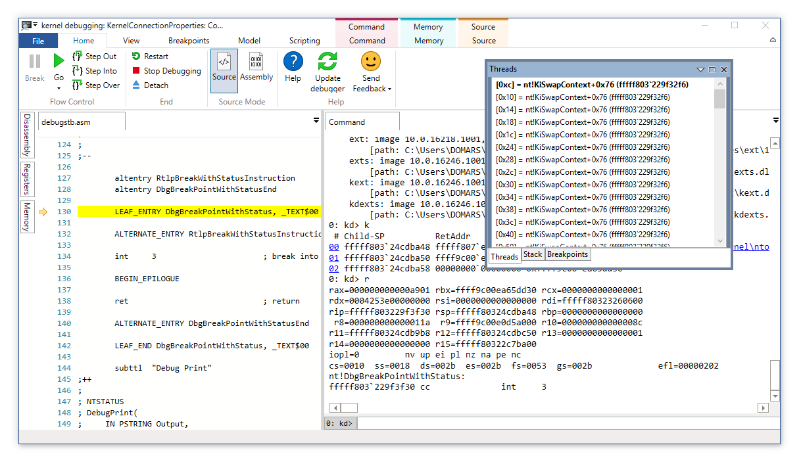
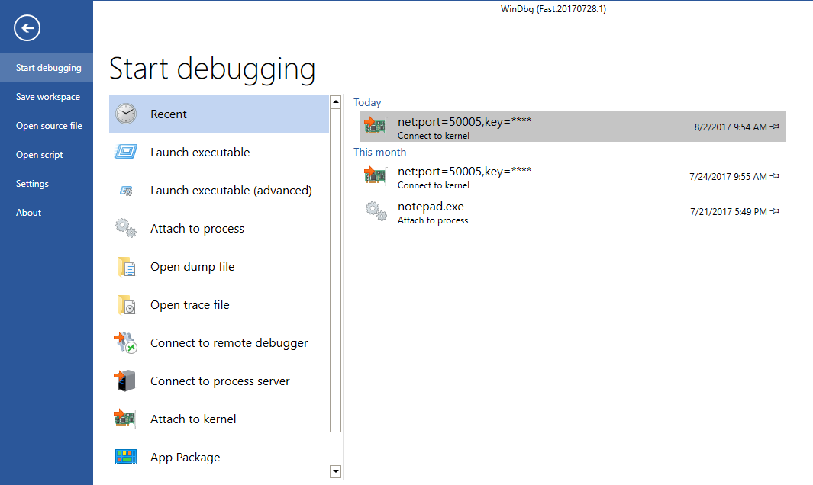
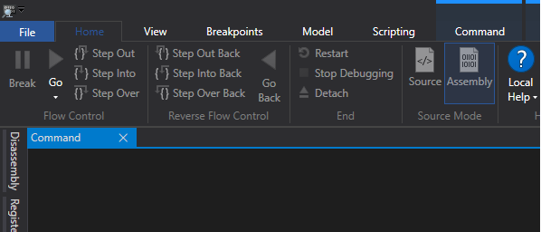
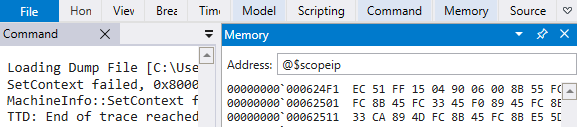
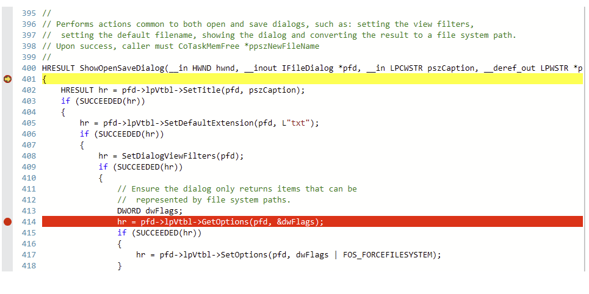
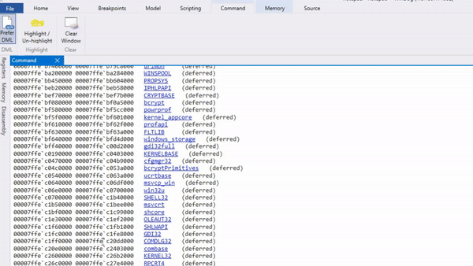
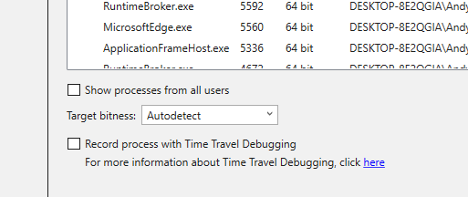
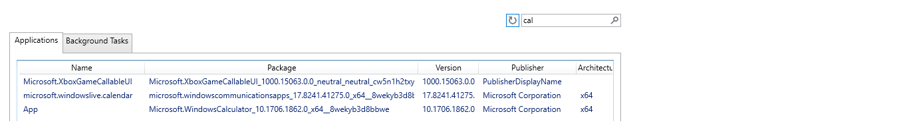
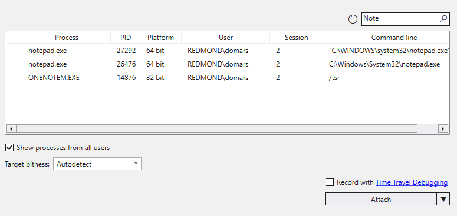
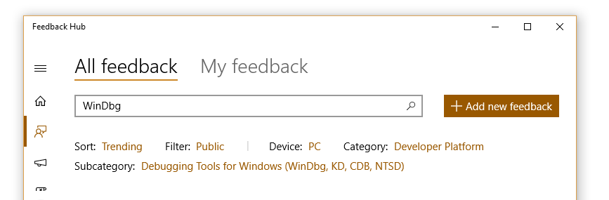

# Debugging Using WinDbg Preview

 

WinDbg Preview is the latest version of WinDbg with more modern visuals, faster windows, a full-fledged scripting experience, built with the extensible debugger data model front and center. WinDbg Preview is using the same underlying engine as WinDbg today, so all the commands, extensions, and workflows you're used to will still work as they did before.

## Major Features of WinDbg Preview

Here's some of the most notable things that have changed or are new in WinDbg Preview.

### General features

- **Easier Connection Setup and Recall** - The WinDbg Preview includes the ability to recall previous session configuration information.

- **Easy feedback channel** - Your feedback will guide the development effort going forward. For more information, see [Providing Feedback](#providing-feedback)

- **Dump file processor detection** -Auto-detects processor architecture for easier managed debugging.

- **Performance Improvements** Windows now load asynchronously and can be canceled - When you run another command, WinDbg Preview will stop the loading of your locals, watch, or other windows.

### Windowing improvements

- **Disassembly Window Improvements** - The disassembly window is also improved, the highlight of the current instruction remains where it is when you scroll.

    

- **Memory window improvements** - The memory window has highlighting and improved scrolling.

- **Locals and watch data model visualization** - The locals and watch windows are both based off of the data model that is used by the dx command. This means the locals and watch windows will benefit from any NatVis or JavaScript extensions you have loaded, and can even support full LINQ queries, just like the dx command.

- **Logs** - This is a under the covers log of the WinDbg Preview internals. It can be viewed for troubleshooting or to monitor long running processes.

For more information, see [WinDbg Preview - View menu](windbg-view-preview.md).

- **Command window** - Use the command window provides easy access to toggle DML and clear the debugger command window. All current debugger commands are compatible with and continue to work in WinDbg Preview.

### Dark theme

Use **File** > **Settings** to enable the dark theme.

### Ribbon Quick Access

Just pin the buttons you use the most and you can collapse the ribbon to save screen real estate. 

### Source code

The source code window has been updated to be much more in line with modern editors.

### Highlighting

The command window has two new highlighting features. Selecting any text will give a subtle highlight to any other instances of that text. You can then hit "Highlight/Un-highlight" or Ctrl+Alt+H to persist the highlighting.

### Better keyboard navigation

Just hit Ctrl+Tab and you can easily navigate between windows with just your keyboard.

### Integrated Time Travel Debugging (TTD)

If you need a TTD trace of your application, just check the "Record with Time Travel Debugging" box when launching or attaching. WinDbgNext will set it up for TTD and open the trace when you're done recording.

For more information, see [Time Travel Debugging - Overview](time-travel-debugging-overview.md).

### Debugging App packages

Debugging your universal app or background task is now a single click or select.

For more information, see [Launch App Package](./windbg-user-mode-preview.md#launch-app-package).

### Attach to a process

The attach dialog provides more detail, includes a search dialog and is easier to use.

### Enhanced breakpoint tracking  

- **Enable/Disable breakpoints** - The breakpoints window shows all your current breakpoints and provides easy access to enabling and disabling them.
- **Hit count** - The breakpoint window keeps a running total of each time the breakpoint is hit.

For more information, see [Breakpoints](windbg-breakpoints-preview.md).

### Enhanced data model support

- **Built in data model support** - WinDbg Preview is written with built in data model support and the data model is available through out the debugger.
- **Model window** - The model window gives you an expandable and browsable version of ‘dx’ and ‘dx -g’, letting you create powerful tables on-top of your NatVis, JavaScript, and LINQ queries.

For more information, see [WinDbg Preview - Data model](windbg-data-model-preview.md).

### New scripting development UI

- **Script development UI** - There is now a purpose built scripting window to make developing JavaScript and NatVis scripts easier, with error highlighting and IntelliSense.

For more information, see [WinDbg Preview - Scripting](windbg-scripting-preview.md).

### Backwards compatibility

Because the underling debugger engine is the same, all of the previous debugger commands and debugger extensions continue to work.

## Providing feedback

Your feedback will help guide WinDbg's development going forward.

- If you have feedback such as a feature that you really want to see or a bug that makes something difficult, use the Feedback Hub.

### Team Blog

The debugger team blog, although now inactive, includes tips and tricks.
[/archive/blogs/windbg/](/archive/blogs/windbg/)

## Videos

Watch these episodes of the [Defrag Tools](https://channel9.msdn.com/Shows/Defrag-Tools) show to see Windbg Preview in action.
  
- [Defrag Tools #182](https://channel9.msdn.com/Shows/Defrag-Tools/Defrag-Tools-182-WinDbg-Preview-Part-1) - Tim, Chad, and Andy go over the basics of WinDbg Preview and some of the features.
- [Defrag Tools #183](https://channel9.msdn.com/Shows/Defrag-Tools/Defrag-Tools-183-WinDbg-Preview-Part-2) - Nick, Tim, and Chad use WinDbg Preview and go over a quick demo.
- [Defrag Tools #184](https://channel9.msdn.com/Shows/Defrag-Tools/Defrag-Tools-184-JavaScript-in-WinDbg-Preview) - Bill and Andrew walk through the scripting features in WinDbg Preview.
- [Defrag Tools #185](https://channel9.msdn.com/Shows/Defrag-Tools/Defrag-Tools-185-Time-Travel-Debugging-Introduction) - James and Ivette provide and introduction to Time Travel Debugging.
- [Defrag Tools #186](https://channel9.msdn.com/Shows/Defrag-Tools/Defrag-Tools-186-Time-Travel-Debugging-Advanced) - James and JCAB covers advanced Time Travel Debugging.

## Next Steps

For information on what's new in the most recent release, see [WinDbg Preview - What's New](windbg-what-is-new-preview.md).

Review these topics to install and configure WinDbg Preview.

- [WinDbg Preview – Installation](windbg-install-preview.md)
- [WinDbg Preview – Command line startup options](windbg-command-line-preview.md)
- [WinDbg Preview – Settings and workspaces](windbg-setup-preview.md)
- [WinDbg Preview – Keyboard shortcuts](windbg-keyboard-shortcuts-preview.md)

These topics describe how to get connected to the environment that you want to debug. 

- [WinDbg Preview – Start a user-mode session](windbg-user-mode-preview.md)
- [WinDbg Preview – Start a kernel mode session](windbg-kernel-mode-preview.md)

These topics describe some common tasks, organized by the menu tabs.

- [WinDbg Preview – File menu](windbg-file-preview.md)
- [WinDbg Preview – Home menu](windbg-home-preview.md)
- [WinDbg Preview – View menu](windbg-view-preview.md)
- [WinDbg Preview – Breakpoints](windbg-breakpoints-preview.md)
- [WinDbg Preview – Data model](windbg-data-model-preview.md)
- [WinDbg Preview – Scripting](windbg-scripting-preview.md)