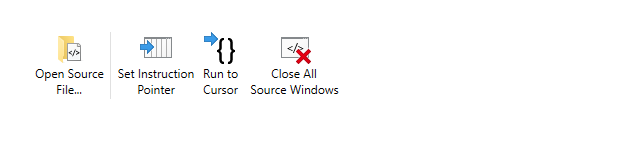
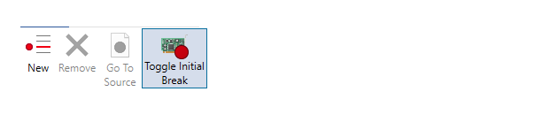
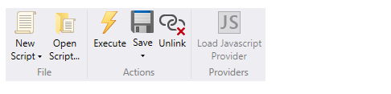

# Debugging Using WinDbg Preview

Welcome to the WinDbg Preview. This next gen debugger is being developed with the debugger community in mind. For information on providing feedback to shape the future of WinDbg , see [Providing feedback](#providingfeedback).

For the latest news, refer to the debugger tools team blog, located here.
[https://blogs.msdn.microsoft.com/windbg/](https://blogs.msdn.microsoft.com/windbg/)

Review these topics to install and configure WinDbg Preview.

- [WinDbg Preview Installation](windbg-install-preview.md)
- [WinDbg Preview Setup – settings and workspaces](windbg-setup-preview.md)
- [Coexisting with the classic WinDbg debugger](windbg-coexist-preview.md)

These topics describe how to get connected to the environment that you want to debug. 

- [Starting a user-mode process using WinDbg Preview](windbg-user-mode-preview.md)
- [Starting a kernel mode session ](windbg-kernel-mode-preview.md)

These topics describe how to complete common tasks, organized by the menu tabs.

- [File](windbg-file-preview.md)
- [Home](windbg-home-preview.md)
- [View](windbg-view-preview.md)
- [Breakpoints](windbg-breakpoints-preview.md)
- [Data Model](windbg-data-model-preview.md)
- [Scripting](windbg-scripting-preview.md)

## Providing feedback

Your feedback will guide the debugger tool development effort going forward. 

- If you have feedback such as a feature that you really want to see, use the Feedback Hub.
- If you see a bug or unexpected behavior - Send-a-frown, and/or use the Feedback Hub and check the “This is a bug” check box.
- If you really like a feature  -  hit send-a-smile and tell us!
- TBD >> newsgroup - use the existing one?

## Features of the next generation debugger

The WinDbg Preview is the next generation debugger with a contemporary interface. The UI has been completely rewritten using the Microsoft Windows Presentation Foundation (WPF). For more information, see 
[XAML Overview (WPF)](https://docs.microsoft.com/en-us/dotnet/framework/wpf/advanced/xaml-overview-wpf). 

### Backwards compatibility 

Because the underling debugger engine is the same, all of the previous debugger commands and debugger extensions continue to work.

### Start debugging

- **Easier Connection Setup and Recall** - The WinDbg Preview includes the ability to recall previous session configuration information.

### General features

- **Update notifications** - When new updates are available, a banner will be displayed notifying you that an update is available.
- **In product feedback channel** - Your feedback will guide the development effort going forward. For more information, see [Providing Feedback](#providing-feedback)
- **Dump file processor detection** -Auto-detect dump processor architecture for managed dumps.
- **Performance Improvements** Windows now load asynchronously and can be canceled - When you run another command, WinDbg Preview will stop the loading of your locals, watch, or other windows.

### View menu

- **Disassembly Window Improvements** - The disassembly window is also improved, the highlight of the current instruction remains where it is when you scroll. 
- **Memory window improvements** - The memory window has highlighting and improved scrolling.
- **Locals and watch data model visualization** - The locals and watch windows are both based off of the data model that is used by the dx command. This means the locals and watch windows will benefit from any NatVis or JavaScript extensions you have loaded, and can even support full LINQ queries, just like the dx command. 
- **Logs** - This is a under the covers log of the WinDbg Preview internals. It can be viewed for troubleshooting or to monitor long running processes. You can continue to create a command log, using the .logopen command. For more information on that, see [Keeping a Log File in WinDbg](keeping-a-log-file-in-windbg.md).

For more information, see [WinDbg Preview View Menu ](windbg-view-preview.md).

### Command, and source windows  

- **Command window** - Use the command window provides easy access to toggle DML and clear the debugger command window. All current debugger commands are compatible with and continue to work in WinDbg Preview.
- **Source window** - Use the source windows to work with source code files. 

### Breakpoints 

- **Enable/Disable breakpoints** - The breakpoints window shows all your current breakpoints and provides easy access to enabling and disabling them. 
- **Hit count** - The breakpoint window keep a running total of each time the breakpoint is hit.

For more information, see [Breakpoints](windbg-breakpoints-preview.md).

### Data model 

- **Built in data model support** - WinDbg Preview is written with built in data model support and the data model is available through out the debugger.
- **Model window** - The model window gives you an expandable and browsable version of ‘dx’ and ‘dx -g’, letting you create powerful tables on-top of your NatVis, JavaScript, and LINQ queries. 

For more information, see  [WinDbg Preview Data Model Menu](windbg-data-model-preview.md).

### Scripting  

- **Script development UI** - There is now a purpose built scripting window to make developing JavaScript and NatVis scripts easier, with error highlighting, Intellisense abd debugging. 

For more information, see [WinDbg Preview Scripting Menu](windbg-scripting-preview.md).

*********************************************
>> TBD - Possible post August release content
*********************************************

-   [Opening a Dump File Using WinDbg](opening-a-crash-dump-file-using-windbg.md)
-   [Ending a Debugging Session in WinDbg](ending-a-debugging-session-in-windbg.md)
-   [Setting Symbol and Executable Image Paths in WinDbg](setting-symbol-and-source-paths-in-windbg.md)
-   [Remote Debugging Using WinDbg](remode-debugging-using-windbg.md)
-   [Entering Debugger Commands in WinDbg](debugger-command-window.md)
-   [Using the Command Browser Window in WinDbg](command-browser-window.md)

 

 

[Send comments about this topic to Microsoft](mailto:wsddocfb@microsoft.com?subject=Documentation%20feedback%20[debugger\debugger]:%20Debugging%20Using%20WinDbg%20%20RELEASE:%20%285/15/2017%29&body=%0A%0APRIVACY%20STATEMENT%0A%0AWe%20use%20your%20feedback%20to%20improve%20the%20documentation.%20We%20don't%20use%20your%20email%20address%20for%20any%20other%20purpose,%20and%20we'll%20remove%20your%20email%20address%20from%20our%20system%20after%20the%20issue%20that%20you're%20reporting%20is%20fixed.%20While%20we're%20working%20to%20fix%20this%20issue,%20we%20might%20send%20you%20an%20email%20message%20to%20ask%20for%20more%20info.%20Later,%20we%20might%20also%20send%20you%20an%20email%20message%20to%20let%20you%20know%20that%20we've%20addressed%20your%20feedback.%0A%0AFor%20more%20info%20about%20Microsoft's%20privacy%20policy,%20see%20http://privacy.microsoft.com/default.aspx. "Send comments about this topic to Microsoft")

