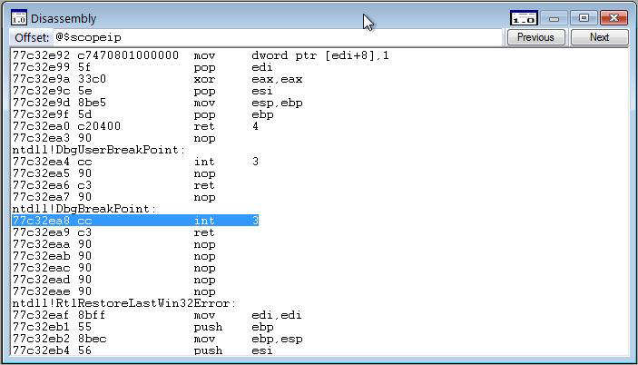

# Assembly Code Debugging in WinDbg

In WinDbg, you can view assembly code by entering commands or by using the Disassembly window.

## Debugger Command Window

You can view assembly code by entering the one of the [**u, ub, uu (Unassemble)**](u--unassemble-.md) commands in the Debugger Command window.

## Dissasembly Window

To open or switch to the Disassembly window, choose **Dissasembly** from the **View** menu. (You can also press ALT+7 or click the **Disassembly** button () on the toolbar. ALT+SHIFT+7 will close the Disassembly Window.)

The following screen shot shows an example of a Disassembly window.

The debugger takes a section of memory, interprets it as binary machine instructions, and then disassembles it to produce an assembly-language version of the machine instructions. The resulting code is displayed in the Disassembly window.

In the Disassembly window, you can do the following:

-   To disassemble a different section of memory, in the **Offset** box, type the address of the memory you want to disassemble. (You can press ENTER after typing the address, but you do not have to.) The Disassembly window displays code before you have completed the address; you can disregard this code.

-   To see other sections of memory, click the **Previous** or **Next** buttons or press the PAGE UP or PAGE DOWN keys. These commands display disassembled code from the preceding or following sections of memory, respectively. By pressing the RIGHT ARROW, LEFT ARROW, UP ARROW, and DOWN ARROW keys, you can navigate within the window. If you use these keys to move off of the page, a new page will appear.

The Disassembly window has a toolbar that contains two buttons and a shortcut menu with additional commands. To access the menu, right-click the title bar or click the icon that appears near the upper-right corner of the window (). The following list describes some of the menu commands:

-   **Go to current address** opens the Source window with the source file that corresponds to the selected line in the Disassembly window and highlights this line.

-   **Disassemble before current instruction** causes the current line to be placed in the middle of the Disassembly window. This command is the default option. If this command is cleared, the current line will appear at the top of the Disassembly window, which saves time because reverse-direction disassembly can be time-consuming.

-   **Highlight instructions from the current source line** causes all of the instructions that correspond to the current source line to be highlighted. Often, a single source line will correspond to multiple assembly instructions. If code has been optimized, these assembly instructions might not be consecutive. This command enables you to find all of the instructions that were assembled from the current source line.

-   **Show source line for each instruction** displays the source line number that corresponds to each assembly instruction.

-   **Show source file for each instruction** displays the source file name that corresponds to each assembly instruction.

### Additional Information

For more information about assembly debugging and related commands and a full explanation of the assembly display, see [Debugging in Assembly Mode](debugging-in-assembly-mode.md).

 

 

