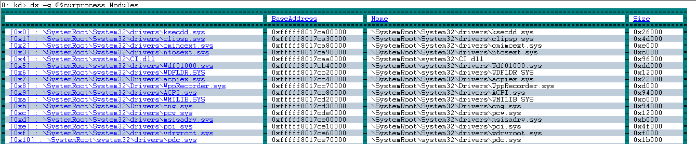

# dx (Display Debugger Object Model Expression)


The **dx** command displays a C++ expression using the NatVis extension model. For more information about NatVis, see [Create custom views of native objects](https://msdn.microsoft.com/library/jj620914.aspx).

```dbgcmd
dx [-g|-gc #][-c #][-n|-v]-r[#] Expression[,<FormatSpecifier> ]
dx [{-?}|{-h}]
```

## <span id="ddk_cmd_display_type_dbg"></span><span id="DDK_CMD_DISPLAY_TYPE_DBG"></span>Parameters


<span id="_______Expression______"></span><span id="_______expression______"></span><span id="_______EXPRESSION______"></span> *Expression*   
A C++ expression to be displayed.

<span id="_______-g______"></span><span id="_______-G______"></span> **-g**   
Display as a data grid objects which are iterable. Each iterated element is a row in the grid and each display child of those elements is a column. This allows you to view something such as an array of structs, where each array element is displayed in a row and each field of the struct is displayed in a column.

Left clicking a column name (where there is an available DML link) will sort by that column. If already sorted by that column, the sort order will be inverted.

Any object which is iterable will have a right click context menu item added via DML called 'Display as Grid'. Right clicking an object in the output window and selecting this will display the object in the grid view instead of the standard tree view.

A (+) displayed by a column name offers both a right click and left click behavior.

-   Left click takes that column and explodes it into its own table. You see the original rows plus the children of the expanded column.
-   Right click provides "Expand Into Grid" which takes the column and adds it back to the current table as right most columns.

<span id="_______-gc________"></span><span id="_______-GC________"></span> **-gc \#**   
Display as a grid and restrict grid cell sizes to specified number of (\#) characters.

<span id="_______-c________"></span><span id="_______-C________"></span> **-c \#**   
Displays container continuation (skipping \# elements of the container).This option is typically used in custom output automation scenarios and provides a "…" continuation element at the bottom of the listing.

<span id="_______-n______"></span><span id="_______-N______"></span> **-n**   
There are two ways that data can be rendered. Using the NatVis visualization (the default) or using the underlying native C/C++ structures. Specify the -n parameter to render the output using just the native C/C++ structures and not the NatVis visualizations.

<span id="_______-v______"></span><span id="_______-V______"></span> **-v**   
Display verbose information that includes methods and other non-typical objects.

<span id="_______-r_______"></span><span id="_______-R_______"></span> **-r**<em>\#</em>   
Recursively display subtypes (fields) up to *\#* levels. If *\#* is not specified, a recursion level of one, is the default value.

<span id="__________FormatSpecifier_________"></span><span id="__________formatspecifier_________"></span><span id="__________FORMATSPECIFIER_________"></span> **\[&lt;,FormatSpecifier&gt;\]**   
Use any of the following format specifiers to modify the default rendering.

|                         |                                                                                          |
|-------------------------|------------------------------------------------------------------------------------------|
| ,x                      | Display ordinals in hexidecimal                                                          |
| ,d                      | Display ordinals in decimal                                                              |
| ,o                      | Display ordinals in octal                                                                |
| ,b                      | Display ordinals in binary                                                               |
| ,en                     | Display enums by name only (no value)                                                    |
| ,c                      | Display as single character (not a string)                                               |
| .s                      | Display 8-bit strings as ASCII quoted                                                    |
| ,sb                     | Display 8-bit strings as ASCII unquoted                                                  |
| ,s8                     | Display 8-bit strings as UTF-8 quoted                                                    |
| ,s8b                    | Display 8-bit strings as UTF-8 unquoted                                                  |
| ,su                     | Display 16-bit strings as UTF-16 quoted                                                  |
| ,sub                    | Display 16-bit strings as UTF-16 unqouted                                                |
| ,!                      | Display objects in raw mode only (e.g.: no NatVis)                                       |
| ,\#                     | Specify length of pointer/array/container as the literal value \# (replace with numeric) |
| ,\[&lt;expression&gt;\] | Specify length of pointer/array/container as the expression &lt;expression&gt;           |
| ,nd                     | Do not find the derived (runtype) type of the object. Display static value only          |


<span id="_______dx_-_______"></span><span id="_______DX_-_______"></span> **dx** {**-?**}   
Display command line help.

<span id="_______dx_-h______"></span><span id="_______DX_-H______"></span> **dx** {**-h**}   
Displays help for objects available in the debugger.

## Command line usage example

The .dx settings command can be used to display information about the Debug Settings object. For more information about the debug settings objects, see [**.settings**](-settings--set-debug-settings-.md) .
```dbgcmd
kd> dx -r1 Debugger.Settings
Debugger.Settings : 
    Display          : 
    EngineInitialization : 
    Extensions       : 
    Input            : 
    Sources          : 
    Symbols          : 
    AutoSaveSettings : false
```

Use the -r1 recursion option to view the other Debugger objects - Sessions, Settings and State.

```dbgcmd
kd> dx -r1 Debugger
Debugger : 
  Sessions : 
  Settings : 
  State    : 
```

Specify the Debugger.Sessions object with the -r3 recursion option to travel further down the object chain.

```dbgcmd
kd> dx -r3 Debugger.Sessions
Debugger.Sessions : 
  [0]              : Remote KD: KdSrv:Server=@{<Local>},Trans=@{1394:Channel=0}
    Processes : 
      [0]              : <Unknown Image>
      [4]              : <Unknown Image>
      [304]            : smss.exe
      [388]            : csrss.exe
      [456]            : wininit.exe
      [468]            : csrss.exe
      [528]            : services.exe
      [536]            : lsass.exe
      [544]            : winlogon.exe
      [620]            : svchost.exe
       ...               ...
```

Add the x format specifier to display the ordinal values in hexadecimal.

```dbgcmd
kd> dx -r3 Debugger.Sessions,x
Debugger.Sessions,x : 
  [0x0]            : Remote KD: KdSrv:Server=@{<Local>},Trans=@{1394:Channel=0}
    Processes : 
      [0x0]            : <Unknown Image>
      [0x4]            : <Unknown Image>
      [0x130]          : smss.exe
      [0x184]          : csrss.exe
      [0x1c8]          : wininit.exe
      [0x1d4]          : csrss.exe
      [0x210]          : services.exe
      [0x218]          : lsass.exe
      [0x220]          : winlogon.exe
      [0x26c]          : svchost.exe
      [0x298]          : svchost.exe
      [0x308]          : dwm.exe
      [0x34c]          : nvvsvc.exe
      [0x37c]          : nvvsvc.exe
      [0x384]          : svchost.exe
       ...               ...
```

This example uses an active debug session to list the call stack of the first thread in the first process.

```dbgcmd
kd> dx -r1 Debugger.Sessions.First().Processes.First().Threads.First().Stack.Frames
Debugger.Sessions.First().Processes.First().Threads.First().Stack.Frames : 
    [0x0]            : nt!RtlpBreakWithStatusInstruction
    [0x1]            : nt!KdCheckForDebugBreak + 0x7a006
    [0x2]            : nt!KiUpdateRunTime + 0x42
    [0x3]            : nt!KiUpdateTime + 0x129
    [0x4]            : nt!KeClockInterruptNotify + 0x1c3
    [0x5]            : hal!HalpTimerClockInterruptEpilogCommon + 0xa
    [0x6]            : hal!HalpTimerClockInterruptCommon + 0x3e
    [0x7]            : hal!HalpTimerClockInterrupt + 0x1cb
    [0x8]            : nt!KiIdleLoop + 0x1a
```

Use the -g option to display output as a data grid. Click on a column to sort.

```dbgcmd
kd> dx -g @$curprocess.Modules
```



Use the -h option to display information about objects.
```dbgcmd
kd>  dx -h Debugger.State
Debugger.State   [State pertaining to the current execution of the debugger (e.g.: user variables)]
    DebuggerVariables [Debugger variables which are owned by the debugger and can be referenced by a pseudo-register prefix of @$]
    PseudoRegisters   [Categorizied debugger managed pseudo-registers which can be referenced by a pseudo-register prefix of @$]
    UserVariables     [User variables which are maintained by the debugger and can be referenced by a pseudo-register prefix of @$]
```

## Displaying TEB and PEB information using the Environment object

Use the Environment object to display TEB and PEB information associated with the thread and process.

To display the TEB associated with the current thread use this command.

```dbgcmd
0: kd> dx -r2 @$curthread.Environment
@$curthread.Environment                
    EnvironmentBlock [Type: _TEB]
        [+0x000] NtTib            [Type: _NT_TIB]
        [+0x038] EnvironmentPointer : Unable to read memory at Address 0x38
        [+0x040] ClientId         [Type: _CLIENT_ID]
        [+0x050] ActiveRpcHandle  : Unable to read memory at Address 0x50
        [+0x058] ThreadLocalStoragePointer : Unable to read memory at Address 0x58
        [+0x060] ProcessEnvironmentBlock : Unable to read memory at Address 0x60
        [+0x068] LastErrorValue   : Unable to read memory at Address 0x68
        [+0x06c] CountOfOwnedCriticalSections : Unable to read memory at Address 0x6c
        [+0x070] CsrClientThread  : Unable to read memory at Address 0x70
        [+0x078] Win32ThreadInfo  : Unable to read memory at Address 0x78
        [+0x080] User32Reserved   [Type: unsigned long [26]]
        [+0x0e8] UserReserved     [Type: unsigned long [5]]
        [+0x100] WOW32Reserved    : Unable to read memory at Address 0x100
        [+0x108] CurrentLocale    : Unable to read memory at Address 0x108
        [+0x10c] FpSoftwareStatusRegister : Unable to read memory at Address 0x10c
         ...
```

To display PEB associated with the current process use this command.

```dbgcmd
0: kd> dx -r2 @$curprocess.Environment
@$curprocess.Environment                
    EnvironmentBlock [Type: _PEB]
        [+0x000] InheritedAddressSpace : Unable to read memory at Address 0x0
        [+0x001] ReadImageFileExecOptions : Unable to read memory at Address 0x1
        [+0x002] BeingDebugged    : Unable to read memory at Address 0x2
        [+0x003] BitField         : Unable to read memory at Address 0x3
        [+0x003 ( 0: 0)] ImageUsesLargePages : Unable to read memory at Address 0x3
        [+0x003 ( 1: 1)] IsProtectedProcess : Unable to read memory at Address 0x3
        [+0x003 ( 2: 2)] IsImageDynamicallyRelocated : Unable to read memory at Address 0x3
        [+0x003 ( 3: 3)] SkipPatchingUser32Forwarders : Unable to read memory at Address 0x3
        [+0x003 ( 4: 4)] IsPackagedProcess : Unable to read memory at Address 0x3
        [+0x003 ( 5: 5)] IsAppContainer   : Unable to read memory at Address 0x3
        [+0x003 ( 6: 6)] IsProtectedProcessLight : Unable to read memory at Address 0x3
        [+0x003 ( 7: 7)] IsLongPathAwareProcess : Unable to read memory at Address 0x3
        [+0x004] Padding0         [Type: unsigned char [4]]
        [+0x008] Mutant           : Unable to read memory at Address 0x8
        [+0x010] ImageBaseAddress : Unable to read memory at Address 0x10
        [+0x018] Ldr              : Unable to read memory at Address 0x18
        [+0x020] ProcessParameters : Unable to read memory at Address 0x20
        ...
```


## Kernel Io.Handles object

Use the current process Io.Handles object to display kernel handle information.

```dbgcmd
0: kd> dx -r1 @$curprocess.Io.Handles
@$curprocess.Io.Handles                
    [0x8]           
    [0xc]           
    [0x10]          
    [0x14]          
    [0x18]       
    ...
```

Use the .First() function to display information about the first handle.

```dbgcmd
0: kd> dx -r2 @$curprocess.Io.Handles.First()
@$curprocess.Io.Handles.First()                
    Handle           : 0x8
    Type             : Unexpected failure to dereference object
    GrantedAccess    : Unexpected failure to dereference object
    Object           [Type: _OBJECT_HEADER]
        [+0x000] PointerCount     : 228806 [Type: __int64]
        [+0x008] HandleCount      : 6 [Type: __int64]
        [+0x008] NextToFree       : 0x6 [Type: void *]
        [+0x010] Lock             [Type: _EX_PUSH_LOCK]
        [+0x018] TypeIndex        : 0xf2 [Type: unsigned char]
        [+0x019] TraceFlags       : 0x0 [Type: unsigned char]
        [+0x019 ( 0: 0)] DbgRefTrace      : 0x0 [Type: unsigned char]
        [+0x019 ( 1: 1)] DbgTracePermanent : 0x0 [Type: unsigned char]
        [+0x01a] InfoMask         : 0x0 [Type: unsigned char]
        [+0x01b] Flags            : 0x2 [Type: unsigned char]
        [+0x01b ( 0: 0)] NewObject        : 0x0 [Type: unsigned char]
        [+0x01b ( 1: 1)] KernelObject     : 0x1 [Type: unsigned char]
        [+0x01b ( 2: 2)] KernelOnlyAccess : 0x0 [Type: unsigned char]
        [+0x01b ( 3: 3)] ExclusiveObject  : 0x0 [Type: unsigned char]
        [+0x01b ( 4: 4)] PermanentObject  : 0x0 [Type: unsigned char]
        [+0x01b ( 5: 5)] DefaultSecurityQuota : 0x0 [Type: unsigned char]
        [+0x01b ( 6: 6)] SingleHandleEntry : 0x0 [Type: unsigned char]
        [+0x01b ( 7: 7)] DeletedInline    : 0x0 [Type: unsigned char]
        [+0x01c] Reserved         : 0x0 [Type: unsigned long]
        [+0x020] ObjectCreateInfo : 0xfffff801f6d9c6c0 [Type: _OBJECT_CREATE_INFORMATION *]
        [+0x020] QuotaBlockCharged : 0xfffff801f6d9c6c0 [Type: void *]
        [+0x028] SecurityDescriptor : 0xffffb984aa815d06 [Type: void *]
        [+0x030] Body             [Type: _QUAD]
        ObjectType       : Unexpected failure to dereference object
        UnderlyingObject : Unexpected failure to dereference object
```

Note that the Io.Handles object is a kernel only object.


## Working around symbol file limitations with casting

When displaying information about various Windows system variables, there are times where not all of the type information is available in the public symbols. This example illustrates this situation.

```dbgcmd
0: kd> dx nt!PsIdleProcess
Error: No type (or void) for object at Address 0xfffff800e1d50128
```

The dx command supports the ability to reference the address of a variable which does not have type information. Such “address of” references are treated as “void \*” and can be cast as such. This means that if the data type is known, the following syntax can be used to display type information for the variable.

```dbgcmd
dx (Datatype *)&VariableName
```

For example for a nt!PsIdleProcess which has a data type of nt!\_EPROCESS, use this command.

```dbgcmd
dx (nt!_EPROCESS *)&nt!PsIdleProcess
(nt!_EPROCESS *)&nt!PsIdleProcess                 : 0xfffff800e1d50128 [Type: _EPROCESS *]
    [+0x000] Pcb              [Type: _KPROCESS]
    [+0x2c8] ProcessLock      [Type: _EX_PUSH_LOCK]
    [+0x2d0] CreateTime       : {4160749568} [Type: _LARGE_INTEGER]
    [+0x2d8] RundownProtect   [Type: _EX_RUNDOWN_REF]
    [+0x2e0] UniqueProcessId  : 0x1000 [Type: void *]
    [+0x2e8] ActiveProcessLinks [Type: _LIST_ENTRY]
    [+0x2f8] Flags2           : 0x218230 [Type: unsigned long]
    [+0x2f8 ( 0: 0)] JobNotReallyActive : 0x0 [Type: unsigned long]
```

The dx command does not support switching expression evaluators with the @@ MASM syntax. For more information about expression evaluators, see [Evaluating Expressions](evaluating-expressions.md).

## Using LINQ With the debugger objects

LINQ syntax can be used with the debugger objects to search and manipulate data. LINQ is conceptually similar to the Structured Query Language (SQL) that is used to query databases. You can use a number of LINQ methods to search, filter and parse debug data. For information us using LINQ with the debugger objects, see [Using LINQ With the debugger objects](using-linq-with-the-debugger-objects.md).

## Using debugger objects with NatVis and JavaScript

For information about using debugger objects with NatVis, see [Native Debugger Objects in NatVis](native-debugger-objects-in-natvis.md).

For information about using debugger objects with JavaScript, see [Native Debugger Objects in JavaScript Extensions](native-objects-in-javascript-extensions.md).


## <span id="see_also"></span>See also

[Using LINQ With the debugger objects](using-linq-with-the-debugger-objects.md)

[Native Debugger Objects in NatVis](native-debugger-objects-in-natvis.md)

[Native Debugger Objects in JavaScript Extensions](native-objects-in-javascript-extensions.md) 

---


