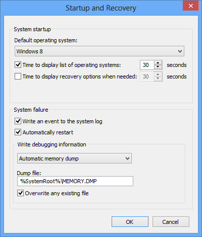

# Enabling a Kernel-Mode Dump File

## 

During a system crash, the Windows crash dump settings determine whether a dump file will be created, and if so, what size the dump file will be.

The Windows Control Panel controls the kernel-mode crash dump settings. Only a system administrator can modify these settings.

To change these settings, go to **Control Panel &gt; System and Security &gt; System**. Click **Advanced system settings**. Under **Startup and Recovery**, click **Settings**.

You will see the following dialog box:

Under **Write Debugging Information**, you can specify a kernel-mode dump file setting. Only one dump file can be created for any given crash. See [Varieties of Kernel-Mode Dump Files](varieties-of-kernel-mode-dump-files.md) for a description of different dump file settings.

You can also select or deselect the **Write an event to the system log** and **Automatically restart** options.

The settings that you select will apply to any kernel-mode dump file created by a system crash, regardless of whether the system crash was accidental or whether it was caused by the debugger. See [Forcing a System Crash](forcing-a-system-crash.md) for details on causing a deliberate crash.

However, these settings do not affect dump files created by the [**.dump**](-dump--create-dump-file-.md) command. See [Creating a Dump File Without a System Crash](creating-a-dump-file-without-a-system-crash.md) for details on using this command.

## Related topics

[Kernel-Mode Dump Files](kernel-mode-dump-files.md)

[Varieties of Kernel-Mode Dump Files](varieties-of-kernel-mode-dump-files.md)

 

 

