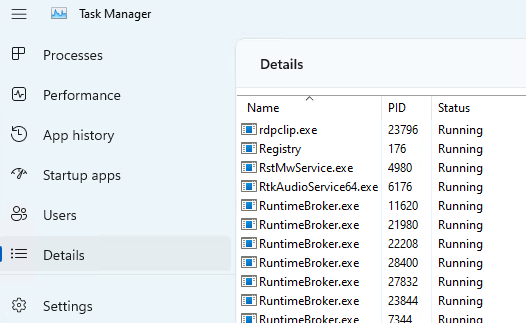

# Finding the process ID

Each process running in Windows is assigned a unique decimal number called the process ID (PID). This number is used in a number of ways, for example to specify the process when attaching a debugger to it.

This topic describes how you can determine the PID for a given app using Task Manager, the tasklist Windows command, the TList utility, the PowerShell Get-Process command, or the debugger.

## Task Manager

Task Manager can be opened in a number of ways, but the simplest is to select Ctrl+Alt+Delete, and then select **Task Manager**.

In Windows, first click **More details** to expand the information displayed.  From the **Processes** tab, select **Details** to see the process ID listed in the *PID* column.



Click on any column name to sort. You can right click a process name to see more options for a process.

Some kernel errors may cause delays in Task Manager's graphical interface.

## The **tasklist** command

Use the built in Windows **tasklist** command from a command prompt to display all processes, their PIDs, and a variety of other details.

```console
C:\>tasklist

Image Name                     PID Session Name        Session#    Mem Usage
========================= ======== ================ =========== ============
System Idle Process              0 Services                   0          8 K
System                           4 Services                   0      7,428 K
Secure System                  104 Services                   0     40,344 K
Registry                       164 Services                   0    146,596 K
smss.exe                       592 Services                   0      1,176 K
csrss.exe                      896 Services                   0      6,224 K
wininit.exe                    980 Services                   0      6,572 K
...
```

Use `tasklist /?` to display command line help.

## TList utility

Task List Viewer (TList), or tlist.exe, is a command-line utility that displays the list of tasks, or user-mode processes, currently running on the local computer. TList is included in the Debugging Tools for Windows. For information on how to download and install the debugging tools, see [Debugging Tools for Windows](debugger-download-tools.md).

If you installed the Windows Driver Kit in the default directory on a 64 bit PC, the debugging tools are located here:

`C:\Program Files (x86)\Windows Kits\10\Debuggers\x64\`

When you run TList from the command prompt, it will display a list of all the user-mode processes in memory with a unique PID number. For each process, it shows the PID, process name, and, if the process has a window, the title of that window.

```console
C:\Program Files (x86)\Windows Kits\10\Debuggers\x64>tlist -t
System Process (0)
System (4)
  smss.exe (592)
  Memory Compression (3376)
Secure System (104)
Registry (164)
csrss.exe (896)
wininit.exe (980)
  services.exe (660)
    svchost.exe (1232)
      WmiPrvSE.exe (6008)
      dllhost.exe (1748)
      WmiPrvSE.exe (1860)
...
```

For more information, see [TList](tlist.md).

## The **.tlist** debugger command

If there's already a user-mode debugger running on the system in question, the [**.tlist (List Process IDs)**](../debuggercmds/-tlist--list-process-ids-.md) command will display a list of all PIDs on that system.

## PowerShell Get-Process command

To work with automation scripts, use the Get-Process PowerShell command. Specify a specific process name, to see the process ID for that process.

```powershell
C:\> Get-Process explorer

Handles  NPM(K)    PM(K)      WS(K)     CPU(s)     Id  SI ProcessName
-------  ------    -----      -----     ------     --  -- -----------
   2520     404   108948     179284   1,702.95   7656   1 explorer
```

For more information, see [Get-Process](/powershell/module/microsoft.powershell.management/get-process).

## Additional resources

To learn more about Windows internals (including memory usage, context, threads, and processes), review additional resources, such as [*Windows Internals*](/sysinternals/resources/windows-internals) by Mark Russinovich, David Solomon, and Alex Ionescu.


