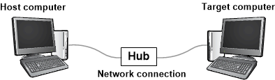
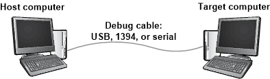

# <span id="debugger.getting_started_with_windbg__kernel-mode_"></span>Getting Started with WinDbg (Kernel-Mode)


WinDbg is a kernel-mode and user-mode debugger that is included in Debugging Tools for Windows. Here we provide hands-on exercises that will help you get started using WinDbg as a kernel-mode debugger.

For information about how to get Debugging Tools for Windows, see [Debugging Tools for Windows (WinDbg, KD, CDB, NTSD)](index.md). After you have installed the debugging tools, locate the installation directories for 64-bit (x64) and 32-bit (x86) versions of the tools. For example:

-   C:\\Program Files (x86)\\Windows Kits\\8.1\\Debuggers\\x64
-   C:\\Program Files (x86)\\Windows Kits\\8.1\\Debuggers\\x86

## <span id="Set_up_a_kernel-mode_debugging"></span><span id="set_up_a_kernel-mode_debugging"></span><span id="SET_UP_A_KERNEL-MODE_DEBUGGING"></span>Set up a kernel-mode debugging


A kernel-mode debugging environment typically has two computers: the *host computer* and the *target computer*. The debugger runs on the host computer, and the code being debugged runs on the target computer. The host and target are connected by a debug cable.

The Windows debuggers support these types of cables for debugging:

-   Ethernet
-   USB 2.0
-   USB 3.0
-   1394
-   Serial (also called null modem)

If your target computer is running Windows 8 or later, you can use any type of debug cable, including Ethernet. This diagram illustrates a host and target computer connected for debugging over Ethernet cable.



If your target computer is running a version of Windows earlier than Window 8, then you cannot use Ethernet for debugging; you must use USB, 1394, or serial. This diagram illustrates a host and target computer connected by a USB, 1394, or serial debug cable.



For details about how to set up the host and target computers, see [Setting Up Kernel-Mode Debugging Manually](setting-up-kernel-mode-debugging-in-windbg--cdb--or-ntsd.md).

## <span id="Establish_a_kernel-mode_debugging_session"></span><span id="establish_a_kernel-mode_debugging_session"></span><span id="ESTABLISH_A_KERNEL-MODE_DEBUGGING_SESSION"></span>Establish a kernel-mode debugging session


After you have set up your host and target computer and connected them with a debug cable, you can establish a kernel-mode debugging session by following the instructions in the same topic that you used for getting set up. For example, if you decided to set up your host and target computers for debugging over Ethernet, you can find instructions for establishing a kernel-mode debugging session is this topic:

-   [Setting Up KDNET Network Kernel Debugging Automatically](setting-up-a-network-debugging-connection-automatically.md)


## <span id="Get_started_using_WinDbg"></span><span id="get_started_using_windbg"></span><span id="GET_STARTED_USING_WINDBG"></span>Get started using WinDbg


1. On the host computer, open WinDbg and establish a kernel-mode debugging session with the target computer.
2. In WinDbg, choose **Contents** from the **Help** menu. This opens the debugger documentation CHM file. The debugger documentation is also available on line [here](index.md).
3. When you establish a kernel-mode debugging session, WinDbg might break in to the target computer automatically. If WinDbg has not already broken in, choose **Break** from the **Debug** menu.

4. Near the bottom of the WinDbg window, in the command line, enter this command:

   [**.sympath srv\\***](https://go.microsoft.com/fwlink/p?linkid=399238)

   The output is similar to this:

   ```dbgcmd
   Symbol search path is: srv*
   Expanded Symbol search path is: cache*;SRV*https://msdl.microsoft.com/download/symbols
   ```

   The symbol search path tells WinDbg where to look for symbol (PDB) files. The debugger needs symbol files to obtain information about code modules (function names, variable names, and the like).

   Enter this command, which tells WinDbg to do its initial finding and loading of symbol files:

   [**.reload**](https://go.microsoft.com/fwlink/p?linkid=399239)

5. To see a list of loaded modules, enter this command:

   [**lm**](https://go.microsoft.com/fwlink/p?linkid=399237)

   The output is similar to this:

   ```dbgcmd
   0:000>3: kd> lm
   start             end                 module name
   fffff800`00000000 fffff800`00088000   CI         (deferred)             
   ...         
   fffff800`01143000 fffff800`01151000   BasicRender   (deferred)             
   fffff800`01151000 fffff800`01163000   BasicDisplay  (deferred)             
   ...      
   fffff800`02a0e000 fffff800`03191000   nt  (pdb symbols) C:\...\ntkrnlmp.pdb
   fffff800`03191000 fffff800`03200000   hal (deferred)             
   ...
   ```

6. To start target computer running, enter this command:

   [**g**](https://go.microsoft.com/fwlink/p?linkid=399388)

7. To break in again, choose **Break** from the **Debug** menu.

8. Enter this command to examine the \_FILE\_OBJECT data type in the nt module:

   [**dt nt!\_FILE\_OBJECT**](https://go.microsoft.com/fwlink/p?linkid=399397)

   The output is similar to this:

   ```dbgcmd
   0:000>0: kd> dt nt!_FILE_OBJECT
      +0x000 Type             : Int2B
      +0x002 Size             : Int2B
      +0x008 DeviceObject     : Ptr64 _DEVICE_OBJECT
      +0x010 Vpb              : Ptr64 _VPB
      ...
      +0x0c0 IrpList          : _LIST_ENTRY
      +0x0d0 FileObjectExtension : Ptr64 Void
   ```

9. Enter this command to examine some of the symbols in the nt module:

   [**x nt!\*CreateProcess\\***](https://go.microsoft.com/fwlink/p?linkid=399240)

   The output is similar to this:

   ```dbgcmd
   0:000>0: kd> x nt!*CreateProcess*
   fffff800`030821cc nt!ViCreateProcessCallbackInternal (<no parameter info>)
   ...
   fffff800`02e03904 nt!MmCreateProcessAddressSpace (<no parameter info>)
   fffff800`02cece00 nt!PspCreateProcessNotifyRoutine = <no type information>
   ...
   ```

10. Enter this command to put a breakpoint at **MmCreateProcessAddressSpace**:

    [**bu nt!MmCreateProcessAddressSpace**](https://go.microsoft.com/fwlink/p?linkid=399390)

    To verify that the breakpoint is set, enter this command:

    [**bl**](https://go.microsoft.com/fwlink/p?linkid=399391)

    The output is similar to this:

    ```dbgcmd
    0:000>0: kd> bu nt!MmCreateProcessAddressSpace
    0: kd> bl
    0 e fffff800`02e03904     0001 (0001) nt!MmCreateProcessAddressSpace
    ```

    Enter [**g**](https://go.microsoft.com/fwlink/p?linkid=399388) to let the target computer run.

11. If the target computer doesn't break in to the debugger immediately, perform a few actions on the target computer (for example, open Notepad). The target computer will break in to the debugger when **MmCreateProcessAddressSpace** is called. To see the stack trace, enter these commands:

    [**.reload**](https://go.microsoft.com/fwlink/p?linkid=399239)

    [**k**](https://go.microsoft.com/fwlink/p?linkid=399389)

    The output is similar to this:

    ```dbgcmd
    0:000>2: kd> k
    Child-SP          RetAddr           Call Site
    ffffd000`224b4c88 fffff800`02d96834 nt!MmCreateProcessAddressSpace
    ffffd000`224b4c90 fffff800`02dfef17 nt!PspAllocateProcess+0x5d4
    ffffd000`224b5060 fffff800`02b698b3 nt!NtCreateUserProcess+0x55b
    ...
    000000d7`4167fbb0 00007ffd`14b064ad KERNEL32!BaseThreadInitThunk+0xd
    000000d7`4167fbe0 00000000`00000000 ntdll!RtlUserThreadStart+0x1d
    ```

12. On the **View** menu, choose **Disassembly**.

    On the **Debug** menu, choose **Step Over** (or press **F10**). Enter step commands a few more times as you watch the Disassembly window.

13. Clear your breakpoint by entering this command:

    [**bc \\***](https://go.microsoft.com/fwlink/p?linkid=399401)

    Enter [**g**](https://go.microsoft.com/fwlink/p?linkid=399388) to let the target computer run. Break in again by choosing **Break** from the **Debug** menu or pressing **CTRL-Break**.

14. To see a list of all processes, enter this command:

    [**!process 0 0**](https://go.microsoft.com/fwlink/p?linkid=399241)

    The output is similar to this:

    ```dbgcmd
    0:000>0: kd> !process 0 0
    **** NT ACTIVE PROCESS DUMP ****
    PROCESS ffffe000002287c0
        SessionId: none  Cid: 0004    Peb: 00000000  ParentCid: 0000
        DirBase: 001aa000  ObjectTable: ffffc00000003000  HandleCount: <Data Not Accessible>
        Image: System

    PROCESS ffffe00001e5a900
        SessionId: none  Cid: 0124    Peb: 7ff7809df000  ParentCid: 0004
        DirBase: 100595000  ObjectTable: ffffc000002c5680  HandleCount: <Data Not Accessible>
        Image: smss.exe
    ...
    PROCESS ffffe00000d52900
        SessionId: 1  Cid: 0910    Peb: 7ff669b8e000  ParentCid: 0a98
        DirBase: 3fdba000  ObjectTable: ffffc00007bfd540  HandleCount: <Data Not Accessible>
        Image: explorer.exe
    ```

15. Copy the address of one process, and enter this command:

    [**!process** *Address* **2**](https://go.microsoft.com/fwlink/p?linkid=399241)

    For example: **!process ffffe00000d5290 2**

    The output shows the threads in the process.

    ```dbgcmd
    0:000>0:000>0: kd> !process ffffe00000d52900 2
    PROCESS ffffe00000d52900
        SessionId: 1  Cid: 0910    Peb: 7ff669b8e000  ParentCid: 0a98
        DirBase: 3fdba000  ObjectTable: ffffc00007bfd540  HandleCount:
        Image: explorer.exe

            THREAD ffffe00000a0d880  Cid 0910.090c  Teb: 00007ff669b8c000
                ffffe00000d57700  SynchronizationEvent

            THREAD ffffe00000e48880  Cid 0910.0ad8  Teb: 00007ff669b8a000
                ffffe00000d8e230  NotificationEvent
                ffffe00000cf6870  Semaphore Limit 0xffff
                ffffe000039c48c0  SynchronizationEvent
            ...
            THREAD ffffe00000e6d080  Cid 0910.0cc0  Teb: 00007ff669a10000
                ffffe0000089a300  QueueObject
    ```

16. Copy the address of one thread, and enter this command:

    [**!thread** *Address*](https://go.microsoft.com/fwlink/p?linkid=399244)

    For example: **!thread ffffe00000e6d080**

    The output shows information about the individual thread.

    ```dbgcmd
    0: kd> !thread ffffe00000e6d080
    THREAD ffffe00000e6d080  Cid 0910.0cc0  Teb: 00007ff669a10000 Win32Thread: 0000000000000000 WAIT: ...
        ffffe0000089a300  QueueObject
    Not impersonating
    DeviceMap                 ffffc000034e7840
    Owning Process            ffffe00000d52900       Image:         explorer.exe
    Attached Process          N/A            Image:         N/A
    Wait Start TickCount      13777          Ticks: 2 (0:00:00:00.031)
    Context Switch Count      2              IdealProcessor: 1             
    UserTime                  00:00:00.000
    KernelTime                00:00:00.000
    Win32 Start Address ntdll!TppWorkerThread (0x00007ffd14ab2850)
    Stack Init ffffd00021bf1dd0 Current ffffd00021bf1580
    Base ffffd00021bf2000 Limit ffffd00021bec000 Call 0
    Priority 13 BasePriority 13 UnusualBoost 0 ForegroundBoost 0 IoPriority 2 PagePriority 5
    ...
    ```

17. To see all the device nodes in the Plug and Play device tree, enter this command:

    [**!devnode 0 1**](https://go.microsoft.com/fwlink/p?linkid=399242)

    ```dbgcmd
    0:000>0: kd> !devnode 0 1
    Dumping IopRootDeviceNode (= 0xffffe000002dbd30)
    DevNode 0xffffe000002dbd30 for PDO 0xffffe000002dc9e0
      InstancePath is "HTREE\ROOT\0"
      State = DeviceNodeStarted (0x308)
      Previous State = DeviceNodeEnumerateCompletion (0x30d)
      DevNode 0xffffe000002d9d30 for PDO 0xffffe000002daa40
        InstancePath is "ROOT\volmgr\0000"
        ServiceName is "volmgr"
        State = DeviceNodeStarted (0x308)
        Previous State = DeviceNodeEnumerateCompletion (0x30d)
        DevNode 0xffffe00001d49290 for PDO 0xffffe000002a9a90
          InstancePath is "STORAGE\Volume\{3007dfd3-df8d-11e3-824c-806e6f6e6963}#0000000000100000"
          ServiceName is "volsnap"
          TargetDeviceNotify List - f 0xffffc0000031b520  b 0xffffc0000008d0f0
          State = DeviceNodeStarted (0x308)
          Previous State = DeviceNodeStartPostWork (0x307)
    ...
    ```

18. To see the device nodes along with their hardware resources, enter this command:

    [**!devnode 0 9**](https://go.microsoft.com/fwlink/p?linkid=399242)

    ```dbgcmd
    0:000>...
            DevNode 0xffffe000010fa770 for PDO 0xffffe000010c2060
              InstancePath is "PCI\VEN_8086&DEV_2937&SUBSYS_2819103C&REV_02\3&33fd14ca&0&D0"
              ServiceName is "usbuhci"
              State = DeviceNodeStarted (0x308)
              Previous State = DeviceNodeEnumerateCompletion (0x30d)
              TranslatedResourceList at 0xffffc00003c78b00  Version 1.1  Interface 0x5  Bus #0
                Entry 0 - Port (0x1) Device Exclusive (0x1)
                  Flags (0x131) - PORT_MEMORY PORT_IO 16_BIT_DECODE POSITIVE_DECODE 
                  Range starts at 0x3120 for 0x20 bytes
                Entry 1 - DevicePrivate (0x81) Device Exclusive (0x1)
                  Flags (0000) - 
                  Data - {0x00000001, 0x00000004, 0000000000}
                Entry 2 - Interrupt (0x2) Shared (0x3)
                  Flags (0000) - LEVEL_SENSITIVE 
                  Level 0x8, Vector 0x81, Group 0, Affinity 0xf
    ...
    ```

19. To see a device node that has a service name of disk, enter this command:

    [**!devnode 0 1 disk**](https://go.microsoft.com/fwlink/p?linkid=399242)

    ```dbgcmd
    0: kd> !devnode 0 1 disk
    Dumping IopRootDeviceNode (= 0xffffe000002dbd30)
    DevNode 0xffffe0000114fd30 for PDO 0xffffe00001159610
      InstancePath is "IDE\DiskST3250820AS_____________________________3.CHL___\5&14544e82&0&0.0.0"
      ServiceName is "disk"
      State = DeviceNodeStarted (0x308)
      Previous State = DeviceNodeEnumerateCompletion (0x30d)
    ...
    ```

20. The output of [**!devnode 0 1**](https://go.microsoft.com/fwlink/p?linkid=399242) displays the address of the physical device object (PDO) for the node. Copy the address of a physical device object (PDO), and enter this command:

    [**!devstack** *PdoAddress*](https://go.microsoft.com/fwlink/p?linkid=399245)

    For example: <em>PdoAddress</em>**!devstack 0xffffe00001159610**

    ```dbgcmd
    0:000>0: kd> !devstack 0xffffe00001159610
      !DevObj           !DrvObj            !DevExt           ObjectName
      ffffe00001d50040  \Driver\partmgr    ffffe00001d50190  
      ffffe00001d51450  \Driver\disk       ffffe00001d515a0  DR0
      ffffe00001156e50  \Driver\ACPI       ffffe000010d8bf0  
    ```

21. To get information about the driver disk.sys, enter this command:

    [**!drvobj disk 2**](https://go.microsoft.com/fwlink/p?linkid=399246)

    ```dbgcmd
    0:000>0: kd> !drvobj disk 2
    Driver object (ffffe00001d52680) is for:
     \Driver\disk
    DriverEntry:   fffff800006b1270 disk!GsDriverEntry
    DriverStartIo: 00000000 
    DriverUnload:  fffff800010b0b5c CLASSPNP!ClassUnload
    AddDevice:     fffff800010aa110 CLASSPNP!ClassAddDevice

    Dispatch routines:
    [00] IRP_MJ_CREATE                      fffff8000106d160    CLASSPNP!ClassGlobalDispatch
    [01] IRP_MJ_CREATE_NAMED_PIPE           fffff80002b0ab24    nt!IopInvalidDeviceRequest
    [02] IRP_MJ_CLOSE                       fffff8000106d160    CLASSPNP!ClassGlobalDispatch
    [03] IRP_MJ_READ                        fffff8000106d160    CLASSPNP!ClassGlobalDispatch
    ...
    [1b] IRP_MJ_PNP                         fffff8000106d160    CLASSPNP!ClassGlobalDispatch
    ```

22. The output of !drvobj displays addresses of dispatch routines: for example, CLASSPNP!ClassGlobalDispatch. To set and verify a breakpoint at ClassGlobalDispatch, enter these commands:

    [**bu CLASSPNP!ClassGlobalDispatch**](https://go.microsoft.com/fwlink/p?linkid=399390)

    [**bl**](https://go.microsoft.com/fwlink/p?linkid=399391)

    Enter g to let the target computer run.

    If the target computer doesn't break in to the debugger immediately, perform a few actions on the target computer (for example, open Notepad and save a file). The target computer will break in to the debugger when **ClassGlobalDispatch** is called. To see the stack trace, enter these commands:

    [**.reload**](https://go.microsoft.com/fwlink/p?linkid=399239)

    [**k**](https://go.microsoft.com/fwlink/p?linkid=399389)

    The output is similar to this:

    ```dbgcmd
    2: kd> k
    Child-SP          RetAddr           Call Site
    ffffd000`21d06cf8 fffff800`0056c14e CLASSPNP!ClassGlobalDispatch
    ffffd000`21d06d00 fffff800`00f2c31d volmgr!VmReadWrite+0x13e
    ffffd000`21d06d40 fffff800`0064515d fvevol!FveFilterRundownReadWrite+0x28d
    ffffd000`21d06e20 fffff800`0064578b rdyboost!SmdProcessReadWrite+0x14d
    ffffd000`21d06ef0 fffff800`00fb06ad rdyboost!SmdDispatchReadWrite+0x8b
    ffffd000`21d06f20 fffff800`0085cef5 volsnap!VolSnapReadFilter+0x5d
    ffffd000`21d06f50 fffff800`02b619f7 Ntfs!NtfsStorageDriverCallout+0x16
    ...
    ```

23. To end your debugging session, enter this command:

    [**qd**](https://go.microsoft.com/fwlink/p?linkid=399394)

## <span id="Summary_of_commands"></span><span id="summary_of_commands"></span><span id="SUMMARY_OF_COMMANDS"></span>Summary of commands


-   **Contents** command on the **Help** menu
-   [.sympath (Set Symbol Path)](https://go.microsoft.com/fwlink/p?linkid=399238)
-   [.reload (Reload Module)](https://go.microsoft.com/fwlink/p?linkid=399239)
-   [x (Examine Symbols)](https://go.microsoft.com/fwlink/p?linkid=399240)
-   [g (Go)](https://go.microsoft.com/fwlink/p?linkid=399388)
-   [dt (Display Type)](https://go.microsoft.com/fwlink/p?linkid=399397)
-   **Break** command on the **Debug** menu
-   [lm (List Loaded Modules)](https://go.microsoft.com/fwlink/p?linkid=399237)
-   [k (Display Stack Backtrace)](https://go.microsoft.com/fwlink/p?linkid=399389)
-   [bu (Set Breakpoint)](https://go.microsoft.com/fwlink/p?linkid=399390)
-   [bl (Breakpoint List)](https://go.microsoft.com/fwlink/p?linkid=399391)
-   [bc (Breakpoint Clear)](https://go.microsoft.com/fwlink/p?linkid=399401)
-   **Step Into** command on the **Debug** menu (**F11**)
-   [!process](https://go.microsoft.com/fwlink/p?linkid=399241)
-   [!thread](https://go.microsoft.com/fwlink/p?linkid=399244)
-   [!devnode](https://go.microsoft.com/fwlink/p?linkid=399242)
-   [!devstack](https://go.microsoft.com/fwlink/p?linkid=399245)
-   [!drvobj](https://go.microsoft.com/fwlink/p?linkid=399246)
-   [qd (Quit and Detach)](https://go.microsoft.com/fwlink/p?linkid=399394)

## <span id="related_topics"></span>Related topics


[Getting Started with WinDbg (User-Mode)](getting-started-with-windbg.md)

[Setting Up Kernel-Mode Debugging Manually](https://go.microsoft.com/fwlink/p?linkid=272138)

[Debugger Operation](https://go.microsoft.com/fwlink/p?linkid=399247)

[Debugging Techniques](https://go.microsoft.com/fwlink/p?linkid=399248)

[Debugging Tools for Windows (WinDbg, KD, CDB, NTSD)](https://go.microsoft.com/fwlink/p?linkid=223405)

 

 


